<!-- nav -->

[← 6. Stereonet](6-stereonet.md)  |  [🏠 Home](../index.md)  |  [7.1. SAED simulation →](7-1-saed-simulation.md)

# Crystal Diffraction (Diffraction Simulator)

**Crystal Diffraction** simulates single-crystal X-ray and electron diffraction patterns.

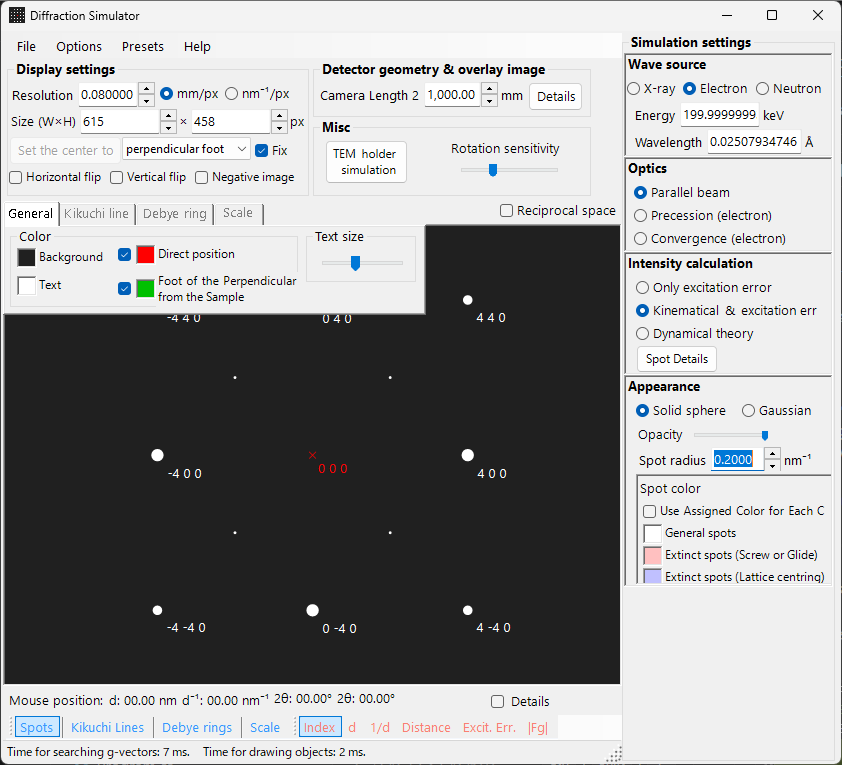

---

## Main area

| Operation | Action |
|-----------|--------|
| Left drag | Rotate |
| Centre drag | Translate |
| Right drag | Zoom in |
| Right click | Zoom out |
| Left double-click | Spot details |

---

## File menu

### Preset

---

## Toolbar

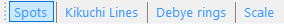

Spots, Kikuchi Lines, Debye rings, Scale, label options (Index / d / Distance / Excit. Err. / |Fg|).

---

## Monitor / Detector geometry

### Monitor

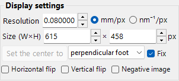

**Resolution**, image **Size (W×H)**, **Set the center to** / **Fix**, and **Horizontal flip / Vertical flip / Negative image** of the pattern. Tick **Reciprocal space** to draw the Ewald sphere and reciprocal-lattice vectors.

### Misc

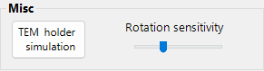

Includes the rotation-sensitivity slider and the **TEM holder simulation** button (see below).

### TEM holder simulation

Opens a window that links the diffraction pattern to a double-tilt (or rotation) **TEM holder**: set the holder tilt angles and the pattern/orientation updates accordingly, and the reachable orientations can be shown on a stereonet. Added in v4.914.

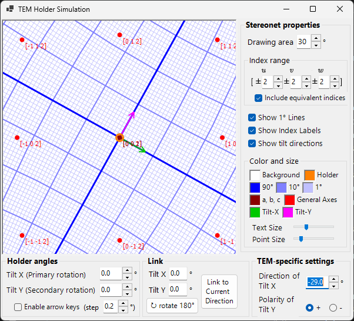

The stereonet (left) plots crystal axes/zone axes with the holder's tilt directions (Tilt-X, Tilt-Y arrows). Set the primary/secondary tilt angles under **Holder angles**; **Link to Current Direction** couples the holder to the current crystal orientation, and the TEM-specific settings define each tilt axis direction and polarity for your instrument.

### Detector geometry

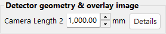

---

## Tab menu

### General

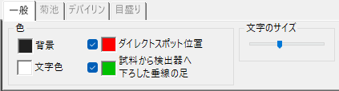

### Kikuchi lines

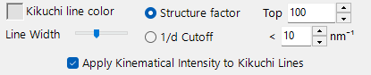

Toggle from the toolbar; choose the reflections by **Structure factor** (Top N) or **1/d Cutoff**, and set the line width and colour.

### Debye rings

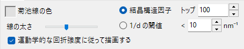

### Scale

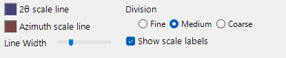

---

## Spot property

### Wave Length

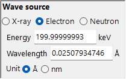

X-ray (characteristic/synchrotron), Electron, Neutron. Set energy or wavelength.

### Incident beam mode

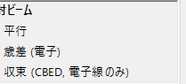

**Parallel beam**, **Precession (electron)** (PED), **Convergence (electron)** (CBED)

### Intensity calculation

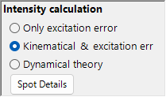

- Only excitation error
- Kinematical & excitation error
- Dynamical theory (Bloch wave, electron only)

### Appearance

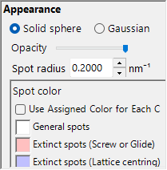

Solid sphere or Gaussian. Opacity, radius, brightness, colour scale.

### Bloch wave parameters

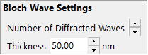

**Number of Diffracted Waves** and **Thickness**.

### PED parameters

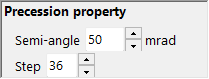

Semi-angle and step.

---

## Detector geometry (detailed)

### Detector geometry settings

### Detector area and overlapped image

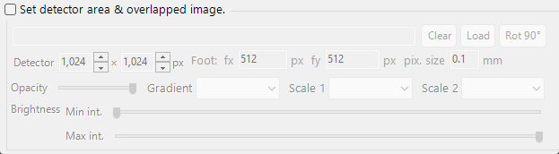

See [Appendix A2. Detector Coordinate System](appendix-a2-detector-coordinate-system.md).

---

## Diffraction spot information

Lists the per-reflection details computed by the Bethe dynamical theory (Bloch-wave method). Open it with the **Spot Details** button (intensity-calculation panel) or the **Details** check box.

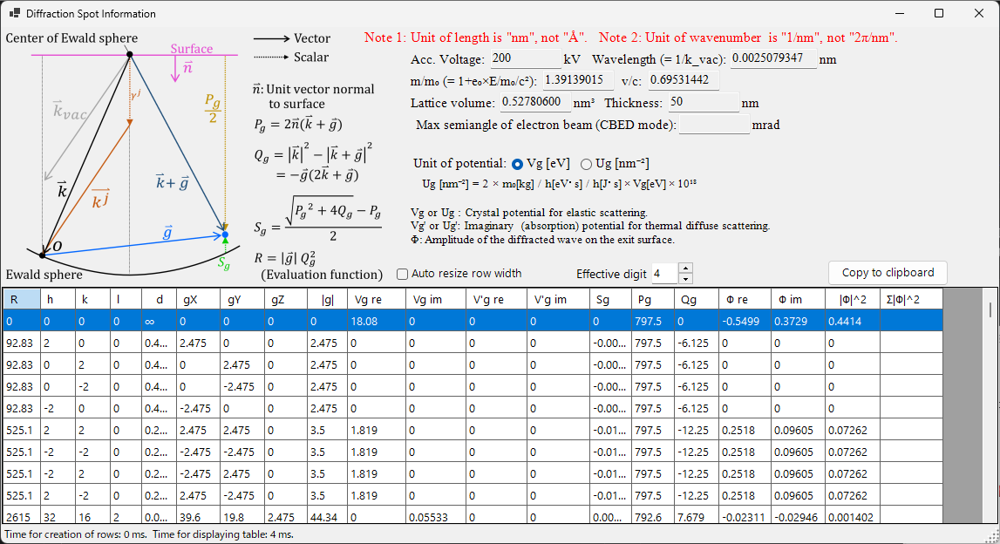

### Schematic and definitions

The schematic (top left) shows the vectors on the Ewald sphere and defines the quantities used in the table (**n̂** is the unit vector normal to the sample surface, **k** is the incident wavevector, **g** is the reciprocal-lattice vector).

- **P_g = 2 n̂·(k + g)**
- **Q_g = |k|² − |k + g|² = −g·(2k + g)**
- **Excitation error S_g = ( √(P_g² + 4Q_g) − P_g ) / 2**
- **Evaluation function R = |g|·Q_g²** — ranks reflections by how strongly they are excited (smaller = closer to the Ewald sphere = more strongly excited; the transmitted beam g=0 has R=0 and comes first). The table is sorted by ascending R.

### Table columns

| Column | Meaning |
|------|------|
| **R** | evaluation function R = \|g\|·Q_g² (above; used for selecting/ordering reflections) |
| **h, k, (i,) l** | Miller indices (*i* is the redundant hexagonal index, shown only for hexagonal crystals) |
| **d** | interplanar spacing (nm) |
| **gX, gY, gZ** | components of the reciprocal-lattice vector *g* (1/nm) |
| **\|g\|** | magnitude of *g* (1/nm) |
| **Vg re / Vg im** | Fourier coefficient of the crystal potential for elastic scattering, *V_g* (real / imaginary) |
| **V'g re / V'g im** | imaginary (absorption) potential for thermal diffuse scattering, *V'_g* (real / imaginary) |
| **Sg** | excitation error S_g (above; 1/nm) |
| **Pg** | auxiliary quantity P_g = 2 n̂·(k+g) (above) |
| **Qg** | auxiliary quantity Q_g = −g·(2k+g) (above) |
| **Φ re / Φ im** | complex amplitude Φ of the dynamical diffracted wave on the exit surface (real / imaginary) |
| **\|Φ\|^2** | diffracted intensity \|Φ\|² of that reflection |
| **Σ\|Φ\|^2** | cumulative sum of \|Φ\|² (total over reflections; useful as an intensity-conservation check) |

### Potential units and other controls

- **Unit of potential** — switches the displayed potential between **Vg [eV]** (electrostatic potential, eV) and **Ug [nm⁻²]** (the scaled quantity *U_g* = 2m₀/h² · *V_g* that enters the Bloch-wave equations). The column headers change accordingly between *Vg / V'g* and *Ug / U'g*.
- Above the table, the accelerating voltage, wavelength (= 1/k_vac), relativistic mass ratio *m/m₀*, speed ratio *v/c*, lattice volume, sample thickness, and (in CBED mode) the maximum semi-angle of the electron beam are shown.
- **Note 1:** the unit of length is **nm**, not Å. **Note 2:** the unit of wavenumber is **1/nm**, not 2π/nm.
- **Effective digit** — number of significant digits shown. **Auto resize row width** — auto-fit column widths. **Copy to clipboard** — exports the table as text that can be pasted into a spreadsheet.

---

[← 6. Stereonet](6-stereonet.md)  |  [🏠 Home](../index.md)  |  [7.1. SAED simulation →](7-1-saed-simulation.md)
