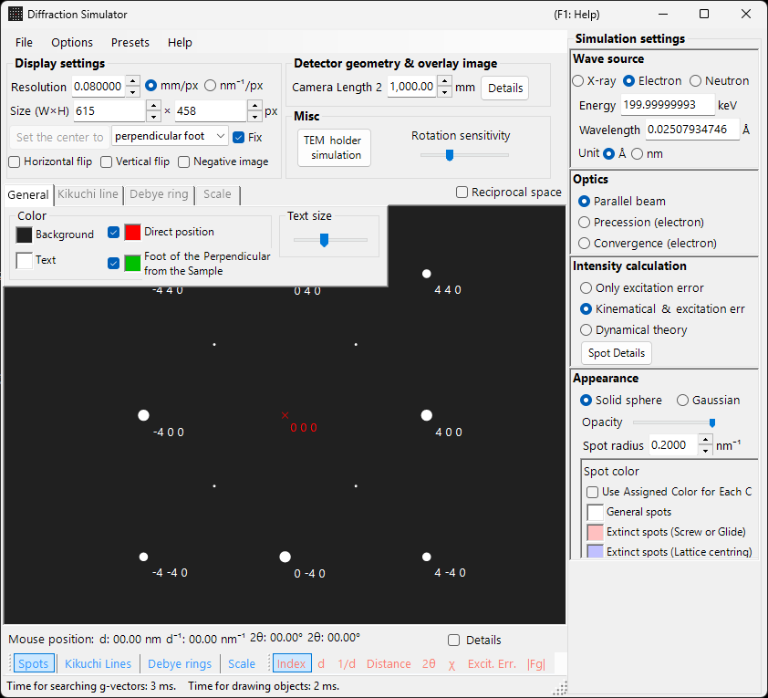

# SAED (Selected Area Electron Diffraction) Simulation

**SAED (Selected Area Electron Diffraction)** simulation calculates single-crystal electron diffraction patterns produced by a parallel electron beam. This is the default mode of the [diffraction simulator](index.md).

> This page lists every setting that appears in the **Spot property** panel on the right when you choose **Wave Length = Electron** and **Incident beam mode = Parallel**. For window-wide operations such as drawing and saving, see the [overview page](index.md).

GUI conditions: Wave Length = Electron, Incident beam mode = Parallel, Intensity calculation = Only excitation error / Kinematical / Dynamical.

---

## Overview

Simulates the diffraction pattern produced when a parallel electron beam passes through a thin specimen. Spot positions are fixed by the geometric relationship between the Ewald sphere and the reciprocal-lattice points, and the brightness of each spot is computed according to the selected intensity-calculation mode.

---

## Wave Length

Set the radiation source to **Electron**. Enter the energy (keV) or wavelength (nm) and the relativistically corrected wavelength is computed. For X-ray and neutron sources, see [X-ray diffraction simulation](4-x-ray-neutron-diffraction.md).

---

## Incident beam mode

Set the incident-beam geometry to **Parallel**. This is the standard plane-wave geometry used for SAED and X-ray diffraction.

> **Note**: For electrons you can choose **Parallel / Precession (electron = PED) / Convergence (CBED)**. Choosing **Precession** gives a [PED simulation](2-ped-simulation.md) and choosing **Convergence** gives a [CBED simulation](3-cbed-simulation.md); in both cases the intensity calculation automatically switches to Dynamical.

---

## Intensity calculation

Selects how spot intensities are computed.

### Only excitation error

Intensity is determined solely from the geometric distance between the Ewald sphere and the reciprocal-lattice point (the excitation error $s_g$). The smaller $\lvert s_g \rvert$ is, the higher the intensity; it reaches its maximum at the value set by **Radius**, and falls to zero when $\lvert s_g \rvert$ exceeds Radius. Because the crystal structure factor is ignored, this is the fastest mode and is suited to checking diffraction-spot positions.

### Kinematical

In addition to the excitation error, the kinematical structure factor $\lvert F_{hkl} \rvert^2$ is folded into the intensity. Extinction rules are correctly reflected, making this mode suited to thin specimens or weak diffraction.

### Dynamical (Bloch-wave method, electron only)

A rigorous dynamical calculation by the Bloch-wave method (Bethe method). It reproduces multiple scattering and the thickness-dependent variation of intensity, and is required for thick specimens or strong diffraction. Available only when Electron is selected. For the theory, see [Appendix A3. Bloch-wave method](../appendix/a3-bloch-wave/calculation.md).

> **Note**: When **Dynamical** is selected, a **Bloch wave settings** panel appears below.

---

## Bloch wave settings (Dynamical theory)

Active only when **Intensity calculation = Dynamical**.

| Parameter | Description |
|-----------|-------------|
| **Number of diffracted waves** | Number of Bloch waves included in the eigenvalue problem. Larger values give more accurate intensities but increase computation time as $O(N^3)$ |
| **Thickness** | Specimen thickness (nm) used in the dynamical calculation |

---

## Spot appearance

Controls how each diffraction spot is rendered.

- **Solid sphere / Gaussian** : the geometric model of the reciprocal-lattice point. **Solid sphere** draws the cross-section (a circle) between a sphere of radius $R$ and the Ewald sphere, with the circle area corresponding to the diffraction intensity; **Gaussian** draws the cross-section (a 2-D Gaussian) of a 3-D Gaussian with $\sigma = R$, with its integral corresponding to the diffraction intensity.
- **Opacity** : transparency of the spot (0 = transparent, 1 = opaque).
- **Radius (R)** : virtual radius of the reciprocal-lattice point. The spot size is fixed by the combination of **Appearance** mode and **Intensity calculation** (e.g. Solid sphere + Dynamical gives a radius proportional to $I_\text{dyn}^{1/2}$).
- **Brightness** : active only in **Gaussian** mode. Integrated intensity of the rendered Gaussian.
- **Color scale** : **Gray scale** or **Cold-warm**.
- **Log scale** : display intensities on a logarithmic scale. Useful for patterns with large intensity contrast.
- **Spot color** : spot colour used when the colour scale is not in use.
- **Use crystal color** : when checked, spots are drawn in the colour assigned to each crystal.

---

## Spot labels

The labels overlaid on the spots are selected from the [toolbar](index.md#toolbar).

| Label | Content |
|-------|---------|
| **Index** | Miller indices $(hkl)$ |
| **d** | interplanar spacing $d$ |
| **1/d** | reciprocal of the interplanar spacing $1/d$ |
| **Distance** | spot-to-spot distance on the detector |
| **2θ** | scattering angle $2\theta$ (same definition as the concentric 2θ scale circles) |
| **χ** | azimuth angle $\chi$, measured from the upward (12 o'clock) direction, positive clockwise (same definition as the radial azimuth scale lines) |
| **Excit. Err.** | excitation error $s_g$ |
| **\|Fg\|** | absolute value of the structure factor $\lvert F_{hkl} \rvert$ |

---

## Shared operations

Detector information, flipping, reciprocal-space display, Kikuchi lines, Debye rings, scale lines, colour settings, saving, and the like are common to all modes. See the [overview page](index.md). The per-reflection details obtained from the dynamical calculation can be browsed in [diffraction spot information](index.md#diffraction-spot-information).

---

## See also

- [Diffraction simulator (overview)](index.md)
- [Parallel-beam SAED calculation](../appendix/a3-bloch-wave/calculation.md#parallel-beam-saed)
- [X-ray diffraction simulation](4-x-ray-neutron-diffraction.md)
- [Precession electron diffraction (PED) simulation](2-ped-simulation.md)
- [Definition of the coordinate system](../appendix/a1-coordinate-system/1-orientation.md)
