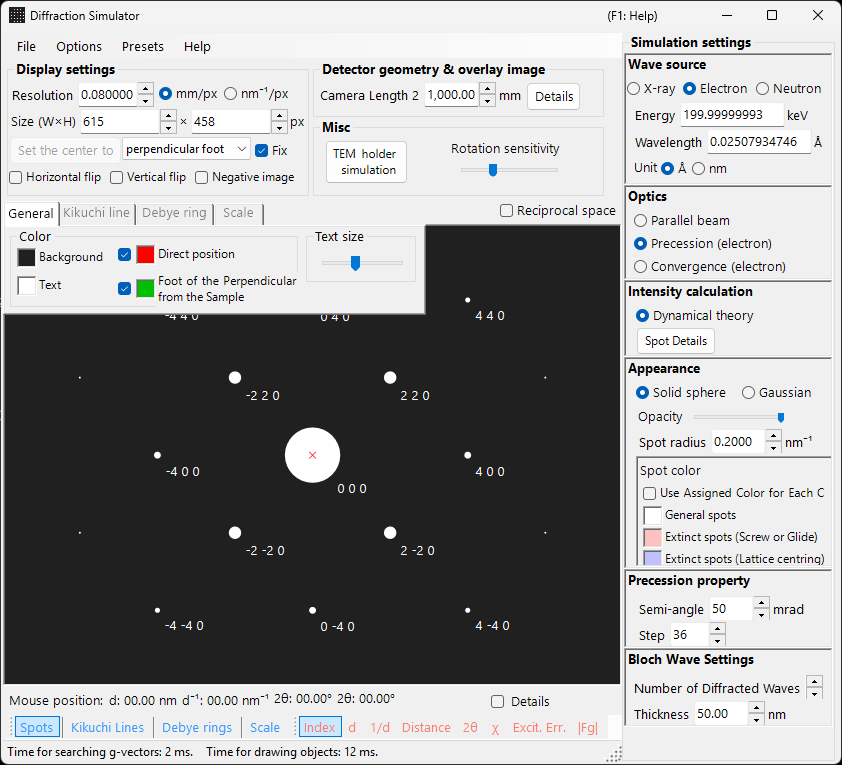

# Precession Electron Diffraction (PED) Simulation

**PED (Precession Electron Diffraction)** simulation calculates electron diffraction patterns obtained by precessing the incident beam in a cone around the optic axis.

> This page lists every setting that appears on the right-hand side when you select **Wave = Electron beam, Incident beam = Precession (electron), Intensity = Dynamical (automatic)**. Note that **selecting Precession (electron) for the incident beam automatically switches the intensity calculation to Dynamical**. For window-wide operations such as drawing and saving, see the [overview page](index.md).

GUI conditions: **Wave = Electron beam, Incident beam = Precession (electron), Intensity = Dynamical (automatic)**

---

## Overview

In PED the electron beam is precessed in a cone around the optic axis, and the diffraction patterns obtained for each beam direction on the precession cone are integrated. Compared with conventional SAED, this offers the following advantages:

- Dynamical effects are averaged out, yielding intensity data close to kinematical intensity ratios
- Higher-order Laue zone (HOLZ) reflections are observed more clearly
- Intensity data suitable for structure analysis can be obtained

---

## Wavelength setup

Since PED is electron diffraction, select **Electron beam** as the source. Entering the electron energy (keV) or wavelength (nm) computes the relativistically corrected wavelength.

---

## Incident beam

For the incident-beam geometry, select **Precession (electron)** (available only when the electron beam is selected).

> **Note** : Selecting **Precession (electron)** **automatically switches the intensity calculation to Dynamical**, and the Bloch-wave settings panel and the precession settings panel appear. **Only excitation error** / **Kinematical** can no longer be selected.

---

## Precession settings

Set the shape and sampling of the precession cone.

| Parameter | Description | Recommended |
|-----------|-------------|-------------|
| **Semi-angle** | Half-angle of the precession cone (mrad) | 10–40 mrad |
| **Step** | Number of parallel-beam directions sampled on the precession cone. Larger values give smoother integration but increase the computation time linearly | 36–72 |

---

## Intensity calculation and Bloch-wave settings

The moment **Precession (electron)** is selected, **Intensity = Dynamical (automatic)** is fixed. For the parallel beam in each precession direction, the diffraction intensity is computed by the Bloch-wave method (Dynamical calculation), and integrating over all directions yields the PED pattern.

| Parameter | Description | Recommended |
|-----------|-------------|-------------|
| **No. of diffracted waves** | Number of Bloch waves included in the eigenvalue problem. Larger values give more accurate intensities but the computation time grows as $O(N^3)$ | 50–200 |
| **Thickness** | Specimen thickness used in the dynamical calculation (nm) | — |

The computational cost is roughly "number of steps × Bloch-wave calculation per direction". For details of the dynamical calculation, see [Dynamical calculation (Bloch-wave method)](../appendix/a3-bloch-wave/calculation.md).

---

## Spot appearance

Controls how each diffraction spot is drawn.

- **Solid sphere / Gaussian** : Geometric model of the reciprocal lattice points. **Solid sphere** draws the cross-section of a sphere of radius $R$ with the Ewald sphere, and **Gaussian** draws the cross-section (a 2D Gaussian) of a 3D Gaussian with $\sigma = R$ and the Ewald sphere.
- **Opacity** : Spot transparency (0 = transparent, 1 = opaque).
- **Radius (R)** : Radius of the reciprocal lattice points. For dynamical intensities, the Gaussian integral $=$ Brightness $\times I_\text{dyn}$, and the Solid sphere uses radius $R \times I_\text{dyn}^{1/2}$ (so the area is proportional to the dynamical intensity).
- **Brightness** : Available only in **Gaussian** mode. Integrated intensity of the drawn Gaussian.
- **Colour scale** : **Gray scale** or **Cold-warm** colour map.
- **Log scale** : Display intensity on a logarithmic scale.
- **Spot colour** : Spot colour used when no colour scale is applied.
- **Use crystal colour** : Draw spots in the colour assigned to each crystal.

---

## Comparison with SAED

| Feature | SAED | PED |
|---------|------|-----|
| Beam | Parallel, fixed | Precessing (cone scan) |
| Dynamical effects | Large | Averaged, smaller |
| HOLZ reflections | Weak | Appear strongly |
| Intensity reliability | May be insufficient for structure analysis | Suitable for structure analysis |
| Computation time | Short | Long |

---

## See also

- [Diffraction simulator (overview)](index.md)
- [X-ray diffraction simulation](4-x-ray-neutron-diffraction.md)
- [SAED simulation](1-saed-simulation.md)
- [Dynamical calculation (Bloch-wave method)](../appendix/a3-bloch-wave/calculation.md)
