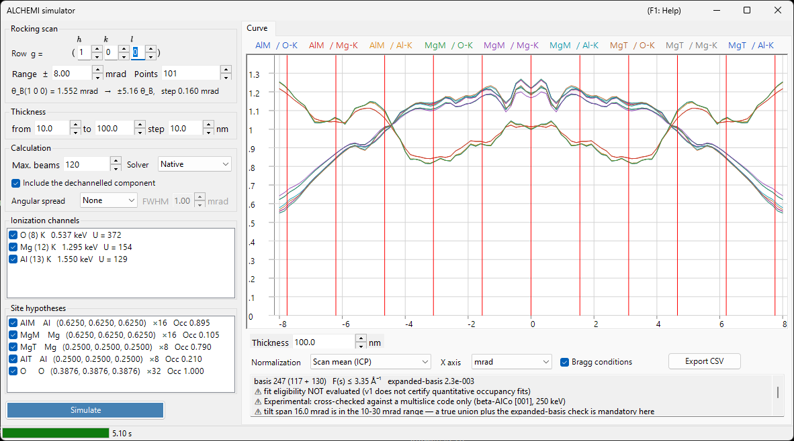

# ALCHEMI Simulation

**ALCHEMI (Atom Location by CHannelling-Enhanced MIcroanalysis)** determines **which site a dopant occupies** by measuring characteristic X-ray yields while the crystal is tilted along a systematic row, and reading the orientation dependence. The ALCHEMI simulator of ReciPro computes the **rocking curve (ionization yield versus orientation) in the forward direction** from a crystal structure and a set of site hypotheses.

> **This is a Preview feature.** v1 performs **one-dimensional forward calculation only**; fitting to experimental data and the 2D map (2D-HARECXS) are not implemented (those tabs are hidden). **To the best of the authors' knowledge, no other publicly available ALCHEMI forward simulator exists.** Because there is no implementation to cross-check against, read [Scope and known limitations](#scope-and-known-limitations) before using the results quantitatively.

Open it from the **Options** menu of the [Diffraction Simulator](index.md) → **ALCHEMI simulator...**

GUI conditions: Wave Length = Electron (the crystal, accelerating voltage and orientation are taken from the parent diffraction simulator)



The window has the **settings on the left** (scan, thickness, calculation, ionization channels, site hypotheses) and the **result on the right** (Curve tab).

---

## What is computed

For each incident orientation the wave field inside the crystal is solved with the Bloch-wave method, and for every pair of site $s$ and ionization channel $c$ the ionization yield is integrated analytically up to the thickness $t$.

$$
Y_\text{dyn} = \mathrm{Re} \sum_{jj'} \alpha_j^{*}\,\bigl(C^{\dagger} \mu_{s,c} C\bigr)_{jj'}\, \alpha_{j'}\, F_{jj'}(t),
\qquad F_{jj'}(t) = \frac{e^{\lambda t} - 1}{\lambda},
\qquad \lambda = 2\pi i\left(\gamma_j - \overline{\gamma_{j'}}\right)
$$

where $\gamma_j$ are the Bloch-wave eigenvalues of the [dynamical core](../appendix/a3-bloch-wave/calculation.md) and $\alpha_j$ their excitation amplitudes; $F_{jj'}(t) \to t$ in the degenerate limit $\lambda \to 0$.

The ionization matrix $\mu$ depends only on the difference of two reflections, $G = \mathbf{g}_h - \mathbf{g}_g$.

$$
\mu_{hg} = \sum_a \mathrm{Occ}_a\, e^{-M_a(G)}\, \sigma_c\, F_c(|G|/2)\, e^{-2\pi i\,G \cdot \mathbf{r}_a}
$$

- $\sigma_c$ : total ionization cross section, from the **Bote–Salvat** model
- $F_c(s)$ : normalized ionization form factor, from self-generated **DHFS** tables (the same data basis as [Beam interaction](../3-beam-interaction.md) and [STEM-EDX](../9-hrtem-stem-simulator/2-stem-simulation.md))
- $e^{-M_a(G)}$ : Debye–Waller factor (anisotropic ADPs are supported)

This is the **local form-factor approximation** of ICSC (Oxley & Allen 2003). The two-momentum MDFF is not used.

### Dechannelled component

Electrons removed from the coherent Bloch field by thermal-diffuse absorption travel the remaining thickness as randomly directed electrons, and ionize there as well.

$$
Y_\text{dech} = \frac{\mu_{00}}{V_c}\,\bigl(t - L_\text{coh}(t)\bigr),
\qquad L_\text{coh}(t) = \int_0^t \sum_g |\psi_g(z)|^2\,dz
$$

Clearing **Include the dechannelled component** in the **Calculation** box drops this term. It accounts for tens of percent of the total yield at typical thicknesses, so omitting it makes the site contrast look stronger than it is.

### Output quantity

The primary quantity is the **number of core-shell vacancies generated per incident electron**. **Conversion to X-ray photons (fluorescence yield and line branching), X-ray self-absorption in the specimen, and detector efficiency and solid angle are NOT applied.**

⚠ **Vacancies are not counts.** A measured EDX intensity is separated from this quantity by three further stages — atomic, specimen and instrumental — none of which ReciPro performs.

1. **vacancy → photon** : fluorescence yield and line branching of the shell
2. **photon → photon that leaves the specimen** : X-ray self-absorption, which depends on the **depth at which the photon was created** and on the take-off angle
3. **photon → count** : detector efficiency, solid angle, and the processing of the spectrum

Stage 2 in particular cannot be recovered afterwards by multiplying the finished curve by one absorption factor — the yield would have to be resolved by depth first. Comparing these curves with measured intensities, k-factors or compositions therefore requires those stages to be carried out outside ReciPro.

Note which of them survive a normalization. Stages 1 and 3, and any absorption treated as a constant, are **multiplicative and independent of the orientation**, so they drop out of the ICP (scan-mean) normalization — even for two lines of very different energy. **Self-absorption in general does not**: channelling changes the depth distribution at which the vacancies are created, so the absorbed fraction itself varies over the scan and survives the normalization. That residue is what choosing lines of similar energy helps with.

---

## Left pane: settings

### Rocking scan

| Item | Description | Default |
|------|-------------|---------|
| **Row g = ( h k l )** | The systematic row to sweep, given as the reflection indices $(h\,k\,l)$ of its reciprocal-lattice vector $\mathbf{g} = h\mathbf{a}^* + k\mathbf{b}^* + l\mathbf{c}^*$ — not a direction $[u\,v\,w]$. The tilt axis is taken perpendicular to both the beam and this $\mathbf{g}$, so the scan sweeps this row through its Bragg conditions | (1 0 0) |
| **Range ±** | Half width of the tilt scan (mrad). Beyond about 10 mrad a fixed union basis is no longer guaranteed, and beyond 30 mrad it is outside the v1 guarantee | 8 mrad |
| **Points** | Number of scan points (3–1001) | 101 |

The line below shows the Bragg angle $\theta_B$ of the selected row, how many $\theta_B$ the scan width corresponds to, and the tilt step — so you can see how far the scan actually reaches before running it.

⚠ **The default of ±8 mrad is a convenient starting value, not a literature optimum.** The review of Jones (2002) prescribes no numerical rocking-scan width in mrad, and the upper figures quoted in the table above are limits of the v1 numerics, not recommendations. Judge the span in units of $\theta_B$ instead (that is what the line under the table reports), and choose it so that the dynamical features you intend to compare fall inside the scan.

⚠ The statement that the illumination may be opened up to **about the Bragg angle** — given by Jones for the optimized systematic-row condition — concerns the **convergence semi-angle of the incident cone**, that is, **Angular spread** in the **Calculation** box below. It is **not** a recommended rocking-scan half width. The two are different quantities and must not be conflated.

### Thickness

Give the start, end and step (nm). **All thicknesses are computed together in a single run**, and the result is switched with the **Thickness** box under the curve (the spin buttons step through the computed thicknesses; a typed value snaps to the nearest one). When the start and end give a single thickness there is nothing to switch between, and the box is disabled.

The site contrast changes strongly — and can even reverse sign — between thin and thick specimens, so check several thicknesses before drawing conclusions. That is why the thickness selector sits directly under the curve.

### Calculation

| Item | Description | Default |
|------|-------------|---------|
| **Max. beams** | Upper bound on the number of Bloch waves per orientation (1–1600). The union over the whole scan is larger | 120 |
| **Solver** | Calculation engine for the eigenvalue problem: **Native** (Eigen C++) or **Managed** (.NET). Where the native solver is unavailable the choice is fixed to Managed | Native |
| **Include the dechannelled component** | Whether to add $Y_\text{dech}$ above | on |
| **Angular spread** | Convolves the curve with the angular spread of the incident beam: **None** or **Gaussian** with a FWHM in mrad. It is a post-process on the orientation axis, applied **before** the display normalization | None |

**The cap of 1600 beams is the counterpart of the tabulated range $s \le 16\ \text{Å}^{-1}$ of the ionization form factor.** In practice even 1600 beams only require about 10.5 Å⁻¹, so the tabulated range is never exhausted while the cap is respected. The value actually reached is reported on the first line of the [basis diagnostic](#basis-diagnostic) box below the graph.

### Ionization channels

The list of element and shell to ionize. Each row reads `element (Z) shell   edge energy   U = overvoltage`, with a parenthesized tag appended where care is needed.

- Channels that **cannot be excited** (the incident energy is below the absorption edge) or that fall **outside the tabulated range** are listed with the reason and cannot be checked
- Channels whose overvoltage $U = E_0/E_\text{edge}$ is below 1.2 carry a caution tag, because the cross section is less reliable there

### Site hypotheses

The list of atomic sites whose yield is computed separately, shown as `label element (x, y, z) ×multiplicity Occ occupancy`.

⚠ **In the tracer picture a channel may be paired with any site.** Pairing a dopant ionization channel with the geometry of a host site (position, ADP, occupancy) is the legitimate use; restricting the pairing to matching elements would be wrong. **Every combination** of the checked channels and sites is computed.

### Simulate / Stop

**Simulate** starts the scan. The progress is reported in the status bar in five stages (resolving ionization data → building the union basis → building the ionization matrices → solving orientations → checking the expanded basis), and **Stop** aborts at any time.

---

## Right pane: Curve tab

When the calculation finishes, one curve is drawn per site × channel pair. The legend reads `site label / channel`.

| Item | Description |
|------|-------------|
| **Thickness** | Selects the thickness to display; the spin buttons step through the computed thicknesses and a typed value snaps to the nearest one (nothing is recomputed) |
| **Normalization** | **Scan mean (ICP)** = divide by the mean over the whole scan (the quantity normally used in ALCHEMI) / **Maximum = 1** / **Raw (per electron)** |
| **X axis** | Switches between **mrad** and **θ_B** (in units of the Bragg angle of the swept row) |
| **Bragg conditions** | Draws vertical lines at $\theta = n\,\theta_B$ |
| **Export CSV** | Writes the raw curves for every orientation, thickness, site and channel to a CSV file ([below](#csv-export)) |

⚠ **Normalization is a display transform only.** The stored quantity is always vacancies generated per incident electron, and **Maximum = 1 is for display only** — it must not be used as an ICP reference.

### Contrast and correlation

The last lines of the read-only diagnostics box under the curve (scroll for the rest; the text can be selected and copied) report, per series, the **contrast** $(\max-\min)/\text{mean}$ and the **correlation coefficient** $r$ against the first series. It is a summary for judging at a glance which site is doing the work: two series with $r$ close to $+1$ have the same orientation dependence, which means that data cannot separate those sites.

### Basis diagnostic

The first lines of the diagnostics box report the state of the basis, one item per line.

```text
basis 347 (184 + 163)   F(s) ≤ 6.20 Å⁻¹   expanded-basis 6.7e-3
⚠ fit eligibility NOT evaluated (v1 does not certify quantitative occupancy fits)
⚠ Experimental: cross-checked against a multislice code only (beta-AlCo [001], 250 keV)
```

- **basis N (centre only + added by union)** : the size of the true union of reflections taken over all orientations of the scan
- **F(s) ≤ … Å⁻¹** : the largest form-factor argument the basis actually required
- **expanded-basis** : the maximum relative difference when the centre and both ends of the scan are re-solved with a 1.25× basis. It is a **proxy for the convergence error**
- **fit eligibility** : v1 always reports **NOT evaluated**. The diagnostic has three known defects — its denominator is the
  maximum over the whole tensor, its numerator is the absolute yield, and it can pass trivially when the 1.25× basis does not
  actually grow — so certifying a result as "eligible" would err in the dangerous direction
- **Experimental** : every run carries this tag together with the verified set, because only β-AlCo has been checked quantitatively

⚠ **v1 does not certify quantitative occupancy fits.** The raw diagnostic value is still shown and smaller is better, but treat it as an indication, not as a pass mark. Note also that it is defined on the **absolute yield**, so it errs on the conservative side when you only look at the ICP (which divides by the scan mean).

Further warnings are added as separate lines of the diagnostics box, each prefixed with ⚠, in the following situations.

- **Accelerating voltage below 80 kV** : at this voltage the form-factor table cannot guarantee $s$ up to $16\ \text{Å}^{-1}$. The calculation itself is still correct as long as the $s$ required by the basis stays inside the certified range, so this is a **notice, not a rejection**
- **Form-factor truncation** : where $F(s)$ beyond the certified range was truncated to zero, **the resulting error bound $|F| \le \varepsilon$ is shown numerically**. Nothing is silently extrapolated

---

## CSV export

**Export CSV** writes a long-format table preceded by a `# key: value` header (abridged below). The header is written so that the file alone states the conditions needed to reproduce it.

```text
# generator: ReciPro ALCHEMI, ver 4.947 (2026-08-09)
# model: LocalFormFactor (local form-factor approximation; NOT the two-momentum MDFF)
# quantity: IonizationVacanciesGenerated (PerIncidentElectron)
# crystal: MgAl2O4 (spinel) / F d -3 m
# cell_nm: a 0.808000 b 0.808000 c 0.808000 alpha 90.0000 beta 90.0000 gamma 90.0000 deg
# accelerating_voltage_kV: 200.000
# scan_row_hkl: 1 0 0
# theta_B_mrad: 1.552030
# thicknesses_nm: 10.0000 20.0000 ... 100.0000
# angular_spread: Gaussian1D FWHM 1.0000 mrad (kernel renormalized at the scan ends)
# processing_order: forward yield -> angular spread convolution -> (display normalization, NOT applied to these columns)
# basis: 202 beams (120 centre-only + 82 added by the union), hash 1F3A...
# expanded_basis_max_rel_diff: 9.500e-004
# fit_eligibility: NotEvaluated (v1 does not certify quantitative occupancy fits; raw diagnostic AcceptedForFit=True at tolerance 3e-3)
# occupancy_coupling: Tracer (dilute limit; site responses may be combined linearly). VCA is not implemented
# verification: Experimental. Quantitatively verified only for beta-AlCo [001] at 250 keV (Al-K / Co-K / Co-L). ...
# not_modelled: X-ray self-absorption, detector efficiency and solid angle, fluorescence yield and line branching, background, specimen thickness distribution, specimen bending
# channel[Al-K]: edge 1.5596 keV, sigma 1.95e-007 nm2, sigma_source ... , F(s)_source ... (tabulated to s = 16.0 A^-1), not truncated
# site[AlM]: atom indices 0, occupancy from the crystal
# conventions: tilt is the signed rotation about the axis perpendicular to both the beam and g(scan_row_hkl), positive toward +g; angles in mrad; lengths in nm; ...
tilt_mrad,thickness_nm,site,channel,dynamic,dechannelled,total,dynamic_conv,dechannelled_conv,total_conv
```

`dynamic` / `dechannelled` / `total` are stored separately, so **the contribution of the dechannelled component can be assessed afterwards**. The `*_conv` columns appear only when the angular spread is enabled and hold the convolved curves, so the file carries both the reproducible raw result and the one to compare against an experiment. The values are raw (per incident electron) and do not pass through the display normalization; the decimal separator is always a period.

---

## Scope and known limitations

"Can be computed" and "has been verified quantitatively" are different things. This section states the latter.

### No blanket ±% accuracy — three things to keep apart

ReciPro deliberately does **not** quote a general accuracy such as "site occupancies to ±N %". The review of Jones (2002) reports no universal occupancy error either, and published numbers of that shape belong to one system measured by one procedure — they are not a property of the method, still less of this simulator.

When you judge a result, keep three different things apart.

**Precision** : how reproducible the number is — counting statistics, the error bar a regression returns, the scatter between repeats. A small fit residual, or a correlation coefficient close to 1, does not by itself establish that the model is right. In the case discussed by Jones, adding a free constant to the fit improved its precision without demonstrating better accuracy.

**Model bias** : the systematic error of the forward calculation itself — the missing site correlation of the dechannelled term, the local form-factor approximation, the absent thickness distribution and bending (all below). Missing physics of this kind does not shrink when you collect more counts or add more scan points. (Enlarging the basis is a different matter: that reduces the *numerical* truncation error, which the [basis diagnostic](#basis-diagnostic) reports separately.)

**Independent checks** : agreement with something that does not share the same assumptions — and there are two levels of it. Comparison against an independently formulated **implementation** (code against code) tests the formulation and the coding; that is what has been done here, for one system. Comparison against **experiment**, which is what tests the physics against reality, has not been done.

### Quantitatively verified range

**β-AlCo [001] at 250 keV, channels Al-K / Co-K / Co-L** — and nothing else. Compared against a multislice + frozen-phonon calculation (py_multislice) whose dynamical formulation is completely independent:

- **Al site (light column)** : RMS residual against the ICP modulation ≤3.2 % at all thicknesses, ≤0.6 % for $t \ge 10$ nm
- **Co site (heavy column)** : ≤3 % for $t \le 4$ nm, but **6–17 % for $t \gtrsim 10$ nm**

Any other system, element, shell or voltage is "computable" but not "quantitatively verified".

**No comparison with experimental data has been made.** The comparison above is code against code, over $t$ = 2–30 nm. The 10–19 point figure quoted in the next section is a *diagnostic* used to isolate the cause of the discrepancy — it is not a correction the simulator applies, and the agreement obtained after applying it is not claimed as verification.

### Known systematic error — the dechannelled term has no site correlation

The dechannelled term of v1 is a constant independent of orientation, so its only effect on the ICP is to pull it toward 1. In reality some of the thermally scattered electrons re-channel into the columns and, being strong scatterers, return **preferentially to the heavy columns**. In the comparison above, the effective amount of this contribution was **underestimated by 10–19 points on the heavy columns**.

→ **For light or weakly scattering sites, or for $t \lesssim 5$ nm, the agreement with an independent implementation is 1–3 %. For heavy columns with $t \gtrsim 10$ nm there is a systematic error of 6–17 % of the ICP modulation.** A re-injection model carrying site correlation is deferred to v1.1 or later.

### Not included in the forward model

**An angular-spread convolution alone will not reproduce an experiment.** None of the following is included.

- **Thickness distribution** and **bending** of the specimen
- X-ray **self-absorption**
- **Detector efficiency and solid angle**
- **Background** (bremsstrahlung, overlapping lines)

The **angular spread of the incident beam** (convergence semi-angle, drift) *is* modelled — see **Angular spread** in the Calculation box — but convolving with it does not make up for any of the items above.

### Low-energy lines — where the local approximation is weakest {#local-approximation}

The ionization matrix of v1 is a function of the single vector $G = \mathbf{g}_h - \mathbf{g}_g$ (the local form-factor approximation). ICSC states that this is reasonable for tightly bound inner shells whose characteristic emission lies **above about 3–4 keV** (Oxley & Allen 2003, p. 941).

⚠ **That figure is an empirical, model-dependent guide, not a hard cutoff — and ReciPro does not use it to reject anything.** Lines below it are computed as usual, and they are often the ones of interest: Al-K is 1.49 keV and Co-L is 0.79 keV, and both are inside the β-AlCo set used for the code comparison above.

What the figure marks is where the reduction to a **single** vector $G$ is expected to become insufficient. The ionization event does not happen on the nucleus: its probability peaks at a finite distance from the nucleus, and that distance grows as the required energy falls. Note what the approximation does and does not keep — $F_c(|G|/2)$ is momentum-dependent, so a finite interaction range **is** retained; what is dropped is the separate dependence on the two momentum transfers, i.e. the nonlocal structure of the full MDFF. As the delocalization grows, that dropped structure is what starts to matter.

The energy of the line by itself cannot certify a result: the spatial extent of the shell, the orientation, the thickness, and the reciprocal vectors the basis actually requires all enter. Treat 3–4 keV as a flag for closer scrutiny rather than a pass mark. Where you have the choice, comparing lines of **similar energy** tends to make the delocalization bias of the two more comparable, and Jones (2002) recommends exactly that as the first practical step; the second step recommended there is to prefer a systematic row over a zone axis, which is the geometry v1 computes (a zone axis channels more strongly, but needs a larger delocalization correction).

⚠ Low emission energies also suffer most strongly from **X-ray self-absorption** — though how strongly depends on the composition of the specimen and its absorption edges, the path length and the take-off angle, not on the emitted energy alone. That is a **separate** error source, not modelled at all (see [Output quantity](#output-quantity) above), and it affects the comparison with an experiment independently of anything the local approximation does.

### Model assumptions

- **Tracer approximation only** : the linear superposition of site responses holds only in the dilute limit where the dopant does not perturb the elastic wave field. Finite-concentration VCA is out of scope for v1
- **Local form-factor approximation** : $\mu$ is a function of $G = \mathbf{g}_h - \mathbf{g}_g$ alone, not the two-momentum MDFF (Model A of OAR 1999). The approximation is weakest for light-element K shells and low-energy edges — see [above](#local-approximation)
- **Vacancies, not X-ray photons** : the fluorescence yield and line branching are not applied
- **The lower bound of the accelerating voltage is 80 kV** : this is the lowest voltage at which $s = 16\ \text{Å}^{-1}$ can be guaranteed, not a rejection threshold

---

## See also

- [Diffraction simulator (overview)](index.md)
- [CBED simulation](3-cbed-simulation.md)
- [Dynamical calculation (shared core)](../appendix/a3-bloch-wave/calculation.md)
- [STEM simulation](../9-hrtem-stem-simulator/2-stem-simulation.md) — STEM-EDX, which uses the same ionization data basis
- [Beam interaction](../3-beam-interaction.md) — cross-section and absorption-edge data
