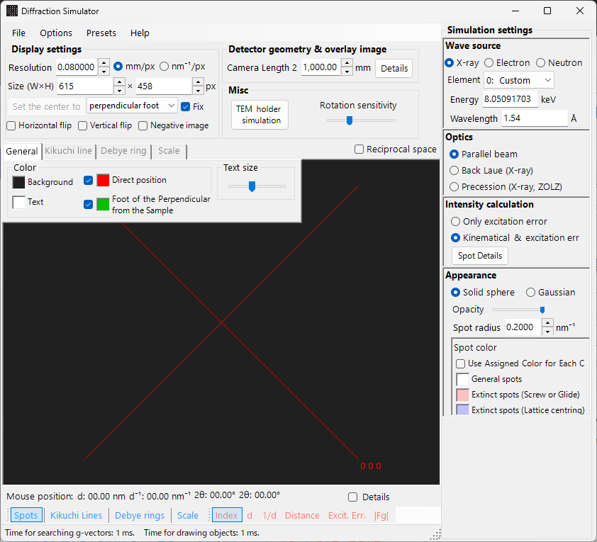

# X-ray / Neutron Diffraction Simulation

**X-ray / neutron diffraction simulation** computes single-crystal X-ray and neutron diffraction patterns. It is one of the main modes of the [diffraction simulator](index.md).

> This page lists every setting that appears on the right-hand side when you select **Wave Length = X-ray** (or neutron). For window-wide operations such as drawing and saving, see the [overview page](index.md).

GUI conditions: Wave Length = X-ray / Neutron · Incident beam = Parallel / Precession (X-ray) / Back-Laue · Intensity calculation = Only excitation error / Kinematical

---

## Overview

X-rays have a longer wavelength than electrons (Cu Kα: 0.15406 nm = 1.5406 Å), so the Ewald sphere is more strongly curved. As a result, fewer reciprocal-lattice points satisfy the diffraction condition simultaneously than for electrons. Because the atomic scattering power is small and multiple scattering is weak, the Kinematical theory of diffraction gives sufficient accuracy for the intensities (the Dynamical calculation is supported for electrons only).

---

## Wave Length

Select **X-ray** as the radiation source. X-rays can be specified in two ways: characteristic X-rays and synchrotron radiation.

### Characteristic X-rays

Choosing an **element** and a **transition** fixes the characteristic X-ray wavelength. The transition is specified in Siegbahn notation (Kα₁ / Kα₂ / Kβ, etc.). Kα₁ wavelengths of representative elements:

| Element | Line | Wavelength (Å) | Energy (keV) |
|---------|------|-----------------|--------------|
| Cu | Kα₁ | 1.5406 | 8.048 |
| Mo | Kα₁ | 0.7107 | 17.479 |
| Co | Kα₁ | 1.7890 | 6.930 |
| Cr | Kα₁ | 2.2910 | 5.415 |

### Synchrotron radiation

Set **Element** to **0: Custom** and enter the energy (keV) or wavelength (Å) directly. Any wavelength can be used.

---

## Incident beam mode

Selects the geometry of the incident beam. Three modes are available for X-rays.

### Parallel

The standard plane wave. A parallel incident beam used for SAED and single-crystal X-ray diffraction.

### Precession (X-ray) — precession camera

Simulates an X-ray precession camera. This is a precession photograph that captures a single layer of the reciprocal lattice.

### Back-Laue (back-reflection Laue)

Simulates a back-reflection Laue pattern with white (polychromatic) X-rays. In this back-reflection geometry the detector is placed on the source side, and **Monochrome** is turned off. The reflection geometry is given by **Tau / Phi** in **Detector geometry** (see [Detector geometry](index.md#detector-geometry)).

> **Note**: The incident-beam options follow the wavelength. **Precession (electron)** and **Convergence (CBED)** appear only when electron radiation is selected, whereas the **Precession (X-ray)** and **Back-Laue** options above appear only when X-ray radiation is selected. For neutrons, only **Parallel** is available. Depending on the state at capture time, the screenshot may not show the X-ray-specific options.

---

## Intensity calculation

Selects the method used to compute spot intensities. Two modes are available for X-rays.

### Only excitation error

Intensity is determined solely by the geometric distance between the Ewald sphere and the reciprocal-lattice point (the excitation error $s_g$). Smaller $\lvert s_g \rvert$ gives higher intensity, peaking at the value set by **Radius**, and falling to zero when $\lvert s_g \rvert$ exceeds Radius. The structure factor is ignored.

### Kinematical & excitation error

In addition to the excitation error, the Kinematical structure factor $\lvert F_{hkl} \rvert^2$ is folded into the intensity. Extinction rules are strictly obeyed. The Lorentz and polarization factors are not included (this is a simulation of the geometric pattern).

> **Note**: **Dynamical theory** is disabled for X-rays (available only when electron radiation is selected).

---

## Spot appearance

Controls how each diffraction spot is rendered.

- **Solid sphere / Gaussian** : geometric model of the reciprocal-lattice point. **Solid sphere** uses the cross-section between a sphere of radius *R* and the Ewald sphere (the area of the circle corresponds to the diffraction intensity); **Gaussian** uses the cross-section between a 3-D Gaussian with σ = *R* and the Ewald sphere (the integral of the 2-D Gaussian corresponds to the diffraction intensity).
- **Opacity** : transparency of the spot (0 = transparent, 1 = opaque).
- **Radius (R)** : radius of the reciprocal-lattice point. The rendered spot size is determined by the combination of **Appearance** and **Intensity calculation**.
- **Brightness** : active only in **Gaussian** mode. Sets the integrated intensity of the rendered Gaussian.
- **Color scale** : choose between **Gray scale** and **Cold-warm** colour maps.
- **Log scale** : display intensities on a logarithmic scale.
- **Spot color** : default spot colour when the colour scale does not apply.
- **Use crystal color** : when checked, draws spots in the colour assigned to each crystal.

---

## Debye rings (polycrystalline)

Debye rings of a polycrystalline specimen can be displayed. Enable **Debye rings** on the toolbar (see [Toolbar](index.md#toolbar)).

- **Ignore diffraction intensity** : draws all rings in the same colour and intensity (used for a purely geometric comparison that ignores the structure factor).
- **Show index label** : displays the (*hkl*) index near each ring.

Detailed settings are on the Debye rings tab of the [tab menu](index.md#drawing-overlay-tabs).

---

## Neutron diffraction

Selecting **Neutron** in the Wave Length control computes a neutron diffraction pattern. Enter the energy (meV) or wavelength (nm). The incident beam can only be **Parallel**. The intensity calculation can be **Only excitation error** or **Kinematical** (Dynamical is not available). The Kinematical intensity uses the neutron scattering length instead of the atomic scattering factor.

---

## Differences between X-ray and electron diffraction

| Feature | X-ray diffraction | Electron diffraction |
|---------|-------------------|----------------------|
| Wavelength | Long (0.5–2.5 Å) | Short (0.02–0.04 Å) |
| Ewald sphere curvature | Large | Small (nearly flat) |
| Simultaneous reflections | Few | Many |
| Scattering factor | Atomic scattering factor $f(s)$ | Electron scattering factor $f_e(s)$ |
| Dynamical effects | Usually small | Large |
| Extinction rules | Strictly obeyed | May be violated by multiple scattering |

---

## Common operations

For window-wide operations such as camera length, detector geometry, saving patterns, and colour settings, see the [overview page](index.md). Detailed detector geometry is configured in the geometry window below.

---

## See also

- [Diffraction simulator (overview)](index.md)
- [SAED simulation](1-saed-simulation.md)
- [Precession electron diffraction (PED) simulation](2-ped-simulation.md)
- [Convergent-beam electron diffraction (CBED) simulation](3-cbed-simulation.md)
- [Coordinate system — crystal orientation](../appendix/a1-coordinate-system/1-orientation.md)
