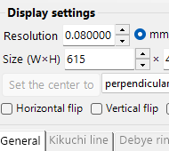
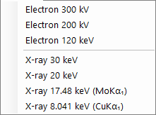
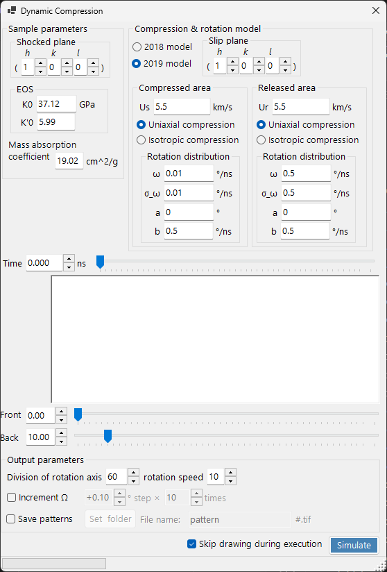

# Crystal Diffraction (Diffraction Simulator)

**Crystal Diffraction (Diffraction Simulator)** simulates single-crystal X-ray, neutron, and electron diffraction patterns.

The window has a diffraction-pattern drawing area on the **left** and, on the **right**, the setting panels for the spot properties (wavelength, incident beam, intensity calculation, appearance, and so on). The combination of wavelength and incident beam determines the acquisition mode (X-ray diffraction, SAED, PED, CBED), and the right-hand panels reconfigure accordingly.

---

## How this page and the mode pages divide the work

- **This page (hub)**: collects the operations common to every mode (shortcuts, menus, toolbar, screen/detector information, overlay tabs, spot information, detector geometry, dynamic compression).
- **Each mode page**: covers **every setting that appears on the right** when that mode is selected (wavelength, incident beam, intensity calculation, appearance, Bloch-wave settings, precession settings, and so on), so each page is self-contained (some overlap exists between modes).

| Mode | Contents | Page |
|------|----------|------|
| **X-ray (and neutron) diffraction** | Single-crystal X-ray / neutron diffraction pattern (parallel, precession X-ray, Back Laue) | [X-ray Diffraction Simulation](4-x-ray-neutron-diffraction.md) |
| **SAED** | Parallel-beam electron diffraction (selected-area electron diffraction) | [SAED Simulation](1-saed-simulation.md) |
| **PED** | Precession electron diffraction | [PED Simulation](2-ped-simulation.md) |
| **CBED** | Convergent-beam electron diffraction | [CBED Simulation](3-cbed-simulation.md) |

---

## Mode quick reference

Look up the page you need from the combination of **wavelength (source)** and **incident beam**.

| Wavelength | Incident beam | Mode | Page |
|------------|--------------------|------|------|
| Electron | Parallel | SAED | [SAED Simulation](1-saed-simulation.md) |
| Electron | Precession (electron = PED) | PED | [PED Simulation](2-ped-simulation.md) |
| Electron | Convergence (CBED) | CBED | [CBED Simulation](3-cbed-simulation.md) |
| X-ray | Parallel | X-ray diffraction | [X-ray Diffraction Simulation](4-x-ray-neutron-diffraction.md) |
| X-ray | Precession (X-ray) | Precession X-ray (precession camera) | [X-ray Diffraction Simulation](4-x-ray-neutron-diffraction.md) |
| X-ray | Back Laue | Back-reflection Laue | [X-ray Diffraction Simulation](4-x-ray-neutron-diffraction.md) |
| Neutron | Parallel | Neutron diffraction | [neutron section of X-ray Diffraction Simulation](4-x-ray-neutron-diffraction.md) |

> **Note**: The incident-beam choices change with the wavelength. For electrons: **Parallel, Precession (electron = PED), Convergence (CBED)**; for X-rays: **Parallel, Precession (X-ray), Back Laue**; for neutrons: **Parallel** only. Selecting **Precession (electron = PED)** or **Convergence (CBED)** automatically switches the intensity calculation to **Dynamical**.

---

## Keyboard & mouse shortcuts

These apply to the diffraction-pattern window shared by the X-ray, SAED, and PED simulations. Dragging on the pattern rotates the **crystal**. There is **no mouse-wheel zoom** here — zoom with right-click / right-drag.

| Shortcut | Action |
|----------|--------|
| <kbd>F1</kbd> | Open this page of the online manual |
| Left-drag near the centre | Tilt the crystal |
| Left-drag the outer area | Spin the crystal about the beam axis |
| Left double-click a spot | Show reflection details (index, *d*, structure factor, excitation error) |
| Middle-drag | Pan the pattern |
| <kbd>CTRL</kbd> + Middle-drag | Move the detector centre (when the detector area is shown) |
| Right-click | Zoom out |
| Right-drag a box | Zoom in to the selected region |
| Right double-click the status bar | Copy a text summary of the current settings |
| Right double-click a lit layer button (Spots / Kikuchi / Debye / Scale) | Blink that layer on and off |

The auxiliary windows opened from here add a few more:

| Shortcut | Action |
|----------|--------|
| Left double-click the stereonet — **TEM holder** | Set the holder tilt to that point |
| Arrow keys — **TEM holder** | Step the holder tilt (tick **Arrow keys** first) |
| Drop a `.prm` file or an image — **Detector geometry** | Load detector geometry / overlay image |
| Drop a `.txt` profile — **Dynamic compression** | Load a pressure/time profile (drag the red line in the graph to scrub) |

The application-wide <kbd>CTRL</kbd>+<kbd>SHIFT</kbd> shortcuts of the main window also work while this window is focused (see [main window](../0-main-window.md)).

→ See **[21. Keyboard & mouse shortcuts](../21-shortcuts.md)** for every window at a glance.

---

## Quick Routes by Goal

| Goal | Start from | Reference |
|------|------------|-----------|
| Produce parallel-beam electron diffraction (SAED) | Set **Incident beam** to **Parallel** and **Wavelength** to electron | [SAED Simulation](1-saed-simulation.md), [parallel-beam SAED calculation](../appendix/a3-bloch-wave/calculation.md) |
| Produce single-crystal X-ray diffraction | Switch **Wavelength** to X-ray / Synchrotron | [X-ray Diffraction Simulation](4-x-ray-neutron-diffraction.md) |
| Produce precession electron diffraction (PED) | Set **Incident beam** to **Precession (electron)**, then set the semi-angle and step | [PED Simulation](2-ped-simulation.md) |
| Produce convergent-beam electron diffraction (CBED) | Set **Incident beam** to **Convergence (CBED, electron only)** and set the conditions in the CBED window | [CBED Simulation](3-cbed-simulation.md), [CBED calculation](../appendix/a3-bloch-wave/cbed.md) |
| Inspect the reflection list from the dynamical calculation | Select **Dynamical** and open **Spot Details** or **Details** | [Dynamical calculation (shared core)](../appendix/a3-bloch-wave/calculation.md) |
| Match detector geometry against an experimental image | Open the detector-geometry settings from **Details** and use the overlay image | [Detector coordinate system](../appendix/a1-coordinate-system/2-diffraction.md) |

---

## Main area

The diffraction pattern is simulated in the centre of the screen.

### Mouse operation

See "Keyboard & mouse shortcuts" at the top of this page.

### Mouse position

The information corresponding to the cursor position (cursor *q*, *d*, 2θ, azimuth, and so on) is displayed in the status line above the pattern. Ticking **Details** adds more detailed information (the (*hkl*) of the nearest reflection, excitation error, structure factor, and so on).

---

## File menu

| Menu item | Description |
|-----------|-------------|
| **Save** | Save the displayed diffraction pattern to a file. |
| **Save detector area** | Save only the detector-area crop. |
| **Copy** | Copy the displayed image to the clipboard. |
| **Copy detector area** | Copy only the detector-area crop. |

### Preset {#toolbar}

Save and recall a complete simulator configuration — wavelength, detector geometry, tab settings, spot properties, and so on — as a preset. Useful for quickly switching between instruments / acquisition modes.

---

## Toolbar

| Button | Description |
|--------|-------------|
| Spots | Show / hide the diffraction-spot layer |
| Kikuchi | Show / hide the Kikuchi-line layer |
| Debye | Show / hide the Debye-ring layer |
| Scale | Show / hide the scale-line layer |
| Index / d / Distance / Excitation error / Structure factor | Choice of label attached to each spot |

---

## Screen and detector information

### Screen

| Item | Description |
|------|-------------|
| **Resolution** | The size of one pixel (mm). It need not be the actual detector pixel size; it is treated as a display scale and is updated automatically when you zoom with the mouse. |
| **Size (W×H)** | Pixel width and height of the drawing area. Depending on your display resolution, very large values may not be settable. |
| **Set centre / Fix centre** | Set the pattern centre to any pixel in the drawing area and, if required, fix it. When fixed, the centre cannot be moved by mouse panning. |
| **Horizontal flip / Vertical flip / Negative image** | Geometric flips (horizontal / vertical) and contrast inversion of the displayed pattern. Use these to match the orientation or contrast of an experimental image. |
| **Reciprocal space** | Overlays the Ewald sphere and reciprocal-lattice vectors on the pattern, visualizing which reflections are excited. |

### Detector (camera length)

- **Camera length** : Distance from the sample to the detector (mm).
- **Details** : Opens the detector-geometry settings window (see [Detector geometry](#detector-geometry) below).

### Misc

- **Rotation sensitivity** : Amount of crystal rotation per pixel of mouse drag.
- **TEM holder simulation** : Opens the holder-linked simulation window (see below).

---

## TEM holder simulation {#drawing-overlay-tabs}

Opens a window that links the diffraction pattern to a double-tilt (or rotation) **TEM holder**. Setting the holder tilt angles updates the pattern and the crystal orientation, and the reachable orientations can be shown on a stereonet (added in v4.914). Left double-click on the stereonet sets the holder tilt to that point, and ticking **Arrow keys** lets the arrow keys step the tilt.

---

## Drawing overlay tabs

### General

Sets the colours of spots, labels, Kikuchi lines, Debye rings, and other overlays. The settings here apply to all rendering modes.

### Kikuchi lines

Active when Kikuchi lines are enabled on the toolbar.

- **Reflection selection** : Choose which reflections generate the Kikuchi lines. Either **structure factor** (the top *N* reflections by $\lvert F_{hkl}\rvert$) or **1/d cutoff** (all reflections whose 1/d is below the threshold (nm⁻¹)).
- **Line appearance** : Sets the line width, the Kikuchi-line colour, and **Draw with kinematical intensity** (scales line darkness by the Kinematical intensity of the reflection).
- **Threshold** : A legacy parameter. Runs the Kikuchi-line calculation only for reflections with *d* greater than the specified value (retained for compatibility).

### Debye rings

Active when Debye rings are enabled on the toolbar.

- **Ignore diffraction intensity** : If checked, all Debye rings are drawn with the same colour and intensity (ignoring the crystal structure factor). Use it for a purely geometric comparison.
- **Show index label** : If checked, the (*hkl*) appears near each ring.

### Scale

Active when the scale lines are enabled on the toolbar.

- **2θ / Azimuth scale lines** : **2θ** represents constant scattering angle (concentric circles), **Azimuth** represents constant azimuth angle (radial lines from the centre). The colours are independently configurable.
- **Line width** : Thickness of the scale lines.
- **Division** : Angular interval between adjacent scale lines.
- **Show scale labels** : Whether to draw numeric labels on the scale lines.

### Misc {#diffraction-spot-information}

Miscellaneous settings such as the mouse rotation sensitivity.

- **Mouse sensitivity** : Amount of crystal rotation per pixel of mouse drag.

---

## Diffraction spot information

Lists the per-reflection details computed by the Bloch-wave method (Dynamical calculation). Open it with the **Spot Details** button (intensity-calculation panel) or the **Details** check box.

### Schematic and definitions

The schematic (top left) shows the vectors on the Ewald sphere and defines the quantities used in the table ($\hat{\mathbf{n}}$ is the unit vector normal to the sample surface, $\mathbf{k}$ is the incident wavevector, $\mathbf{g}$ is the reciprocal-lattice vector).

- $P_g = 2\,\hat{\mathbf{n}} \cdot (\mathbf{k} + \mathbf{g})$
- $Q_g = |\mathbf{k}|^2 - |\mathbf{k} + \mathbf{g}|^2 = -\mathbf{g} \cdot (2\mathbf{k} + \mathbf{g})$
- **Excitation error:** $S_g = \dfrac{\sqrt{P_g^2 + 4 Q_g} - P_g}{2}$
- **Evaluation function:** $R = |\mathbf{g}|\, Q_g^2$ — ranks reflections by how strongly they are excited (smaller = closer to the Ewald sphere = more strongly excited; the transmitted beam $g=0$ has $R=0$ and comes first). The table is sorted by ascending $R$.

### Table columns

| Column | Meaning |
|--------|---------|
| **R** | evaluation function $R = \lvert\mathbf{g}\rvert\, Q_g^2$ (above; used for selecting / ordering reflections) |
| **h, k, (i,) l** | Miller indices (*i* is the redundant hexagonal index, shown only for hexagonal crystals) |
| **d** | interplanar spacing (nm) |
| **gX, gY, gZ** | components of the reciprocal-lattice vector *g* (1/nm) |
| **\|g\|** | magnitude of *g* (1/nm) |
| **Vg re / Vg im** | Fourier coefficient of the crystal potential for elastic scattering, $V_g$ (real / imaginary) |
| **V'g re / V'g im** | imaginary (absorption) potential for thermal diffuse scattering (TDS), $V'_g$ (real / imaginary) |
| **Sg** | excitation error $S_g$ (above; 1/nm) |
| **Pg** | auxiliary quantity $P_g = 2\,\hat{\mathbf{n}}\cdot(\mathbf{k}+\mathbf{g})$ (above) |
| **Qg** | auxiliary quantity $Q_g = -\mathbf{g}\cdot(2\mathbf{k}+\mathbf{g})$ (above) |
| **Φ re / Φ im** | complex amplitude $\Phi$ of the dynamical diffracted wave on the exit surface (real / imaginary) |
| **\|Φ\|^2** | diffracted intensity $\lvert\Phi\rvert^2$ of that reflection |
| **Σ\|Φ\|^2** | cumulative sum of $\lvert\Phi\rvert^2$ (total over reflections; useful as an intensity-conservation check) |

### Potential units and other controls

- **Unit of potential** : Switches the displayed potential between **Vg [eV]** (electrostatic potential, eV) and **Ug [nm⁻²]** (the scaled quantity $U_g = (2 m_0/h^2)\, V_g$ that enters the Bloch-wave equations). The column headers change accordingly between *Vg / V'g* and *Ug / U'g*.
- Above the table, the accelerating voltage, wavelength ($\lambda = 1/k_\text{vac}$), relativistic mass ratio $m/m_0$, speed ratio $v/c$, lattice volume, sample thickness, and (in CBED mode) the maximum semi-angle of the electron beam are shown.
- **Note 1:** the unit of length is **nm**, not Å. **Note 2:** the unit of wavenumber is **1/nm**, not 2π/nm.
- **Effective digit** : number of significant digits shown in the table. **Auto resize row width** : auto-fit column widths. **Copy to clipboard** : exports the table as text that can be pasted into a spreadsheet. (This form is shown in English even under a Japanese UI.)

---

## Detector geometry {#detector-geometry}

A window for the detailed setup of the detector geometry (camera length, tilt, rotation) and overlay of an experimental image. Open it from **Details** in the **Detector geometry** panel.

### Detector geometry settings

Specify the reflection geometry such as the camera length and the detector tilt (**Tau / Phi**). For Back Laue (back-reflection Laue), set the geometry that places the detector on the source side here.

### Detector area and overlapped image

Specify the active area of the detector and drop an experimental image to overlay it. Use this to overlay the simulated pattern and an experimental image and fine-tune the detector geometry.

See also [Detector coordinate system](../appendix/a1-coordinate-system/2-diffraction.md) for the coordinate-system definitions.

---

## Dynamic compression

A window for scrubbing the pressure/time profile of a high-pressure (dynamic-compression) experiment. Drop a `.txt` pressure/time profile onto this window to load it, then drag the red line in the graph to continuously scan through time (pressure) while reflecting the corresponding state in the diffraction pattern.

---

## Related topics

- [X-ray Diffraction Simulation](4-x-ray-neutron-diffraction.md)
- [SAED Simulation](1-saed-simulation.md)
- [PED Simulation](2-ped-simulation.md)
- [CBED Simulation](3-cbed-simulation.md)
- [Dynamical calculation (shared core)](../appendix/a3-bloch-wave/calculation.md)
- [Detector coordinate system](../appendix/a1-coordinate-system/2-diffraction.md)
