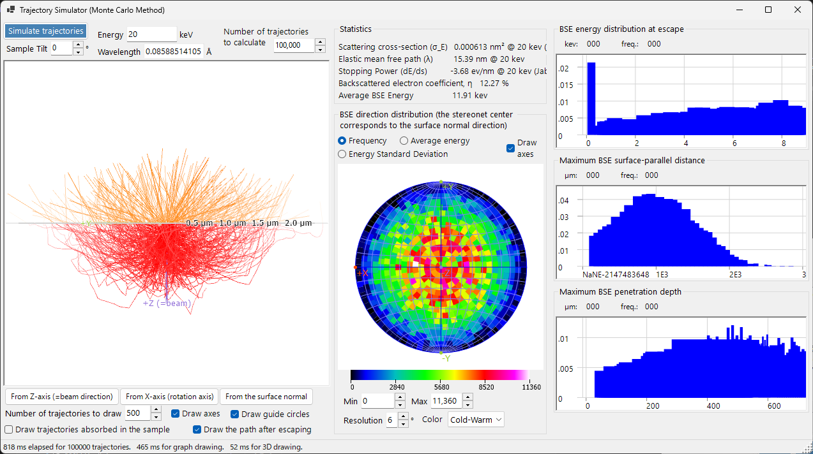
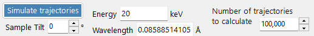
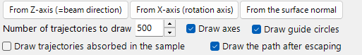
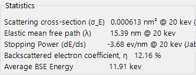
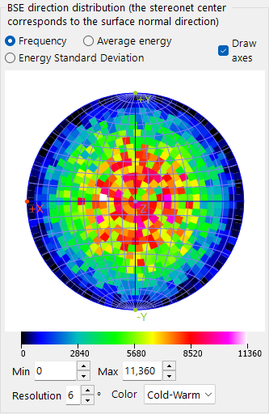
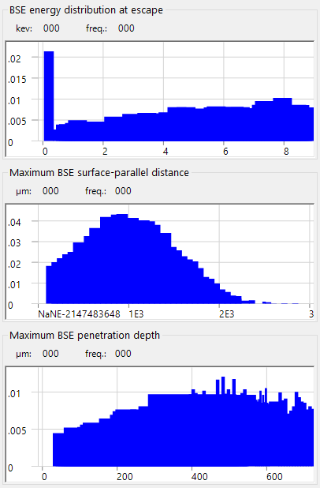

# Electron Trajectory

**Trajectory Simulator** computes electron trajectories inside a sample by the **Monte-Carlo method**: incident electrons undergo elastic and inelastic scattering, and the resulting distributions of backscattered electrons (direction, energy, penetration depth) are accumulated. These distributions also feed the angular/energy/depth weighting used by the [12. EBSD simulation](12-ebsd-simulation.md).

---

## Keyboard & mouse shortcuts

The trajectories are shown in a 3-D OpenGL view. It uses ReciPro's standard [view navigation](21-shortcuts.md), but **panning is disabled** — use the view-preset buttons to jump to the standard orientations.

| Shortcut | Action |
|----------|--------|
| <kbd>F1</kbd> | Open this page of the online manual |
| Left-drag | Rotate the model |
| Right-drag up/down, or Mouse wheel | Zoom |
| <kbd>CTRL</kbd> + Right double-click | Toggle orthographic / perspective projection |

→ See **[21. Keyboard & mouse shortcuts](21-shortcuts.md)** for every window at a glance.

---

## Calculation Conditions

Beam energy, number of incident electrons, sample/material, and other Monte-Carlo parameters.

### Beam energy

Accelerating voltage of the incident electron beam (keV). Sets the kinetic energy used for both elastic (Mott) and inelastic (dielectric-response) scattering models.

### Number of incident electrons

How many electrons to simulate. More electrons reduce statistical noise but increase run time linearly.

### Sample / material

Composition and density of the sample. Defaults to the crystal currently selected in the main window, but can be overridden for trajectory-only studies.

### Sample tilt

Sample tilt angle. Used when the trajectory data feeds the [EBSD simulator](12-ebsd-simulation.md) (typically 70° for EBSD).

### Cross-section model

The elastic-scattering cross-section model (Mott / Bethe / NIST). Different models trade speed for accuracy at high tilt angles or near absorption edges.

---

## Stereonet Options

Display options for the angular distribution drawn on the stereographic projection.

### Projection method

**Wulff** (equal-angle) or **Schmidt** (equal-area) projection. Schmidt is usually preferred when reading off statistical density.

### Hemisphere

Plots the upper (back-scattered) or lower (transmitted) hemisphere.

### Resolution / Colour scale

Bin size of the angular histogram and the colour map used for the density display.

---

## Statistics

Summary of the run.

- **Backscatter yield** — fraction of incident electrons that exit through the entrance surface.
- **Mean free path** — average distance between scattering events.
- **Mean penetration depth** — average maximum depth reached by an electron before either exiting or being absorbed.
- **Elapsed time / Throughput** — wall-clock cost of the run.

---

## BSE direction distribution

Angular distribution of the backscattered electrons (the stereonet centre corresponds to the surface normal direction). The yellow/orange outline (when present) marks the region subtended by the EBSD detector.

---

## Profiles

Depth and energy profiles of the simulated electrons.

### Depth profile

Histogram of the final exit depth (nm) of the backscattered electrons. Used by the EBSD simulator to weight the depth integration of the master pattern.

### Energy profile

Histogram of the energy loss ΔE (keV) of the backscattered electrons. Used by the EBSD simulator to weight the energy integration.

---

## See also

- [EBSD simulation](12-ebsd-simulation.md)
- [EBSD calculation](appendix/a3-bloch-wave/ebsd.md)
- [Dynamical diffraction (Bloch-wave)](appendix/a3-bloch-wave/index.md)
- [HRTEM/STEM simulator](9-hrtem-stem-simulator/index.md)
- [Diffraction simulator](7-diffraction-simulator/index.md)
