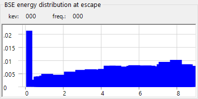

# Electron Trajectory

**Trajectory Simulator** computes electron trajectories inside a sample by the **Monte-Carlo method**: incident electrons undergo elastic and inelastic scattering, and the resulting distributions of backscattered electrons (direction, energy, penetration depth) are accumulated. These distributions also feed the angular/energy/depth weighting used by the [14. EBSD simulation](12-ebsd-simulation.md).

---

## Calculation Conditions

Beam energy, number of incident electrons, sample/material, and other Monte-Carlo parameters.

---

## Stereonet Options

Display options for the angular distribution drawn on the stereographic projection.

---

## Statistics

Summary of the run (backscatter yield, mean free path, penetration depth, etc.).

---

## BSE direction distribution

Angular distribution of the backscattered electrons (the stereonet center corresponds to the surface normal direction).

---

## Profiles

Depth and energy profiles of the simulated electrons.

### BSE energy distribution at escape

