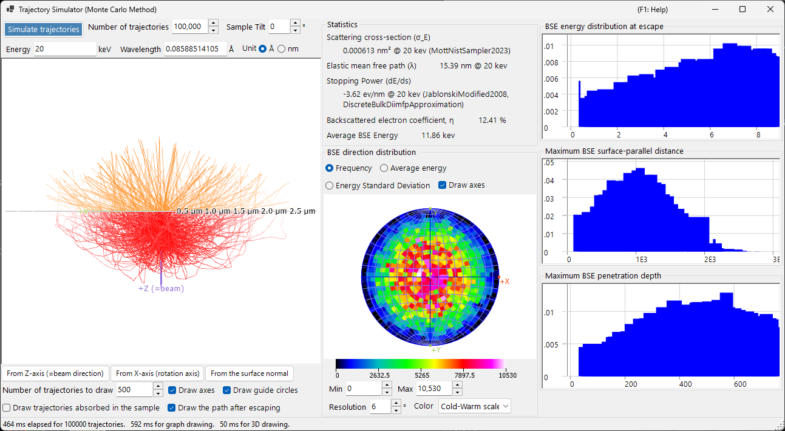
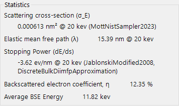
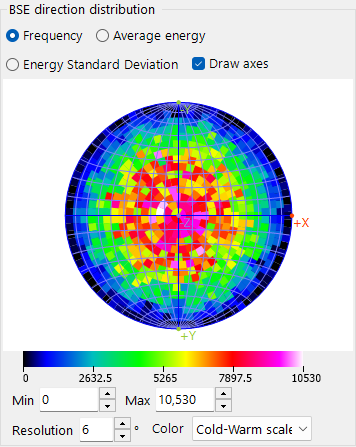
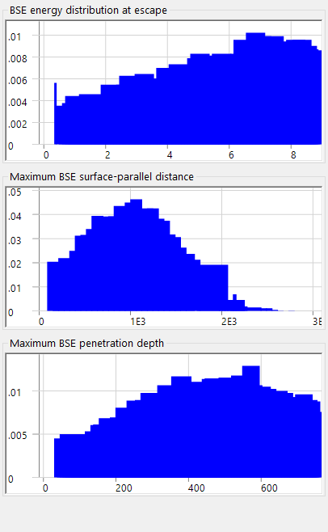

# Electron Trajectory

**Trajectory Simulator (Monte Carlo Method)** computes electron trajectories inside a sample by the **Monte-Carlo method**: incident electrons undergo elastic and inelastic scattering, and the resulting distributions of backscattered electrons (BSE) — direction, energy at escape, penetration depth and lateral spread — are accumulated. These distributions also feed the angular/energy/depth weighting used by the [12. EBSD simulation](12-ebsd-simulation.md).

The window has three columns: the **3-D trajectory view** on the left, **Statistics** and the **BSE direction distribution** stereonet in the middle, and three **histograms** on the right. The sample composition and density come from the crystal selected in the main window; only the beam energy, the sample tilt and the number of trajectories are set here.

---

## Keyboard & mouse shortcuts

The trajectories are shown in a 3-D OpenGL view. It uses ReciPro's standard [view navigation](21-shortcuts.md), but **panning is disabled** — use the view-preset buttons to jump to the standard orientations.

| Shortcut | Action |
|----------|--------|
| <kbd>F1</kbd> | Open this page of the online manual |
| Left-drag | Rotate the model |
| Right-drag up/down, or Mouse wheel | Zoom |
| <kbd>CTRL</kbd> + Right double-click | Toggle orthographic / perspective projection |

→ See **[21. Keyboard & mouse shortcuts](21-shortcuts.md)** for every window at a glance.

---

## Calculation conditions

The controls along the top of the window set the run:

- **Simulate trajectories** : starts the Monte-Carlo run. The status bar at the bottom reports the elapsed time of the trajectory calculation, the graph drawing and the 3-D rendering separately.
- **Number of trajectories** : how many incident electrons to track. More electrons reduce the statistical noise of every distribution below, at a run time that grows linearly.
- **Sample Tilt** (°) : tilt of the sample surface about the *X* axis. Leave it at 0 for normal incidence; use **−70°** to reproduce the geometry of the [EBSD simulator](12-ebsd-simulation.md), where the large tilt raises the backscatter yield.
- **Energy** (keV) / **Wavelength** / **Unit** : the accelerating voltage of the incident beam, and the relativistically corrected electron wavelength linked to it. The energy sets the kinetic energy used by both the elastic (NIST Mott) and the inelastic (stopping power / IMFP) models.

The scattering models themselves are not user-selectable: the elastic cross sections come from the bundled NIST Mott table (falling back to screened Rutherford outside its range), and the stopping power from the modified Jablonski (2008) form. The model actually used is printed next to each value in **Statistics**. See [Attenuation & transport](appendix/a2-beam-interaction/attenuation-transport.md) for what these models are.

### 3-D trajectory view

Red trajectories are electrons absorbed in the sample, orange ones are those that escape as backscattered electrons. The concentric guide circles are labelled in nm (or µm), and **+X**, **+Y**, **+Z (=beam)** mark the axes.

- **From Z-axis (=beam direction)** / **From X-axis (rotation axis)** / **From the surface normal** : snap the view to the standard directions.
- **Number of trajectories to draw** : how many of the calculated trajectories to render (drawing every one of 100,000 would be unreadable and slow).
- **Draw axes** / **Draw guide circles** : the axis arrows and the distance scale.
- **Draw trajectories absorbed in the sample** : include the electrons that never escape.
- **Draw the path after escaping** : continue drawing a backscattered electron's path after it has left the surface.

---

## Statistics

Values for the current beam energy, with the model that produced each one named in brackets.

- **Scattering cross-section (σ_E)** (nm²) — total elastic cross section per atom.
- **Elastic mean free path (λ)** (nm) — average distance between elastic scattering events.
- **Stopping Power (dE/ds)** (eV/nm, negative) — energy lost per unit path length.
- **Backscattered electron coefficient, η** (%) — the fraction of incident electrons that leave again through the entrance surface. This is the quantity that BSE imaging contrast is built on.
- **Average BSE Energy** (keV) — mean energy of the backscattered electrons at the moment they escape.

---

## BSE direction distribution

Angular distribution of the backscattered electrons, drawn on a stereonet whose centre is the surface-normal direction.

- **Frequency** / **Average energy** / **Energy Standard Deviation** : the quantity mapped to colour — how many electrons leave in each direction, their mean energy, or the spread of that energy.
- **Draw axes** : overlay the +X / ±Y / ±Z directions.
- **Min** / **Max**, **Resolution**, **Color** : the colour-scale limits, the angular bin size of the histogram, and the colour map.

---

## Histograms

Three distributions of the backscattered electrons, all normalised to unit area.

### BSE energy distribution at escape

Histogram of the **energy the backscattered electrons still carry when they leave the sample** (keV) — not their energy loss. The EBSD simulator uses it to weight the energy integration of the master pattern.

### Maximum BSE surface-parallel distance

Histogram of how far each backscattered electron travelled **laterally** (parallel to the surface, nm) before escaping. It is the lateral size of the interaction volume, and therefore the intrinsic spatial resolution limit of a BSE or EBSD measurement.

### Maximum BSE penetration depth

Histogram of the greatest depth **perpendicular to the surface** (nm) each backscattered electron reached before escaping. The EBSD simulator uses it to weight the depth integration of the master pattern.

---

## See also

- [EBSD simulation](12-ebsd-simulation.md)
- [EBSD calculation](appendix/a3-bloch-wave/ebsd.md)
- [Attenuation & transport](appendix/a2-beam-interaction/attenuation-transport.md) — the elastic cross sections, stopping power and ranges used here.
- [Dynamical diffraction (Bloch-wave)](appendix/a3-bloch-wave/index.md)
- [HRTEM/STEM simulator](9-hrtem-stem-simulator/index.md)
- [Diffraction simulator](7-diffraction-simulator/index.md)
