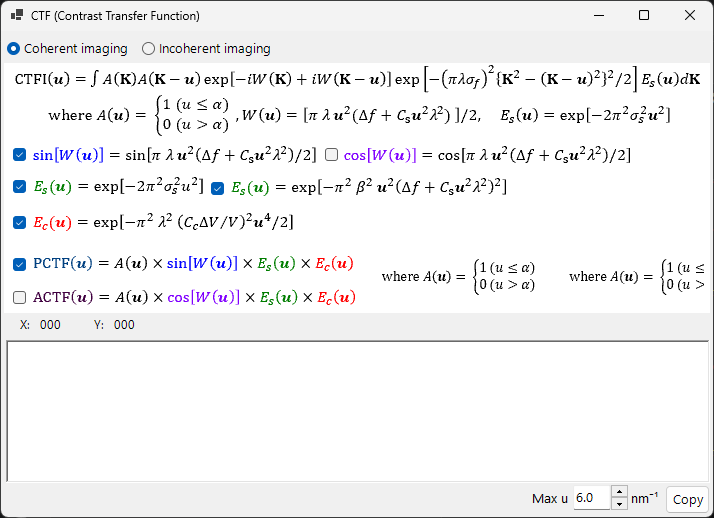

# HRTEM Simulation

Simulates high-resolution TEM lattice-fringe images. The primary mode of the [HRTEM/STEM simulator](index.md).

---

## Calculation flow

1. **Bloch-wave method**: compute electron wave propagation through the crystal potential; obtain exit-wave amplitude and phase
2. **Lens function**: apply objective-lens aberrations (spherical aberration $C_s$, defocus $\Delta f$)
3. **Partial coherence**: account for finite source size (spatial coherence) and energy spread (temporal coherence)
4. **Image formation**: compute intensity $|\psi(\mathbf{r})|^2$

---

## Specimen parameters

| Parameter | Description |
|-----------|-------------|
| **Thickness** | Specimen thickness (nm). HRTEM images are strongly thickness-dependent |

---

## Optical parameters

### TEM conditions

| Parameter | Description |
|-----------|-------------|
| **Acc. Vol.** | Accelerating voltage (kV). Relativistically corrected wavelength shown alongside |
| **Defocus** | Defocus value (nm). Scherzer defocus displayed as reference |

### Intrinsic parameters

| Parameter | Description | Typical |
|-----------|-------------|---------|
| **Cs** | Spherical aberration (mm) | 0.5–1.0 (conventional); < 0.01 (Cs-corrected) |
| **Cc** | Chromatic aberration (mm) | 1.0–2.0 |
| **β** | Illumination semiangle (mrad) | 0.1–1.0 |
| **ΔE** | Energy spread 1/*e* width (eV) | 0.5–2.0 |

---

## Phase Contrast Transfer Function (PCTF)

Displayed in the lens-function tab:

- $\sin\chi(u)$: phase contrast transfer function ($\chi(u)$ is the lens aberration function)
- $E_\text{s}(u)$: spatial coherence envelope
- $E_\text{c}(u)$: temporal coherence envelope

Scherzer defocus: $\Delta f = -\sqrt{\tfrac{4}{3}\,C_s \lambda}\ (\approx -1.155\,\sqrt{C_s \lambda})$, the condition giving a broad negative PCTF band (dark contrast = atom positions). ReciPro uses this original Scherzer value — derived by setting the minimum of the aberration phase $\chi$ to $-2\pi/3$ — and the value shown in the GUI follows this formula; some references instead use the *extended Scherzer* value $-1.2\sqrt{C_s\lambda}$.

---

## Objective aperture

Set aperture size (mrad) and position. **Open aperture** removes it. The number of Bloch waves considered depends on aperture conditions.

---

## Partial coherence models

| Model | Description |
|-------|-------------|
| **Quasi-coherent (linear image)** | Fast. Valid under the weak-phase approximation |
| **TCC (Transmission Cross Coefficient)** | More accurate; longer computation |

---

## Simulation modes

| Mode | Description |
|------|-------------|
| **Single image** | One image at current thickness and defocus |
| **Serial image** | Matrix of images over thickness × defocus ranges (Start / Step / Num) |

---

## Image adjustment

| Setting | Description |
|---------|-------------|
| **Min / Max** | Display range (image-adjustment trackbars) |
| **Colour** | Greyscale or Cold-Warm |
| **Gaussian blur (FWHM)** | Apply a Gaussian filter |
| **Unit cell** | Overlay unit-cell grid |
| **Scale** | Show scale bar |

---

## See also

- [HRTEM/STEM simulator (overview)](index.md)
- [STEM simulation](2-stem-simulation.md)
- [Potential simulation](3-potential-simulation.md)
- [Appendix A2.2 — HRTEM image formation](../appendix/a2-bloch-wave/hrtem.md)
