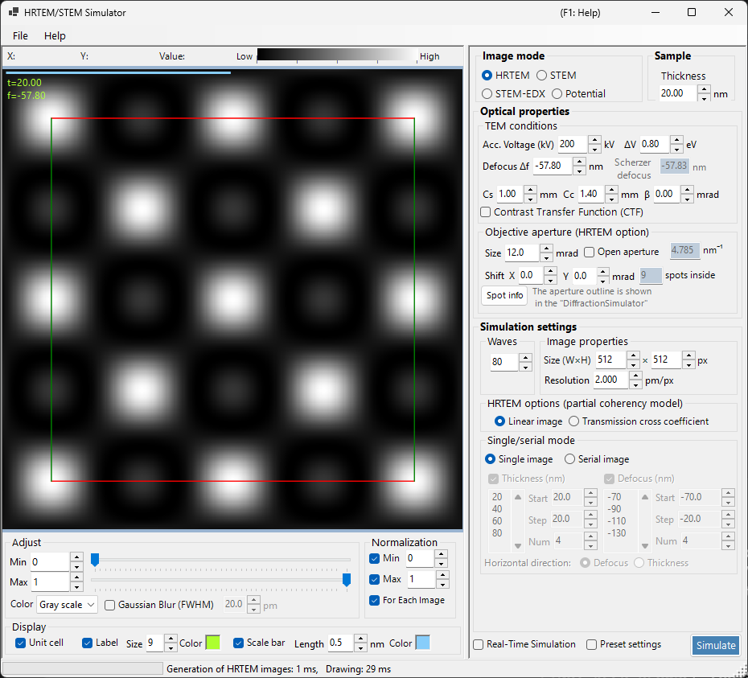
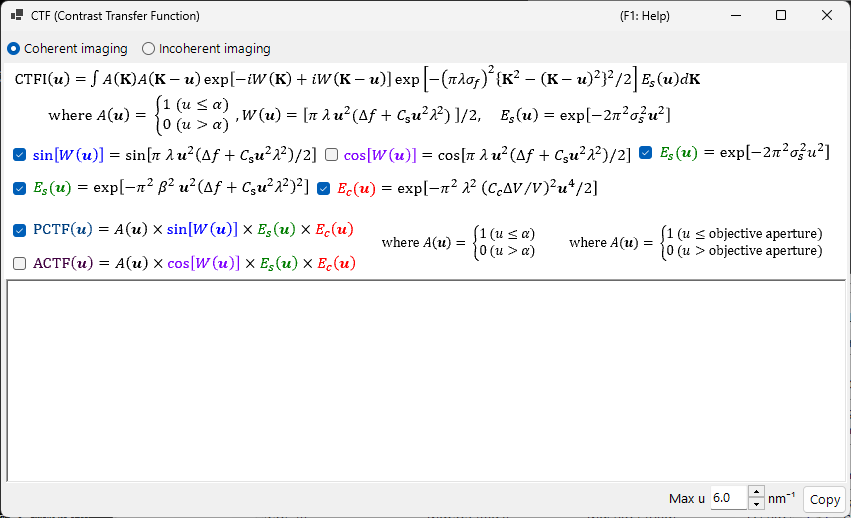
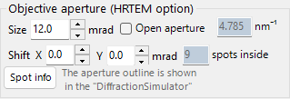
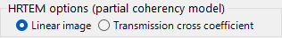

# HRTEM Simulation

**HRTEM (High-Resolution Transmission Electron Microscopy)** simulation calculates high-resolution TEM lattice-fringe images. It is the primary mode of the [HRTEM/STEM simulator](index.md).

> This page covers every setting that appears on the right side when **Image mode = HRTEM**. For the controls on the left side — displaying the result and adjusting its brightness — see the [overview page](index.md#displaying-and-adjusting-results-left-panel).

---

## Overview

An HRTEM image is formed when the electron wave transmitted through the specimen is imaged under the influence of the objective-lens aberrations. ReciPro computes the propagation of the electron wave inside the specimen with the Bloch-wave method (dynamical calculation) and generates the HRTEM image through the phase-contrast transfer function (PCTF).

### Calculation flow

1. **Bloch-wave method**: compute the electron wave propagation in the crystal potential and obtain the amplitude and phase of the exit wave
2. **Lens function**: apply the objective-lens aberrations (spherical aberration $C_s$, defocus $\Delta f$)
3. **Partial coherence**: account for the finite source size (spatial coherence) and the energy fluctuation (temporal coherence)
4. **Image formation**: compute the intensity distribution $|\psi(\mathbf{r})|^2$

For the theory, see [Appendix A3.2 — HRTEM image formation](../appendix/a3-bloch-wave/hrtem.md).

---

## Sample

- **Thickness** : specimen thickness (nm). HRTEM images depend strongly on thickness. In **Serial image** mode this value is ignored and the thickness list described below is used instead.

---

## TEM conditions

Sets the imaging conditions of the objective lens.

| Parameter | Description | Default / typical |
|-----------|-------------|-------------------|
| **Acc. Voltage (kV)** | Accelerating voltage. The relativistically corrected electron wavelength is shown to the right | 200 kV |
| **Defocus Δf** | Defocus of the objective lens (nm). The reference **Scherzer defocus** value is shown below it | −57.8 nm |
| **Cs** | Spherical aberration coefficient (mm). Affects the CTF and the Scherzer defocus | 0.5–1.0 (conventional), < 0.01 (Cs-corrected) |
| **Cc** | Chromatic aberration coefficient (mm). Determines the image blur caused by the energy spread | 1.0–2.0 mm |
| **β** | Illumination semi-angle (mrad). Represents the finite-source-size effect (spatial coherence) | 0.1–1.0 mrad |
| **ΔV** | Full width at half maximum of the electron energy spread (eV). Together with Cc it determines the focus spread due to chromatic aberration | 0.5–2.0 eV |

> **Right-click menu**: on the TEM conditions panel you can apply **Set all aberrations to zero** / **Set defocus to Scherzer value** / **Set Defocus to 0 nm** with a single click. Condition presets (300kV ARM300F, 200kV 2100F, and so on) are available from **Preset settings** at the lower left.

### Scherzer defocus

The defocus value near which the phase contrast is optimal, calculated from the current wavelength and spherical aberration $C_s$ (shown for reference).

$$\Delta f_{\text{Scherzer}} = -\sqrt{\tfrac{4}{3}\,C_s \lambda}\quad\left(\approx -1.155\,\sqrt{C_s \lambda}\right)$$

Under this condition the PCTF is negative over a wide range of spatial frequencies, so atomic positions appear as dark contrast. ReciPro adopts this original Scherzer value (derived by setting the minimum of the aberration phase $\chi$ to $-2\pi/3$), and the value shown in the GUI follows this formula. Note that some references instead use the *extended Scherzer* value $-1.2\sqrt{C_s\lambda}$, which broadens the transfer band further.

---

## Lens function / Contrast Transfer Function (CTF)

Checking **Contrast Transfer Function (CTF)** opens a window that plots how the lens aberrations and defocus transfer the image contrast at each spatial frequency.

- $\sin\chi(u)$ : phase-contrast transfer function ($\chi(u)$ is the aberration function of the lens)
- $E_\text{s}(u)$ : spatial-coherence envelope function; the damping due to the finite source size ($\beta$)
- $E_\text{c}(u)$ : temporal-coherence envelope function; the damping due to the energy fluctuation ($C_c$, $\Delta V$)

Changing the upper limit of the horizontal axis $u$ (spatial frequency) changes the plotted range.

---

## Objective aperture (HRTEM option)

Restricts the diffracted waves that pass through the objective aperture. The number of diffracted waves cut by the aperture also changes the number of spots included in the Bloch-wave calculation (the upper bound is the maximum number of Bloch waves set in **Waves**).

- **Size** : semi-angle of the objective aperture (mrad). The smaller it is, the more high-angle diffracted waves are cut, and the smoother the high-resolution detail becomes. The equivalent reciprocal-space radius $\sin\theta/\lambda$ (nm⁻¹) is displayed.
- **Shift X** / **Y** : shift of the objective-aperture center (mrad). Used for dark-field and tilted imaging.
- **Open aperture** : opens the objective aperture (infinite), so that all diffracted waves are used for imaging.
- **spots inside** : the number of diffracted beams (spots) that fall inside the aperture (read-only).
- **Spot info** : opens a table listing the diffracted beams inside the aperture (intensity, complex amplitude, and so on).

> The size of the objective aperture is also shown in the **Diffraction Simulator**.

---

## HRTEM options (partial coherency model)

Selects the interference model used when integrating the contributions from all incident-beam directions.

- **Linear image** : computationally cheap. Suited to thin specimens where the weak-phase-object approximation holds; it multiplies the PCTF by the spatial- and temporal-coherence envelopes.
- **Transmission cross coefficient** : computationally expensive but more accurate. It integrates the full transmission cross coefficient, and is the model to use for strong scatterers that excite many strong diffracted waves.

For details, see [Appendix A3.2 — HRTEM image formation](../appendix/a3-bloch-wave/hrtem.md).

---

## Single/serial mode

- **Single image** : calculates one HRTEM image at the current thickness and defocus.
- **Serial image** : generates a set of images with the thickness and defocus varied stepwise (a through-thickness / through-focus series). Useful for finding the condition that best matches an experimental image.

For a serial image, set the following.

| Item | Description |
|------|-------------|
| **Thickness (nm)** / **Defocus (nm)** | Which quantity to sweep (both are allowed) |
| **Start / Step / Num** | Start value, step width, and number of images. They are expanded into the list box below, which can also be edited directly |
| **Horizontal direction:** | When both thickness and defocus are swept, the quantity laid out along the horizontal direction of the grid (**Defocus** or **Thickness**) |

Sweeping both thickness and defocus produces a row × column matrix of images.

---

## Image properties

- **Size (W×H)** : number of pixels of the simulated image (512×512 by default).
- **Resolution** : sampling resolution (pm/px). A smaller value resolves finer lattice fringes, but the FFT time grows proportionally.

---

## Waves

- Maximum number of Bloch waves used in the Bethe method (dynamical calculation), 80 by default. A larger number improves accuracy, but the eigenvalue problem takes $O(N^3)$ time to solve.

---

## See also

- [HRTEM/STEM simulator (overview)](index.md)
- [STEM simulation](2-stem-simulation.md)
- [Potential simulation](3-potential-simulation.md)
- [Appendix A3.2 — HRTEM image formation](../appendix/a3-bloch-wave/hrtem.md)
