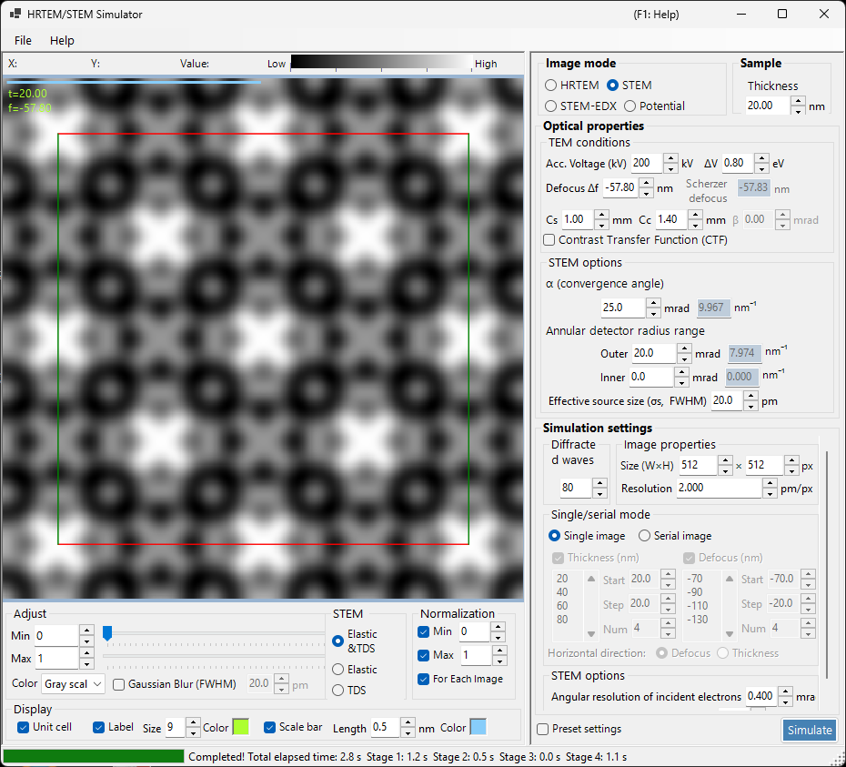
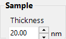
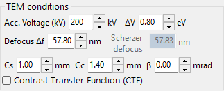
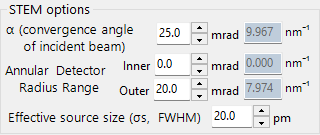
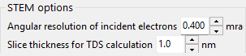
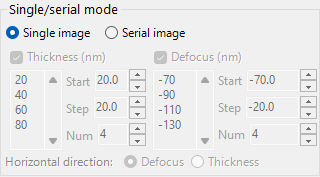
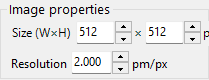
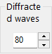
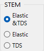

# STEM Simulation

**STEM (Scanning Transmission Electron Microscopy)** simulation computes scanning transmission electron microscopy images using the Bloch-wave method.

> This page lists every setting that appears on the right when **Image mode = STEM**. For the result display, brightness, and normalisation controls on the left, see the [overview page](index.md). Only the STEM-specific **display target** is repeated below.

---

## Overview

A convergent electron beam is scanned across the specimen, and the transmitted and scattered electrons at each scan position are collected by annular detectors. ReciPro computes the STEM image with the Bloch-wave method (dynamical calculation).

### Calculation flow

1. At each scan position, compute the diffracted intensities with the Bloch-wave method for every incident direction of the convergent probe.
2. Integrate the scattered intensity over the detector's angular range.
3. Both elastic and thermal-diffuse scattering (TDS) contributions can be computed.

See [Appendix A2.4 — STEM calculation](../appendix/a2-bloch-wave/stem.md) for the theory.

---

## Detector types

| Detector | Angle range | Main contribution | Contrast |
|----------|-------------|-------------------|----------|
| **BF** (bright field) | 0 – convergence angle | Elastic | Phase contrast |
| **ABF** (annular bright field) | Inner part of the convergence angle | Elastic | Light-element sensitive |
| **LAADF** (low-angle annular dark field) | Just outside the convergence angle | Elastic + TDS | Strain sensitive |
| **HAADF** (high-angle annular dark field) | Well outside the convergence angle | TDS (inelastic) | Z-contrast ($\propto Z^2$) |

> **Typical detector settings** (each available with one click from the right-click menu of the STEM options, all with convergence angle α = 25 mrad):
> BF (0–5 mrad) / ABF (12–24 mrad) / LAADF (26–60 mrad) / HAADF (80–250 mrad)

---

## Specimen parameters

- **Thickness** : specimen thickness (nm). This value is ignored in **Serial image** mode.

---

## TEM conditions

| Parameter | Description | Default / typical |
|-----------|-------------|-------------------|
| **Acc. Vol. (kV)** | Accelerating voltage. The relativistically corrected electron wavelength is shown alongside | 200 kV |
| **Defocus Δf** | Defocus of the objective (probe-forming) lens (nm) | −57.8 nm |
| **Cs** | Spherical aberration coefficient (mm). Affects the probe size | 0.5–1.0 mm |
| **Cc** | Chromatic aberration coefficient (mm) | 1.0–2.0 mm |
| **ΔV (FWHM)** | Full width at half maximum of the electron energy spread (eV) | 0.5–2.0 eV |

> **β (illumination semi-angle) is disabled in STEM mode**, because the convergence angle α takes its role.

---

## STEM options (optical)

Set the geometry of the convergent probe and the annular detector. Each angle is also shown converted to a reciprocal-space radius $\sin\theta/\lambda$ (nm⁻¹) on the right.

| Parameter | Description | Default / typical |
|-----------|-------------|-------------------|
| **α (convergence angle)** | Semi-angle of the convergent probe (mrad). Larger values give a finer probe and change the diffraction contrast | 15–25 mrad |
| **(Annular) detector inner angle** | Inner collection semi-angle of the annular detector (mrad). Signal inside this angle is excluded | BF: 0, HAADF: 80 |
| **(Annular) detector outer angle** | Outer collection semi-angle of the annular detector (mrad). Signal outside this angle is excluded | BF: 5, HAADF: 250 |
| **Effective source size σs (FWHM)** | Effective electron source size. Larger values blur the probe and reduce fine-detail contrast | — |

---

## STEM options (simulation)

- **Slice thickness for inelastic** : specimen slice thickness (nm) used when computing the TDS (thermal-diffuse, inelastic) intensity. Smaller values are more accurate but slower.
- **Angular resolution** : angular sampling resolution of the incident probe directions (mrad). Smaller values sample the probe more finely but are slower.

---

## Image mode (single / serial)

- **Single image** : compute one STEM image at the current thickness.
- **Serial image** : generate a series of images with thickness / defocus stepped in stages (set by **Start / Step / Num**; the list below can also be edited directly).

---

## Image property

- **Size (W×H)** : number of pixels in the scanned image (default 512×512). In STEM this equals the number of scan points and scales the computation time linearly.
- **Resolution** : sampling resolution (pm/px).

---

## Diffracted waves

- **Max Bloch waves** : maximum number of Bloch waves used in the Bethe method (default 80). The eigenvalue-problem cost scales as the cube of the number of waves.

---

## STEM display target (result side)

The display switch at the bottom-left of the window selects which scattering component of the already-computed STEM image to show (switchable without recomputing).

| Display target | Description |
|----------------|-------------|
| **Elastic** | Elastic-scattering only image |
| **TDS** | Thermal-diffuse-scattering only image |
| **Elastic & TDS** | Sum of elastic + TDS |

---

## Computational cost

STEM simulation is computationally expensive, so set the following parameters appropriately.

| Factor | Impact |
|--------|--------|
| **Convergence angle** | Larger → more CBED disk overlap → higher cost |
| **Bloch waves** | Eigenvalue-problem cost scales as N³ |
| **Angular resolution** | Finer → more accurate but cost scales as N² |
| **Image pixels (Size)** | Linear scaling with the number of scan points |

---

## Importance of the temperature factor

For HAADF-STEM simulation, atoms must have a non-zero isotropic temperature factor (Debye-Waller factor). If the value is unknown, set $B \approx 0.5\ \text{Å}^2$. With a zero temperature factor the TDS intensity is zero and the HAADF image is not computed correctly.

| Detector | Range | Main contribution |
|----------|-------|-------------------|
| BF, ABF | Inside the convergence angle | Elastic |
| LAADF, HAADF | Outside the convergence angle | Inelastic (TDS) |

---

## Comparison with Dr. Probe

ReciPro's STEM simulations have been confirmed to agree closely with the widely used Dr. Probe GUI (v1.10). The figure below compares the two for BF, ABF, LAADF and HAADF detectors over a thickness series (2.96–60.05 nm), both aberration-free (left) and with Cs = 0.2 mm, defocus = −25.9 nm (right). The two codes agree across all detector types and thicknesses.

A more detailed report is available as a PDF: [Comparison of STEM simulations by Dr. Probe GUI (v1.10) and ReciPro (v4.854)](https://github.com/seto77/ReciPro/files/10976084/ComparisonSTEMsimulations.pdf).

---

## See also

- [HRTEM/STEM simulator (overview)](index.md)
- [HRTEM simulation](1-hrtem-simulation.md)
- [Potential simulation](3-potential-simulation.md)
- [Appendix A2.4 — STEM calculation](../appendix/a2-bloch-wave/stem.md)
- [Appendix A2.4 — STEM calculation](../appendix/a2-bloch-wave/stem.md)
