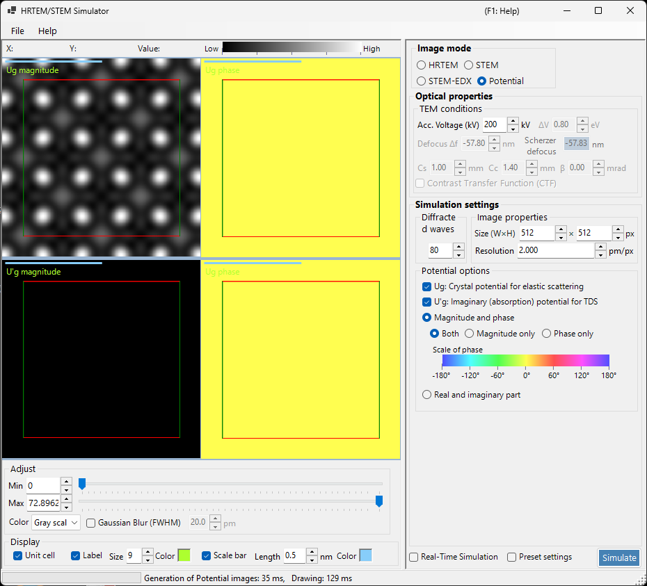

# Potential Simulation

**Potential simulation** calculates and displays the 2D distribution of the crystal potential. No image-transfer effects (lens aberrations, detector) are applied: it visualises the projected crystal potential itself.

> This page covers every setting that appears on the right-hand side when **Image mode = Potential**. For result display, brightness adjustment and the other controls on the left, see the [overview page](index.md#display-settings).

---

## Overview

Electrons inside a crystal are scattered by the crystal potential. Its distribution underlies all diffraction and imaging phenomena and is key information for understanding crystal structure. Because this mode includes neither lens aberrations nor thickness-dependent dynamical effects, it is well suited to inspecting the structure itself.

> **In potential mode the specimen-thickness, intensity-normalisation and image-mode (single / serial) panels are not shown.** Of the TEM conditions, only the accelerating voltage is active.

---

## TEM conditions

- **Acc. voltage (kV)** — accelerating voltage. It sets the electron wavelength and is used to compute the Fourier coefficients $U_g$ of the potential.

> **Defocus, Cs, Cc, β, ΔE and the PCTF are inactive in potential mode** (no image-formation optics is applied) and appear greyed out.

---

## Potential options

Selects which potential to display and how to display it.

### Target potential

| Type | Description |
|------|-------------|
| **$U_g$ — elastic scattering potential** | The (electrostatic) crystal potential responsible for elastic scattering. Represents scattering strength |
| **$U'_g$ — absorption potential** | The imaginary (absorption) potential arising from thermal diffuse scattering (TDS). Represents loss from the elastic channel |

$U_g$ and $U'_g$ can be shown at the same time (one pane is added for each one that is ticked).

### Display method

| Mode | Options |
|------|---------|
| **Magnitude and phase** | **Both** / **Magnitude only** / **Phase only** (the phase is rendered with a colour wheel, and a phase scale is shown below) |
| **Real and imaginary part** | **Both** / **Real only** / **Imaginary only** |

---

## Image property

- **Size (W×H)** — pixel dimensions of the generated image (default 512×512).
- **Resolution** — sampling resolution (pm/px).

---

## Diffracted waves

- **Max Bloch waves** — maximum number of Bloch waves (Fourier coefficients) included in the Fourier synthesis of the potential (default 80). Larger values include higher spatial frequencies and reproduce finer detail of the potential.

---

## Image adjustment (left side)

Brightness (Min / Max), colour scale and the unit-cell grid overlay are set on the left in **Adjust** and **Display** (see the [overview page](index.md#display-settings)).

---

## See also

- [HRTEM/STEM simulator (overview)](index.md)
- [HRTEM simulation](1-hrtem-simulation.md)
- [STEM simulation](2-stem-simulation.md)
