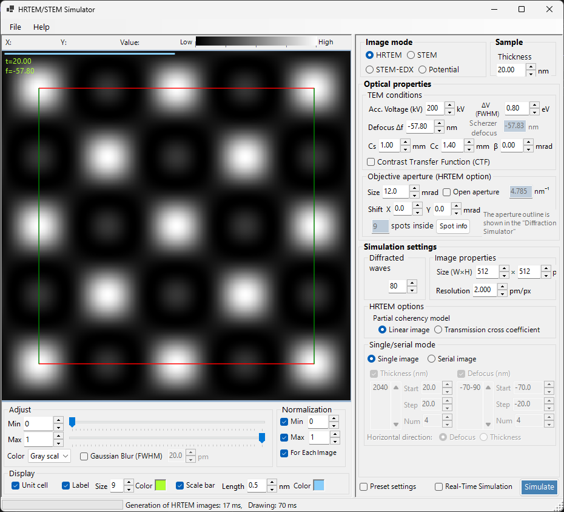
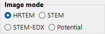
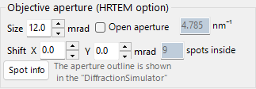
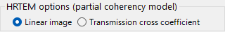
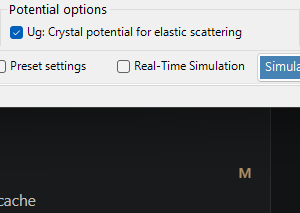
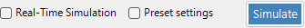
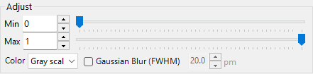
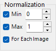
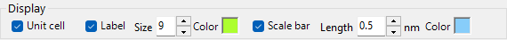

# HRTEM / STEM Simulator

The **HRTEM/STEM Simulator** simulates TEM lattice-fringe (HRTEM) images, STEM images, and projected potentials. Click **Simulate** to run.

---

## Keyboard & mouse shortcuts

Results are shown as one or more image panes. They use ReciPro's standard [image-view navigation](../21-shortcuts.md), and all panes pan and zoom together.

| Shortcut | Action |
|----------|--------|
| <kbd>F1</kbd> | Open this page of the online manual |
| <kbd>CTRL</kbd>+<kbd>C</kbd> (image grid focused) | Copy the image(s) to the clipboard as a metafile |
| Left-drag / Middle-drag | Pan the image (all panes move together) |
| Mouse wheel up / down | Zoom in (×2) / out (×0.5) at the cursor |
| Right-drag a box | Zoom in to the selected region |
| Right-click / Right double-click | Zoom out (×0.5) |
| <kbd>CTRL</kbd> + Right-drag a box | Select a rectangular area |
| Left double-click a pane | Maximise that pane / restore the grid (multi-pane layouts) |
| Move the mouse (no button) | Read the position (pm) and pixel value at the cursor |

→ See **[21. Keyboard & mouse shortcuts](../21-shortcuts.md)** for every window at a glance.

---

## Quick Routes by Goal

| Goal | Start from | Reference |
|------|------------|-----------|
| Calculate one HRTEM image | Set **Image mode** to **HRTEM**, then set accelerating voltage and defocus in **TEM conditions** | [HRTEM simulation](1-hrtem-simulation.md), [HRTEM image formation](../appendix/a2-bloch-wave/hrtem.md) |
| Calculate a STEM image | Set **Image mode** to **STEM**, then set convergence angle and detector in **STEM options** | [STEM simulation](2-stem-simulation.md), [STEM calculation](../appendix/a2-bloch-wave/stem.md) |
| View projected potential | Set **Image mode** to **Potential** | [Potential simulation](3-potential-simulation.md) |
| Generate a thickness / defocus series | Configure **Single / Serial** and the image conditions in **HRTEM options** | [HRTEM simulation](1-hrtem-simulation.md) |
| Use HAADF-STEM with TDS | Set non-zero atomic temperature factors and use an LAADF / HAADF detector | [STEM calculation](../appendix/a2-bloch-wave/stem.md) |

---

## Basic Workflow

1. Select the crystal and orientation in the main window, then open this simulator.
2. Choose HRTEM, STEM, or Potential in **Image mode**.
3. Set accelerating voltage, defocus, aberrations, apertures, and STEM convergence settings in **Optical property**.
4. Set thickness, image size, resolution, Bloch-wave count, and partial-coherence model in **Simulation property**.
5. Click **Simulate**, then adjust brightness, normalisation, scale bar, and labels in **Display settings**.

---

## Image area

The left half of the window shows the simulated image. The status bar across the top reports the cursor position (**X:**, **Y:**) and the image **Value:** (intensity) under the cursor, next to a **Low → High** intensity scale that reflects the current colour map and brightness range.

---

## File menu

### Help menu

---

## Image mode / Sample

{align=left}

HRTEM, Potential, or STEM.

{ align=left style="clear: both" }
Sets the sample thickness.

## Optical property { style="clear: both" }

### TEM conditions

Acc. voltage, defocus (Scherzer shown).

#### Acc. voltage

Accelerating voltage of the electron microscope. Changing this updates the relativistically-corrected wavelength (displayed beside the field) and, together with **Cs**, the suggested **Scherzer defocus** value shown below.

#### Defocus

Defocus value of the objective lens. The Scherzer defocus (the value that maximises the phase-contrast transfer in the weak-phase-object approximation) is shown below as a reference.

### Inherent property (HRTEM optical aberrations)

Microscope-specific aberration parameters used by the lens-function calculation.

- **Cs** — spherical aberration coefficient.
- **Cc** — chromatic aberration coefficient.
- **β** — illumination semi-angle (finite-source effect).
- **ΔE** — 1/e width of the electron-energy fluctuation.

### Lens function

Plots of the lens function. Adjusting the upper limit of *u* changes the drawing range.

- **sin[χ(u)]** — phase-contrast transfer function (PCTF).
- **E_s(u)** — spatial-coherence envelope function.
- **E_c(u)** — temporal-coherence envelope function.

### Objective aperture (HRTEM option)

Cs, Cc, beta, delta-E, PCTF, spatial/temporal coherence envelopes, objective aperture.

#### Size

Objective aperture size in mrad. Tick **Open aperture** to remove the aperture. The number of diffraction spots taken into the Bloch-wave calculation depends on the aperture; the maximum is bounded by the **Max Bloch waves** value in **Simulation property**.

#### Shift

Horizontal displacement of the aperture in mrad — used to mimic an offset objective aperture in HRTEM.

#### Spot info

Opens the detailed spot list (intensity, complex amplitude, etc.) for the reflections passing through the aperture. Convenient when the Diffraction Simulator is also open for comparison.

### STEM options (optical)

#### Convergence semi-angle

Half-angle of the convergent probe (mrad). Controls the size of the STEM probe and the spatial resolution of the simulated image.

#### Detector geometry

Inner / outer collection angles of the annular detector (mrad). Choose between BF (small inner angle), ABF, LAADF, HAADF (large inner angle).

#### Scan area / step

Scan field of view and pixel size for the STEM image.

---

## Simulation property

### HRTEM options

Max Bloch waves, image pixels/resolution, partial coherence (quasi-coherent / TCC), Single/Serial mode.

#### Max Bloch waves

Maximum number of Bloch waves used in the dynamical calculation. Increasing this improves accuracy at the cost of *O*(*N*³) eigenvalue solving time.

#### Image property (pixels & resolution)

Pixel dimensions and sampling resolution of the simulated image. Higher resolution gives a finer fringe pattern but proportionally longer FFT time per slice.

#### Partial-coherent model

How wave interference is treated when combining the contributions from all incident-beam directions.

- **Quasi-coherent** — fast, approximate model that multiplies the phase-contrast transfer function by spatial- and temporal-coherence envelopes.
- **Transmission cross coefficient (TCC)** — more accurate model that integrates over the full transmission cross coefficient. Slower but exact in the linear-imaging regime.

See [Appendix A2.2 — HRTEM image formation](../appendix/a2-bloch-wave/hrtem.md).

#### Single / Serial mode

- **Single image** — simulates a single image at the thickness set in **Sample property** and the defocus set in **Optical property**.
- **Serial image** — generates a thickness × defocus matrix according to **Start / Step / Num** for each. Useful for finding the best matching condition against an experimental image.

### STEM options (simulation)

- **Bloch wave count** — same role as for HRTEM, applied per probe position.
- **Angular resolution** — number of sample points in the probe-direction integration.
- **TDS treatment** — whether to include thermal-diffuse scattering via temperature factors *B*. Required for LAADF/HAADF.

### Potential options

Displayed when **Image mode = Potential**.

- **Target potential** — choose **U_g** (elastic) or **U′_g** (absorption / TDS).
- **Display method** — **Magnitude and phase**, or **Real and imaginary part**.

### Image properties

### Diffracted waves

---

## Simulate

---

## Display settings

### Adjust

Min/Max brightness, colour scale, Gaussian blur.

### Normalization

### Display

Label (thickness/defocus), scale bar, unit cell overlay.

### STEM image

---

## STEM simulation

Computation depends on: convergence angle, Bloch wave count, angular resolution.

| Detector | Contribution |
|----------|-------------|
| BF, ABF | Elastic |
| LAADF, HAADF | Inelastic (TDS) |

> Set temperature factors non-zero for TDS (B = 0.5 Ų if unsure). HAADF intensity $\propto Z^2$.

A more detailed report is available as a PDF: [Comparison of STEM simulations by Dr. Probe GUI (v1.10) and ReciPro (v4.854)](https://github.com/seto77/ReciPro/files/10976084/ComparisonSTEMsimulations.pdf). See [STEM simulation](2-stem-simulation.md) for details.

---

## See also

- [HRTEM simulation](1-hrtem-simulation.md)
- [STEM simulation](2-stem-simulation.md)
- [Potential simulation](3-potential-simulation.md)
- [Dynamical diffraction (Bloch-wave)](../appendix/a2-bloch-wave/index.md)
- [Diffraction simulator](../7-diffraction-simulator/index.md)
- [Electron trajectory](../8-electron-trajectory.md)
