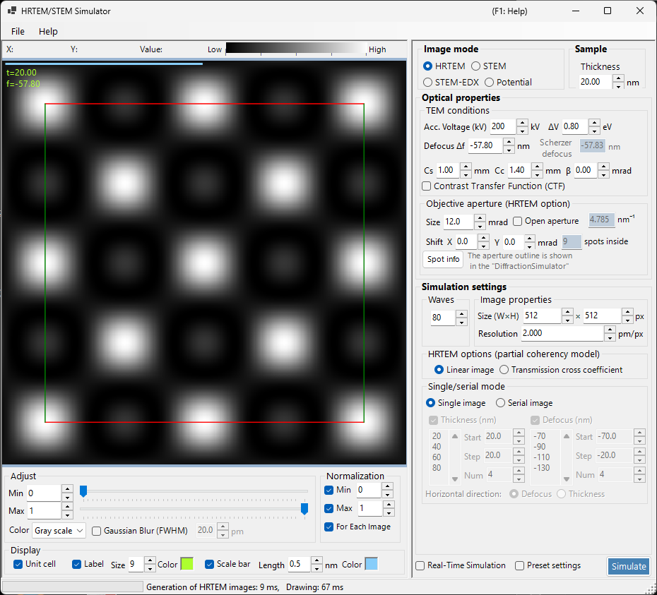
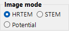
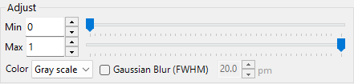
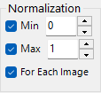
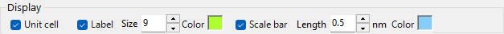
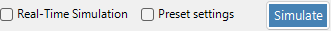
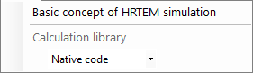

# HRTEM / STEM Simulator

The **HRTEM/STEM Simulator** simulates TEM lattice-fringe (HRTEM) images, STEM images, and projected crystal potentials for the selected crystal and orientation. Click **Simulate** to run.

The window is split into two halves. The **left side** displays the simulation result and controls its appearance (image panes, brightness, color, scale bar, and so on); the **right side** holds the calculation conditions (**Optical properties** and **Simulation settings**).

---

## This page and the mode pages

- **This page (overview)**: the operations common to every mode, together with the **result display and adjustment controls on the left side**.
- **Mode pages**: every setting that appears on the **right side** for that mode, covered so that each page is self-contained (some settings therefore appear on more than one page).

| Mode | Contents | Page |
|------|----------|------|
| **HRTEM** | High-resolution TEM lattice-fringe images | [HRTEM simulation](1-hrtem-simulation.md) |
| **STEM** | Scanning transmission electron microscope images (BF / ABF / LAADF / HAADF) | [STEM simulation](2-stem-simulation.md) |
| **Potential** | Projected crystal potential ($U_g$ / $U'_g$) | [Potential simulation](3-potential-simulation.md) |

---

## Keyboard & mouse shortcuts

Results are shown as one or more image panes. They use ReciPro's standard [image-view navigation](../21-shortcuts.md), and all panes pan and zoom together.

| Shortcut | Action |
|----------|--------|
| <kbd>F1</kbd> | Open this page of the online manual |
| <kbd>CTRL</kbd>+<kbd>C</kbd> (image grid focused) | Copy the image(s) to the clipboard as a metafile |
| Left-drag / Middle-drag | Pan the image (all panes move together) |
| Mouse wheel up / down | Zoom in (×2) / out (×0.5) at the cursor |
| Right-drag a box | Zoom in to the selected region |
| Right-click / Right double-click | Zoom out (×0.5) |
| <kbd>CTRL</kbd> + Right-drag a box | Select a rectangular area |
| Left double-click a pane | Maximize that pane / restore the grid (multi-pane layouts) |
| Move the mouse (no button) | Read the position (pm) and pixel value at the cursor |

→ See **[21. Keyboard & mouse shortcuts](../21-shortcuts.md)** for every window at a glance.

---

## Quick routes by goal

| Goal | Start from | Reference |
|------|------------|-----------|
| Calculate one HRTEM image | Set **Image mode** to **HRTEM**, then set the accelerating voltage and defocus in **TEM conditions** | [HRTEM simulation](1-hrtem-simulation.md), [HRTEM image formation](../appendix/a3-bloch-wave/hrtem.md) |
| Calculate a STEM image | Set **Image mode** to **STEM**, then set the convergence angle and detector in **STEM options** | [STEM simulation](2-stem-simulation.md), [STEM calculation](../appendix/a3-bloch-wave/stem.md) |
| View the projected potential | Set **Image mode** to **Potential** | [Potential simulation](3-potential-simulation.md) |
| Generate a thickness / defocus series | In HRTEM, configure **Single/serial mode** and the image conditions | [HRTEM simulation](1-hrtem-simulation.md) |
| Use HAADF-STEM with TDS | Set non-zero atomic temperature factors and move the STEM detector to LAADF / HAADF | [STEM calculation](../appendix/a3-bloch-wave/stem.md) |

---

## Basic workflow

1. Select the crystal and orientation in the main window, then open this window.
2. Choose HRTEM, STEM, or Potential in **Image mode**.
3. Set the accelerating voltage, defocus, aberrations, aperture, STEM convergence angle, and so on in **Optical properties** (see the mode pages).
4. Set the thickness, image size, resolution, Bloch-wave count, partial-coherence model, and so on in **Simulation settings** (see the mode pages).
5. Click **Simulate**, then tune the appearance with **Adjust**, **Normalization**, and **Display** on the left as needed.

---

## Selecting the image mode

{ align=left }

**Image mode** at the top right selects the kind of calculation. The panels on the right (**Optical properties** and **Simulation settings**) change to match the mode you choose.

- **HRTEM** — high-resolution TEM lattice-fringe images → [HRTEM simulation](1-hrtem-simulation.md)
- **STEM** — scanning transmission electron microscope images → [STEM simulation](2-stem-simulation.md)
- **STEM-EDX** — handles STEM-EDX output using the STEM calculation conditions (a variant of STEM)
- **Potential** — projected crystal potential → [Potential simulation](3-potential-simulation.md)

---

## Image area (left side)

The left half of the window shows the simulated image. The status bar across the top reports the cursor position (**X:**, **Y:**) and the image **Value:** (intensity) under the cursor, next to a **Low → High** intensity scale that reflects the current color map and brightness range.

When several images are produced (a serial image, or the magnitude/phase of a potential) they are tiled in a grid, and all panes zoom and pan together.

---

## Displaying and adjusting results (left panel)

The panel at the lower left adjusts how the result looks — brightness, color, normalization, and overlays. These apply to every mode and take effect without recalculating.

### Adjust

- **Min** / **Max** : lower (black) and upper (white) ends of the displayed intensity range. Use the trackbars to adjust the contrast.
- **Color** : color scale of the image — **Gray scale** or **Cold-Warm** (blue to red).
- **Gaussian Blur (FWHM)** : when checked, applies a Gaussian blur with the full width at half maximum (pm) given on the right, approximating a finite resolution (point-spread function).

### Normalization

- **For Each Image** : when checked, normalizes each image separately (when unchecked, the whole series shares a common scale).
- **Min** / **Max** : fixes the lower / upper end of the normalization to the value given on the right instead of the minimum / maximum of the image.

### STEM image

Shown in STEM mode only. Selects which scattering component of the calculated STEM image is displayed (**Elastic**, **TDS**, or **Elastic & TDS**). Because it is specific to STEM, it is also described on the [STEM simulation](2-stem-simulation.md) page.

### Display

Sets the items overlaid on the image.

- **Unit cell** : overlays the outline of the projected unit cell, so you can relate the image contrast to the crystal lattice.
- **Label** : overlays labels such as thickness, defocus, and indices. **Size** (font size) and **Color** can be specified.
- **Scale bar** : overlays a scale bar. **Length** (nm) and **Color** can be specified.

---

## Running the simulation

- **Simulate** : runs the calculation with the current crystal, microscope conditions, thickness, defocus, and display settings.
- **Stop** : aborts the running calculation (shown only while calculating).
- **Real-Time Simulation** : when checked, recalculates immediately as the crystal is rotated (hidden in STEM mode).
- **Preset settings** : toggles the preset window, which stores and recalls TEM imaging conditions.

---

## File menu

- **Save Image** : save as **as Image (PNG format)**, **as Image (TIFF format)**, or **as Metafile (EMF)**. **Save individually for serial image mode** writes the images of a serial run one by one.
- **Copy image** : copy to the clipboard **as Image** or **as Metafile (EMF)**.
- **Overprint symbols** : burns the unit cell, labels, and scale bar into the saved image.
- **Load TEM parameters** / **Save TEM parameters** : save the optical conditions (accelerating voltage, aberrations, and so on) to a file and restore them.

## Help menu

- **Basic concept of HRTEM simulation** : opens the explanation of HRTEM image formation ([Appendix A3.2](../appendix/a3-bloch-wave/hrtem.md)).
- **Calculation library** : selects the calculation library — **Native code** (fast C++/Eigen) or **Managed code** (.NET). Native is normally faster.

---

## See also

- [HRTEM simulation](1-hrtem-simulation.md)
- [STEM simulation](2-stem-simulation.md)
- [Potential simulation](3-potential-simulation.md)
- [Dynamical diffraction (Bloch-wave)](../appendix/a3-bloch-wave/index.md)
- [Diffraction simulator](../7-diffraction-simulator/index.md)
- [Electron trajectory](../8-electron-trajectory.md)
