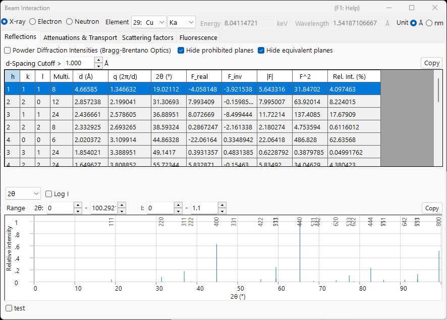

# Appendix A2. Beam Interaction (solid-state background)

The main-window chapter [3. Beam interaction](../../3-beam-interaction.md) is a guide to the GUI: it tells you which buttons to press and what each column means. This appendix collects the **solid-state and scattering physics** behind those numbers — why an atom scatters X-rays, electrons, and neutrons so differently, where the structure factor and its imaginary part come from, how a beam is attenuated and slowed inside a solid, and what the fluorescence preview does and does not represent.

The window has four tabs, and the theory is best read in the order in which one quantity feeds the next:

1. **[Atomic scattering factors](scattering-factor.md)** — how a *single atom* scatters each kind of beam.
2. **[Structure factor](structure-factor.md)** — how the atoms in a *unit cell* interfere, including the Debye–Waller factor and extinction rules.
3. **[Attenuation & transport](attenuation-transport.md)** — how the beam is *removed and slowed* as it travels through the material.
4. **[Fluorescence](fluorescence.md)** — the characteristic X-ray emission that follows inner-shell ionisation.

---

## Scattering geometry and the variable $s$

Every scattering quantity in this window is a function of how much the beam direction changes. Writing $\mathbf k_i$ and $\mathbf k_s$ for the incident and scattered wavevectors (elastic, so $|\mathbf k_i|=|\mathbf k_s|=1/\lambda$), the **scattering vector** and its magnitude are

$$\mathbf Q = 2\pi(\mathbf k_s - \mathbf k_i), \qquad Q = |\mathbf Q| = \frac{4\pi\sin\theta}{\lambda} = 4\pi s .$$

- $\theta$ : the Bragg angle — *half* the total scattering angle. The Reflections table lists the full angle $2\theta$.
- $s = \dfrac{\sin\theta}{\lambda}$ (Å⁻¹) : the variable against which the **Scattering factors** tab is plotted. It is the natural argument of every atomic form factor.
- $d$ : interplanar spacing. At the Bragg condition $\lambda = 2d\sin\theta$, so $s = \dfrac{1}{2d} = \dfrac{|\mathbf g|}{2}$, where $\mathbf g$ is the reciprocal-lattice vector with $|\mathbf g| = 1/d$.

These three conventions describe the same geometry; only the scale differs. The correspondence is worth keeping straight because the window uses more than one of them:

| In the window | Symbol | Relation |
|---|---|---|
| Reflections table | $q = 2\pi/d$ | $q = 2\pi\lvert\mathbf g\rvert = Q = 4\pi s$ |
| Reflections table | $2\theta$ | full scattering angle, $\sin\theta = \lambda s$ |
| Scattering factors tab | $s = \sin\theta/\lambda$ | $s = q/4\pi = 1/(2d)$ |
| Diffraction-peak plot | $Q = 4\pi\sin\theta/\lambda$ | $Q = q = 4\pi s$ |

!!! note "Units"
    The published parametrisations of the form factors use $s$ in Å⁻¹ (so $s^2$ in Å⁻²), while ReciPro carries $s^2$ internally in nm⁻². The two differ by a factor $100$ in $s^2$; the curves and tables are presented in the units stated in each table's header. One model — **Kirkland** — is tabulated against $q = 2s = 1/d$ rather than $s$; see [Atomic scattering factors](scattering-factor.md).

### Bragg, Laue, and the Ewald sphere

The Bragg condition is one face of a single geometric requirement. Constructive interference (the **Laue condition**) demands that the scattering vector equal a reciprocal-lattice vector,

$$\mathbf k_s = \mathbf k_i + \mathbf g, \qquad |\mathbf k_i + \mathbf g|^2 = |\mathbf k_i|^2 ,$$

which, with $|\mathbf k_i|=|\mathbf k_s|=1/\lambda$, reduces to

$$2\,\mathbf k_i\cdot\mathbf g + |\mathbf g|^2 = 0 \qquad\Longleftrightarrow\qquad |\mathbf g| = \frac{1}{d} = \frac{2\sin\theta}{\lambda},$$

i.e. **Bragg's law** $\lambda = 2d\sin\theta$. Geometrically this is the **Ewald-sphere** construction: a reflection is excited when its reciprocal-lattice point lies on the sphere of radius $1/\lambda$. (Here $\mathbf g$ is in $1/d$ units, so $\mathbf Q = 2\pi\mathbf g$.)

---

## Phase convention

ReciPro builds structure factors with the crystallographic phase convention

$$F_{\mathbf g} = \sum_j \dots \exp\!\left(-2\pi i\,\mathbf g\cdot\mathbf r_j\right),$$

i.e. a **minus** sign in the exponent. This choice fixes the sign of the imaginary part of the structure factor (`F_inv` in the Reflections table) and the relation between Friedel pairs once anomalous dispersion is switched on. It is stated here once and assumed throughout the appendix; the consequences are worked out in [Structure factor](structure-factor.md).

---

## Kinematical vs dynamical scattering

This appendix treats **single (kinematical) scattering**: the incident beam scatters once, and the diffracted amplitude is the structure factor of the next page. That is the right picture when the interaction is weak — X-rays and neutrons in almost all samples, and electrons in *very thin* specimens.

When the interaction is strong — electrons in any but the thinnest crystals — the beam scatters many times before it leaves, intensity is redistributed among the reflections, and $\lvert F\rvert^2$ no longer gives the measured intensity. That regime needs the **dynamical** theory of [Appendix A3](../a3-bloch-wave/index.md). The scattering factors and structure factors derived here are the *input* to both pictures.

Even in the kinematical limit the diffracted amplitude is not the structure factor alone: summing the scattered wave through a slab of thickness $t$ gives

$$A_{\mathbf g}(t) \;\propto\; F_{\mathbf g}\int_0^t e^{\,2\pi i S_{\mathbf g} z}\,dz = F_{\mathbf g}\, t\, e^{\,\pi i S_{\mathbf g} t}\,\operatorname{sinc}(\pi S_{\mathbf g} t),$$

where $S_{\mathbf g}$ is the **excitation error** — the distance of the reciprocal-lattice point from the Ewald sphere. The intensity peaks sharply at $S_{\mathbf g}=0$ and oscillates with thickness (the origin of thickness fringes); the dynamical theory of [Appendix A3](../a3-bloch-wave/index.md) replaces this single-beam result with coupled-beam behaviour.

---

## The three probes at a glance

| | X-ray | Electron | Neutron |
|---|---|---|---|
| Interacts with | electron density $\rho_e$ | electrostatic potential $V$ | nuclei (and unpaired spins) |
| Interaction strength | weak | strong | very weak |
| Typical penetration | µm – mm | nm – µm | mm – cm |
| Single scattering valid? | almost always | thin foils only | almost always |
| Sensitivity to light atoms | poor ($\propto Z$) | moderate | often excellent |

These contrasts recur throughout the following pages, each traceable to the scattering mechanism in [Atomic scattering factors](scattering-factor.md).

---

## See also

- [3. Beam interaction](../../3-beam-interaction.md) — the GUI this appendix explains.
- [Atomic scattering factors](scattering-factor.md) · [Structure factor](structure-factor.md) · [Attenuation & transport](attenuation-transport.md) · [Fluorescence](fluorescence.md)
- [Appendix A1. Coordinate systems](../a1-coordinate-system/1-orientation.md)
- [Appendix A3. Dynamical diffraction (Bloch-wave method)](../a3-bloch-wave/index.md) — the multiple-scattering theory that uses these scattering factors.
