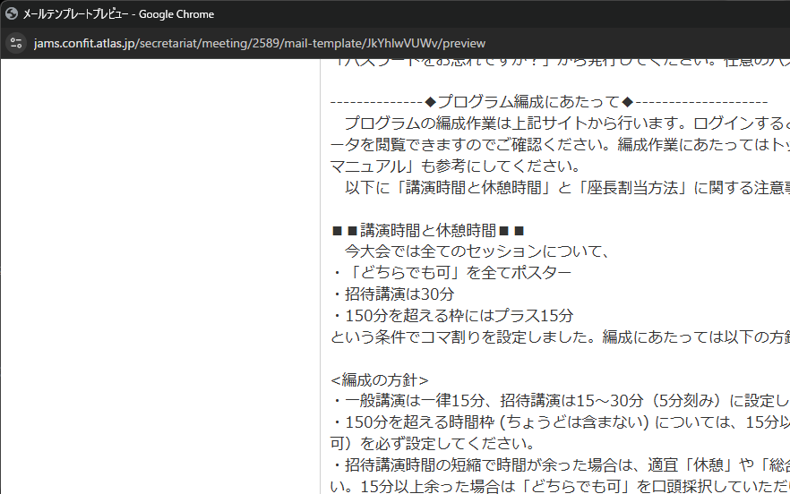
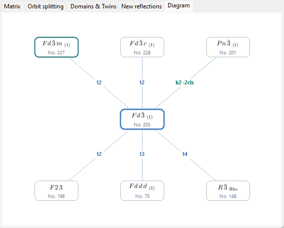
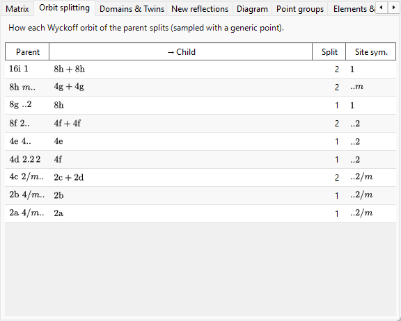
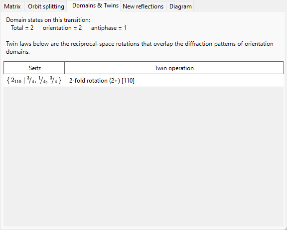

# A4.2. Group–Subgroup Relations

**Group Relations…** is a browser for the maximal-subgroup / minimal-supergroup relations of the 230 space-group types, opened from the **Options** panel of [Symmetry Information](../../2-symmetry-information.md). Unlike a static table, every relation it shows is computed at run time directly from the current space group's own symmetry operations (see [A4.1](symbols-and-diagrams.md#symmetry-operations-operations-tab)), so it can be cross-checked operation by operation rather than only trusted as a transcription of *International Tables*, Vol. A1.

This page explains the group-theory vocabulary the browser uses, and then walks through each of its tabs.

---

## Hermann's theorem: *t*-, *k*-, and isomorphic subgroups

A subgroup $H<G$ is **maximal** if no subgroup of $G$ lies strictly between $H$ and $G$. A theorem due to Carl Hermann (1929) says that, for the 3-dimensional space groups tabulated here, every maximal subgroup of a space group $G$ is one of two kinds:

- **translationengleiche (*t*-) subgroup** — "translations-equal": $H$ keeps *all* of $G$'s translations (the same lattice, the same cell), but a smaller point group. The index $[G:H]$ (the number of cosets of $H$ in $G$) equals the point-group index $[P_G:P_H]$.
- **klassengleiche (*k*-) subgroup** — "class-equal": $H$ keeps the *same geometric crystal class* (point-group type) as $G$, but only a sublattice of $G$'s translations — a larger conventional cell, and/or fewer centring vectors. The index equals the translation-lattice index $[T_G:T_H]$.

**Isomorphic subgroups** are the special, important case of *k*-subgroups where $H$ is additionally of the *same space-group type* as $G$ itself (only a larger cell — a relationship that repeats indefinitely, so isomorphic subgroups form an infinite series indexed by cell size, unlike the finitely many *t*- and non-isomorphic *k*-subgroups of a given $G$). For a *maximal* isomorphic subgroup the index is always a prime power ($p$, and in three dimensions occasionally $p^2$ or $p^3$); which power occurs depends on how the finite quotient lattice decomposes as a module under the point group. Note also that a sublattice's basis change can carry a genuine change of basis vectors and an origin shift, not merely a uniform enlargement of the cell along one axis.

Because every finite-index subgroup relation (maximal or not) can be reached as a chain of maximal steps, listing only the maximal subgroups (and, in the other direction, the minimal supergroups) is enough to describe the complete network of finite-index subgroup relations — which is exactly why ITA Vol. A1, and this browser, tabulate maximal/minimal relations only.

!!! note "Only two kinds — isomorphic is a subclass, not a third"
    It is common shorthand to speak of "*t*-, *k*-, and isomorphic subgroups" as if there were three peers, and the tree in this browser is indeed organised into three branches for convenience. Formally, though, Hermann's theorem is a **two**-way split (*t* vs. *k*); isomorphic subgroups are simply the *k*-subgroups that happen to reproduce $G$'s own space-group type.

### Index, as a coset count

Because space groups are infinite (they contain translations), "index" here always means **the number of cosets of $H$ in $G$**, not an order ratio $|G|/|H|$ (both orders are infinite) — for finite groups the two notions coincide, but for space groups only the coset-counting definition makes sense. The tree and the Matrix tab both display this index as e.g. `t, index 2` or `k, index 3`.

### Conjugate subgroups and conjugacy class

A given abstract subgroup relation can often be realised inside $G$ in more than one geometrically distinct way — related by orientation or location rather than by type — for instance a mirror plane's mirror image, or a screw axis along a differently-oriented but symmetry-equivalent direction. Two such realisations $H$ and $H'$ are conjugate **within $G$** if $H' = gHg^{-1}$ for some $g\in G$; the browser groups all such $G$-conjugate copies of one relation into a single entry and reports how many there are as the *conjugacy class* size. This is a strictly finer notion than grouping subgroups by the (coarser) equivalence under $G$'s Euclidean or affine normalizer — a classification ITA itself sometimes uses instead — so subgroups sharing the same type and index do not automatically belong to one conjugacy class; they can split into several.

---

## Navigating the browser

- **Tree** (left pane) has two roots, **Maximal subgroups** and **Minimal supergroups**, each split into a **`t — translationengleiche`** branch, a **`k — klassengleiche`** branch, and an **`isomorphic (series)`** branch. Non-conjugate classes that share the same child type and index would otherwise get identical labels, so they are distinguished by a `· class n` suffix. In the **isomorphic** branch of Maximal subgroups, conjugacy classes that are equivalent under the *affine normalizer* of $G$ are additionally grouped under one orbit row (*"… — m classes (normalizer-equivalent)"*) — the same granularity as the IIc entries of ITA Vol. A1 — and the enumeration bound is set by the **Isomorphic subgroups: index ≤** spinner on the toolbar (2–27, default 4; higher bounds are computed in the background).
- **Diagram** tab draws a simplified Bärnighausen-style skeleton: the current group in the middle (highlighted), its minimal supergroups above and its maximal subgroups below — ***t*-, *k*-, and isomorphic relations alike**, since each is one "maximal step". Every edge is labelled with its kind and index (`t2`, `k3`, `i3`), colour-coded blue for *t*, teal for *k*, and orange for isomorphic. Node symbols are typeset as proper crystallographic symbols — subscripts for screw axes, overbars for rotoinversions. Non-conjugate classes that share the same target type, kind, and index are merged into a single node whose edge label carries a class count (e.g. `k2 ·2 cls`) — the tree remains the place to inspect each class individually. When a row holds more relations than fit the window width, the nodes shrink one step and any remainder is collected into a dashed `+N` node (not clickable — use the tree for the full list); a small `i: index ≤ 4 only` reminder appears in the corner whenever isomorphic edges are shown, and `k: computing…` while the *k*-supergroup lookup is still being built. When you double-click your way down through subgroups, the chain of groups you passed through (your *selected branch*) is drawn as a purple vertical column above the current group — a multi-level Bärnighausen tree of your own transition path (e.g. $Pm\bar3m \rightarrow P4/mmm \rightarrow Pmmm \rightarrow \ldots$), each edge labelled with the relation you took; ascending or pressing **Back** trims the branch accordingly, and chains longer than three ancestors are abbreviated with a dimmed `⋮ +N`. This shows the group-theoretic skeleton only — a full Bärnighausen tree in the structural-relationship sense also carries cell transformations, Wyckoff-splitting, and atom-coordinate correlations at each edge, which live in the other tabs described below rather than on the diagram itself.
- **Single-click** (a tree node, or a Diagram node) selects a relation and populates the detail tabs below. **Double-click** *navigates*: it re-roots the whole browser at that space group, so you can walk step by step from group to subgroup to subgroup.
- **Back / Forward / Home** step through your navigation history; **Home** always returns to the space group of the crystal you actually opened the browser from.
- The **breadcrumb** (top) shows the space group currently displayed (`HM symbol (No. n)`); the **context banner** below it turns green ("Viewing the current crystal's space group.") when that matches your crystal, or amber ("Viewing … — not the current crystal (…).") when you have navigated elsewhere — a reminder that browsing a subgroup does *not* change your crystal.

---

## Matrix tab

Shows the basis change and origin shift between the parent setting and the child setting, using ITA's convention: the new basis vectors are $(\mathbf a',\mathbf b',\mathbf c')=(\mathbf a,\mathbf b,\mathbf c)\cdot P$, and a point's parent-setting coordinates are $\mathbf x_{\text{parent}} = P\,\mathbf x_{\text{child}} + \mathbf p$. The $3\times3$ matrix $P$ and the origin shift $\mathbf p$ are printed as fractions.

- When you reached this relation from **Maximal subgroups**, $P$ and $\mathbf p$ are shown directly (parent → child direction).
- When you reached it from **Minimal supergroups** instead, the tab shows $P^{-1}$ (and the correspondingly inverted shift), captioned as *"derived from the supergroup's own subgroup table"* — the browser always stores a relation from the larger group's point of view and inverts it on demand, rather than maintaining two independent copies.
- **Conjugate subgroups in this class: $n$** reports the size of the conjugacy class described above.
- A generators table lists every coset representative, tagged **retained** (still present in $H$) or **lost** (present in $G$ but not in $H$ — these are exactly the operations responsible for the symmetry breaking), each with its Seitz symbol and geometric-type description from [A4.1](symbols-and-diagrams.md#symmetry-operations-operations-tab).
- If a candidate relation's target space-group type could not be identified against ReciPro's catalogue, the tab says so plainly instead of guessing, and shows only the point-group symbol.

---

## Orbit splitting tab

Shows how each of the *parent* group's Wyckoff positions splits when the symmetry is lowered to $H$: one row per parent position, listing the parent's multiplicity/letter/site-symmetry, the resulting child multiplicities/letters (joined with `+` if the orbit splits into more than one), how many pieces it split into, and the distinct child site symmetries.

This is computed by actually substituting **one fixed, generic sample point** into both groups' operations and comparing the resulting orbits — a numerically *sampled* splitting, not the fully symbolic Wyckoff-splitting formalism (as used by tools such as WYCKSPLIT); it is deliberately labelled "Orbit splitting", not "Wyckoff splitting", for this reason — a fully symbolic treatment could in principle track every special-parameter coincidence, while this sampled approach reports only the splitting seen at one generic point and would not by itself flag a coincidence that occurs only for special values of $x,y,z$.

For a ***k*- or isomorphic relation** the same sampled approach is applied to the coarser translation lattice: the tab shows how each parent orbit splits as lattice translations are lost, and the child multiplicities are counted **in the enlarged subgroup cell** (so for an index-$n$ cell enlargement the multiplicities of the pieces sum to $n$ times the parent multiplicity).

---

## Domains & Twins tab

When a crystal transforms from $G$ to a subgroup $H$, each of the $[G:H]$ cosets of $H$ in $G$ corresponds to one possible **domain state**: the reference state is the identity coset, and each other coset — represented by one "lost" operation from the Matrix tab — generates one more domain state related to the reference by that operation.

For a ***t*-subgroup** specifically, the translation lattice is unchanged ($T_G=T_H$), so there is, group-theoretically, no such thing as an **antiphase (translation) domain** here — every domain state differs from the reference by a genuine point-group operation, never by a bare shift. The tab therefore always reports `antiphase = 1` and `orientation = total`, i.e. all $[G:H]$ domain states are **orientation domains**.

For a ***k*- or isomorphic** transition the situation is exactly reversed: the point group is unchanged, so there is only **one orientation state**, and the lost lattice translations generate **antiphase (translation) domains** — the tab reports `orientation = 1` and `antiphase = total`. Each lost translation is listed as a pure-translation Seitz symbol together with the corresponding antiphase vector expressed in the subgroup cell. Because all antiphase domains share the same orientation, their fundamental reflections coincide exactly; only the superlattice reflections (see the **New reflections** tab) carry a phase difference across an antiphase boundary.

The **twin law** for a pair of orientation domains is the lost operation's matrix part — a rotation or reflection, expressed as acting on the direct or reciprocal lattice — that maps one domain's lattice orientation onto the other's. For a *t*-subgroup transition, this operation is by construction a symmetry of the *parent* group $G$'s lattice, so if the low-symmetry structure's actual metric still has that lattice symmetry, the two domains' reciprocal lattices coincide exactly after the twin operation and their diffraction patterns overlap completely — the idealised case of *merohedral* twinning that this tab describes. In a real transition the low-symmetry phase typically develops a small spontaneous strain that only approximately keeps the parent's metric, so in practice the overlap is often only approximate (*pseudo-merohedral* twinning); this tab reports the group-theoretical, exact-metric twin law, not a measurement of how closely a particular real crystal approaches it.

A degenerate case with an empty coset list is reported as `(single domain)` (index 1 is never shown as a relation).

---

## New reflections tab

For a *t*-subgroup transition, lists the reflections that become symmetry-allowed in $H$ although they were systematically absent in $G$ — i.e. reflections for which the parent's reflection conditions (from the [Conditions](../../2-symmetry-information.md) tab) forbid them, but $H$'s do not. The search window is set by the **Search window** spinner on the tab: $|h|,|k|,|l|\le4$ by default, adjustable from 2 to 8 (larger bounds can list many more reflections).

Because a *t*-subgroup never enlarges the unit cell, these are **not** superstructure/fractional-index reflections — they remain integer $(h,k,l)$ of the parent cell, and only become *allowed* because a glide plane or screw axis that used to force them to vanish is no longer present. (Genuine superstructure reflections at fractional parent indices are only possible once the cell itself enlarges, which happens for a *k*-subgroup, not a *t*-subgroup.) A reflection appearing here is only symmetry-*permitted*; whether it is actually observed still depends on the structure factor of the real, lower-symmetry structure.

For a ***k*- or isomorphic relation** the tab lists the new reflections **indexed on the enlarged subgroup cell** (again within the search window) and classifies each one in the last column:

- **superlattice reflections** map to *fractional* parent indices, shown in parentheses (e.g. `(1/2 0 1)`) — they appear purely because the cell enlarged;
- **released reflections** are integer in the parent cell but were forbidden by a parent reflection condition that the subgroup lifts — the lifted parent rule is shown instead (this includes the loss of centring translations, e.g. an $I$-centred parent losing its $h+k+l$ even condition).

Reflections allowed in both parent and child (fundamental reflections) are not listed. If the child's space-group type could not be identified, the child's reflection conditions are unknown and the tab says the prediction is not possible.

---

## Current limitations

The browser's *t*- and *k*-subgroup engines, the *t*- and *k*-supergroup reverse lookups, and the isomorphic (IIc) classification are fully implemented and independently verified against the space-group operation tables, and the **Orbit splitting**, **Domains & Twins**, and **New reflections** tabs are live for every relation kind. The remaining limitations are shown as such rather than silently omitted:

- **Isomorphic subgroups are enumerated up to the spinner bound (default index ≤ 4, at most 27).** An isomorphic series continues indefinitely to higher indices, so the greyed-out note on the branch always states the current bound rather than pretending the list is complete. The normalizer-orbit grouping relies on a bounded search for normalizer generators; it is verified against ITA A1 for the tested cases, but a formal completeness proof for every group is future work — at worst an orbit could be displayed split into several rows, never wrongly merged.
- ***k*-supergroups** are computed in the background on first use (the reverse lookup needs the *k*-subgroup tables of every type in the same crystal class); the tree briefly shows a greyed-out *"computing…"* node (and the Diagram a *"k: computing…"* corner note) until it is ready.

---

## Glossary

| Term | Meaning |
|---|---|
| Maximal subgroup / minimal supergroup | A subgroup (supergroup) with no other subgroup relation strictly between it and $G$ |
| Index $[G:H]$ | The number of cosets of $H$ in $G$ |
| *translationengleiche* (*t*-) | Same translation lattice, smaller point group; index = point-group index |
| *klassengleiche* (*k*-) | Same point-group type, sublattice of translations (larger cell); index = lattice index |
| Isomorphic subgroup | A *k*-subgroup that is additionally of the same space-group type as $G$ |
| Conjugacy class (within $G$) | The set of $G$-conjugate ($gHg^{-1}$) realisations of one subgroup relation |
| Orientation domain | A domain state related to the reference by a point-group operation |
| Antiphase (translation) domain | A domain state related to the reference by a lost translation only (possible for *k*-, not *t*-, transitions) |
| Twin law | The matrix part of a lost operation, mapping one orientation domain's lattice onto another's |

---

## See also

- [2. Symmetry information](../../2-symmetry-information.md) — the GUI guide this appendix explains.
- [A4.1. Space-group symbols and symmetry diagrams](symbols-and-diagrams.md) — the Seitz-symbol/geometric-type vocabulary used throughout the Matrix and Domains & Twins tabs.
- [Appendix A4. Symmetry and Space Groups](index.md)
