# Ventana principal

Al iniciar ReciPro, aparece la ventana principal. Desde esta ventana selecciona el cristal, controla su rotación e invoca diversas funciones.

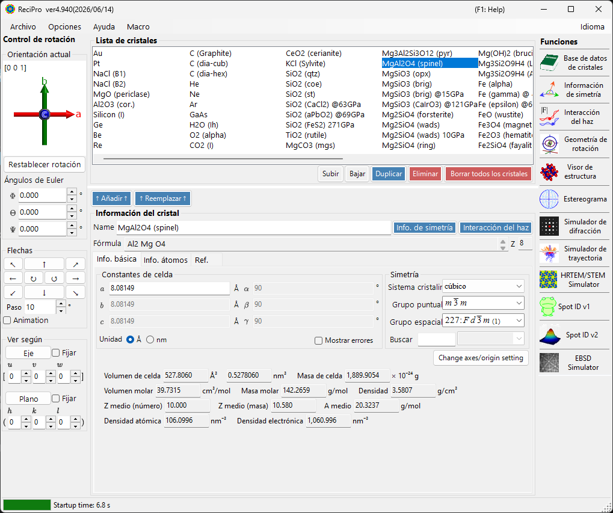

| Área | Posición | Descripción |
|------|----------|-------------|
| **Menú Archivo** | Arriba | Operaciones de archivo, opciones, ayuda |
| **Control de rotación** | Izquierda | Ver/establecer la orientación del cristal |
| **Lista de cristales** | Centro superior | Seleccionar y gestionar cristales |
| **Información del cristal** | Centro inferior | Editar parámetros de red, simetría, átomos |
| **Funciones** | Derecha | Iniciar ventanas de simulación/análisis |

---

## Atajos de teclado y ratón {#keyboard-mouse-shortcuts}

La ventana principal instala varios atajos **de ámbito global de la aplicación**. Siguen funcionando mientras las ventanas Visor de estructura, Estereograma, Simulador de difracción, Spot ID y Calculadora tienen el foco.

| Atajo | Acción |
|----------|--------|
| <kbd>F1</kbd> | Abrir esta página del manual en línea |
| <kbd>CTRL</kbd>+<kbd>SHIFT</kbd>+<kbd>D</kbd> | Abrir / cerrar el **Simulador de difracción** |
| <kbd>CTRL</kbd>+<kbd>SHIFT</kbd>+<kbd>V</kbd> | Abrir / cerrar el **Visor de estructura** |
| <kbd>CTRL</kbd>+<kbd>SHIFT</kbd>+<kbd>S</kbd> | Abrir / cerrar el **Estereograma** |
| <kbd>CTRL</kbd>+<kbd>SHIFT</kbd>+<kbd>T</kbd> | Abrir / cerrar **Spot ID** |
| <kbd>CTRL</kbd>+<kbd>SHIFT</kbd> + teclas de flecha | Rotar el cristal un paso en esa dirección (mantenga dos flechas para una diagonal) |
| Doble toque de <kbd>CTRL</kbd> | Abrir / cerrar la **Calculadora** |
| <kbd>CTRL</kbd>+<kbd>SHIFT</kbd>+<kbd>R</kbd> | Alternar el indicador **Reserved** del cristal seleccionado |
| Mantener <kbd>CTRL</kbd> mientras ReciPro arranca | Iniciar con OpenGL desactivado (recuperación ante problemas gráficos) |
| Arrastrar con el botón izquierdo el widget de orientación (abajo a la izquierda, bajo *Current Direction*) | Rotar el cristal |
| Doble clic derecho sobre el widget de orientación | Copiar la imagen del widget al portapapeles |
| Un solo clic sobre un botón de función | Abrir / cerrar esa ventana |
| Doble clic sobre un botón de función | Forzar que la ventana se muestre y traerla al frente |
| Clic derecho sobre un cristal de la lista | Menú contextual (Renombrar / Duplicar / Eliminar / Exportar CIF…) |
| Doble clic sobre la etiqueta **Current Index** | Mostrar / ocultar el cuadro max-UVW |
| Soltar un archivo sobre la ventana | Cargar una lista de cristales (`.xml`, `.cdb2`) o un cristal (`.cif`, `.amc`) |

→ Consulte **[21. Atajos de teclado y ratón](21-shortcuts.md)** para ver todas las ventanas de un vistazo.

---

## Flujo de trabajo básico

Si utiliza ReciPro por primera vez, siga estos pasos:

1. Seleccione el cristal deseado en la **Lista de cristales**. Para usar un archivo CIF/AMC, arrástrelo y suéltelo en **Información del cristal**.
2. Si edita parámetros de red o posiciones atómicas, pulse **Add** o **Replace** para que los cambios se escriban de vuelta en la lista de cristales.
3. Establezca la orientación del cristal en el **Control de rotación** mediante un eje de zona, un plano cristalino, ángulos de Euler o arrastrando con el ratón.
4. Abra la herramienta deseada desde **Funciones**. Las ventanas de cálculo de difracción, HRTEM/STEM, EBSD y otras utilizan el cristal y la orientación seleccionados actualmente.

---

## Menú Archivo

### File

| Elemento del menú | Descripción |
|-----------|-------------|
| Read crystal list (as new list) | Cargar un archivo de lista de cristales (*.xml) y reemplazar la lista actual |
| Read crystal list (and add) | Añadir a la lista actual |
| Read initial crystal list | Recargar la lista de cristales predeterminada |
| Save crystal list | Guardar la lista de cristales actual |
| Export selected crystal to CIF | Guardar en formato CIF |
| Clear crystal list | Eliminar todos los cristales |
| Exit | Cerrar la aplicación |

### Option

| Elemento del menú | Descripción |
|-----------|-------------|
| Show Tooltips | Alternar la visualización de las descripciones emergentes |
| Use Miller-Bravais (hkil) index | Usar la notación de 4 índices para los sistemas trigonal/hexagonal en toda la aplicación |
| Reset registry settings on exit (effective after restart) | Restablecer los ajustes en el próximo reinicio |
| Disable Crystallography.Native library (requires restart) | Recurrir al código administrado si la biblioteca nativa (C++) no se puede cargar |
| Disable all OpenGL rendering (requires restart) | Para GPU antiguas / escritorio remoto |
| Disable OpenGL text rendering (requires restart) | Solución alternativa para problemas de representación de texto en algunas GPU |
| Use MKL Library | Usar Intel MKL para las rutinas numéricas |
| Dark mode | Alternar entre el tema de color claro y oscuro |
| Powder diffraction function (under development) | Habilitar la ventana de difracción policristalina (de polvo) |
| Capture GUI Components… | Herramienta de desarrollador para guardar capturas de pantalla de la GUI |

### Help

| Elemento del menú | Descripción |
|-----------|-------------|
| Program updates | Comprobar si hay una nueva versión de ReciPro disponible e instalarla |
| Hint | Mostrar sugerencias de uso (obsoleto) |
| Version history | Abrir el diálogo de historial de versiones |
| License | Mostrar la licencia MIT |
| GitHub page | Abrir el repositorio de ReciPro en el navegador |
| Report bugs, requests, or comments | Abrir la página de GitHub Issues |
| Help (Web) | Abrir el manual en línea en GitHub Pages, en la página que coincide con el idioma de la interfaz. |

El idioma se cambia desde el menú independiente **Language** (Inglés/Japonés, requiere reinicio).

### Language

Cambiar el idioma de la interfaz entre inglés y japonés. El cambio surte efecto tras reiniciar ReciPro.

### Macro

Abre la ventana [Macro](20-macro/index.md) para automatizar operaciones de ReciPro con scripts de estilo Python. Para flujos de trabajo repetidos, consulte las [funciones integradas](20-macro/1-built-in-functions.md) y los [ejemplos de macros](20-macro/2-examples.md).

---

## Control de orientación del cristal

El estado de rotación del cristal es compartido por el simulador de difracción, el Visor de estructura, el Estereograma, el simulador HRTEM/STEM, el simulador EBSD y otras ventanas. No es solo un ajuste de vista: define la dirección del haz incidente y la relación de coordenadas del cristal utilizada por las simulaciones. Hay un breve tutorial en vídeo disponible en la página [Cómo usar](appendix/a0-how-to-use.md).

### Orientación actual

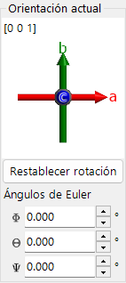

Muestra la orientación del cristal. Arrastre para rotar. Ejes: rojo = *a*, verde = *b*, azul = *c*.

### Restablecer rotación
Restablece al estado inicial: eje *c* perpendicular a la pantalla, eje *b* hacia arriba.

### Eje de zona
Muestra el eje de zona más cercano a la normal de la pantalla (p. ej., *u*+*v*+*w* < 30).

### Ángulos de Euler (Z-X-Z)
Establezca la orientación del cristal con los ángulos de Euler **Z–X–Z**:

- \(\Phi\): rotación en torno al eje Z
- \(\Theta\): rotación en torno al eje X
- \(\Psi\): rotación en torno al eje Z

Las rotaciones se aplican en el orden \(\Psi \to \Theta \to \Phi\). Consulte [Geometría de rotación](4-rotation-geometry.md) y [Apéndice A1. Sistema de coordenadas](appendix/a1-coordinate-system/1-orientation.md) para más detalles.

### Flechas

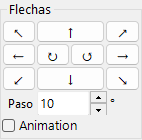

Rota por el ángulo Step. Active Animation para una rotación continua.

### Ver a lo largo de

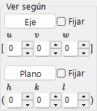

Alinea un eje de zona [*uvw*] o un plano cristalino (*hkl*) perpendicular a la pantalla.

- **Fix**: cuando está marcada, el eje de zona o el plano especificado se mantiene fijo en el espacio durante las operaciones de rotación posteriores.
- **Axis**: coloca el eje de zona introducido \([uvw]\) perpendicular a la pantalla. Si además se establece **Plane**, esa dirección apunta hacia arriba en la pantalla.
- **Plane**: coloca la normal del plano cristalino introducido \((hkl)\) perpendicular a la pantalla. Si además se establece **Axis**, esa dirección apunta hacia arriba en la pantalla.

### Formas básicas de establecer la orientación

| Método | Usar cuando | Dónde |
|--------|----------|-------|
| Arrastrar con el ratón | Desea rotar libremente mientras observa los ejes del cristal. | Panel **Orientación actual** |
| Botones de flecha | Desea rotaciones pequeñas y repetibles. | Panel **Flechas** |
| Eje de zona | Conoce la dirección de visualización, como \([001]\) o \([110]\). | **Ver a lo largo de** / entrada de eje de zona |
| Normal del plano | Desea un plano cristalino \((hkl)\) normal a la pantalla. | **Ver a lo largo de** / entrada de plano |
| Ángulos de Euler | Necesita una orientación numérica reproducible. | **Ángulos de Euler (Z-X-Z)** |

Consulte [Geometría de rotación](4-rotation-geometry.md) y [Apéndice A1. Sistemas de coordenadas](appendix/a1-coordinate-system/1-orientation.md) para las matrices de rotación y las convenciones de coordenadas.

---

## Lista de cristales

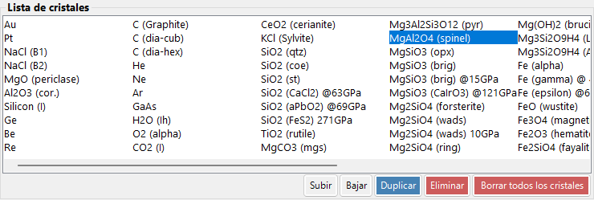

~80 cristales en la instalación predeterminada. Seleccione uno para ver sus detalles y establecerlo para los cálculos. **Haga clic derecho sobre un cristal** en la Lista de cristales para un menú contextual: *Rename*, *Export as CIF*, *Duplicate*, *Delete*.

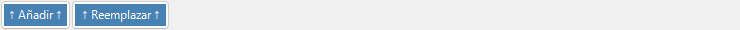

| Botón | Acción |
|--------|--------|
| Up / Down | Reordenar |
| Duplicate | Copiar el cristal seleccionado |
| Delete / All clear | Eliminar cristales |
| Add / Replace | Añadir a la lista o reemplazar la entrada seleccionada |

---

## Información del cristal

Edite los parámetros de red, la simetría y los átomos; arrastre y suelte archivos CIF/AMC para cargar una estructura. Este control es compartido por ReciPro, PDIndexer y CSmanager, pero las pestañas y funciones mostradas difieren según la aplicación. ReciPro muestra las pestañas Basic Info, Atom y Reference (las pestañas EOS, Elasticity y otras son para las demás aplicaciones y no se muestran en ReciPro).

> **Importante**: Pulse **Add** o **Replace** para guardar los cambios.

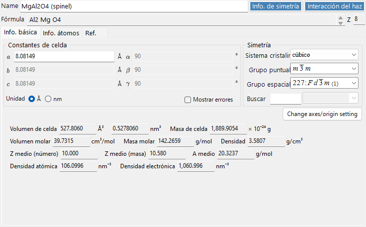

La parte superior del panel siempre muestra **Name** (nombre del cristal), **Formula** (fórmula química, calculada a partir de la lista de átomos) y **Reset** (borrar todos los campos).

### Pestaña Basic Info

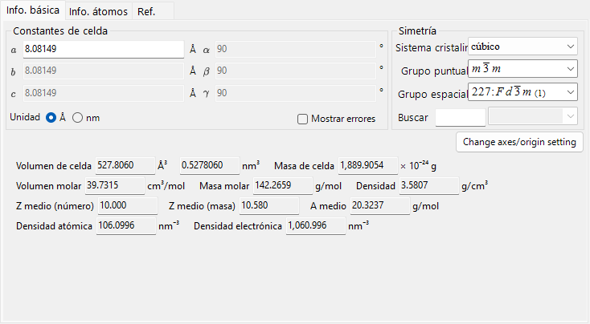

Parámetros de red, simetría y magnitudes derivadas de ellos.

| Elemento | Descripción |
|------|------|
| Cell constants | Parámetros de red a, b, c (en Å = 10⁻¹⁰ m) y α, β, γ. La elección de una simetría los restringe automáticamente (p. ej., a=b=c, α=β=γ=90° para cúbico). |
| Symmetry | Elija el sistema cristalino, el grupo puntual y el grupo espacial. Escriba en el cuadro **Search** para listar los candidatos coincidentes (distingue mayúsculas y minúsculas). |
| Cell Volume / Cell Mass | Volumen y masa de la celda elemental. |
| Molar Volume / Molar Mass / Z / Density | Volumen molar, masa molar, número de unidades fórmula por celda elemental (Z) y densidad. Se muestra **solo cuando se han introducido átomos**. |
| Color of Profile | Color utilizado al representar el perfil de difracción de este cristal. |

### Pestaña Atom

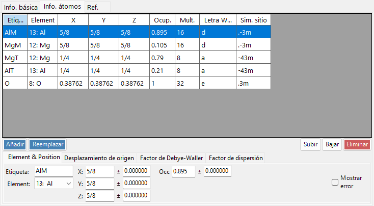

Establezca la especie, posición, factor de temperatura y factor de dispersión de cada átomo. Edite la lista de átomos con **Add**, **Replace** (reemplazar la fila seleccionada), **Up/Down** (reordenar) y **Delete**. Cada átomo tiene:

| Elemento | Descripción |
|------|------|
| Label | Etiqueta del átomo (cualquier identificador). |
| Element | Elemento (incluida la valencia iónica). |
| X, Y, Z | Coordenadas fraccionarias (0–1). Pueden introducirse fracciones como 1/2 o 2/3. |
| Occ | Ocupación (0–1). |

**Origin shift**: desplaza el origen de todas las coordenadas atómicas. Use los botones predefinidos (**+** / **−**) para desplazamientos estándar, o **Apply custom shift** para una cantidad arbitraria.

**Factor de Debye–Waller (factor de temperatura)**:

| Elemento | Descripción |
|------|------|
| Notation | Usar la notación U o B. |
| Model | Isótropo o anisótropo. |
| B##, U## | Para el caso anisótropo, introduzca cada componente (B11, …). |

**Scattering factor**: elija el factor de dispersión utilizado para cada átomo.

| Radiación | Fuente / ajuste |
|-----------|------|
| X-ray | Factores de dispersión incluida la valencia iónica (International Tables for Crystallography, Vol. C). |
| Electron | Factores de dispersión de electrones (Peng 1998, Acta Cryst. A54, 481–485). |
| Neutron | Longitudes de dispersión de neutrones. Elija **Natural isotope abundance** o **Custom isotope abundance** (una composición isotópica arbitraria). |

### Pestaña Reference

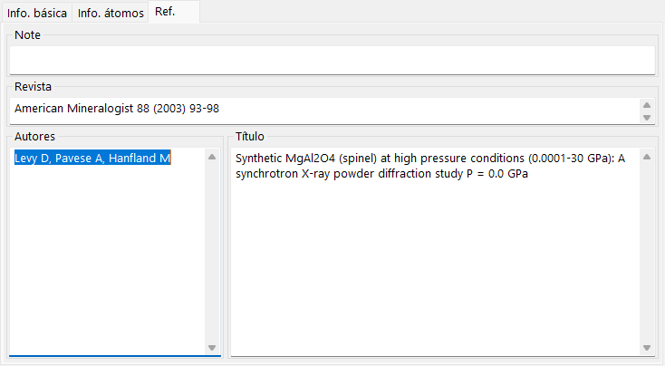

Registre la fuente de la estructura: **Note**, **Authors**, **Journal** y **Title**.

### Menú contextual (clic derecho)

Haga clic derecho en un área vacía del control para estas acciones principales:

| Elemento del menú | Acción |
|-----------|------|
| Beam Interaction | Abre la ventana [Interacción del haz](3-beam-interaction.md). |
| Symmetry information | Abre la ventana [Información de simetría](2-symmetry-information.md). |
| Import from CIF, AMC | Carga un cristal desde un archivo CIF / AMC. |
| Export to CIF | Exporta el cristal actual como CIF. |
| Revert cell constants | Restaura las constantes de celda a los valores cargados inicialmente. |
| Convert to P1 spacegroup | Expande la estructura al grupo espacial P1. |
| Convert to a superstructure | Convierte en una superestructura con múltiplos enteros de a, b, c (diálogo de tamaño). |
| Convert to an equivalent space group | Convierte en un grupo espacial equivalente (una orientación de ejes diferente). |

---

## Panel de funciones {#functions}

La tira vertical de botones de la derecha inicia las ventanas de análisis y simulación (consulte la tabla [Funciones](#functions) más abajo).

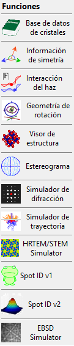

| Botón | Descripción | Detalles |
|--------|-------------|---------|
| Crystal Database | Buscar e importar cristales desde las bases de datos integradas / en línea | [1. Base de datos de cristales](1-crystal-database.md) |
| Symmetry Information | Información del grupo espacial y diagramas de simetría de las ITC Vol. A | [2. Información de simetría](2-symmetry-information.md) |
| Beam Interaction | Interacción haz-cristal: reflexiones, atenuación, factores de dispersión, fluorescencia | [3. Interacción del haz](3-beam-interaction.md) |
| Rotation Geometry | Matriz de rotación 3D / ángulos del goniómetro | [4. Geometría de rotación](4-rotation-geometry.md) |
| Structure Viewer | Estructura cristalina 3D | [5. Visor de estructura](5-structure-viewer.md) |
| Stereonet | Proyección estereográfica | [6. Estereograma](6-stereonet.md) |
| Diffraction Simulator | Difracción de rayos X / electrones de monocristal | [7. Simulador de difracción](7-diffraction-simulator/index.md) |
| Trajectory Simulator | Simulación Monte-Carlo de trayectorias electrónicas | [8. Trayectorias electrónicas](8-electron-trajectory.md) |
| HRTEM/STEM Simulator | Simulación de imágenes HRTEM / STEM | [9. Simulador HRTEM/STEM](9-hrtem-stem-simulator/index.md) |
| Spot ID v1 | Indexación de patrones SAED (antes "TEM ID") | [10. Spot ID v1](10-spot-id.md) |
| Spot ID v2 | Detección e indexación de reflexiones | [11. Spot ID v2](11-spot-id-v2.md) |
| EBSD Simulator | Simulación de patrones EBSD | [12. Simulación EBSD](12-ebsd-simulation.md) |
| Powder Diffraction | Difracción policristalina (de polvo) — habilítela mediante **Option ▸ Powder diffraction function** | - |

---

## Véase también

- [Base de datos de cristales](1-crystal-database.md)
- [Geometría de rotación](4-rotation-geometry.md)
- [Visor de estructura](5-structure-viewer.md)
- [Simulador de difracción](7-diffraction-simulator/index.md)
- [Atajos de teclado y ratón](21-shortcuts.md)
- [Sistema de coordenadas básico y orientación del cristal](appendix/a1-coordinate-system/1-orientation.md)
