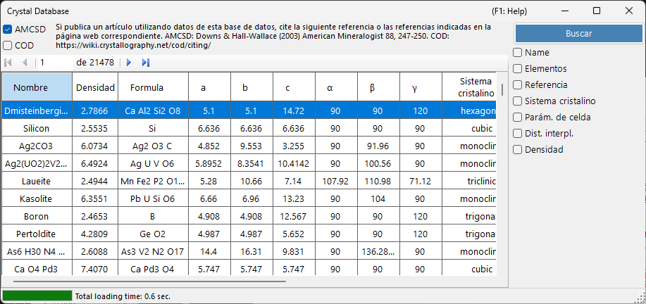
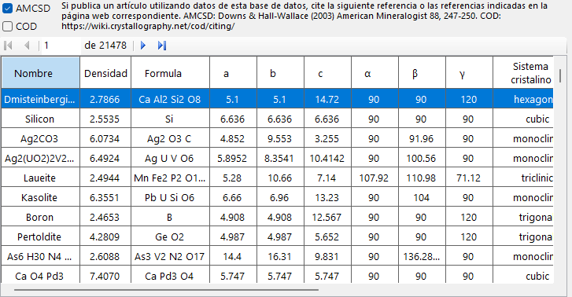
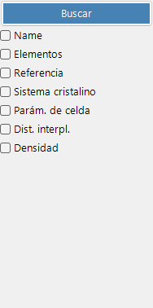

# Base de datos de cristales

La **Base de datos de cristales** ofrece funciones para buscar e importar estructuras cristalinas de dos fuentes, seleccionables mediante las casillas **AMCSD** y **COD**:

- **AMCSD** : la [American Mineralogist Crystal Structure Database](https://www.rruff.net/) incluida (más de 20.000 estructuras).
- **COD** : la [Crystallography Open Database](https://www.crystallography.net/cod/). Como el archivo es grande, no se incluye con el instalador; el archivo de la base de datos se descarga automáticamente en el primer uso. Cuando el archivo se actualiza en el servidor, se le solicita que lo descargue de nuevo.

Cite las siguientes referencias cuando utilice estas bases de datos.

Al utilizar **AMCSD**:

> Downs, R.T. and Hall-Wallace, M. (2003) The American Mineralogist Crystal Structure Database. *American Mineralogist* **88**, 247-250.

Al utilizar **COD**:

> Gražulis, S. et al. (2009) Crystallography Open Database – an open-access collection of crystal structures. *Journal of Applied Crystallography* **42**, 726-729.
>
> Gražulis, S. et al. (2012) Crystallography Open Database (COD): an open-access collection of crystal structures and platform for world-wide collaboration. *Nucleic Acids Research* **40**, D420-D427.

---

## Atajos de teclado y ratón

Esta ventana no tiene combinaciones con teclas modificadoras; se maneja mediante clics ordinarios. Las únicas entradas no evidentes son:

| Atajo | Acción |
|----------|--------|
| <kbd>F1</kbd> | Abrir esta página del manual en línea |
| <kbd>ENTER</kbd> en cualquier campo de búsqueda | Ejecutar la búsqueda en la base de datos (equivale al botón **Search**) |
| Hacer clic en una fila de la tabla de resultados | Cargar ese cristal en la ventana principal |
| Hacer clic en un elemento de la ventana emergente **Periodic table** | Alternar su filtro: *ignore* → *must include* → *must exclude* |

→ Consulte **[21. Atajos de teclado y ratón](21-shortcuts.md)** para ver de un vistazo todas las ventanas.

---

## Tabla

Muestra los cristales que coinciden con los criterios de búsqueda. Seleccione un cristal para transferirlo a la Información del cristal de la ventana principal. Pulse **Add** o **Replace** para añadirlo a la Lista de cristales.

---

## Opciones de búsqueda

Introduzca los criterios de búsqueda a continuación y pulse el botón **Search** o la tecla **Enter**.

| Criterio | Descripción |
|-----------|-------------|
| **Name** | Nombre del cristal |
| **Element** | Selector de tabla periódica (puede/debe/no debe incluir) |
| **Reference** | Título, revista, autor |
| **Crystal system** | Seleccionar sistema cristalino |
| **Cell Param** | Constantes reticulares y error |
| **d-spacing** | Valores d de la reflexión más intensa y error |
| **Density** | Densidad y error |

### Name

Coincidencia de texto libre con el nombre del cristal. Se permiten coincidencias parciales.

### Element

Pulse el botón **Periodic Table** para abrir el selector de elementos. Cada botón de elemento alterna entre tres estados:

- **May or may not include** (predeterminado: gris)
- **Must include** (verde)
- **Must exclude** (rojo)

Los tres botones en la parte superior de la ventana restablecen cada elemento a uno de los tres estados con un solo clic.

### Reference

Coincidencia de texto libre con los metadatos de la publicación: título del artículo, nombre de la revista y lista de autores.

### Crystal system

Restringe la búsqueda a un sistema cristalino específico (Cubic, Tetragonal, Orthorhombic, Hexagonal, Trigonal, Monoclinic, Triclinic).

### Búsqueda por parámetros de celda

Introduzca las constantes reticulares objetivo *a*, *b*, *c*, *α*, *β*, *γ* y los errores admisibles. Los campos vacíos se tratan como comodines.

### d-spacing

Introduzca el *d*-spacing de la reflexión más intensa (o de varias reflexiones intensas) y un error admisible. Útil cuando solo se conocen las posiciones de los picos de difracción de un experimento.

### Density

Filtra por densidad de masa (g/cm³) dentro de una banda de error admisible.

---

## Véase también

- [Ventana principal](0-main-window.md)
- [Información de simetría](2-symmetry-information.md)
- [Interacción del haz](3-beam-interaction.md)
- [Visor de estructura](5-structure-viewer.md)
