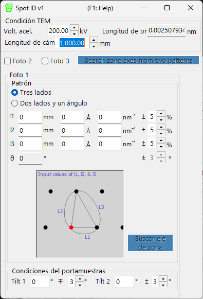

# Spot ID v1

**Spot ID v1** detecta, ajusta e indexa reflexiones de difracción a partir de imágenes experimentales de difracción de electrones. Además admite la búsqueda manual de ejes de zona a partir de una geometría de reflexiones introducida numéricamente (el antiguo **TEM ID**).

---

## Atajos de teclado y ratón

Spot ID v1 toma la geometría de las reflexiones como **entrada numérica** (el antiguo flujo de trabajo *TEM ID*), y la detección/ajuste de reflexiones se controla mediante botones; la imagen de difracción se muestra solo como referencia y no es interactiva al hacer clic (el zoom con el ratón y la selección manual de reflexiones pertenecen a [Spot ID v2](11-spot-id-v2.md)). El único atajo se encuentra en la ventana de resultados:

| Atajo | Acción |
|----------|--------|
| <kbd>F1</kbd> | Abrir esta página del manual en línea |
| Doble clic en una fila de la lista de resultados | Seleccionar ese cristal y rotarlo al eje de zona correspondiente |

→ Consulte **[21. Atajos de teclado y ratón](21-shortcuts.md)** para ver de un vistazo todas las ventanas.

---

## Área principal

Muestra la imagen de difracción como referencia. Cargue las imágenes mediante arrastrar y soltar o desde el menú **File**.

### Ajustes de imagen

| Ajuste | Descripción |
|---------|-------------|
| Min / Max | Rango de brillo (también ajustable mediante la barra deslizante) |
| Gradient | Positivo o Negativo |
| Scale | Lineal o Log |
| Colour | Escala de grises o Cold-Warm |
| Dust & Scratch | Eliminar píxeles excepcionalmente claros/oscuros (definir rango y umbral) |
| Gaussian blur | Aplicar desenfoque (rango en píxeles) |

---

## Optics

Introduzca la fuente incidente, la energía/longitud de onda, la longitud de cámara y el tamaño de píxel del detector.

> Si se carga un archivo dm3/dm4 (Gatan Digital Micrograph), estos valores se establecen automáticamente.

---

## Detección y ajuste de reflexiones

Pulse **Detect & fit spots** para detectar automáticamente las reflexiones de difracción y ajustarlas con una función Pseudo-Voigt 2D. Los resultados aparecen en la tabla.

### Opciones de detección

| Parámetro | Descripción |
|-----------|-------------|
| Number | Número máximo de reflexiones a detectar |
| Nearest neighbour | Distancia mínima entre reflexiones detectadas |
| Fitting range | Radio (píxeles) alrededor de cada reflexión para el ajuste |

### Controles de la tabla

| Botón | Acción |
|--------|--------|
| Reset range | Restablecer el rango de ajuste de todas las reflexiones |
| Show label/symbol | Superponer etiquetas/símbolos sobre la imagen |
| Clear all spots | Eliminar todas las reflexiones |
| Save / Copy | Exportar la tabla en formato separado por tabuladores (Excel) |
| Re-fit all | Reajustar todas las reflexiones |

### Ventana de detalle de la reflexión

Marque la casilla para abrir una ventana de detalle que muestra la reflexión seleccionada (izquierda) y los perfiles en cuatro direcciones (derecha). Azul = datos observados, rojo = ajuste.

---

## Index

Pulse **Identify spots** para indexar las reflexiones detectadas frente al cristal seleccionado en la Ventana principal.

| Ajuste | Descripción |
|---------|-------------|
| Acceptable error | Tolerancia para la indexación |
| Single grain / Multi grains | Indexar como cristal único o como varios granos (definir el número máximo de granos) |
| Show label/symbol | Superponer las etiquetas indexadas sobre la imagen |
| Refine thickness and direction | Aplicar la teoría dinámica (método de Bethe) para refinar el espesor de la muestra y la orientación del cristal que mejor se ajusten a las intensidades detectadas |

---

## Búsqueda de eje de zona a partir de la geometría de reflexiones (antiguo TEM ID)

Cuando no dispone de una imagen para cargar, todavía puede buscar ejes de zona candidatos introduciendo a mano la geometría de un patrón de difracción de electrones de área seleccionada (SAED). Introduzca las condiciones de observación TEM y la geometría de las reflexiones, y luego pulse **Search zone axes** para encontrar orientaciones cristalinas candidatas.

### TEM condition

Introduzca las condiciones de observación TEM (voltaje de aceleración, longitud de cámara, etc.).

### Photo 1, 2, 3

Introduzca la geometría de las reflexiones de difracción.

- Para introducir la distancia entre reflexiones en el detector, use la casilla **mm**.
- Si conoce el valor *d*, introdúzcalo en unidades **Å** o **nm⁻¹**.

**Three sides mode** : Introduzca las longitudes de los tres lados de un triángulo cuyo vértice es el direct spot.

**Two sides and an angle mode** : Introduzca las longitudes de dos lados (incluyendo el direct spot) y el ángulo entre ellos.

---

## Véase también

- [Spot ID v2](11-spot-id-v2.md)
- [Simulador de difracción](7-diffraction-simulator/index.md)
- [Ventana principal](0-main-window.md)
- [Base de datos de cristales](1-crystal-database.md)
- [Simulación EBSD](12-ebsd-simulation.md)
