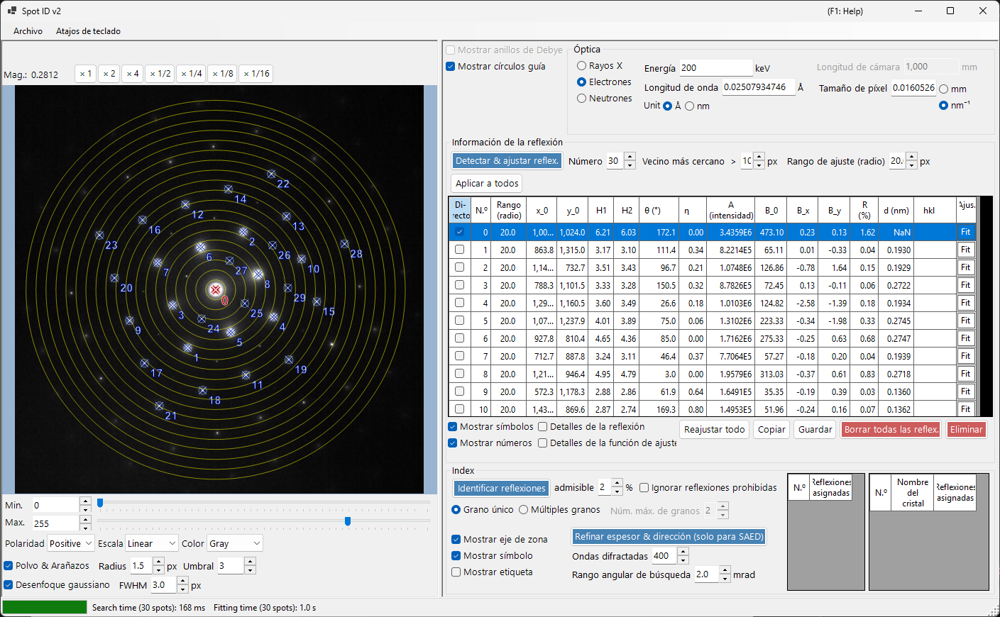
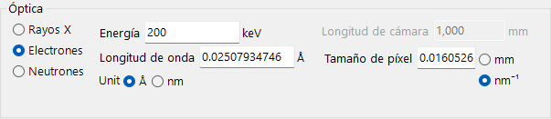
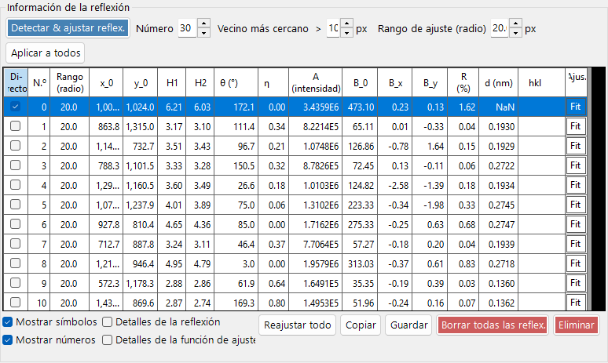
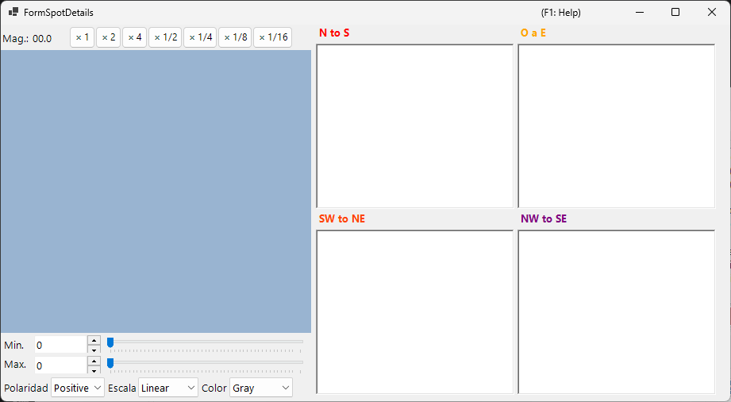
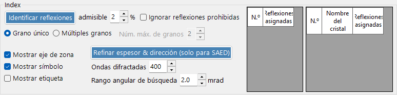

# Spot ID v2

**Spot ID v2** es la versión mejorada de [Spot ID](10-spot-id.md) con una detección de reflexiones perfeccionada, algoritmos de ajuste mejorados y un motor de indexación más potente.

---

## Atajos de teclado y ratón

La lista de reflexiones se construye directamente sobre la imagen cargada. El panel de imagen utiliza la [navegación de vista de imagen](21-shortcuts.md) estándar de ReciPro para desplazar/hacer zoom; para la edición de reflexiones se añaden las combinaciones siguientes.

| Atajo | Acción |
|----------|--------|
| <kbd>F1</kbd> | Abrir esta página del manual en línea |
| Doble clic izquierdo sobre la imagen | Añadir una reflexión en ese punto (con ajuste de pico) |
| <kbd>CTRL</kbd> + doble clic izquierdo | Añadir una reflexión y marcarla como el haz directo (000) |
| Clic izquierdo sobre una reflexión | Seleccionar la reflexión más cercana |
| <kbd>CTRL</kbd> + clic derecho sobre una reflexión | Eliminar la reflexión más cercana |
| <kbd>CTRL</kbd> + teclas de flecha | Desplazar la reflexión seleccionada un píxel |
| Arrastrar con izquierdo / con central (área vacía) | Desplazar la imagen |
| Rueda del ratón | Acercar/alejar el zoom en el cursor |
| Arrastrar con derecho un recuadro | Acercar el zoom a la región seleccionada |
| Doble clic derecho | Alejar el zoom |
| Doble clic en el encabezado de fila de una reflexión (tabla) | Hacer zoom a esa reflexión (×2) |

Con <kbd>CTRL</kbd>+<kbd>SHIFT</kbd>+<kbd>T</kbd> en la ventana principal se abre/cierra esta ventana.

→ Consulte **[21. Atajos de teclado y ratón](21-shortcuts.md)** para ver todas las ventanas de un vistazo.

---

## Menú Archivo

Abrir/guardar una imagen de difracción. Se admite la misma carga mediante arrastrar y soltar que en [Spot ID v1](10-spot-id.md), y los metadatos DM3/DM4 de Gatan (longitud de cámara, longitud de onda, tamaño de píxel) se tienen en cuenta automáticamente.

---

## Óptica

### Fuente incidente

Seleccione el tipo de radiación (rayos X / electrones / neutrones) y ajuste la energía o la longitud de onda.

### Longitud de cámara / Tamaño de píxel

La longitud de cámara (mm) y el tamaño de píxel del detector (mm o nm⁻¹). Cuando se carga un archivo DM de Gatan, estos valores se rellenan a partir del encabezado del archivo.

---

## Información de la reflexión

- **Detect & Fit Spots**: Detección automática de reflexiones mediante máximos locales y sustracción del fondo.
- **Number**: El número máximo de reflexiones que se detectarán.
- **Nearest neighbour**: La separación mínima (px) permitida entre reflexiones detectadas. Los picos más cercanos que este valor se fusionan, evitando la doble detección de la misma reflexión.
- **Fitting range (radius)**: El radio (px) de la región circular utilizada para ajustar el pico de cada reflexión. Los píxeles dentro de este círculo se ajustan con una función pseudo-Voigt.
- **Apply to All**: Establece el radio de ajuste de todas las reflexiones al valor actual de **Fitting range (radius)**.
- **Delete spot / Clear spots**: Eliminar reflexiones individuales o todas las detectadas.
- **Copy to clipboard**: Copiar las posiciones e intensidades de las reflexiones al portapapeles.
- **Details of the spot**: Cuando está activado, se abre una ventana que muestra información detallada sobre la reflexión seleccionada actualmente.

---

## Index

- **Identify Spots**: Ejecuta el algoritmo de indexación para encontrar el cristal y el eje de zona que mejor coinciden.
- **Acceptable error**: Establece la desviación aceptable en el espaciado interplanar y el ángulo para una coincidencia.
- **Ignore prohibited reflections**: Cuando está activado, las reflexiones prohibidas por ejes helicoidales y planos de deslizamiento se tratan como no necesariamente satisfechas durante la búsqueda del eje de zona.
- **Single Grain / Multiple Grains**: Buscar una única orientación (monocristal) o varias orientaciones (una región policristalina / multigrano). Para varios granos, **Max. num. of grains** establece el límite superior del número de granos que se buscarán.
- **Results**: Las mejores coincidencias se muestran con el nombre del cristal, el eje de zona [uvw] y los índices individuales de las reflexiones (hkl).

---

## Mejoras respecto a v1

- Mejor tratamiento del ruido en la detección de reflexiones.
- Algoritmos de ajuste más robustos con múltiples formas de perfil.
- Indexación más rápida con algoritmos de búsqueda optimizados.
- Compatibilidad con reflexiones solapadas y reflexiones satélite.

---

## Véase también

- [Spot ID v1](10-spot-id.md)
- [Simulador de difracción](7-diffraction-simulator/index.md)
- [Ventana principal](0-main-window.md)
- [Atajos de teclado y ratón](21-shortcuts.md)
