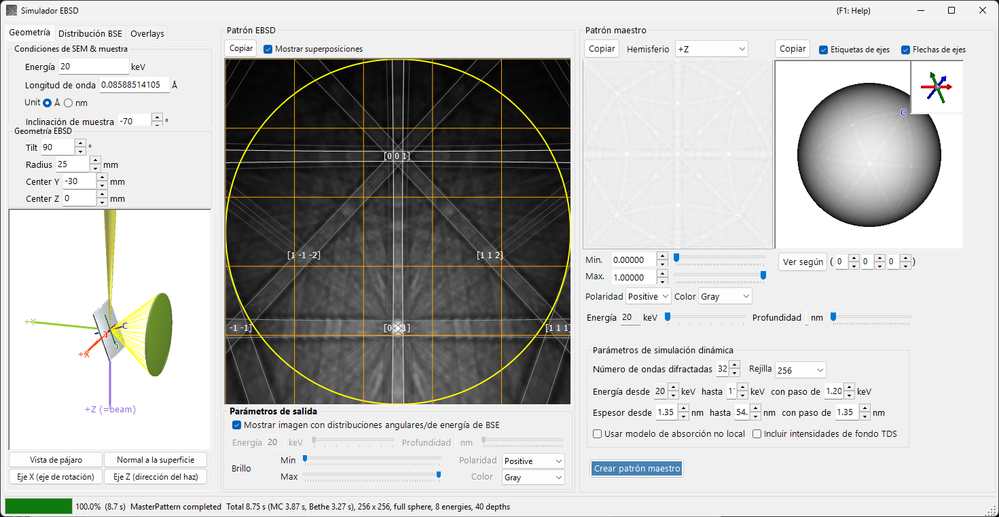
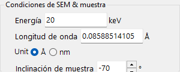
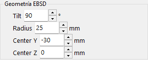
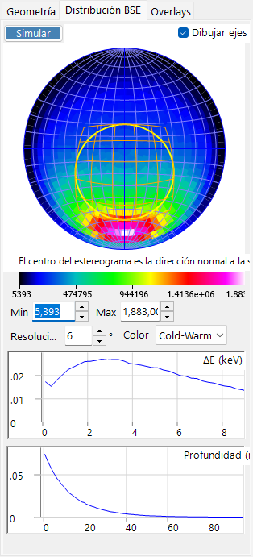
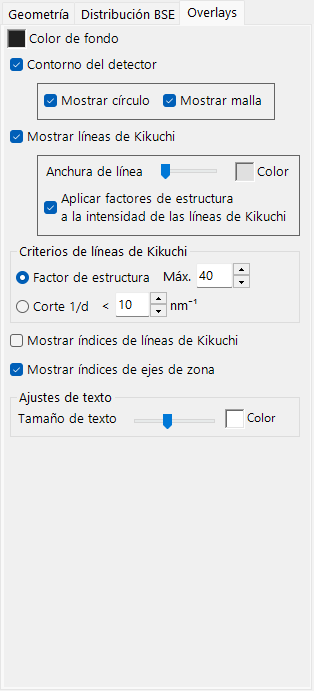
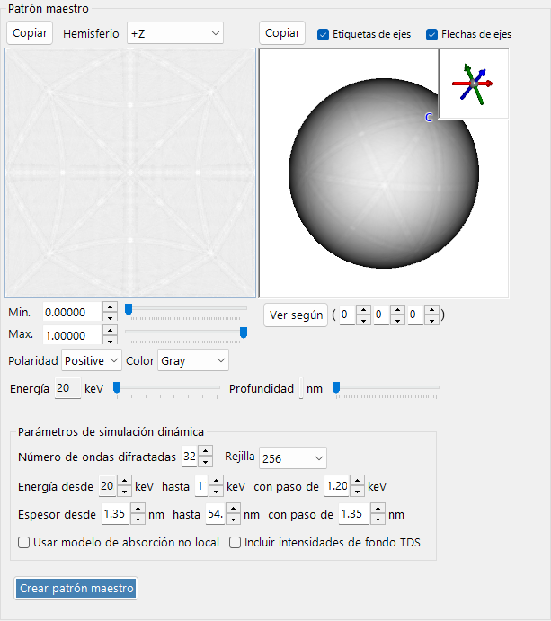
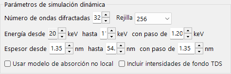
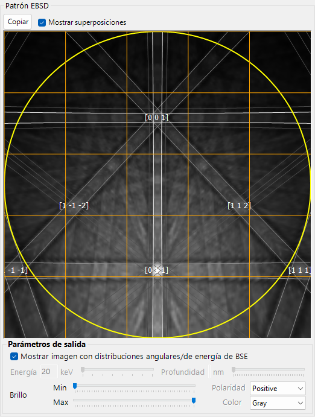

# Simulación EBSD

El **Simulador EBSD** simula los patrones de difracción de electrones retrodispersados (EBSD) —patrones de Kikuchi— obtenidos en un microscopio electrónico de barrido (SEM), mediante cálculos de teoría dinámica. Calcula la distribución angular/energética/de profundidad de los electrones retrodispersados (BSE) mediante una simulación de Monte-Carlo, construye un **master pattern** dinámico (de ondas de Bloch) del cristal y lo proyecta sobre el detector para la orientación actual del cristal.

La ventana tiene tres columnas.

- **Izquierda** : condiciones de simulación. Las pestañas seleccionan **Geometry** (geometría de muestra/detector y una vista 3D), **BSE Distribution** (distribuciones de electrones retrodispersados) y **Overlays** (líneas de Kikuchi y otras anotaciones).
- **Centro** : el patrón EBSD (de Kikuchi) para la orientación actual del cristal.
- **Derecha** : el master pattern independiente de la orientación (proyección 2D y esfera 3D).

---

## Atajos de teclado y ratón

La vista central del patrón EBSD (de Kikuchi) y las vistas del master pattern de la derecha responden a acciones de ratón diferentes.

| Atajo | Acción |
|----------|--------|
| <kbd>F1</kbd> | Abrir esta página del manual en línea |
| Arrastrar con el botón izquierdo el patrón cerca del centro | Inclinar el cristal |
| Arrastrar con el botón izquierdo la zona exterior del patrón | Girar el cristal |
| Doble clic sobre el patrón | Seleccionar la subcelda del detector bajo el cursor y mostrar su estadística |
| Arrastrar con el botón izquierdo una vista 3D (geometría / esfera maestra) | Rotarla |
| Arrastrar con el botón derecho, o rueda del ratón, sobre una vista 3D | Zoom |
| <kbd>CTRL</kbd> + doble clic derecho sobre una vista 3D | Alternar ortográfica / perspectiva |
| Arrastrar / rueda sobre el master pattern 2D | Desplazar / hacer zoom en la imagen |

Las vistas 3D usan la [navegación de vista](21-shortcuts.md) estándar de ReciPro (desplazamiento desactivado).

→ Consulte **[21. Atajos de teclado y ratón](21-shortcuts.md)** para una visión general de cada ventana.

---

## Flujo de trabajo

Al pulsar **Build Master Pattern** se ejecutan en orden los siguientes pasos.

1. **Simulación BSE de Monte-Carlo** : usando la composición, densidad, voltaje de aceleración e inclinación de la muestra actuales del cristal, se siguen unos 2,5 millones de electrones dentro de la muestra (dispersión elástica: secciones eficaces de Mott/NIST; dispersión inelástica: modelo de respuesta dieléctrica). Esto produce la distribución conjunta de *profundidad de penetración × dirección de salida × energía de salida* de los electrones retrodispersados.
2. **Selección automática de rango** : a partir de esa distribución, se fijan automáticamente el rango de energía (desde la energía incidente hasta aproximadamente el percentil 80 de pérdida de energía) y el rango de profundidad (hasta aproximadamente el percentil 99 de profundidad de penetración) usados en el cálculo dinámico.
3. **Construcción del master pattern** : para cada energía y profundidad se resuelve el problema de difracción dinámica (ondas de Bloch) y se integra sobre la esfera de direcciones, ponderado por la distribución de Monte-Carlo, para dar la intensidad de difracción de retrodispersión en cada dirección. El resultado se almacena en una rejilla de igual área (Rosca–Lambert).
4. **Proyección sobre el detector, con ponderación** : para la orientación actual del cristal, la intensidad de la dirección subtendida por cada píxel del detector se consulta en el master pattern y se dibuja como el patrón de Kikuchi, opcionalmente ponderada por la distribución angular/energética de los BSE.

Los rangos de energía y profundidad se fijan automáticamente en los pasos 1–2, pero pueden ajustarse manualmente antes de construir.

---

## Ajustes SEM-EBSD

### Condiciones del SEM y de la muestra

- **Energy** : voltaje de aceleración del haz incidente (keV).
- **Wavelength** : longitud de onda del electrón (Å), vinculada a Energy.
- **Sample tilt** : ángulo de inclinación de la muestra (típicamente 70°). La gran inclinación en EBSD aumenta el rendimiento de electrones retrodispersados.

### Geometría EBSD

- **Detector tilt** : inclinación del detector (pantalla de fósforo).
- **Detector radius** : radio del detector (mm); fija el campo de visión angular del patrón dibujado.
- **Detector center** : posición (Y, Z) del centro del detector relativa al punto de impacto del haz (mm).

La geometría puede inspeccionarse en la vista 3D de la pestaña **Geometry**.

La placa gris es la muestra, el cilindro/cono verde es el detector y el **+Z (=beam)** violeta es el haz incidente. También se muestran los ejes **a / b / c** del cristal (fijos a la muestra). Los botones **Bird's-Eye View**, **Surface Normal**, **X Axis (Rotation Axis)** y **Z Axis (Beam Direction)** ajustan la vista a direcciones estándar. Consulte el [Apéndice A1. Sistemas de coordenadas](appendix/a1-coordinate-system/2-diffraction.md) para las definiciones del sistema de coordenadas.

---

## Distribución BSE

La pestaña **BSE Distribution** muestra las distribuciones de Monte-Carlo de los electrones retrodispersados. Use **Simulate** para recalcularlas.

- **Stereonet** : distribución angular (histograma de las direcciones de salida) de los electrones retrodispersados. El centro es la dirección de la normal a la superficie, y el contorno amarillo/naranja marca la región subtendida por el detector. **Draw axes** superpone los ejes del cristal, y la escala de color (Min/Max, resolución, color) es ajustable.
- **ΔE (keV)** : distribución de pérdida de energía de los electrones retrodispersados.
- **Depth (nm)** : distribución de la profundidad de salida final de los electrones retrodispersados.

Estas distribuciones se calculan con el mismo motor de Monte-Carlo que [Trayectorias electrónicas](8-electron-trajectory.md) y se usan para ponderar el master pattern.

---

## Overlays

La pestaña **Overlays** configura las anotaciones dibujadas sobre el patrón EBSD.

- **Background color** : color de fondo.
- **Detector outline** : el contorno del detector. **Show circle** (perímetro) / **Show mesh** (rejilla).
- **Show Kikuchi lines** : dibujar líneas de Kikuchi. **Line Width** / **Color**, y **Apply structure factors to Kikuchi line intensity**.
- **Show Kikuchi line indices** : mostrar los índices de las líneas de Kikuchi (bandas).
- **Show zone axis indices** : mostrar los índices de eje de zona.
- **Kikuchi line criteria** : qué líneas de Kikuchi dibujar: **Structure factor** (las *N* mayores por factor de estructura) o **1/d Cutoff** (aquellas con 1/d por debajo de un umbral).
- **Text settings** : **Text Size** / **Color** de las etiquetas de índices.

---

## Master pattern

El master pattern es la intensidad de difracción de retrodispersión sobre todas las direcciones, calculada de antemano por la teoría dinámica con **Build Master Pattern**.

- **Vista 2D** (izquierda) : proyección de igual área de un hemisferio. **Hemisphere** selecciona el hemisferio proyectado (+Z / −Z).
- **Vista 3D** (derecha) : una esfera con la intensidad mapeada sobre ella. Puede rotarse con el ratón, y un recuadro en la parte superior derecha muestra los ejes del cristal sincronizados (a/b/c). **Axis Labels** / **Axis Arrows** alternan las etiquetas/flechas, y **View Along** mira a lo largo de un eje de zona elegido [u v w].
- **Min / Max, Polarity, Color** : rango de intensidad mostrado, polaridad y escala de color.
- Deslizadores **Energy / Depth** : seleccionan la rebanada de energía/profundidad a mostrar.
- Cualquiera de las vistas puede enviarse al portapapeles con **Copy**.

### Parámetros de la simulación dinámica

- **Number of diffracted waves** : número de haces (ondas) difractados incluidos en el cálculo de ondas de Bloch. Más ondas son más precisas pero más lentas.
- **Grid** : resolución de la rejilla del master pattern (predeterminado 256).
- **Energy from … to … with step of …** : rango de energía y paso integrados (keV); fijado automáticamente a partir del resultado de Monte-Carlo.
- **Thickness from … to … with step of …** : rango de profundidad y paso integrados (nm); fijado igualmente de forma automática.
- **Use non-local absorption model** : usar la forma de absorción no local.
- **Include TDS background intensities** : incluir el fondo de dispersión térmica difusa (TDS).

---

## Patrón EBSD

El panel central muestra el patrón EBSD (de bandas de Kikuchi) para la orientación actual del cristal.

- **Show Dynamical EBSD Pattern (Master Pattern Required)** : proyecta el master pattern construido sobre el detector.
- **Show overlays** : dibuja los overlays (abajo), como las líneas de Kikuchi e índices.
- **Output parameters**
  - **Show image with BSE angular/energy distributions** : cuando está marcado, el patrón se compone ponderando con la distribución BSE (energía, profundidad, dirección) en lugar de una sola rebanada.
  - **Energy / Depth** : cuando lo anterior está desactivado, selecciona la rebanada de energía/profundidad a mostrar.
  - **Brightness (Min/Max), Polarity, Color** : rango de brillo, polaridad y escala de color.
- **Copy** : copia el patrón al portapapeles.

---

## Véase también

- [Trayectorias electrónicas](8-electron-trajectory.md) — simulación de Monte-Carlo de trayectorias electrónicas / BSE usada para la ponderación angular/energética/de profundidad.
- [Simulador de difracción](7-diffraction-simulator/index.md) — difracción electrónica dinámica (de ondas de Bloch).
- [Apéndice A1. Sistemas de coordenadas](appendix/a1-coordinate-system/2-diffraction.md) — definiciones de los sistemas de coordenadas de muestra/detector.
