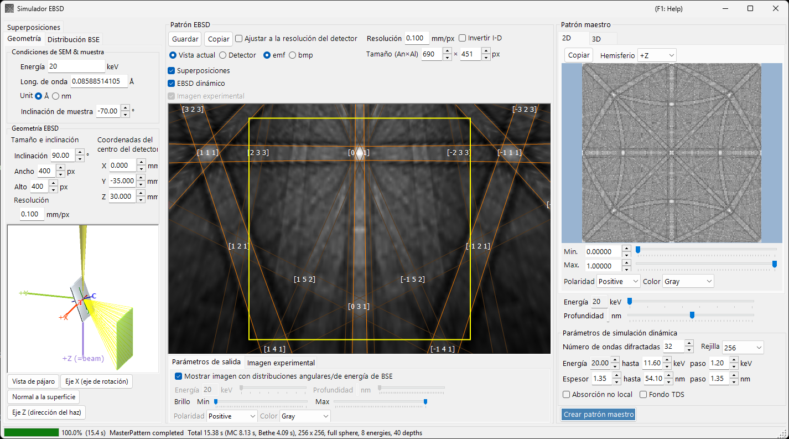
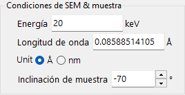
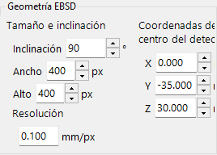
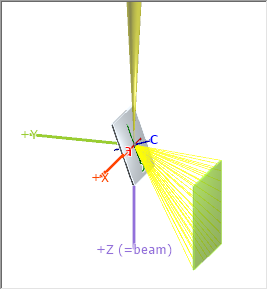
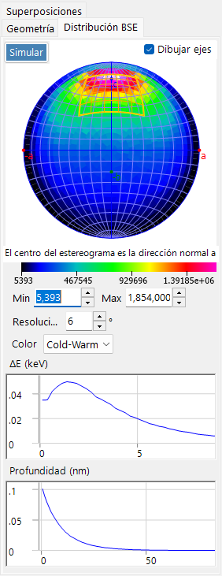
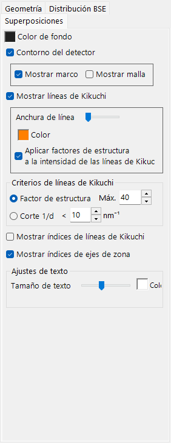
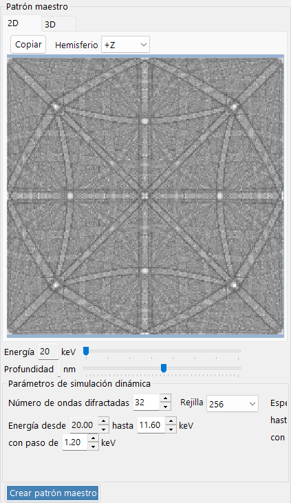
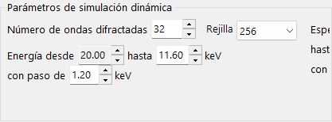
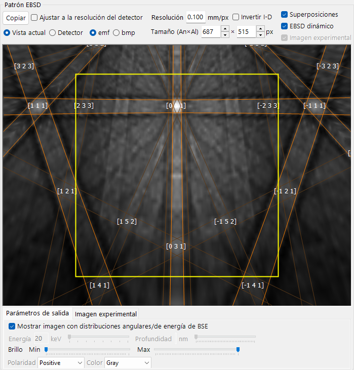
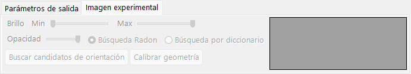

# Simulación EBSD

El **Simulador EBSD** simula los patrones de difracción de electrones retrodispersados (EBSD) —patrones de Kikuchi— obtenidos en un microscopio electrónico de barrido (SEM), mediante cálculos de teoría dinámica. Calcula la distribución angular/energética/de profundidad de los electrones retrodispersados (BSE) mediante una simulación de Monte-Carlo, construye un **master pattern** dinámico (de ondas de Bloch) del cristal y lo proyecta sobre el detector para la orientación actual del cristal. También puede cargarse una imagen EBSD experimental e **indexarla**: la orientación que mejor la explica se busca automáticamente ([Imagen experimental](#imagen-experimental)).

La ventana tiene tres columnas.

- **Izquierda** : condiciones de simulación. Las pestañas seleccionan **Geometría** (geometría de muestra/detector y una vista 3D), **Distribución BSE** (distribuciones de electrones retrodispersados) y **Superposiciones** (líneas de Kikuchi y otras anotaciones).
- **Centro** : el patrón EBSD (de Kikuchi) para la orientación actual del cristal. Debajo, las pestañas seleccionan **Parámetros de salida** e **Imagen experimental**.
- **Derecha** : el master pattern independiente de la orientación, en las pestañas **2D** y **3D**.

La barra de estado inferior muestra el progreso del cálculo en curso y un resumen de su resultado.

---

## Atajos de teclado y ratón

La vista central del patrón EBSD (de Kikuchi) y las vistas del master pattern de la derecha responden a acciones de ratón diferentes.

| Atajo | Acción |
|----------|--------|
| <kbd>F1</kbd> | Abrir esta página del manual en línea |
| Arrastrar con el botón izquierdo el patrón cerca del centro | Inclinar el cristal |
| Arrastrar con el botón izquierdo la zona exterior del patrón | Girar el cristal |
| Doble clic sobre el patrón | Seleccionar la subcelda del detector bajo el cursor y mostrar su estadística |
| Soltar un archivo de imagen sobre la ventana | Cargarlo como imagen EBSD experimental |
| Arrastrar con el botón izquierdo una vista 3D (geometría / esfera maestra) | Rotarla |
| Arrastrar con el botón derecho, o rueda del ratón, sobre una vista 3D | Zoom |
| <kbd>CTRL</kbd> + doble clic derecho sobre una vista 3D | Alternar ortográfica / perspectiva |
| Arrastrar / rueda sobre el master pattern 2D | Desplazar / hacer zoom en la imagen |

Las vistas 3D usan la [navegación de vista](21-shortcuts.md) estándar de ReciPro (desplazamiento desactivado).

→ Consulte **[21. Atajos de teclado y ratón](21-shortcuts.md)** para una visión general de cada ventana.

---

## Flujo de trabajo

Al pulsar **Crear patrón maestro** se ejecutan en orden los siguientes pasos.

1. **Simulación BSE de Monte-Carlo** : usando la composición, densidad, voltaje de aceleración e inclinación de la muestra actuales del cristal, se siguen unos 2,5 millones de electrones dentro de la muestra (dispersión elástica: secciones eficaces de Mott/NIST; dispersión inelástica: modelo de respuesta dieléctrica). Esto produce la distribución conjunta de *profundidad de penetración × dirección de salida × energía de salida* de los electrones retrodispersados.
2. **Selección automática de rango** : a partir de esa distribución, se fijan automáticamente el rango de energía (desde la energía incidente hasta aproximadamente el percentil 80 de pérdida de energía) y el rango de profundidad (hasta aproximadamente el percentil 99 de profundidad de penetración) usados en el cálculo dinámico.
3. **Construcción del master pattern** : para cada energía y profundidad se resuelve el problema de difracción dinámica (ondas de Bloch) y se integra sobre la esfera de direcciones, ponderado por la distribución de Monte-Carlo, para dar la intensidad de difracción de retrodispersión en cada dirección. El resultado se almacena en una rejilla de igual área (Rosca–Lambert).
4. **Proyección sobre el detector, con ponderación** : para la orientación actual del cristal, la intensidad de la dirección subtendida por cada píxel del detector se consulta en el master pattern y se dibuja como el patrón de Kikuchi, opcionalmente ponderada por la distribución angular/energética de los BSE.

Los rangos de energía y profundidad se fijan automáticamente en los pasos 1–2, pero pueden ajustarse manualmente antes de construir.

---

## Geometría

### Condiciones de SEM & muestra

- **Energy** : voltaje de aceleración del haz incidente (keV).
- **Wavelength** : longitud de onda del electrón, vinculada a Energy. **Unit** selecciona Å o nm.
- **Sample tilt** : ángulo de inclinación de la muestra (típicamente −70°). La gran inclinación en EBSD aumenta el rendimiento de electrones retrodispersados.

### Geometría EBSD

El detector (pantalla de fósforo) es un rectángulo definido por un número de píxeles y un tamaño de píxel.

- **Tamaño e inclinación** : **Tilt** es la inclinación del plano del detector (°); **Width** y **Height** son el número de píxeles del detector.
- **Resolución** : el tamaño físico de un píxel del detector (mm/px). Por tanto, el tamaño físico del detector es Width × Resolución por Height × Resolución.
- **Coordenadas del centro del detector** : posición **X**, **Y**, **Z** del centro del detector relativa al punto de impacto del haz (mm). Y y Z, junto con la inclinación, determinan la longitud de cámara; X es el desplazamiento izquierda-derecha.

Al cargar una imagen experimental, **Width** y **Height** se ajustan al tamaño de la imagen, de modo que un píxel del detector corresponde a un píxel de la imagen (la **Resolución** no cambia).

La geometría puede inspeccionarse en la vista 3D de la pestaña **Geometría**.

La placa gris es la muestra, la placa rectangular verde es el detector y el **+Z (=beam)** violeta es el haz incidente. También se muestran los ejes **a / b / c** del cristal (fijos a la muestra). Los botones **Vista de pájaro**, **Normal a la superficie**, **Eje X (eje de rotación)** y **Eje Z (dirección del haz)** ajustan la vista a direcciones estándar. Consulte el [Apéndice A1. Sistemas de coordenadas](appendix/a1-coordinate-system/2-diffraction.md) para las definiciones del sistema de coordenadas.

---

## Distribución BSE

La pestaña **Distribución BSE** muestra las distribuciones de Monte-Carlo de los electrones retrodispersados. Use **Simular** para recalcularlas.

- **Stereonet** : distribución angular (histograma de las direcciones de salida) de los electrones retrodispersados. El centro es la dirección de la normal a la superficie, y el contorno amarillo marca la región rectangular subtendida por el detector. **Dibujar ejes** superpone los ejes del cristal, y la escala de color (**Min** / **Max**, **Resolution**, **Color**) es ajustable.
- **ΔE (keV)** : distribución de pérdida de energía de los electrones retrodispersados.
- **Profundidad (nm)** : distribución de la profundidad a la que los electrones retrodispersados detectados sufrieron su última dispersión inelástica, la misma definición de profundidad que pondera el master pattern.

Estas distribuciones se calculan con el mismo motor de Monte-Carlo que [Trayectorias electrónicas](8-electron-trajectory.md) y se usan para ponderar el master pattern.

---

## Superposiciones

La pestaña **Superposiciones** configura las anotaciones dibujadas sobre el patrón EBSD.

- **Background color** : color de fondo.
- **Contorno del detector** : el contorno del detector. **Mostrar marco** (el rectángulo amarillo en el borde del detector) / **Mostrar malla** (rejilla de división).
- **Mostrar líneas de Kikuchi** : dibujar líneas de Kikuchi. **Anchura de línea** / **Color**, y **Aplicar factores de estructura a la intensidad de las líneas de Kikuchi** (cada línea se funde con el fondo en proporción a su factor de estructura).
- **Criterios de líneas de Kikuchi** : qué líneas de Kikuchi dibujar: **Factor de estructura** (las **Top** *N* por factor de estructura) o **Corte 1/d** (aquellas con 1/d por debajo de un umbral, nm⁻¹).
- **Mostrar índices de líneas de Kikuchi** : mostrar los índices de las líneas de Kikuchi (bandas).
- **Mostrar índices de ejes de zona** : mostrar los índices de eje de zona.
- **Ajustes de texto** : **Tamaño de texto** / **Color** de las etiquetas de índices.

---

## Patrón maestro

El master pattern es la intensidad de difracción de retrodispersión sobre todas las direcciones, calculada de antemano por la teoría dinámica con **Crear patrón maestro** (**Detener** interrumpe el cálculo en curso).

- Pestaña **2D** : proyección de igual área (de Lambert) de un hemisferio. **Hemisferio** selecciona el hemisferio proyectado (+Z / −Z).
- Pestaña **3D** : una esfera con la intensidad mapeada sobre ella. Puede rotarse con el ratón, y un recuadro en la parte superior derecha muestra los ejes del cristal sincronizados (a/b/c). **Etiquetas de ejes** / **Flechas de ejes** alternan las etiquetas/flechas, y **Ver según** mira a lo largo del eje de zona [u v w] introducido al lado.
- Deslizadores **Energy / Depth** : seleccionan la rebanada de energía/profundidad de la vista previa.
- Cualquiera de las vistas puede enviarse al portapapeles con **Copiar**.

### Parámetros de simulación dinámica

- **Number of diffracted waves** : número de haces (ondas) difractados incluidos en el cálculo de ondas de Bloch. Más ondas son más precisas pero más lentas.
- **Rejilla** : resolución de la rejilla del master pattern (predeterminado 256).
- **Energy from … to … with step of …** : rango de energía y paso integrados (keV); fijado automáticamente a partir del resultado de Monte-Carlo.
- **Thickness from … to … with step of …** : rango de profundidad y paso integrados (nm); fijado igualmente de forma automática.
- **Absorción no local** : usar la forma de absorción no local.
- **Fondo TDS** : incluir el fondo de dispersión térmica difusa (TDS).

---

## Patrón EBSD

El panel central muestra el patrón EBSD (de bandas de Kikuchi) para la orientación actual del cristal. La barra situada encima del patrón controla qué se dibuja y cómo se copia.

- **EBSD dinámico** : proyecta el master pattern construido sobre el detector; sin marcar sólo queda el fondo.
- **Superposiciones** : dibuja las líneas de Kikuchi, los índices y el contorno del detector configurados en la pestaña **Superposiciones**.
- **Imagen experimental** : superpone la imagen experimental cargada (véase más abajo).
- **Invertir I-D** : refleja el patrón y todas sus superposiciones de izquierda a derecha. Sin marcar (opción predeterminada) es la vista desde el detector hacia la muestra, es decir, el patrón tal como lo registra una cámara EBSD; márquelo sólo si su imagen experimental tiene la quiralidad opuesta.
- **Resolution** (mm/px) y **Size (W×H)** (px) : resolución y tamaño de la vista mostrada.
- **Copiar** : copia el patrón al portapapeles con el rango y el formato seleccionados al lado.
  - **Vista actual** copia el área mostrada actualmente (con su desplazamiento y zoom); **Detector** copia sólo el área del detector, en cuyo caso se omite el marco amarillo para que la imagen termine exactamente en el borde del detector.
  - **emf** copia un metarchivo mejorado (Enhanced Metafile), conservando las líneas de Kikuchi y las etiquetas de índices como vectores; **bmp** rasteriza todo.
  - **Ajustar a la resolución del detector** copia con un píxel de imagen por píxel de detector (el lado mayor se limita a 4096 px). Sin marcar se usa la resolución en pantalla.

### Parámetros de salida

- **Mostrar imagen con distribuciones angulares/de energía de BSE** : cuando está marcado, el patrón se compone ponderando con la distribución BSE (energía, profundidad, dirección) en lugar de una sola rebanada.
- **Energy / Depth** : cuando lo anterior está desactivado, selecciona la rebanada de energía/profundidad a mostrar.
- **Brillo** (**Min** / **Max**), **Polaridad**, **Color** : rango de brillo, polaridad y escala de color.

### Imagen experimental

Suelte un archivo de imagen EBSD (TIFF, PNG, BMP o JPEG; los TIFF de 16 bits se leen con toda su profundidad) en cualquier punto de la ventana para cargarlo como patrón experimental. Se dibuja sobre el área del detector —encima del patrón simulado y debajo de las superposiciones de líneas de Kikuchi—, de modo que la simulación puede compararse directamente con la medida. Al cargar la imagen también se ajustan **Width** y **Height** del detector al tamaño de la imagen.

- **Brillo** (**Min** / **Max**) : puntos de negro y de blanco de la imagen superpuesta, como fracción de su propio rango de intensidad (deslizadores logarítmicos). Actúan sólo sobre la imagen experimental, no sobre el patrón simulado.
- **Opacidad** : opacidad de la imagen superpuesta, de 0 (invisible) a 100 % (opaca). Redúzcala para ver el patrón simulado debajo.

A continuación, la orientación que explica la imagen se busca con uno de los dos motores.

- **Búsqueda Radon** : compara plantillas cinemáticas de bandas de Kikuchi con el mapa de Radon (detección de rectas) de la imagen experimental. Funciona sin master pattern; si existe uno, los candidatos se reordenan mediante una ZNCC robusta (correlación cruzada normalizada de media cero) frente al patrón simulado.
- **Búsqueda por diccionario** : genera patrones de diccionario a partir del master pattern dinámico para todas las orientaciones y los compara todos mediante ZNCC robusta. Requiere el master pattern y tarda unos segundos, pero es más fiable que la búsqueda Radon.

**Buscar candidatos de orientación** ejecuta el motor seleccionado y lista hasta 10 candidatos, del mejor al peor; si hay un master pattern disponible, el mejor candidato se refina hasta ±0,25°. Las columnas son:

| Columna | Significado |
|---------|-------------|
| **#** | Rango (0 = el mejor) |
| **Score** | Valor *z* de la evidencia de bandas de Radon |
| **Bands** | Bandas emparejadas / bandas predichas en el campo de visión |
| **ZNCC** | Correlación con el patrón simulado |
| **Strong bands (hkl)** | Índices de las bandas emparejadas (sólo búsqueda Radon) |

**Al hacer clic en una fila, esa orientación se aplica a todo el programa**: el patrón simulado se vuelve a dibujar sobre el experimental y la orientación del cristal de las demás ventanas la sigue.

**Calibrar geometría** refina la geometría del detector —centro del patrón (PC) y distancia del detector (DD)— alternándola con la orientación, maximizando la ZNCC entre los patrones simulado y experimental. Requiere el master pattern, mantiene fija la inclinación del detector y reescribe el resultado en los campos **Coordenadas del centro del detector** X/Y/Z. Como el barrido del haz de un SEM desplaza el centro del patrón sólo una fracción de milímetro, normalmente basta con una calibración al comienzo del experimento para toda una serie de imágenes.

---

## Véase también

- [Trayectorias electrónicas](8-electron-trajectory.md) — simulación de Monte-Carlo de trayectorias electrónicas / BSE usada para la ponderación angular/energética/de profundidad.
- [Simulador de difracción](7-diffraction-simulator/index.md) — difracción electrónica dinámica (de ondas de Bloch).
- [Apéndice A1. Sistemas de coordenadas](appendix/a1-coordinate-system/2-diffraction.md) — definiciones de los sistemas de coordenadas de muestra/detector.
