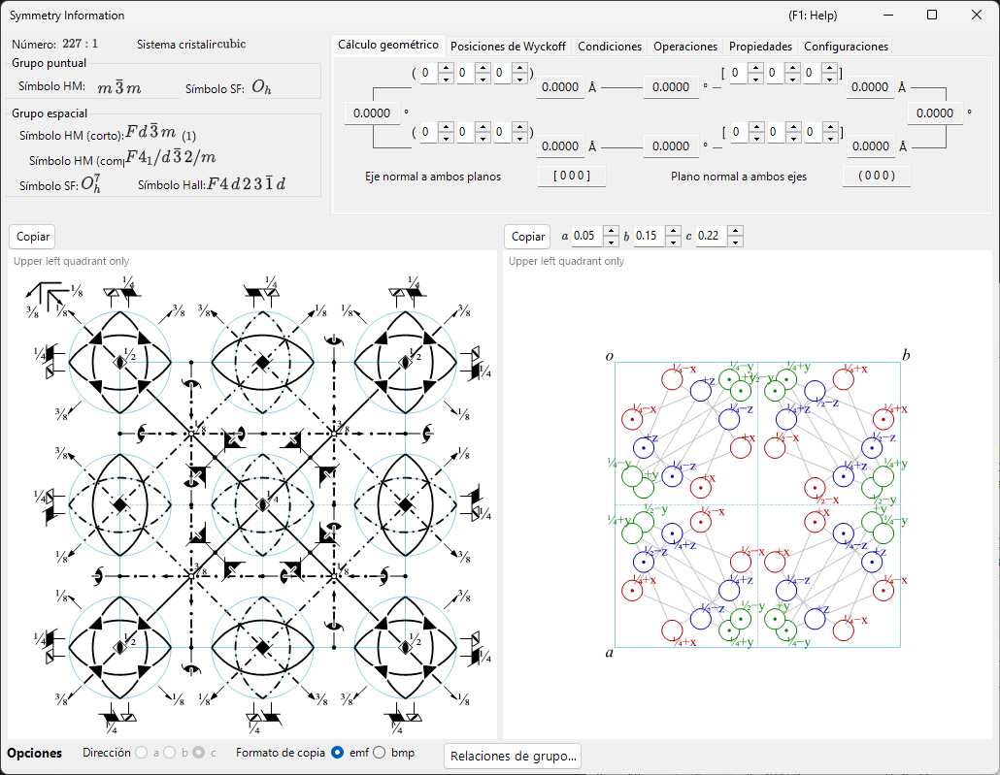
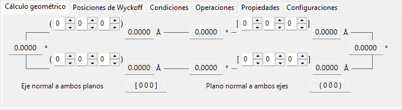
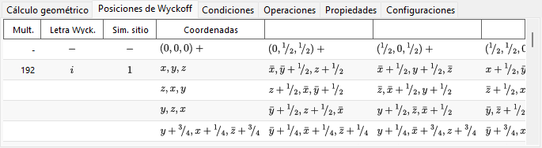
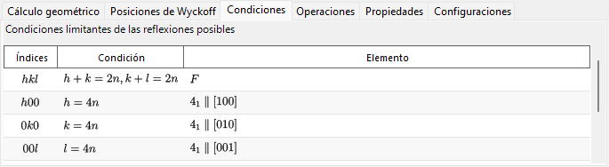
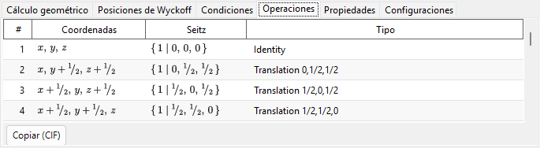
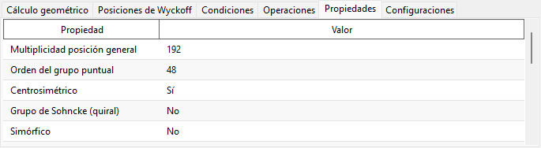
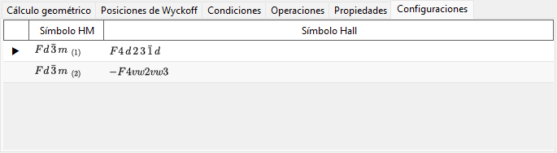

# Información de simetría

**Información de simetría** muestra información detallada sobre la simetría del grupo espacial del cristal seleccionado y, además, representa diagramas esquemáticos de los elementos de simetría y de las posiciones generales al estilo de las *International Tables for Crystallography* Vol. A.

La ventana se divide en un área de identidad del grupo espacial (arriba a la izquierda), un área de cálculo/tabla con pestañas (arriba a la derecha) y dos diagramas esquemáticos (abajo).

!!! tip "Teoría de la simetría (Apéndice A4)"
    Qué codifica realmente un símbolo de Hermann–Mauguin/Hall/Schoenflies, las clasificaciones de teoría de grupos de la pestaña **Propiedades** (centrosimétrico, Sohncke, simórfico, polar, …), el significado de los diagramas de elementos de simetría y de posiciones generales de la parte inferior, y las relaciones grupo-subgrupo que muestra **Relaciones de grupo…**: todo ello se explica en el **[Apéndice A4. Simetría y grupos espaciales](appendix/a4-symmetry-space-groups/index.md)**.

---

## Atajos de teclado y ratón

Esta ventana no tiene combinaciones especiales de teclas o ratón. <kbd>F1</kbd> abre esta página del manual, y los dos botones **Copiar** colocan el diagrama de elementos de simetría y el diagrama de posiciones generales en el portapapeles (como **emf** vectorial o **bmp** rasterizado, según lo elegido en **Formato de copia**).

→ Consulte **[21. Atajos de teclado y ratón](21-shortcuts.md)** para ver todas las ventanas de un vistazo.

---

## Identidad del grupo espacial

El panel superior izquierdo enumera, para el grupo espacial actual:

- **Número** (1–230) y el índice de configuración (setting)
- **Sistema cristalino**
- **Grupo puntual** : símbolos de Hermann–Mauguin (HM) y de Schoenflies (SF)
- **Grupo espacial** : símbolo HM (corto), símbolo HM (completo), símbolo SF y **símbolo Hall**

---

## Cálculo geométrico

Introduzca dos planos cristalinos \((h_1, k_1, l_1)\), \((h_2, k_2, l_2)\) o dos índices de dirección \([u_1, v_1, w_1]\), \([u_2, v_2, w_2]\) para obtener:

- el espaciado d de cada plano / la longitud de cada eje,
- el ángulo entre los dos planos (o los dos ejes),
- **el índice de dirección normal a ambos planos** y **el índice de plano normal a ambos ejes**.

Estos cálculos respetan la métrica de la celda elemental actual.

---

## Posiciones de Wyckoff

Enumera cada posición de Wyckoff con su multiplicidad, su letra de Wyckoff, su simetría de sitio y si se trata de una posición general o especial. En el caso de las redes centradas, los vectores de traslación de la red se muestran en la fila de cabecera.

---

## Condiciones

Las condiciones de reflexión que surgen del centrado de la red y de los operadores de simetría de deslizamiento y helicoidales.

---

## Operaciones

Enumera cada operación de simetría de la posición general (con las traslaciones de centrado de la red ya expandidas) como triplete de coordenadas, símbolo de Seitz y tipo geométrico en lenguaje llano (p. ej. *"3-fold rotation"*, *"c-glide plane"*, *"screw axis"*). **Copiar (CIF)** copia la lista completa al portapapeles como un bucle CIF `_space_group_symop_operation_xyz`.

→ Véase el **[Apéndice A4.1](appendix/a4-symmetry-space-groups/symbols-and-diagrams.md#operaciones-de-simetría-pestaña-operaciones)** para saber cómo leer estas tres notaciones.

---

## Propiedades

Presenta las clasificaciones de teoría de grupos del grupo espacial actual (multiplicidad de la posición general, orden del grupo puntual, centrosimétrico, Sohncke, simórfico, dirección polar, pareja enantiomorfa, familia cristalina/sistema reticular/tipo de Bravais, clase cristalina aritmética, simetría de Patterson) y qué propiedades físicas macroscópicas (piroelectricidad/ferroelectricidad, piezoelectricidad, generación de segundo armónico, actividad óptica) están permitidas por esa simetría.

→ Véase el **[Apéndice A4.1](appendix/a4-symmetry-space-groups/symbols-and-diagrams.md#clasificación-según-la-teoría-de-grupos-pestaña-propiedades)** para el significado de cada término.

---

## Configuraciones

Enumera, a título de referencia, todas las elecciones tabuladas de origen y de configuración de ejes que comparten el número IT del grupo espacial actual, cada una con su símbolo HM y su símbolo Hall; la configuración mostrada actualmente aparece marcada. Seleccionar una fila no cambia el cristal.

---

## Diagramas de elementos de simetría y de posiciones generales

Los dos paneles inferiores reproducen los diagramas esquemáticos de simetría del grupo espacial en la notación de las *International Tables for Crystallography* Vol. A.

- **Elementos de simetría (izquierda)**: los ejes de rotación/helicoidales, los planos de espejo/deslizamiento y los centros de inversión/puntos de rotoinversión se dibujan con los símbolos gráficos convencionales.
  - Para la red \(F\) del sistema cúbico, solo se muestra un octavo de la celda elemental (únicamente el cuadrante superior izquierdo).
  - Estos elementos de simetría también pueden dibujarse directamente sobre el modelo 3D en el [Visor de estructura](5-structure-viewer.md).
- **Posiciones generales (derecha)**: las posiciones equivalentes generales se representan como círculos (una coma denota una imagen especular), anotadas con sus coordenadas fraccionarias.
  - Solo para el sistema cúbico, líneas auxiliares conectan los tres círculos relacionados por un eje de rotación de orden 3.

Controles debajo de los diagramas:

- **Dirección** (`a` / `b` / `c`) : elija el eje cristalino a lo largo del cual proyectar.
- **Copiar** : copia cada diagrama al portapapeles en el formato seleccionado en **Formato de copia** (**emf** vectorial / **bmp** rasterizado); el emf puede desagruparse y editarse en PowerPoint.
- **Relaciones de grupo…** abre un explorador de las relaciones de subgrupos maximales/supergrupos minimales del grupo espacial actual. Véase el [Apéndice A4.2](appendix/a4-symmetry-space-groups/group-subgroup-relations.md) para saber cómo leerlo.

---

## Véase también

- [Base de datos de cristales](1-crystal-database.md)
- [Visor de estructura](5-structure-viewer.md)
- [Estereograma](6-stereonet.md)
- [Geometría de rotación](4-rotation-geometry.md)
- [Ventana principal](0-main-window.md)
- [Apéndice A4. Simetría y grupos espaciales](appendix/a4-symmetry-space-groups/index.md) — los fundamentos cristalográficos y de teoría de grupos detrás de cada pestaña y diagrama de esta página.
