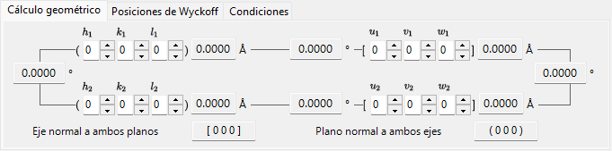
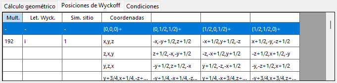
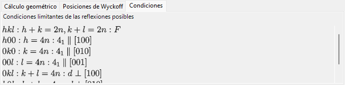
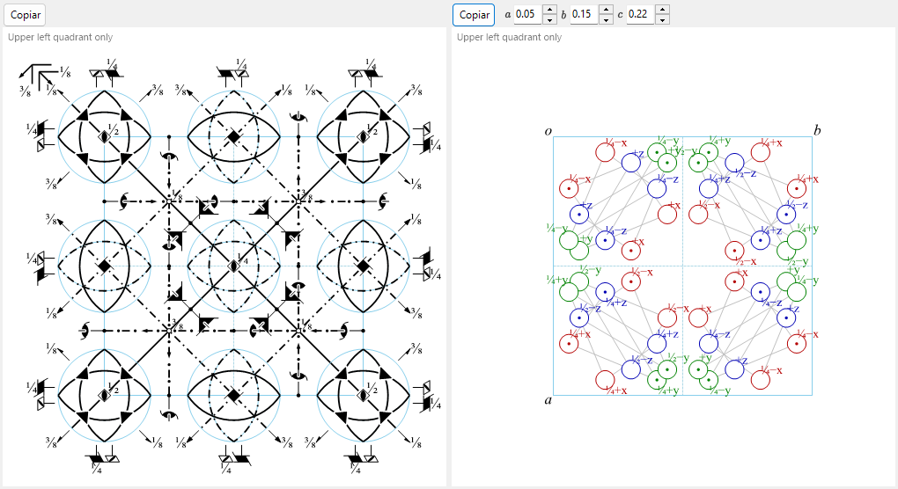

# Información de simetría

**Información de simetría** muestra información detallada sobre la simetría del grupo espacial del cristal seleccionado y, además, representa diagramas esquemáticos de los elementos de simetría y de las posiciones generales al estilo de las *International Tables for Crystallography* Vol. A.

La ventana se divide en un área de identidad del grupo espacial (arriba a la izquierda), un área de cálculo/tabla con pestañas (arriba a la derecha) y dos diagramas esquemáticos (abajo).

---

## Atajos de teclado y ratón

Esta ventana no tiene combinaciones especiales de teclas o ratón. <kbd>F1</kbd> abre esta página del manual, y los dos botones **Copy** colocan el diagrama de elementos de simetría y el diagrama de posiciones generales en el portapapeles (como mapa de bits, o como EMF vectorial cuando **EMF** está marcado).

→ Consulte **[21. Atajos de teclado y ratón](21-shortcuts.md)** para ver todas las ventanas de un vistazo.

---

## Identidad del grupo espacial

El panel superior izquierdo enumera, para el grupo espacial actual:

- **Number** (1–230) y el índice de configuración (setting)
- **Crystal System**
- **Point Group** : símbolos de Hermann–Mauguin (HM) y de Schoenflies (SF)
- **Space Group** : símbolo corto HM, símbolo completo HM, símbolo SF y **Hall symbol**

---

## Cálculo geométrico

Introduzca dos planos cristalinos \((h_1, k_1, l_1)\), \((h_2, k_2, l_2)\) o dos índices de dirección \([u_1, v_1, w_1]\), \([u_2, v_2, w_2]\) para obtener:

- el espaciado d de cada plano / la longitud de cada eje,
- el ángulo entre los dos planos (o los dos ejes),
- **el índice de dirección normal a ambos planos** y **el índice de plano normal a ambos ejes**.

Estos cálculos respetan la métrica de la celda elemental actual.

---

## Posiciones de Wyckoff

Enumera cada posición de Wyckoff con su multiplicidad, su letra de Wyckoff, su simetría de sitio y si se trata de una posición general o especial. En el caso de las redes centradas, los vectores de traslación de la red se muestran en la fila de cabecera.

---

## Condiciones

Las condiciones de reflexión que surgen del centrado de la red y de los operadores de simetría de deslizamiento/tornillo.

---

## Diagramas de elementos de simetría y de posiciones generales

Los dos paneles inferiores reproducen los diagramas esquemáticos de simetría del grupo espacial en la notación de las *International Tables for Crystallography* Vol. A.

- **Elementos de simetría (izquierda)**: los ejes de rotación/tornillo, los planos de espejo/deslizamiento y los centros de inversión/puntos de rotoinversión se dibujan con los símbolos gráficos convencionales.
  - Para la red \(F\) del sistema cúbico, solo se muestra un octavo de la celda elemental (únicamente el cuadrante superior izquierdo).
  - Estos elementos de simetría también pueden dibujarse directamente sobre el modelo 3D en el [Visor de estructura](5-structure-viewer.md).
- **Posiciones generales (derecha)**: las posiciones equivalentes generales se representan como círculos (una coma denota una imagen especular), anotadas con sus coordenadas fraccionarias.
  - Solo para el sistema cúbico, líneas auxiliares conectan los tres círculos relacionados por un eje de rotación de orden tres.

Controles debajo de los diagramas:

- **Direction** (`a` / `b` / `c`) : elija el eje cristalino a lo largo del cual proyectar.
- **Copy** cada diagrama al portapapeles como imagen vectorial (**EMF**) o imagen rasterizada (**BMP**); el EMF puede desagruparse y editarse en PowerPoint.

---

## Véase también

- [Base de datos de cristales](1-crystal-database.md)
- [Visor de estructura](5-structure-viewer.md)
- [Estereograma](6-stereonet.md)
- [Geometría de rotación](4-rotation-geometry.md)
- [Ventana principal](0-main-window.md)
