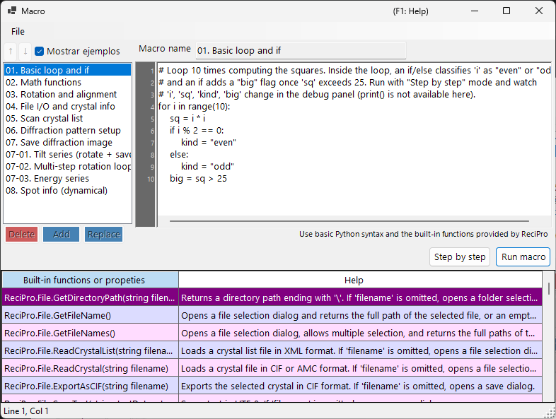

# Macro

ReciPro incluye un sistema de macros basado en **IronPython** para automatizar operaciones con cristales, simulaciones de difracción y simulaciones de imágenes mediante scripts.



En la captura de pantalla anterior, **Show samples** está activado, por lo que se muestran las macros de ejemplo integradas. La lista de macros está a la izquierda, el editor de código a la derecha y una tabla de ayuda de las funciones integradas en la parte inferior.

---

## Atajos de teclado y ratón

| Atajo | Acción |
|----------|--------|
| <kbd>F1</kbd> | Abrir esta página del manual en línea |
| <kbd>CTRL</kbd>+<kbd>S</kbd> | Guardar el texto del editor de vuelta en la entrada seleccionada de la lista de macros |
| <kbd>F10</kbd> | Avanzar un paso (durante la ejecución paso a paso) |
| Doble clic en una fila de la lista de ayuda de funciones | Insertar la firma de esa función en el cursor |
| Soltar un archivo `.mcr` sobre la ventana | Cargarlo en el editor |

**Run**, **Step** y **Stop** son botones (sin acelerador de teclado).

→ Consulte **[21. Atajos de teclado y ratón](../21-shortcuts.md)** para ver todas las ventanas de un vistazo.

---

## Resumen

Las macros se escriben con sintaxis de Python. Utilizando las clases y funciones integradas de ReciPro, puede realizar mediante programación las mismas operaciones disponibles a través de la GUI.

- **Lenguaje**: Python 3 (IronPython 3.4)
- **Almacenamiento**: Binario comprimido en el Registro de Windows (persiste entre sesiones)
- **Acceso**: Haga clic en el botón Macro de la ventana principal para abrir el editor de macros

---

## Ventana del editor

El editor de macros tiene cuatro áreas principales:

| Área | Propósito |
|------|---------|
| **Lista de macros** (izquierda) | Macros almacenadas. `Add` añade una nueva macro, `Replace` sobrescribe la seleccionada, `Delete` la elimina. Up/Down reordenan. |
| **Campo de nombre** (arriba) | Identificador de la macro que se está editando. |
| **Área de código** (derecha) | Editor de código Python con margen de números de línea, sangría automática y ventana emergente de ayuda de sintaxis. |
| **Tabla de funciones integradas** (abajo) | Lista de las funciones/propiedades integradas que proporciona ReciPro, cada una con una descripción de ayuda. Una referencia mientras se escribe código. |
| **Barra de estado** (parte inferior) | Muestra la posición actual del cursor como `Line N, Col M`. |
| **Panel de depuración** (visible durante la ejecución Step) | Lista las variables locales en la línea actual. |

La barra de título muestra **`Macro*`** (con un asterisco) mientras haya cambios sin guardar, y vuelve a **`Macro`** tras Add / Replace / <kbd>CTRL</kbd>+<kbd>S</kbd>.

### Macros de ejemplo

Al activar **Show samples** (arriba a la izquierda), su lista de macros se reemplaza temporalmente por las macros de ejemplo integradas (bucles y condicionales básicos, funciones matemáticas, rotación/alineación, recorrido de la lista de cristales, simulación de difracción/imagen, series de inclinación/energía, información de reflexiones y más). Los ejemplos son de solo lectura y se muestran en el idioma actual de la interfaz; utilícelos para aprender o como punto de partida para copiar. Al desactivarlo se restauran sus propias macros.

---

## Funciones de edición

- **Sangría automática**: Cuando pulsa <kbd>ENTER</kbd>, la siguiente línea hereda los espacios iniciales de la línea actual. Si la línea termina con `:` (tras `def`/`if`/`for`/etc.), se añade automáticamente un nivel de sangría adicional (4 espacios).
- **Retroceso inteligente**: Dentro de los espacios iniciales, <kbd>BACKSPACE</kbd> elimina un nivel de sangría completo (4 espacios) en lugar de un solo carácter.
- **<kbd>TAB</kbd> / <kbd>SHIFT</kbd>+<kbd>TAB</kbd>**:
  - Sin selección: insertar / quitar un nivel de sangría en el cursor.
  - Selección de varias líneas: sangrar / quitar sangría de todas las líneas seleccionadas a la vez.
- **Autocompletado**: A medida que escribe, una ventana emergente lista los nombres de funciones y las palabras clave del lenguaje que coinciden. Las teclas de flecha navegan, <kbd>ENTER</kbd> o <kbd>TAB</kbd> acepta, <kbd>ESC</kbd> cancela.
- **Ayuda mediante tooltip**: Al pasar el ratón sobre una entrada de autocompletado seleccionada se muestra su documentación.

### Atajos de teclado

| Atajo | Acción |
|----------|--------|
| <kbd>CTRL</kbd>+<kbd>S</kbd> | Guardar el código actual en la entrada de macro seleccionada (en el sitio) |
| <kbd>F10</kbd> | Avanzar a la siguiente línea (durante la ejecución Step) |
| <kbd>ENTER</kbd> | Insertar salto de línea con sangría automática |
| <kbd>TAB</kbd> / <kbd>SHIFT</kbd>+<kbd>TAB</kbd> | Sangrar / quitar sangría |
| <kbd>BACKSPACE</kbd> | Eliminar un nivel de sangría si está dentro de los espacios iniciales |
| <kbd>CTRL</kbd>+<kbd>↑</kbd> / <kbd>CTRL</kbd>+<kbd>↓</kbd> | No disponible — use los botones Up/Down para reordenar las macros |

---

## Ejecución de macros

Dos modos de ejecución:

- **Run macro**: Ejecuta el código hasta el final. Los errores muestran un cuadro de diálogo con el traceback de Python y resaltan la línea problemática en el editor.
- **Step by step**: Pausa antes de cada línea. El panel de depuración muestra las variables locales. Use <kbd>F10</kbd> (o el botón **Next step (F10)**) para avanzar, o **Stop** para abortar.

**Stop** solo funciona en el modo Step (la ejecución normal de Run macro no se puede interrumpir porque IronPython no respeta `CancellationToken` y todo se ejecuta en el hilo de la interfaz).

---

## Compatibilidad con el lenguaje Python

Este entorno de macros es **IronPython 3.4**. No todas las características de Python tienen sentido aquí.

### Importado previamente

- **`math`** se importa al inicio. Use `math.sqrt(x)`, `math.sin(x)`, `math.pi`, `math.radians(deg)`, etc. directamente.

### Utilizable

- Control de flujo: `if`/`elif`/`else`, `for`, `while`, `def`, `class`, `return`, `try`/`except`/`finally`, `pass`, `break`, `continue`, `lambda`
- Literales: `True`, `False`, `None`
- Funciones integradas: `len`, `range`, `abs`, `min`, `max`, `sum`, `sorted`, `enumerate`, `zip`, `int`, `float`, `str`, `list`, `dict`, `tuple`, `type`, `isinstance`
- Módulos de la biblioteca estándar que son Python puro: `random`, `datetime`, `time`, `re`, `json`, `itertools`, `functools`, `collections`

Estos elementos básicos están registrados previamente en la ventana emergente de autocompletado, por lo que puede descubrirlos escribiendo las primeras letras.

### NO utilizable

- **`print()`** : no hay ventana de consola; la salida no va a ninguna parte. Use **Step by step** y observe el panel de depuración para inspeccionar valores.
- **`input()`** : no hay stdin.
- **E/S de archivos** (`open`, `with open`) : no está pensado para macros. Use en su lugar los ayudantes `ReciPro.File.*`.
- **Paquetes de extensión en C**: `numpy`, `scipy`, `pandas`, `matplotlib` — no compatibles con IronPython.

---

## Acceso a la API

La API de macros de ReciPro se expone bajo el nombre de nivel superior **`ReciPro`**. Cada clase integrada es un campo de `ReciPro`:

```python
ReciPro.File.*         # File I/O helpers
ReciPro.Crystal.*      # Currently selected crystal
ReciPro.CrystalList.*  # Manage the crystal list
ReciPro.Dir.*          # Crystal orientation (Euler, zone-axis, rotation)
ReciPro.DifSim.*       # Diffraction simulator
ReciPro.HRTEM.*        # HRTEM simulation
ReciPro.STEM.*         # STEM simulation
ReciPro.Potential.*    # Potential simulation
ReciPro.Sleep(ms)      # Pause execution (milliseconds)
```

La ventana emergente de autocompletado siempre muestra la forma completa `ReciPro.Class.Member` y la inserta literalmente, por lo que rara vez necesita escribir el prefijo a mano.

Consulte [20.1. Funciones integradas](1-built-in-functions.md) para la referencia completa de la API.

---

## Mensajes de error

Cuando una macro falla, un cuadro de diálogo muestra el traceback de Python en el formato estándar:

```
Traceback (most recent call last):
  File "<string>", line 5, in <module>
NameError: name 'abc' is not defined
```

El editor selecciona automáticamente la línea indicada en el traceback (el marco más interno), de modo que puede corregir el problema de inmediato. Los errores de sintaxis también se notifican con números de línea, antes de que comience la ejecución.

---

## Véase también

- [20.1. Funciones integradas](1-built-in-functions.md)
- [20.2. Ejemplos](2-examples.md)
