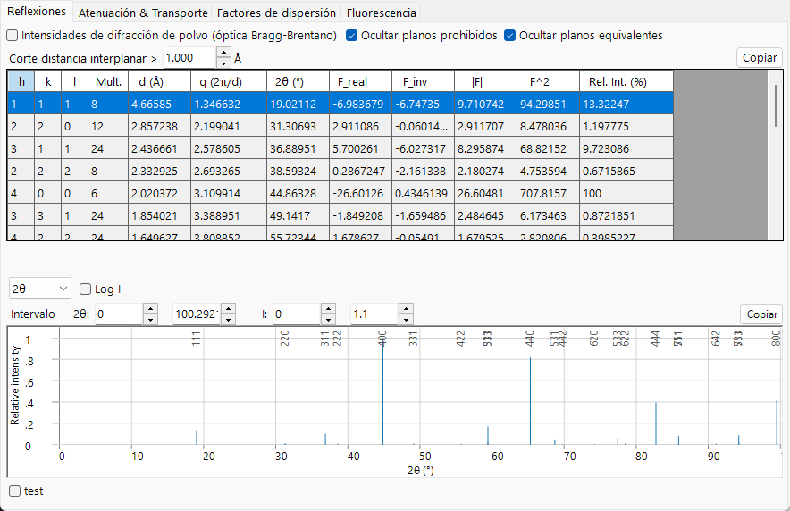
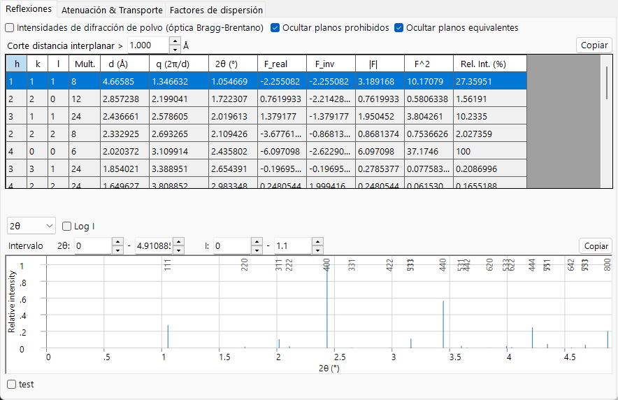
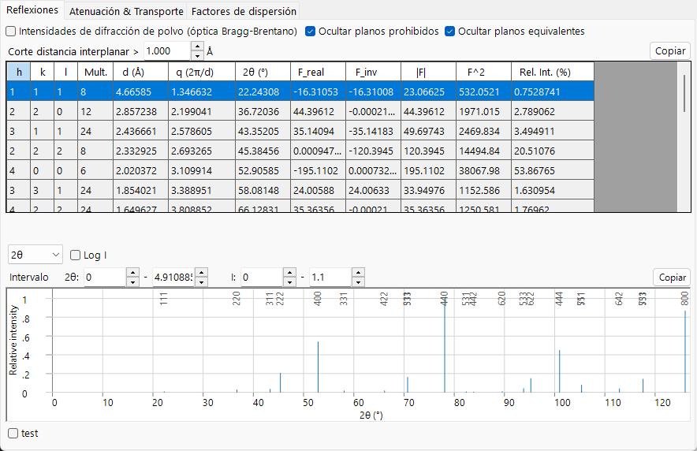
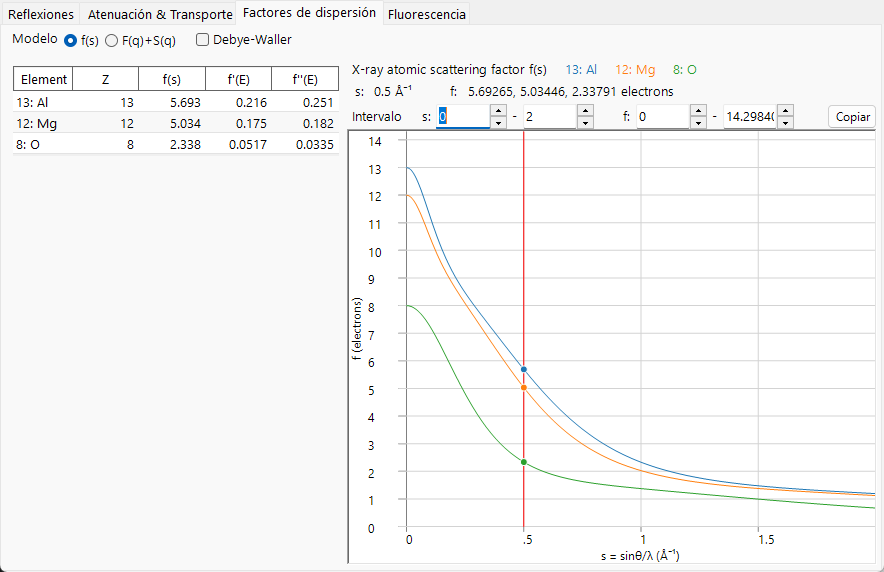
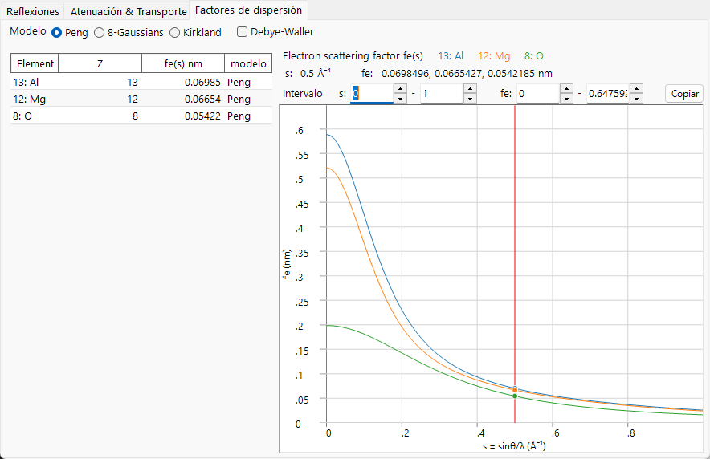
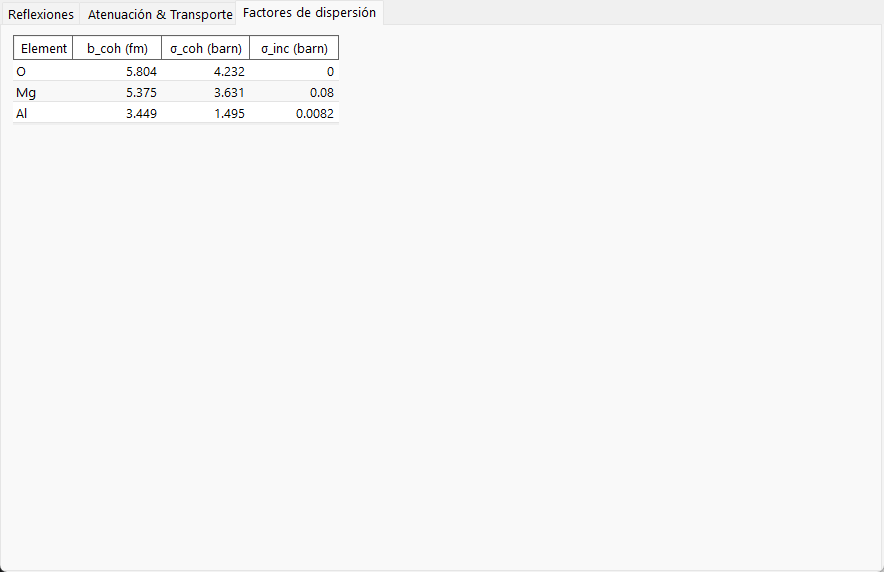
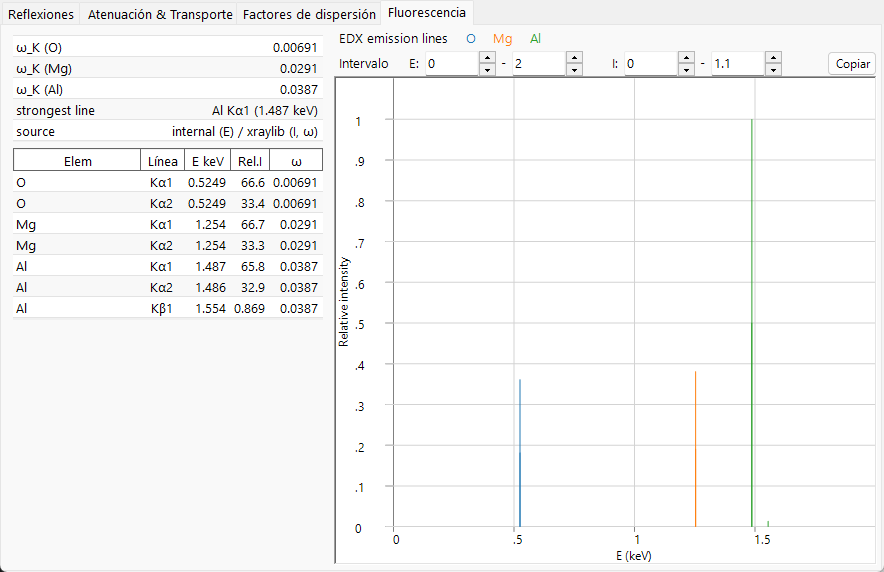

# Interacción del haz

La **Interacción del haz** describe cómo el cristal seleccionado interactúa con un haz incidente de **rayos X, electrones o neutrones**. Para una radiación elegida calcula las reflexiones permitidas y sus factores de estructura, la atenuación y el transporte del haz a través del material, los factores de dispersión atómica de cada elemento y (para rayos X) las líneas de fluorescencia características. Cambiar el tipo de radiación en la parte superior recalcula todo, de modo que el mismo cristal puede compararse entre técnicas de difracción y de espectroscopía.

El haz incidente se selecciona en la banda situada en la parte superior de la ventana; las cuatro pestañas inferiores — **Reflections**, **Attenuations & Transport**, **Scattering factors** y **Fluorescence** — muestran los distintos aspectos de la interacción. Cada sección de pestaña a continuación muestra la pestaña bajo los haces **X-ray / Electron / Neutron** (use las pestañas de cada figura); el contenido cambia notablemente según el haz.

!!! tip "Fundamentos de estado sólido (Apéndice A2)"
    La dispersión y la física del estado sólido detrás de estas cuatro pestañas — los factores de dispersión atómica, el factor de estructura, la atenuación y el transporte del haz, y la fluorescencia — se explican en **[Apéndice A2. Interacción del haz (fundamentos de estado sólido)](appendix/a2-beam-interaction/index.md)**.

!!! note "Datos de rayos X y la biblioteca xraylib incluida"
    Muchas de las magnitudes de rayos X (dispersión anómala $f'/f''$, la separación de dispersión $F(q)+S(q)$, el desglose foto / Rayleigh / Compton de la atenuación másica, los saltos en los bordes de absorción y los rendimientos de fluorescencia) se evalúan con la biblioteca **[xraylib](https://github.com/tschoonj/xraylib)** incluida. Si xraylib no está disponible, ReciPro recurre a sus tablas internas (atenuación solo por fotoabsorción, solo energías de líneas características) y las celdas afectadas muestran **N/A**. La fila **source** de cada tabla indica qué conjunto de datos se utilizó.

---

## Atajos de teclado y ratón

Esta ventana no tiene combinaciones de teclas especiales. <kbd>F1</kbd> abre esta página del manual. En la pestaña **Scattering factors** se puede **arrastrar** la línea vertical del cursor para leer el factor de dispersión de cada elemento en esa posición, y cada pestaña tiene un botón **Copy** que exporta su tabla como texto pegable en una hoja de cálculo.

→ Consulte **[21. Atajos de teclado y ratón](21-shortcuts.md)** para ver todas las ventanas de un vistazo.

---

## Haz y longitud de onda {#reflections-tab}

La banda superior es un **Wave Length Control** compartido con los demás simuladores.

- **X-ray / Electron / Neutron** : los factores de dispersión atómica y la física de la interacción difieren según el tipo de haz incidente, por lo que se conmutan aquí.
- Para **X-ray**, elegir el **Element** (material del ánodo) y la línea característica (Kα, etc.) fija automáticamente la longitud de onda de ese rayo X característico.
- **Energy (keV)** y **Wavelength (Å)** están enlazados; al fijar uno se actualiza el otro, y ambos determinan el 2θ usado en la tabla **Reflections**.
- **Unit (Å / nm)** cambia la unidad de longitud usada para los espaciados d y magnitudes similares.

El haz elegido también decide qué pestañas y curvas tienen sentido:

| Haz | Reflections | Attenuations & Transport | Scattering factors | Fluorescence |
|------|------|------|------|------|
| **X-ray** | factores de estructura incl. dispersión anómala | µ/ρ, µ, transmisión + bordes de absorción (frente a energía) | $f(s)$ o $F(q)+S(q)$ | líneas características + barras EDX |
| **Electron** | factores de estructura electrónicos | σ, MFP, \|dE/ds\|, IMFP, alcance (frente a energía) | Peng / Kirkland / 8-Gaussians | — (oculta) |
| **Neutron** | factores de estructura nucleares | longitudes de dispersión y secciones eficaces (sin curva de energía) | longitudes de dispersión (sin dependencia de *s*) | — (oculta) |

La pestaña **Fluorescence** es exclusiva de rayos X y desaparece para los haces de electrones y neutrones. Para neutrones, las gráficas dependientes de la energía en **Attenuations & Transport** y **Scattering factors** se sustituyen por tablas de elementos, porque la longitud de dispersión nuclear no depende del ángulo de dispersión ni de la energía.

---

## Pestaña Reflections

Enumera los planos cristalinos permitidos (reflexiones) del cristal y el **factor de estructura** y la intensidad de difracción de cada uno. Para rayos X, el factor de estructura ahora incluye los términos de **dispersión anómala** $f'/f''$ a la energía actual, de modo que `F_inv` (la parte imaginaria) es en general distinta de cero cerca de un borde de absorción. La disposición es la misma para todos los haces; solo cambian los valores del factor de estructura y el 2θ de cada reflexión.

=== "X-ray"
    

=== "Electron"
    

=== "Neutron"
    

**Options**

- **Powder Diffraction Intensities (Bragg-Brentano Optics)** : calcula la intensidad relativa como una intensidad de difracción de polvo (Bragg–Brentano), incluyendo la multiplicidad y el factor de Lorentz–polarización. Cuando está desactivado, muestra la intensidad del factor de estructura. Activarlo también fuerza *Hide equivalent planes* y *Hide prohibited planes*.
- **Hide equivalent planes** : agrupa los planos cristalográficamente equivalentes en una sola entrada.
- **Hide prohibited planes** : excluye los planos cuya intensidad es nula por las reglas de extinción.
- **d-Spacing Cutoff >** : excluye las reflexiones con un espaciado d menor que este valor (la unidad de longitud sigue la selección de **Unit**).

Cada fila es una reflexión (o un grupo de planos equivalentes por simetría):

| Columna | Significado |
|------|------|
| **h, k, l** | índices de Miller |
| **Multi.** | multiplicidad (número de planos equivalentes por simetría) |
| **d (Å)** | espaciado interplanar |
| **q (2π/d)** | módulo del vector de dispersión |
| **2θ (°)** | ángulo de difracción para la longitud de onda seleccionada |
| **F_real** | parte real del factor de estructura |
| **F_inv** | parte imaginaria del factor de estructura (distinta de cero con dispersión anómala de rayos X) |
| **\|F\|** | amplitud del factor de estructura ($= \sqrt{F_\text{real}^2 + F_\text{inv}^2}$) |
| **F^2** | intensidad del factor de estructura ($\lvert F\rvert^2$) |
| **Rel. Int. (%)** | intensidad relativa, con la reflexión más intensa fijada en 100 |

**Gráfica de picos de difracción.** Bajo la tabla, las mismas reflexiones se dibujan como un patrón de barras, con los picos más intensos etiquetados por su *hkl*.

- El selector del eje horizontal elige entre **2θ** (ángulo de dispersión en grados), **d** (espaciado de planos reticulares) y **Q** ($= 4\pi\sin\theta/\lambda$, el vector de dispersión / transferencia de momento). Las tres opciones describen las mismas reflexiones; solo cambia la escala horizontal.
- **Log I** conmuta el eje de intensidad entre lineal y logarítmico. Las intensidades de difracción abarcan muchos órdenes de magnitud, por lo que una escala logarítmica estira la parte inferior para revelar los picos débiles que una escala lineal aplana contra la línea de base.
- Los campos **Range** establecen el intervalo horizontal y de intensidad representado.

---

## Pestaña Attenuations & Transport

Hasta qué profundidad penetra el haz en el material y cómo pierde energía. El contenido depende del haz.

=== "X-ray"
    

=== "Electron"
    

=== "Neutron"
    

### X-ray

Los botones de opción eligen el coeficiente representado frente a la energía del fotón (1–60 keV, eje logarítmico):

- **µ/ρ** — el coeficiente de atenuación **másico** (cm²/g): con qué intensidad el material elimina rayos X por gramo, independientemente de lo densamente que esté empaquetado (este es el valor que se encuentra en las tablas de referencia). La gráfica muestra el **total** junto con sus componentes **photo**, **Rayleigh** y **Compton**.
- **µ** — el coeficiente de atenuación **lineal** $\mu = (\mu/\rho)\cdot\rho$ (cm⁻¹): la atenuación por centímetro del material real a su densidad real. La intensidad transmitida sigue $I = I_0\,e^{-\mu t}$, y $1/\mu$ es la distancia en la que la intensidad cae a aproximadamente el 37 % (1/e).
- **T %** — la **transmisión** $T = e^{-\mu t}$ en porcentaje para el espesor de muestra **t** fijado en el campo **Thickness t** (µm). 100 % = transparente, 0 % = totalmente bloqueado; úselo para juzgar un espesor de muestra razonable a la energía actual.

Las líneas verticales marcan la energía actual y los **bordes de absorción** de cada elemento. La tabla escalar de la izquierda enumera, a la energía actual: **µ/ρ (total)**, **µ (linear)**, **Attenuation length** ($1/\mu$), **HVL** (capa hemirreductora, $\ln 2/\mu$), **Transmission** al espesor *t*, **µ_en/ρ** (coeficiente de absorción de energía másico), los decrementos del índice de refracción de rayos X **δ** y **β** ($n = 1-\delta+i\beta$), el ángulo **θc (critical)** de reflexión externa total y la **X-ray SLD** real (densidad de longitud de dispersión). La tabla inferior enumera las energías de los **bordes** de absorción **K** y **L3** y sus relaciones de **Jump** para cada elemento.

### Electron

El selector de magnitud elige qué se representa frente a la energía del haz (1–30 keV):

- **All (normalized)** — superpone las tres curvas siguientes, cada una reescalada a su propio máximo para que las formas puedan compararse en una sola gráfica (lea los valores absolutos en la tabla).
- **σ elastic (nm²)** — sección eficaz de dispersión elástica: la probabilidad de que un solo átomo desvíe el electrón.
- **Elastic MFP (nm)** — recorrido libre medio: la distancia media que recorre el electrón entre sucesos de dispersión elástica.
- **|dE/ds| (keV/nm)** — magnitud del poder de frenado: la energía que el electrón pierde por nanómetro de recorrido.
- **IMFP (nm)** — recorrido libre medio inelástico: la distancia media entre colisiones con pérdida de energía.
- **Range CSDA (µm)** — la longitud total del camino que recorre el electrón antes de detenerse.

La tabla escalar enumera la **wavelength** del electrón, **σ elastic**, **Elastic MFP**, **|dE/ds|**, **IMFP**, la **Plasma E** y la energía media de excitación **J**, dos **ranges** del electrón (la estimación de penetración de Kanaya–Okayama y la longitud de camino integrada CSDA), y los valores medios **Z, A**. La tabla por elemento da la fracción atómica de cada elemento y la sección eficaz elástica σ. Las secciones eficaces elásticas usan los datos **NIST Mott** (50 eV–36 keV) y recurren a **screened Rutherford** por encima de 36 keV.

### Neutron {#scattering-factors-tab}

La interacción del neutrón se fija mediante secciones eficaces nucleares en lugar de una curva dependiente de la energía, por lo que esta pestaña muestra solo tablas. La tabla escalar enumera la longitud de dispersión coherente media **b̄**, la **Coherent SLD**, las secciones eficaces promediadas coherente / incoherente / de absorción / total (**σ̄_coh**, **σ̄_incoh**, **σ̄_abs**, **σ̄_total**), la sección eficaz total macroscópica **Σ_total** y la **attenuation length** correspondiente. La sección eficaz de absorción se evalúa con la ley 1/v a la longitud de onda actual; los núclidos en los que esto no es válido (Cd, Sm, Eu, Gd, absorbentes resonantes) se señalan. La tabla por elemento enumera **b_coh**, **σ_coh** y la fracción atómica.

---

## Pestaña Scattering factors {#fluorescence-tab}

El factor de dispersión atómica de cada elemento constituyente, representado frente a $s = \sin\theta/\lambda$ (Å⁻¹). Cada elemento se dibuja en su propio color, y se puede arrastrar la **línea vertical del cursor** para leer el factor de dispersión de cada elemento en esa posición en la tabla de la izquierda.

=== "X-ray"
    

=== "Electron"
    

=== "Neutron"
    

- **X-ray** ofrece dos modos **Model**: **f(s)** representa el factor de dispersión atómica de rayos X convencional (en unidades de electrón); **F(q)+S(q)** representa el factor de forma **coherente** de Rayleigh $F(q)$ junto con la función de dispersión **incoherente** de Compton $S(q)$ (de xraylib). La tabla también enumera los términos de dispersión anómala **f'(E)** y **f''(E)** a la energía actual.
- **Electron** ofrece tres parametrizaciones del factor de dispersión electrónico: **Peng**, **Kirkland** y **8-Gaussians**. La tabla muestra $f_e(s)$ (nm) y qué **model** lo produjo.
- Las longitudes de dispersión **Neutron** no dependen de $s$, por lo que no se dibuja ninguna curva; la tabla enumera, para cada elemento, la longitud de dispersión coherente **b_coh** y sus secciones eficaces coherente / incoherente.
- **Debye-Waller** multiplica cada factor por la amortiguación térmica $e^{-B s^2}$ usando el parámetro de desplazamiento isótropo de cada átomo.

---

## Pestaña Fluorescence

Para un haz de rayos X, la emisión de **fluorescencia** característica de la muestra. (Esta pestaña está oculta para los haces de electrones y neutrones.)

La gráfica **EDX emission lines** dibuja las líneas características (Kα1, Kα2, Kβ1, Lα1, Lα2, Lβ1) de cada elemento como barras a sus energías de fotón, con la altura proporcional a fracción atómica × tasa radiativa × rendimiento de fluorescencia (una vista previa cualitativa de estilo EDX; no se modelan la sección eficaz de excitación ni la eficiencia del detector). La tabla inferior enumera, por línea, el elemento, el nombre de la línea, la energía **E keV**, la intensidad relativa **Rel.I** y el rendimiento de fluorescencia **ω**. La tabla escalar indica el rendimiento de la capa K **ω_K** de cada elemento y la **strongest line** del espectro.

---

## Copiar al portapapeles

Cada pestaña tiene un botón **Copy** que copia su tabla al portapapeles como texto que puede pegarse en una hoja de cálculo como Excel.

---

## Véase también

- [Base de datos de cristales](1-crystal-database.md) — definición del cristal cuya interacción se calcula.
- [Simulador de difracción](7-diffraction-simulator/index.md) — simulación de patrones de difracción usando los factores de estructura.
- [Apéndice A2. Interacción del haz (fundamentos de estado sólido)](appendix/a2-beam-interaction/index.md) — la dispersión y la física del estado sólido detrás de cada pestaña.
