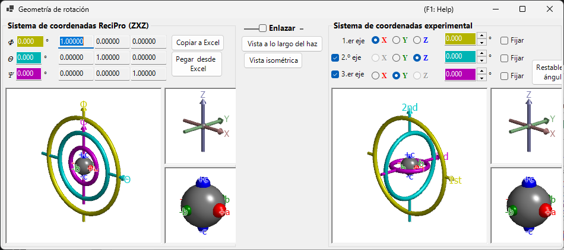

# Geometría de rotación

Esta ventana representa el estado de rotación de un cristal como una matriz 3×3 y convierte entre distintos sistemas de coordenadas eulerianos.

ReciPro utiliza tres ángulos de Euler — **Ψ**, **θ** y **Φ** — aplicados en el orden **Z–X–Z**. Sin embargo, esta convención no coincide necesariamente con los ejes del goniómetro de su instrumento real. La ventana **Geometría de rotación** le permite convertir los ángulos de Euler de ReciPro a un sistema de coordenadas definido arbitrariamente, lo que facilita el ajuste del goniómetro en el laboratorio.

---

## Atajos de teclado y ratón

Las seis vistas 3D (los paneles de ReciPro y del goniómetro experimental / los ejes / los objetos) están **vinculadas** — al rotar cualquiera de ellas, las seis rotan juntas. Comparten la [navegación de vistas OpenGL](21-shortcuts.md) estándar de ReciPro.

| Atajo | Acción |
|----------|--------|
| <kbd>F1</kbd> | Abrir esta página del manual en línea |
| Arrastrar con el botón izquierdo en una vista | Rotar el modelo (las seis vistas rotan juntas) |
| Rueda del ratón, o arrastrar con el botón derecho arriba/abajo | Zoom (las vistas grandes del goniómetro) |
| Arrastrar con el botón central | Desplazar (las vistas grandes del goniómetro) |
| <kbd>CTRL</kbd> + arrastrar con el botón derecho arriba/abajo | Cambiar la distancia de la cámara (solo en modo perspectiva) |
| <kbd>CTRL</kbd> + doble clic con el botón derecho | Alternar entre proyección ortográfica y perspectiva |

Las vistas pequeñas *Axes* y *Objects* tienen el zoom y el desplazamiento desactivados. No hay atajos de teclado aparte de <kbd>F1</kbd>.

---

## Sistema de coordenadas de ReciPro (ZXZ)

La mitad superior de la ventana muestra el estado de rotación en el "sistema de coordenadas de ReciPro".

- Los valores **Φ, θ, Ψ** están sincronizados con los ángulos de Euler definidos en la Ventana principal.
- **Rotation matrix** muestra la matriz 3×3 que corresponde al estado de rotación actual.

### Φ, θ, Ψ (ángulos de Euler Z–X–Z)

La orientación del cristal se parametriza mediante tres rotaciones aplicadas en este orden:

1. **Φ** — primera rotación alrededor del eje **Z**.
2. **θ** — rotación alrededor del eje **X** del sistema de referencia girado una vez.
3. **Ψ** — segunda rotación alrededor del eje **Z** del sistema de referencia girado dos veces.

Cada casilla numérica es editable; cambiar un valor aquí actualiza la Ventana principal y todos los simuladores vinculados.

### Rotation matrix

La matriz 3 × 3 generada a partir de los valores actuales (Φ, θ, Ψ). Use **Copy to Excel** / **Paste from Excel** para transferir la matriz de ida y vuelta a través de una hoja de cálculo.

### Ventanas OpenGL

La vista 3D muestra la rotación actual mediante tres toros (donas) de colores:

| Color | Ángulo de Euler | Nivel del goniómetro |
|--------|------------|-----------------|
| **Amarillo** | Φ | 1.er eje (superior) |
| **Azul claro** | θ | 2.º eje (medio) |
| **Rosa** | Ψ | 3.er eje (inferior) |

Las flechas **roja**, **verde** y **azul** representan los ejes X, Y, Z en coordenadas cartesianas del espacio real. Estos *no* son los mismos que los ejes cristalinos mostrados en la Ventana principal.

La esfera gris del centro representa la muestra; las esferas roja/verde/azul muestran cómo ha rotado el objeto desde su orientación inicial (cuando Φ = θ = Ψ = 0, están alineadas con +X, +Y, +Z respectivamente).

> **Nota**: Arrastrar en la ventana OpenGL cambia solo la *dirección de proyección* de esta vista, no la orientación del cristal en sí. Para rotar el cristal, use la Ventana principal.

### Botones

| Botón | Acción |
|--------|--------|
| Copy to Excel | Copiar la matriz de rotación 3×3 en formato separado por tabulaciones |
| Paste from Excel | Definir la matriz de rotación a partir del portapapeles (3×3 separado por tabulaciones) |
| View along beam | Ajustar a la proyección de la Ventana principal (eje Z perpendicular a la pantalla) |
| Isometric | Cambiar a proyección isométrica |

---

## Sistema de coordenadas experimental

La mitad inferior define los ángulos de Euler sobre un conjunto arbitrario de ejes de rotación y lee/establece el estado del goniómetro. Esto se denomina **sistema de coordenadas experimental**.

### Ejes 1.º, 2.º, 3.º

Seleccione los ejes de rotación del goniómetro entre **±X**, **±Y** y **±Z** para cada nivel (superior, medio, inferior). La gráfica se actualiza en consecuencia.

Los ángulos de Euler de cada eje se muestran en las casillas de texto de color correspondientes (amarillo, azul claro, rosa). También puede introducir los valores directamente.

---

## Link

Cuando **Link** está activado, el sistema de coordenadas de ReciPro y el sistema de coordenadas experimental quedan acoplados: sus ángulos de Euler se ajustan de modo que la orientación del objeto sea coherente entre ambos sistemas.

### Flujo de trabajo de ejemplo

1. En el laboratorio, ajuste un goniómetro de modo que el eje *a* de un cristal quede alineado con la dirección de incidencia de los rayos X y el eje *b* quede horizontal.
2. Introduzca los ángulos de Euler del goniómetro del laboratorio en el sistema de coordenadas experimental.
3. En la Ventana principal, rote el cristal de modo que el eje *a* apunte hacia la normal de la pantalla y el eje *b* quede horizontal.
4. Active **Link** — ahora, cada vez que oriente el cristal hacia una orientación distinta en la Ventana principal, se mostrarán automáticamente los ángulos del goniómetro necesarios.

---

## Véase también

- [Ventana principal](0-main-window.md)
- [Estereograma](6-stereonet.md)
- [Sistema de coordenadas básico y orientación del cristal](appendix/a1-coordinate-system/1-orientation.md)
- [Atajos de teclado y ratón](21-shortcuts.md)
