# Visor de estructura

El **Visor de estructura** dibuja la estructura del cristal seleccionado como una imagen tridimensional usando OpenGL.

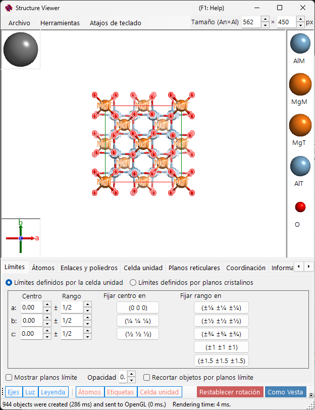

---

## Atajos de teclado y ratón

La ventana tiene una vista 3D principal más dos pequeños gizmos — la caja de **ejes cristalinos** (abajo a la izquierda) y la caja de **dirección de la luz** (arriba a la izquierda) — y cada uno responde de forma diferente a un arrastre con el botón izquierdo. La vista principal usa la [navegación de vista OpenGL](21-shortcuts.md) estándar de ReciPro.

| Atajo | Acción |
|----------|--------|
| <kbd>F1</kbd> | Abrir esta página del manual en línea |
| <kbd>CTRL</kbd>+<kbd>SHIFT</kbd>+<kbd>C</kbd> | Copiar la imagen renderizada al portapapeles |
| Arrastrar con el botón izquierdo en la vista principal | Rotar el modelo |
| Doble clic izquierdo sobre un átomo | Mostrar sus coordenadas, distancias a los vecinos más próximos y ángulos de enlace |
| Arrastrar con el botón derecho arriba/abajo, o rueda del ratón | Zoom |
| Arrastrar con el botón central | Desplazamiento |
| <kbd>CTRL</kbd> + arrastrar con el botón derecho arriba/abajo | Cambiar la distancia de la cámara (solo en modo perspectiva) |
| <kbd>CTRL</kbd> + doble clic derecho | Alternar entre proyección ortográfica y perspectiva |
| Arrastrar con el botón izquierdo el gizmo de **ejes cristalinos** | Rotar el modelo (sin giro en el plano) |
| Arrastrar con el botón izquierdo el gizmo de **luz** | Cambiar la dirección de iluminación |

Los atajos <kbd>CTRL</kbd>+<kbd>SHIFT</kbd> de toda la aplicación de la [ventana principal](0-main-window.md#keyboard-mouse-shortcuts) también funcionan mientras esta ventana tiene el foco.

→ Consulte **[21. Atajos de teclado y ratón](21-shortcuts.md)** para ver todas las ventanas de un vistazo.

---

## Área principal

Estructura cristalina 3D con fuente de luz, ejes cristalinos y leyenda de átomos.
> La caja **Size (W×H)** en la parte superior derecha de la ventana establece el tamaño en píxeles utilizado al guardar o copiar la imagen renderizada.

---

## Barra de menús

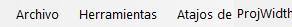

### Menú Archivo

Guardar imagen, copiar al portapapeles (Ctrl+Shift+C), guardar película (MP4).

**Guardar película** abre el cuadro de diálogo de configuración de película que se muestra a continuación: establezca la velocidad de rotación, la duración de la grabación y la dirección (proyección actual, un índice de dirección o un plano reticular), el códec (H.264 / H.265) y la velocidad de codificación, y luego pulse **OK** para generar un archivo MP4.

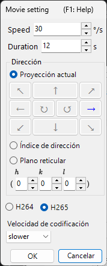

### Menú Herramientas

---

## Menú de pestañas

### Límites definidos por la celda

Especifica el intervalo de dibujo del cristal. Hay dos modos, que se cambian con los botones de opción de la parte superior.

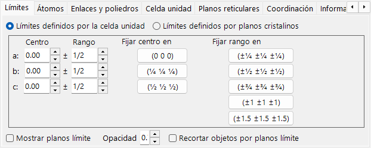

En este modo, los ejes *a*, *b*, *c* de la celda elemental son la unidad del intervalo de dibujo.

- **Center**: coordenada fraccionaria central del volumen de dibujo.
- **Range**: límite superior/inferior para cada uno de los ejes *a*, *b*, *c*.
- Los **botones de preajuste** de la derecha proporcionan valores de uso frecuente (p. ej. celda 1×1×1, celda 2×2×2).

### Límites definidos por planos cristalinos

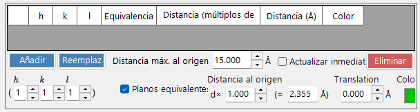

En este modo, el área de dibujo está delimitada por un conjunto de planos cristalinos. Si los planos no definen una región espacialmente cerrada, ReciPro recurre automáticamente a un límite de una celda elemental.

#### Lista de límites

Todos los planos límite registrados para el cristal actual. Use **Add / Replace / Delete** para manipular la lista; la casilla situada más a la izquierda desactiva temporalmente un plano sin eliminarlo.

> Para guardar los cambios de forma permanente, también debe pulsar **Add** o **Replace** en la **Ventana principal**. De lo contrario, los cambios se pierden la próxima vez que cambie la selección en la lista principal de cristales.

#### Índices H k l

Establece el plano límite mediante su índice de Miller. La casilla incluye los planos cristalográficamente equivalentes generados a partir del (*hkl*) seleccionado.

#### Distancia desde el origen

La distancia desde el centro del cristal hasta el plano límite. La unidad se puede elegir entre **d** y **Å**. Con **d**, la distancia es el valor introducido multiplicado por la distancia interplanar *d* del (*hkl*) seleccionado. Con **Å**, el valor es la distancia absoluta. Al cambiar uno se actualiza el otro automáticamente.

#### Mostrar planos límite / Opacidad

Muestra u oculta los propios planos límite. Cuando se muestran, **Opacity** establece la transparencia (0 = transparente, 1 = opaco).

#### Recortar objetos por los planos límite

Si está marcado, solo se renderiza la región interior definida por los límites; los átomos, enlaces y poliedros que cortan los límites se recortan.

#### Ocultar átomos

Si está marcado, se ocultan todos los átomos, enlaces y poliedros — útil cuando solo es necesario visualizar la celda o los planos reticulares.

### Átomos

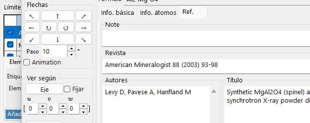

Coordenadas, elemento, ocupación, radio, color, material. **Apply to same elements**.

#### Lista de átomos

La lista de átomos del cristal. Use **Add / Replace / Delete** para manipular la lista; la casilla situada más a la izquierda oculta temporalmente un átomo.

> Para guardar los cambios de forma permanente, haga clic también en **Add** o **Replace** en la **Ventana principal**.

#### Elemento y posición

- **Label**: etiqueta de texto libre para el átomo (se usa en leyendas y descripciones emergentes).
- **Element**: elemento químico / estado de ionización.
- **X, Y, Z**: coordenadas fraccionarias. Números reales entre 0 y 1, o fracciones como `1/2` o `2/3`.
- **Occ**: ocupación, un número real entre 0 y 1.

#### Desplazamiento del origen

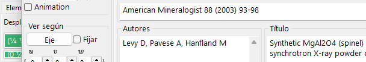

Desplaza cada átomo en el mismo desplazamiento fraccionario. Pulse un botón de preajuste (por ejemplo, para alternar entre la elección de origen 1 / 2 del mismo grupo espacial), o introduzca un (Δx, Δy, Δz) personalizado y pulse **Apply custom shift**.

#### Apariencia

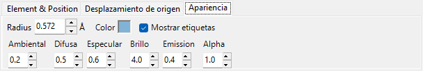

Radio, color y material por átomo.

- **Radius**: radio atómico dibujado.
- **Atom color**: color de la superficie.
- **Material**: propiedades de textura / material utilizadas por el shader de OpenGL.
- **Apply to same elements**: aplica el radio y el color actuales a todos los átomos de la misma especie elemental.

### Enlaces y poliedros

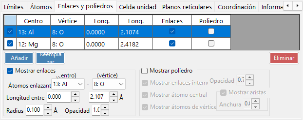

Umbrales de longitud de enlace, visualización de poliedros, aristas.

#### Lista de enlaces

Todas las reglas de enlace/poliedro registradas para el cristal. Use **Add / Replace / Delete**; la casilla situada más a la izquierda desactiva temporalmente una entrada. Como con los átomos y los límites, se requiere **Add** / **Replace** en la **Ventana principal** para hacer permanente el cambio.

#### Propiedad del enlace

- **Bonding Atom (center)**: especie elemental usada como átomo central del enlace / poliedro.
- **Bonding Atom (vertex)**: especie elemental usada como vértice (el otro extremo).
- **Length between … and …**: umbrales de distancia inferior y superior. Los pares de átomos fuera de este intervalo no se dibujan.
- **Bond Radius**: grosor dibujado del enlace (radio del cilindro).
- **Alpha**: transparencia del enlace (0 = transparente, 1 = opaco).

#### Propiedad del poliedro

- **Show Polyhedron**: cuando está marcado, se dibuja el poliedro definido por el enlace actual (solo si el conjunto centro/vértice es geométricamente válido).
- **Inner Bonds**: muestra/oculta los enlaces dentro del poliedro.
- **Center Atom**: muestra/oculta el átomo central.
- **Vertex Atoms**: muestra/oculta los átomos de los vértices.
- **Color** / **Alpha**: color de cara y transparencia.
- **Show Edge**: dibuja las aristas que conectan los vértices.
- **Edge Color** / **Width**: color y ancho de línea de las aristas.

### Celda elemental

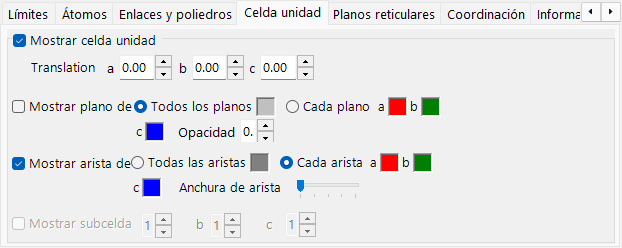

Traslación, planos de la celda, aristas.

#### Traslación

Cada grupo espacial tiene un origen predeterminado. Para alejar el centro de la celda elemental dibujada de ese origen, establezca la traslación a lo largo de *a*, *b*, *c*.

#### Mostrar plano de la celda

Si se dibujan o no las seis caras que delimitan la celda elemental. Cuando está habilitado, puede establecer el color de cara y la transparencia.

#### Mostrar aristas

Si se dibujan o no las aristas de la celda elemental. El color de las aristas es configurable.

### Planos reticulares

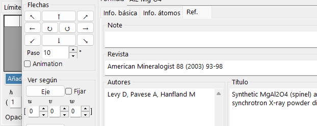

Especificación del índice de Miller con equivalentes cristalográficos.

#### Índices H k l

Especifica el plano reticular mediante su índice de Miller. La casilla incluye opcionalmente los planos cristalográficamente equivalentes generados a partir de (*hkl*).

#### Traslación

Traslada el plano reticular dibujado en un múltiplo entero de su distancia interplanar *d* — útil para visualizar planos sucesivos de la misma familia.

### Coordinación

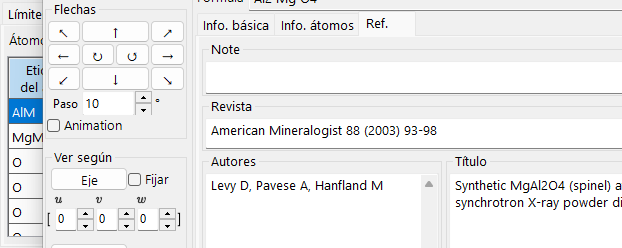

Tabla y gráfico de coordinación alrededor del átomo objetivo.

#### Tabla (lado izquierdo)

Enumera qué átomos rodean al átomo objetivo seleccionado y a qué distancia. El átomo objetivo se selecciona en el menú desplegable situado sobre la tabla.

#### Gráfico (lado derecho)

Histograma del número de vecinos en función de la distancia, derivado de los mismos datos que la tabla. Ajuste **Bar width** hasta que las barras separen limpiamente las capas de coordinación — esto da una estimación visual del número de coordinación.

### Información

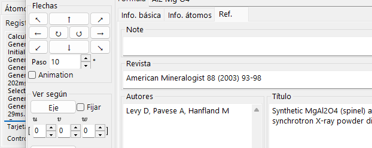

Registro de renderizado (tiempo de fotograma, información de la GPU) e información básica sobre el átomo seleccionado. En construcción — los campos pueden ampliarse con el tiempo.

### Proyección

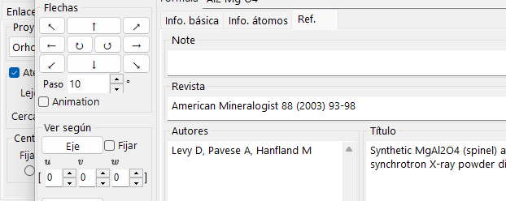

Modo de proyección (ortográfica/perspectiva), atenuación por profundidad, calidad de renderizado, modo de transparencia.

#### Proyección

- **Orthographic**: proyección paralela perfecta (punto de vista en el infinito).
- **Perspective**: proyección en perspectiva desde la distancia de punto de vista establecida con el control deslizante.

#### Atenuación por profundidad

Atenúa los objetos lejanos en la dirección de profundidad. Los objetos más lejanos que **Far** son completamente transparentes; los objetos más cercanos que **Near** son completamente opacos; los objetos intermedios se interpolan linealmente.

#### Centro de proyección

Establece el centro de proyección en las coordenadas especificadas. Active **Custom** para introducir coordenadas arbitrarias.

#### Calidad de renderizado

Calidad de dibujo (subdivisión de malla, antialiasing). Una calidad mayor es más lenta — elija el ajuste que se adapte a su GPU.

#### Modo de transparencia

Algoritmo usado para átomos y poliedros translúcidos.

- **Approximate**: rápido, pero puede ser impreciso cuando se solapan muchos objetos translúcidos.
- **Perfect**: transparencia independiente del orden — precisa pero muy lenta, requiere en la práctica una GPU dedicada.

### Elementos de simetría

La pestaña **Symmetry Elements** dibuja los operadores de simetría del grupo espacial directamente sobre el modelo 3D (se alterna con el botón **Symmetry Elements** de la barra de herramientas). Cada clase de elemento se puede mostrar/ocultar de forma independiente:

- **Ejes de rotación** y **ejes helicoidales**
- **Planos de espejo** y **planos de deslizamiento**
- **Centros de inversión** y **ejes de rotoinversión**

Para cada clase puede ajustar el tamaño del símbolo, el ancho de línea y el color.

### Misceláneos

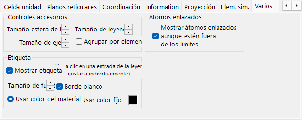

- **Accessory controls**: establece los tamaños de visualización (esfera de luz, ejes, leyenda). **Group by element** alterna la visualización de la leyenda.
- **Bonded atoms**: **Show bonded atoms even if they are outside the boundaries** sigue dibujando los átomos enlazados a átomos dentro del intervalo de dibujo, incluso cuando quedan fuera de él.
- **Label**: establece el tamaño de fuente, el color y otras propiedades de las etiquetas de los átomos.

---

## Barra de herramientas

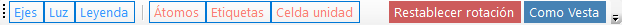

| Botón | Descripción |
|--------|-------------|
| Axes | Mostrar la orientación de los ejes (tamaño = constante de red) |
| Light | Establecer la dirección de la luz |
| Legend | Leyenda de átomos |
| Atoms | Alternar los objetos de átomos |
| Labels | Alternar las etiquetas de los átomos |
| Unit Cell | Alternar las aristas de la celda elemental |
| Sym. Elems. | Alternar la superposición de elementos de simetría (ver arriba) |
| Reset Rotation | Volver a la orientación inicial |
| Like Vesta | Apariencia al estilo Vesta |

---

## Véase también

- [Ventana principal](0-main-window.md)
- [Base de datos de cristales](1-crystal-database.md)
- [Información de simetría](2-symmetry-information.md)
- [Simulador de difracción](7-diffraction-simulator/index.md)
- [Atajos de teclado y ratón](21-shortcuts.md)
