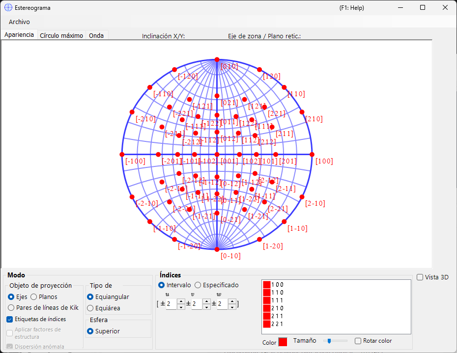
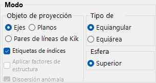
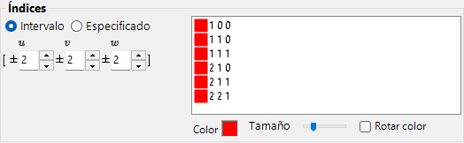
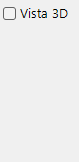
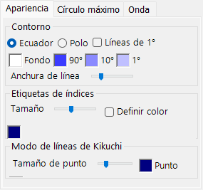
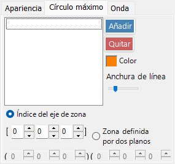
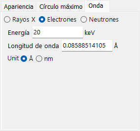

# Estereograma

El **Estereograma** muestra las direcciones de los planos cristalinos y de los ejes mediante proyección estereográfica.

---

## Atajos de teclado y ratón

El estereograma en sí es una proyección 2-D; opcionalmente se puede mostrar una esfera 3-D con **3D display**.

| Atajo | Acción |
|----------|--------|
| <kbd>F1</kbd> | Abrir esta página del manual en línea |
| Arrastrar con el botón izquierdo cerca del centro | Inclinar el cristal |
| Arrastrar con el botón izquierdo en la zona exterior | Girar el cristal alrededor del eje de visión |
| Doble clic izquierdo | Alternar entre la proyección **Plane** y **Axis** |
| Clic derecho | Alejar el zoom |
| Arrastrar un recuadro con el botón derecho | Acercar el zoom a la región seleccionada |
| Arrastrar con el botón central | Desplazar |
| Mover el ratón (sin botón) | Leer los índices (hkl)/[uvw] bajo el cursor — útil para indexar un reflejo medido |

Arrastrar sobre la red rota el **cristal**; el estado de rotación se comparte entre todas las ventanas.

El renderizado 3-D utiliza la [navegación de vista OpenGL](21-shortcuts.md) estándar de ReciPro (arrastrar con el botón izquierdo para rotar, arrastrar con el botón derecho / rueda para hacer zoom, <kbd>CTRL</kbd> + doble clic derecho alterna la proyección) y rota únicamente la vista 3-D, no el cristal en sí.

Los atajos <kbd>CTRL</kbd>+<kbd>SHIFT</kbd> de toda la aplicación procedentes de la [ventana principal](0-main-window.md#keyboard-mouse-shortcuts) también funcionan mientras esta ventana tiene el foco.

→ Consulte **[21. Atajos de teclado y ratón](21-shortcuts.md)** para ver todas las ventanas de un vistazo.

---

## Área principal

Aquí se muestra la proyección en estereograma de los planos cristalinos, los índices de dirección y las líneas de Kikuchi del cristal seleccionado.

---

## Menú Archivo

Guardar o copiar en formato ráster o vectorial. El formato vectorial permite editar la fuente y el grosor de las líneas en PowerPoint u otros editores vectoriales.

---

## Mode

### Objetivo de proyección

Seleccione qué se proyecta sobre la red.

- **Axes** — proyecta los índices de dirección \([uvw]\).
- **Planes** — proyecta las normales a los planos cristalinos \((hkl)\).
- **Kikuchi line pairs** — proyecta los pares de líneas de Kikuchi.

### Método de proyección

| Método | Descripción |
|--------|-------------|
| **Wulff** (equiangular / estereográfica) | Conserva la relación angular entre los elementos proyectados, pero no el ángulo sólido. La emplean los cristalógrafos clásicos al leer ángulos entre ejes o entre planos. |
| **Schmidt** (equiareal / Lambert) | Conserva el ángulo sólido (el área) de cada región, pero distorsiona los ángulos. Preferida para figuras de polos estadísticas en las que importa la densidad relativa. |

### Hemisferio

Elija el hemisferio **Upper** o **Lower** como fuente de proyección — esto alterna si la cara visible de la esfera es la más cercana o la más alejada del observador.

### Opciones de visualización

- Mostrar las etiquetas de índices.
- Cuando se selecciona **Planes** o **Kikuchi line pairs**, cada punto o línea se pondera con el factor de estructura \(|F_{hkl}|\) (establezca la fuente de onda y la longitud de onda en la [pestaña Wave](#wave)).

> Para cristales trigonales/hexagonales, la notación de Miller–Bravais (4 índices) puede activarse desde **Option ▸ Use Miller-Bravais (hkil) index** en la ventana principal.

---

## Indices

Establece qué planos cristalinos / ejes se dibujan.

### Modo de intervalo

Especifique un intervalo de índices \([uvw]\) o \((hkl)\). ReciPro enumera cada índice dentro de los límites y proyecta cada uno de ellos.

### Modo especificado

Especifica ejes o planos concretos de forma individual. Escriba un índice, pulse **Add** para registrarlo o **Remove** para eliminarlo. Cuando **include equivalent indices** está marcado, también se dibujan todos los índices cristalográficamente equivalentes.

### Colour / Size

Establezca el **colour** y el **size** de los puntos representados. Marque **Change colour automatically** para codificar por color de forma diferente cada conjunto de ejes/planos equivalentes — útil para distinguir familias en una representación de múltiples índices.

---

## 3D Options

Controla la superposición de la red 3D (esfera) — opacidad de la esfera, indicadores de ejes, etc.

---

## Menú de pestañas

### Appearance

#### Outline

Cómo se dibuja el contorno del estereograma — el círculo delimitador y la malla opcional de círculos máximos de latitud/longitud. Elija **Equator** o **Pole**, active **1° Lines** y el relleno **Background**, establezca los colores de malla **90° / 10° / 1°** y ajuste el **Line width** con la barra deslizante.

#### Index labels

- **Size** — tamaño de las etiquetas de índices.
- **Specify color** — utiliza un único color fijo para todas las etiquetas de índices en lugar del color de cada punto; útil cuando los puntos están codificados por color pero usted desea todas las etiquetas en un solo color para mejorar la legibilidad.
- **Delimiter** — carácter que se coloca entre los índices de cada etiqueta: **None** (p. ej. 100), **Space** (1 0 0) o **Comma** (1,0,0).

#### Kikuchi line mode

- **Point size** — tamaño de los puntos representados.
- **Point** / **Label** — colores de los puntos y de sus etiquetas.

### Great and Small Circle

Dibuje círculos máximos y círculos menores. Especifíquelos mediante el **zone-axis index** \([uvw]\) (el círculo máximo formado por la zona de ese eje) o mediante **two crystal-plane indices** que comparten el eje de zona. El grosor de línea de los círculos también se puede configurar con la barra deslizante.

### Wave {#wave}

Disponible solo cuando se selecciona **Planes** o **Kikuchi line pairs** como objetivo de proyección. Establece la fuente de onda (X-ray / electron / neutron) y la longitud de onda o energía necesarias para calcular los factores de estructura cristalina que se usan en la opción **structure-factor weighting** de [Mode](#mode).

---

## Véase también

- [Ventana principal](0-main-window.md)
- [Geometría de rotación](4-rotation-geometry.md)
- [Visor de estructura](5-structure-viewer.md)
- [Simulador de difracción](7-diffraction-simulator/index.md)
- [Sistema de coordenadas básico y orientación del cristal](appendix/a1-coordinate-system/1-orientation.md)
