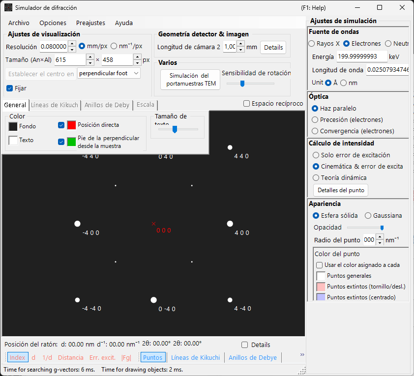
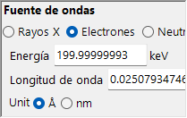
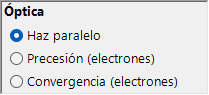
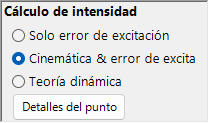
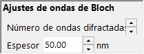
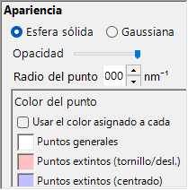

# Simulación SAED (Selected Area Electron Diffraction)

La simulación **SAED (Selected Area Electron Diffraction)** calcula los patrones de difracción de electrones de monocristal producidos por un haz de electrones paralelo. Este es el modo predeterminado del [simulador de difracción](index.md).

> Esta página enumera cada ajuste que aparece en el panel **Spot property** a la derecha cuando se elige **Wave Length = Electron** e **Incident beam mode = Parallel**. Para operaciones que afectan a toda la ventana, como dibujar y guardar, consulte la [página de resumen](index.md).

Condiciones de la GUI: Wave Length = Electron, Incident beam mode = Parallel, Intensity calculation = Only excitation error / Kinematical / Dynamical.

---

## Resumen

Simula el patrón de difracción que se produce cuando un haz de electrones paralelo atraviesa una muestra delgada. Las posiciones de los spots quedan fijadas por la relación geométrica entre la esfera de Ewald y los puntos de la red recíproca, y el brillo de cada spot se calcula según el modo de cálculo de intensidad seleccionado.

---

## Wave Length

Establezca la fuente de radiación en **Electron**. Introduzca la energía (keV) o la longitud de onda (nm) y se calcula la longitud de onda corregida relativísticamente. Para fuentes de rayos X y de neutrones, consulte [Simulación de difracción de rayos X](4-x-ray-neutron-diffraction.md).

---

## Incident beam mode

Establezca la geometría del haz incidente en **Parallel**. Esta es la geometría estándar de onda plana utilizada para SAED y para la difracción de rayos X.

> **Nota**: Para los electrones puede elegir **Parallel / Precession (electron = PED) / Convergence (CBED)**. Elegir **Precession** produce una [simulación PED](2-ped-simulation.md) y elegir **Convergence** produce una [simulación CBED](3-cbed-simulation.md); en ambos casos el cálculo de intensidad cambia automáticamente a Dynamical.

---

## Intensity calculation

Selecciona cómo se calculan las intensidades de los spots.

### Solo error de excitación

La intensidad se determina únicamente a partir de la distancia geométrica entre la esfera de Ewald y el punto de la red recíproca (el error de excitación $s_g$). Cuanto menor es $\lvert s_g \rvert$, mayor es la intensidad; alcanza su máximo en el valor establecido mediante **Radius** y cae a cero cuando $\lvert s_g \rvert$ supera Radius. Como se ignora el factor de estructura del cristal, este es el modo más rápido y resulta adecuado para comprobar las posiciones de los spots de difracción.

### Cinemática

Además del error de excitación, el factor de estructura cinemático $\lvert F_{hkl} \rvert^2$ se incorpora a la intensidad. Las reglas de extinción se reflejan correctamente, lo que hace que este modo sea adecuado para muestras delgadas o difracción débil.

### Dinámica (método de ondas de Bloch, solo electrón)

Un cálculo dinámico riguroso mediante el método de ondas de Bloch (método de Bethe). Reproduce la dispersión múltiple y la variación de la intensidad en función del espesor, y es necesario para muestras gruesas o difracción intensa. Disponible solo cuando se selecciona Electron. Para la teoría, consulte [Apéndice A3. Método de ondas de Bloch](../appendix/a3-bloch-wave/calculation.md).

> **Nota**: Cuando se selecciona **Dynamical**, aparece debajo un panel **Bloch wave settings**.

---

## Bloch wave settings (teoría dinámica)

Activo solo cuando **Intensity calculation = Dynamical**.

| Parámetro | Descripción |
|-----------|-------------|
| **Number of diffracted waves** | Número de ondas de Bloch incluidas en el problema de valores propios. Valores mayores dan intensidades más precisas pero aumentan el tiempo de cálculo como $O(N^3)$ |
| **Thickness** | Espesor de la muestra (nm) utilizado en el cálculo dinámico |

---

## Spot appearance

Controla cómo se representa cada spot de difracción.

- **Solid sphere / Gaussian** : el modelo geométrico del punto de la red recíproca. **Solid sphere** dibuja la sección transversal (un círculo) entre una esfera de radio $R$ y la esfera de Ewald, donde el área del círculo corresponde a la intensidad de difracción; **Gaussian** dibuja la sección transversal (una gaussiana 2-D) de una gaussiana 3-D con $\sigma = R$, cuya integral corresponde a la intensidad de difracción.
- **Opacity** : transparencia del spot (0 = transparente, 1 = opaco).
- **Radius (R)** : radio virtual del punto de la red recíproca. El tamaño del spot queda fijado por la combinación del modo **Appearance** y la **Intensity calculation** (p. ej., Solid sphere + Dynamical da un radio proporcional a $I_\text{dyn}^{1/2}$).
- **Brightness** : activo solo en el modo **Gaussian**. Intensidad integrada de la gaussiana dibujada.
- **Color scale** : **Gray scale** o **Cold-warm**.
- **Log scale** : muestra las intensidades en escala logarítmica. Útil para patrones con gran contraste de intensidad.
- **Spot color** : color del spot utilizado cuando no se emplea la escala de color.
- **Use crystal color** : cuando está marcado, los spots se dibujan con el color asignado a cada cristal.

---

## Spot labels

Las etiquetas superpuestas sobre los spots se seleccionan desde la [barra de herramientas](index.md#toolbar).

| Etiqueta | Contenido |
|-------|---------|
| **Index** | índices de Miller $(hkl)$ |
| **d** | distancia interplanar $d$ |
| **1/d** | inverso de la distancia interplanar $1/d$ |
| **Distance** | distancia spot a spot en el detector |
| **2θ** | ángulo de dispersión $2\theta$ (misma definición que los círculos concéntricos de la escala 2θ) |
| **χ** | ángulo azimutal $\chi$, medido desde la dirección hacia arriba (las 12 en punto), positivo en sentido horario (misma definición que las líneas radiales de la escala azimutal) |
| **Excit. Err.** | error de excitación $s_g$ |
| **\|Fg\|** | valor absoluto del factor de estructura $\lvert F_{hkl} \rvert$ |

---

## Operaciones comunes

La información del detector, el volteo, la visualización del espacio recíproco, las líneas de Kikuchi, los anillos de Debye, las líneas de escala, los ajustes de color, el guardado y similares son comunes a todos los modos. Consulte la [página de resumen](index.md). Los detalles por reflexión obtenidos del cálculo dinámico pueden consultarse en [información de spots de difracción](index.md#diffraction-spot-information).

---

## Véase también

- [Simulador de difracción (resumen)](index.md)
- [Cálculo SAED con haz paralelo](../appendix/a3-bloch-wave/calculation.md#parallel-beam-saed)
- [Simulación de difracción de rayos X](4-x-ray-neutron-diffraction.md)
- [Simulación de difracción de electrones por precesión (PED)](2-ped-simulation.md)
- [Definición del sistema de coordenadas](../appendix/a1-coordinate-system/1-orientation.md)
