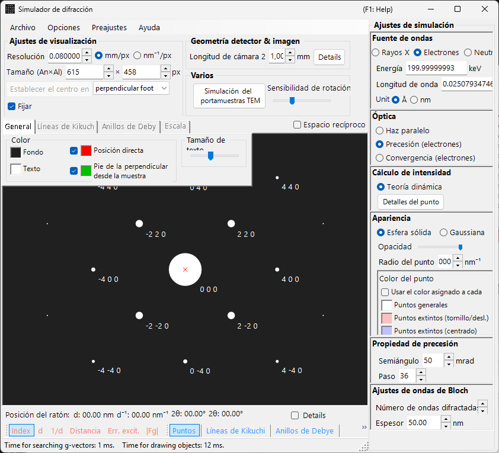
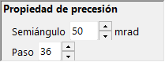

# Simulación de difracción de electrones por precesión (PED)

La simulación de **PED (Precession Electron Diffraction)** calcula los patrones de difracción de electrones obtenidos al hacer precesar el haz incidente sobre un cono alrededor del eje óptico.

> Esta página enumera todos los ajustes que aparecen en el lado derecho cuando selecciona **Wave = Electron beam, Incident beam = Precession (electron), Intensity = Dynamical (automatic)**. Tenga en cuenta que **al seleccionar Precession (electron) para el haz incidente, el cálculo de intensidad cambia automáticamente a Dynamical**. Para operaciones que afectan a toda la ventana, como dibujar y guardar, consulte la [página de descripción general](index.md).

Condiciones de la GUI: **Wave = Electron beam, Incident beam = Precession (electron), Intensity = Dynamical (automatic)**

---

## Descripción general

En la PED, el haz de electrones se hace precesar sobre un cono alrededor del eje óptico, y los patrones de difracción obtenidos para cada dirección del haz sobre el cono de precesión se integran. En comparación con la SAED convencional, esto ofrece las siguientes ventajas:

- Los efectos dinámicos se promedian, produciendo datos de intensidad próximos a las relaciones de intensidad cinemáticas
- Las reflexiones de zonas de Laue de orden superior (HOLZ) se observan con mayor claridad
- Se pueden obtener datos de intensidad adecuados para el análisis estructural

---

## Configuración de la longitud de onda

Dado que la PED es difracción de electrones, seleccione **Electron beam** como fuente. Al introducir la energía de los electrones (keV) o la longitud de onda (nm) se calcula la longitud de onda corregida relativísticamente.

---

## Haz incidente

Para la geometría del haz incidente, seleccione **Precession (electron)** (disponible solo cuando se ha seleccionado el haz de electrones).

> **Nota** : Al seleccionar **Precession (electron)** **el cálculo de intensidad cambia automáticamente a Dynamical**, y aparecen el panel de ajustes del método de ondas de Bloch y el panel de ajustes de precesión. **Only excitation error** / **Kinematical** ya no se pueden seleccionar.

---

## Ajustes de precesión

Defina la forma y el muestreo del cono de precesión.

| Parámetro | Descripción | Recomendado |
|-----------|-------------|-------------|
| **Semi-angle** | Semiángulo del cono de precesión (mrad) | 10–40 mrad |
| **Step** | Número de direcciones de haz paralelo muestreadas sobre el cono de precesión. Los valores mayores producen una integración más suave, pero aumentan el tiempo de cálculo linealmente | 36–72 |

---

## Cálculo de intensidad y ajustes del método de ondas de Bloch

En el momento en que se selecciona **Precession (electron)**, queda fijado **Intensity = Dynamical (automatic)**. Para el haz paralelo en cada dirección de precesión, la intensidad de difracción se calcula mediante el método de ondas de Bloch (cálculo dinámico), y la integración sobre todas las direcciones produce el patrón PED.

| Parámetro | Descripción | Recomendado |
|-----------|-------------|-------------|
| **No. of diffracted waves** | Número de ondas de Bloch incluidas en el problema de valores propios. Los valores mayores producen intensidades más precisas, pero el tiempo de cálculo crece como $O(N^3)$ | 50–200 |
| **Thickness** | Espesor de la muestra utilizado en el cálculo dinámico (nm) | — |

El coste computacional equivale aproximadamente a "número de pasos × cálculo de ondas de Bloch por dirección". Para más detalles sobre el cálculo dinámico, consulte [Cálculo dinámico (método de ondas de Bloch)](../appendix/a3-bloch-wave/calculation.md).

---

## Apariencia de los reflejos

Controla cómo se dibuja cada reflejo de difracción.

- **Solid sphere / Gaussian** : Modelo geométrico de los puntos de la red recíproca. **Solid sphere** dibuja la sección transversal de una esfera de radio $R$ con la esfera de Ewald, y **Gaussian** dibuja la sección transversal (una gaussiana 2D) de una gaussiana 3D con $\sigma = R$ con la esfera de Ewald.
- **Opacity** : Transparencia del reflejo (0 = transparente, 1 = opaco).
- **Radius (R)** : Radio de los puntos de la red recíproca. Para intensidades dinámicas, la integral gaussiana $=$ Brightness $\times I_\text{dyn}$, y Solid sphere utiliza el radio $R \times I_\text{dyn}^{1/2}$ (de modo que el área es proporcional a la intensidad dinámica).
- **Brightness** : Disponible solo en el modo **Gaussian**. Intensidad integrada de la gaussiana dibujada.
- **Colour scale** : Mapa de color **Gray scale** o **Cold-warm**.
- **Log scale** : Mostrar la intensidad en una escala logarítmica.
- **Spot colour** : Color del reflejo utilizado cuando no se aplica ninguna escala de color.
- **Use crystal colour** : Dibuja los reflejos en el color asignado a cada cristal.

---

## Comparación con SAED

| Característica | SAED | PED |
|---------|------|-----|
| Haz | Paralelo, fijo | En precesión (barrido cónico) |
| Efectos dinámicos | Grandes | Promediados, menores |
| Reflexiones HOLZ | Débiles | Aparecen con fuerza |
| Fiabilidad de la intensidad | Puede ser insuficiente para el análisis estructural | Adecuada para el análisis estructural |
| Tiempo de cálculo | Corto | Largo |

---

## Véase también

- [Simulador de difracción (descripción general)](index.md)
- [Simulación de difracción de rayos X](4-x-ray-neutron-diffraction.md)
- [Simulación SAED](1-saed-simulation.md)
- [Cálculo dinámico (método de ondas de Bloch)](../appendix/a3-bloch-wave/calculation.md)
