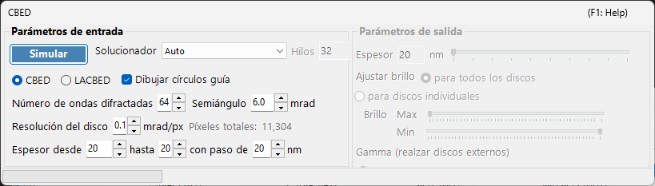
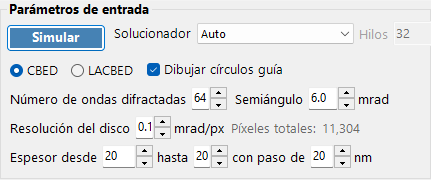
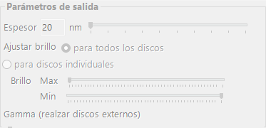

# Simulación CBED

La **simulación CBED (Convergent-Beam Electron Diffraction)** calcula y muestra patrones de difracción con haz convergente mediante el método de ondas de Bloch (Bethe). Los patrones CBED muestran discos de difracción en lugar de puntos y contienen abundante información sobre la simetría, el espesor y la estructura del cristal.

> Esta página enumera todos los ajustes de la ventana específica que se abre cuando selecciona **Wavelength = Electron** e **Incident beam = Convergence (CBED, electron only)** en el [Simulador de difracción](index.md). Al cambiar el haz incidente a convergencia, **Intensity calculation** se establece automáticamente en **Dynamical** y se abre esta ventana de ajustes CBED. Para dibujar y guardar patrones de difracción, así como para otras operaciones comunes al simulador de difracción, consulte la [página de descripción general](index.md).

Condiciones de la GUI: Wave Length = Electron · Incident beam = Convergence (CBED, electron only) · Intensity calculation = Dynamical (automático)

---

## Parámetros de entrada

| Parámetro | Descripción | Predeterminado / Típico |
|-----------|-------------|-------------------|
| **Mode** | **CBED**: patrón estándar con haz convergente en el que cada disco corresponde a una reflexión, con el disco transmitido (000) en el centro. **LACBED** (Large-Angle CBED): patrón con haz convergente de gran ángulo en el que se solapan los discos de distintas reflexiones. Útil para observar las líneas HOLZ (higher-order Laue zone) y la simetría | CBED |
| **Convergence semi-angle (mrad)** | Semiángulo del cono del haz convergente. Determina el tamaño de cada disco de difracción (el diámetro del disco en el espacio recíproco corresponde a $2\alpha$) | 5–30 mrad |
| **Disk resolution (mrad/px)** | Resolución angular dentro de cada disco. Valores más pequeños dan mayor resolución, pero el número de direcciones del haz (píxeles) calculadas crece con el cuadrado, por lo que el tiempo de cálculo también aumenta cuadráticamente. El número total de píxeles resultante (= número total de direcciones del haz) se muestra a la derecha | — |
| **No. of Bloch waves** | Número máximo de haces incluidos en el cálculo de ondas de Bloch para cada dirección del haz incidente. Más haces dan mayor precisión, pero el coste del problema de valores propios crece como $O(N^3)$ | 100–500 |
| **Thickness range** | Valores inicial, final y de paso del espesor de la muestra (nm). Varios espesores se calculan conjuntamente y se conmutan con el control deslizante de espesor en el lado de salida | — |
| **Solver** | Motor de cálculo para el problema de valores propios. **Auto**: selecciona automáticamente el mejor solver. **Eigenproblem (MKL)**: basado en Intel MKL (el más rápido). **Eigenproblem (Eigen)**: biblioteca Eigen de C++. **Managed**: .NET gestionado puro (el más lento, pero siempre disponible) | Auto |
| **Thread count** | Número de hilos paralelos para el cálculo | — |
| **Draw disk outlines** | Cuando está marcado, dibuja un círculo que indica el borde de cada disco de difracción | — |

---

## Run / Stop

- **Start** : inicia la simulación CBED con los parámetros de entrada actuales.
- **Stop** : cancela el cálculo en curso.

---

## Parámetros de salida

Una vez completado el cálculo, los parámetros de salida quedan disponibles. Todos ellos cambian únicamente la visualización sin recalcular.

| Parámetro | Descripción |
|-----------|-------------|
| **Sample thickness** | Selecciona, mediante un control deslizante, el espesor de la muestra que se va a mostrar dentro del rango de espesores de los parámetros de entrada |
| **Brightness adjustment** | **Common to all disks**: utiliza una escala de brillo común para todos los discos con el fin de mostrar el patrón CBED completo. **Per disk**: muestra un único disco seleccionado a resolución completa, normalizado dentro de ese disco |
| **Brightness (Max / Min)** | Límites superior e inferior de la intensidad mostrada. Ajústelos cuando desee resaltar características débiles |
| **γ (emphasis of outer disks)** | Corrección gamma. Se usa para hacer más visibles los oscuros discos exteriores de gran ángulo en relación con el disco transmitido central |
| **Scale** | Selecciona la gradación de intensidad entre **Positive** / **Negative** (blanco y negro invertido) |
| **Color** | Mapa de colores usado para la visualización. Elija entre **Gray** y otros |

---

## Fundamento físico

En CBED, el haz incidente se considera como un cono de ondas planas con diferentes direcciones. Para cada dirección (cada punto dentro del diafragma de convergencia = una onda plana incidente parcial), el método de ondas de Bloch resuelve la ecuación de Schrödinger del electrón en el interior del cristal y los resultados se reordenan como discos de difracción. Las líneas HOLZ (higher-order Laue zone) aparecen como finas líneas oscuras/claras dentro de los discos y surgen de reflexiones en las zonas de Laue superiores. Son sensibles al parámetro de red a lo largo del eje $c$ y resultan útiles para el análisis estructural tridimensional.

Para los detalles teóricos, consulte [Cálculo CBED](../appendix/a3-bloch-wave/cbed.md).

---

## Véase también

- [Simulador de difracción (descripción general)](index.md)
- [Simulación SAED](1-saed-simulation.md)
- [Simulación PED](2-ped-simulation.md)
- [Cálculo CBED](../appendix/a3-bloch-wave/cbed.md)
