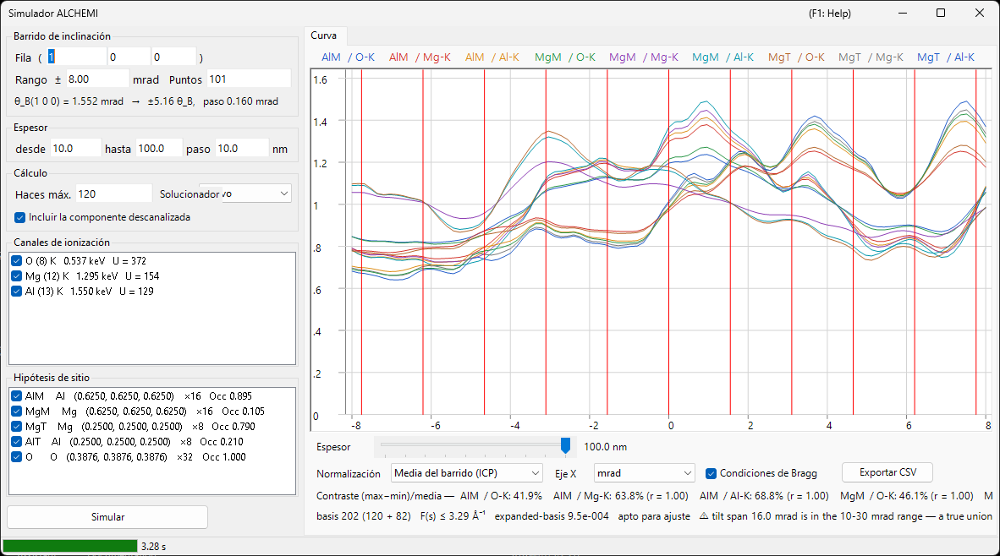

# Simulación ALCHEMI

**ALCHEMI (Atom Location by CHannelling-Enhanced MIcroanalysis)** determina **qué sitio ocupa un dopante** midiendo los rendimientos de rayos X característicos mientras el cristal se inclina a lo largo de una fila sistemática, y leyendo la dependencia con la orientación. El simulador ALCHEMI de ReciPro calcula hacia adelante la **curva de inclinación (rendimiento de ionización frente a orientación)** a partir de una estructura cristalina y un conjunto de hipótesis de sitio.

> **Es una función Preview.** La v1 solo realiza **cálculo directo unidimensional**; el ajuste a datos experimentales y el mapa 2D (2D-HARECXS) no están implementados (esas pestañas están ocultas). **Hasta donde saben los autores, no existe ningún otro simulador directo de ALCHEMI disponible públicamente.** Como no hay implementación con la que contrastar, lea [Alcance y limitaciones conocidas](#alcance-y-limitaciones-conocidas) antes de usar los resultados cuantitativamente.

Se abre desde el menú **Opciones** del [Simulador de difracción](index.md) → **Simulador ALCHEMI...**

Condiciones de la GUI: Wave Length = Electron (el cristal, la tensión de aceleración y la orientación se toman del simulador de difracción principal)



La ventana tiene **los ajustes a la izquierda** (barrido, espesor, cálculo, canales de ionización, hipótesis de sitio) y **el resultado a la derecha** (pestaña Curva).

---

## Qué se calcula

Para cada orientación incidente se resuelve el campo de ondas dentro del cristal con el método de ondas de Bloch, y para cada par de sitio $s$ y canal de ionización $c$ el rendimiento de ionización se integra analíticamente hasta el espesor $t$.

$$
Y_\text{dyn} = \mathrm{Re} \sum_{jj'} \alpha_j^{*}\,\bigl(C^{\dagger} \mu_{s,c} C\bigr)_{jj'}\, \alpha_{j'}\, F_{jj'}(t),
\qquad F_{jj'}(t) = \frac{e^{\lambda t} - 1}{\lambda}
$$

La matriz de ionización $\mu$ solo depende de la diferencia de dos reflexiones, $G = \mathbf{g}_h - \mathbf{g}_g$.

$$
\mu_{hg} = \sum_a \mathrm{Occ}_a\, e^{-M_a(G)}\, \sigma_c\, F_c(|G|/2)\, e^{-2\pi i\,G \cdot \mathbf{r}_a}
$$

- $\sigma_c$ : sección eficaz total de ionización, modelo **Bote–Salvat**
- $F_c(s)$ : factor de forma de ionización normalizado, tablas **DHFS** generadas internamente (la misma base de datos que [Interacción del haz](../3-beam-interaction.md) y [STEM-EDX](../9-hrtem-stem-simulator/2-stem-simulation.md))
- $e^{-M_a(G)}$ : factor de Debye-Waller (se admiten ADP anisótropos)

Corresponde a la **aproximación de factor de forma local** de ICSC (Oxley & Allen 2003). No se usa la MDFF de dos momentos.

### Componente descanalizada

Los electrones extraídos del campo de Bloch coherente por la absorción térmica difusa recorren el espesor restante como electrones de dirección aleatoria, y también ionizan allí.

$$
Y_\text{dech} = \frac{\mu_{00}}{V_c}\,\bigl(t - L_\text{coh}(t)\bigr),
\qquad L_\text{coh}(t) = \int_0^t \sum_g |\psi_g(z)|^2\,dz
$$

Desmarcar **Incluir la componente descanalizada** en el cuadro **Cálculo** elimina este término. Supone decenas de por ciento del rendimiento total a espesores típicos, así que omitirlo hace que el contraste de sitio parezca más fuerte de lo que es.

### Magnitud de salida

La magnitud primaria es el **número de vacantes de capa interna generadas por electrón incidente**. **NO se aplican la conversión a fotones de rayos X (rendimiento de fluorescencia y ramificación de líneas), la autoabsorción de rayos X en la muestra ni la eficiencia y el ángulo sólido del detector.**

---

## Panel izquierdo: ajustes

### Barrido de inclinación

| Elemento | Descripción | Predeterminado |
|----------|-------------|----------------|
| **Fila ( h k l )** | Fila sistemática a barrer, dada como índices de reflexión. El eje de inclinación se toma perpendicular tanto al haz como a este $\mathbf{g}$, de modo que el barrido recorre esta fila a través de sus condiciones de Bragg | (1 0 0) |
| **Rango ±** | Semianchura del barrido de inclinación (mrad). Más allá de unos 10 mrad ya no se garantiza una base unión fija, y más allá de 30 mrad queda fuera de la garantía de la v1 | 8 mrad |
| **Puntos** | Número de puntos del barrido (3–1001) | 101 |

La línea inferior muestra el ángulo de Bragg $\theta_B$ de la fila elegida, a cuántos $\theta_B$ corresponde la anchura del barrido, y el paso de inclinación, de modo que se ve hasta dónde llega realmente el barrido antes de ejecutarlo.

### Espesor

Indique inicio, fin y paso (nm). **Todos los espesores se calculan juntos en una sola ejecución**, y el resultado se conmuta con el deslizador bajo la curva.

El contraste de sitio cambia mucho —e incluso puede invertir su signo— entre muestras delgadas y gruesas, así que compruebe varios espesores antes de sacar conclusiones. Por eso el selector de espesor está justo debajo de la curva.

### Cálculo

| Elemento | Descripción | Predeterminado |
|----------|-------------|----------------|
| **Haces máx.** | Cota superior del número de ondas de Bloch por orientación (1–1600). La unión sobre todo el barrido es mayor | 120 |
| **Solucionador** | Motor de cálculo del problema de autovalores: **Nativo** (Eigen C++) o **Gestionado** (.NET). Donde el solucionador nativo no está disponible, la elección queda fijada en Gestionado | Nativo |
| **Incluir la componente descanalizada** | Si se suma $Y_\text{dech}$ anterior | activado |

**El tope de 1600 haces es la contrapartida del rango tabulado $s \le 16\ \text{Å}^{-1}$ del factor de forma de ionización.** En la práctica, incluso 1600 haces solo requieren unos 10,5 Å⁻¹, así que el rango tabulado nunca se agota mientras se respete el tope. El valor realmente alcanzado se indica en la línea de [diagnóstico de la base](#diagnóstico-de-la-base) bajo el gráfico.

### Canales de ionización

Lista de elemento y capa a ionizar. Cada fila se lee `elemento (Z) capa   energía del borde   U = sobretensión`, con una etiqueta entre paréntesis donde hace falta precaución.

- Los canales que **no pueden excitarse** (la energía incidente está por debajo del borde de absorción) o que quedan **fuera del rango tabulado** se listan con el motivo y no pueden marcarse
- Los canales cuya sobretensión $U = E_0/E_\text{borde}$ es inferior a 1,2 llevan una advertencia, porque allí la sección eficaz es menos fiable

### Hipótesis de sitio

Lista de sitios atómicos cuyo rendimiento se calcula por separado, mostrados como `etiqueta elemento (x, y, z) ×multiplicidad Occ ocupación`.

⚠ **En la imagen de trazador, un canal puede emparejarse con cualquier sitio.** Emparejar el canal de ionización de un dopante con la geometría de un sitio anfitrión (posición, ADP, ocupación) es el uso previsto; restringir el emparejamiento a elementos coincidentes sería un error. Se calculan **todas las combinaciones** de los canales y sitios marcados.

### Simular / Detener

**Simular** inicia el barrido. El progreso se muestra en la barra de estado en cinco etapas (resolviendo datos de ionización → construyendo la base unión → construyendo las matrices de ionización → resolviendo orientaciones → verificando la base ampliada), y **Detener** aborta en cualquier momento.

---

## Panel derecho: pestaña Curva

Al terminar el cálculo se dibuja una curva por cada par sitio × canal. La leyenda se lee `etiqueta de sitio / canal`.

| Elemento | Descripción |
|----------|-------------|
| **Espesor** | Selecciona el espesor mostrado con un deslizador (no se recalcula nada) |
| **Normalización** | **Media del barrido (ICP)** = dividir por la media de todo el barrido (la magnitud que se usa normalmente en ALCHEMI) / **Máximo = 1** / **Bruto (por electrón)** |
| **Eje X** | Alterna entre **mrad** y **θ_B** (en unidades del ángulo de Bragg de la fila barrida) |
| **Condiciones de Bragg** | Dibuja líneas verticales en $\theta = n\,\theta_B$ |
| **Exportar CSV** | Escribe las curvas brutas de cada orientación, espesor, sitio y canal en un archivo CSV ([abajo](#exportación-csv)) |

⚠ **La normalización es solo una transformación de visualización.** La magnitud almacenada son siempre las vacantes generadas por electrón incidente, y **Máximo = 1 es solo para visualización**: no debe usarse como referencia ICP.

### Contraste y correlación

La primera línea bajo la curva indica, por serie, el **contraste** $(\max-\min)/\text{media}$ y el **coeficiente de correlación** $r$ frente a la primera serie. Es un resumen para juzgar de un vistazo qué sitio está actuando: dos series con $r$ próximo a $+1$ tienen la misma dependencia con la orientación, es decir, esos datos no pueden separar esos sitios.

### Diagnóstico de la base

La segunda línea informa del estado de la base.

```text
basis 347 (184 + 163)   F(s) ≤ 6.20 Å⁻¹   expanded-basis 6.7e-3   ⚠ NO apto para ajuste
```

- **basis N (solo centro + añadidos por la unión)** : tamaño de la unión verdadera de reflexiones sobre todas las orientaciones del barrido
- **F(s) ≤ … Å⁻¹** : el mayor argumento del factor de forma que la base realmente requirió
- **expanded-basis** : máxima diferencia relativa al resolver de nuevo el centro y ambos extremos del barrido con una base 1,25×. Es un **sustituto del error de convergencia**
- **apto para ajuste / NO apto para ajuste** : el resultado pasa a **no apto** cuando el valor expanded-basis supera el umbral de $3\times10^{-3}$

⚠ **No use un resultado marcado como no apto para ajuste en un ajuste cuantitativo de ocupación.** Es una condición de publicación de la v1. Tenga en cuenta además que el diagnóstico se define sobre el **rendimiento absoluto**, por lo que resulta conservador si solo mira el ICP (que divide por la media del barrido).

En las siguientes situaciones se añaden más advertencias.

- **Tensión de aceleración por debajo de 80 kV** : a esta tensión la tabla de factores de forma no garantiza $s$ hasta $16\ \text{Å}^{-1}$. El cálculo en sí sigue siendo correcto mientras el $s$ requerido por la base permanezca dentro del rango certificado, así que se trata de un **aviso, no de un rechazo**
- **Truncamiento del factor de forma** : allí donde $F(s)$ más allá del rango certificado se truncó a cero, **se muestra numéricamente la cota de error resultante $|F| \le \varepsilon$**. Nada se extrapola en silencio

---

## Exportación CSV {#exportación-csv}

**Exportar CSV** escribe una tabla en formato largo precedida por las dos líneas de cabecera siguientes. La cabecera está pensada para que el propio archivo indique las condiciones necesarias para reproducirlo.

```text
# ReciPro ALCHEMI, 250.0 kV, row (1 0 0), theta_B 3.8424 mrad, model LocalFormFactor,
#   quantity ..., normalization PerIncidentElectron (self-absorption and detector efficiency are NOT applied)
# basis 347 beams, hash ..., expanded-basis 6.658e-003, fit-eligible False
tilt_mrad,thickness_nm,site,channel,dynamic,dechannelled,total
```

`dynamic` / `dechannelled` / `total` se guardan por separado, de modo que **la contribución de la componente descanalizada puede evaluarse a posteriori**. Los valores son brutos (por electrón incidente) y no pasan por la normalización de visualización; el separador decimal es siempre un punto.

---

## Alcance y limitaciones conocidas

«Se puede calcular» y «está verificado cuantitativamente» son cosas distintas. Esta sección indica lo segundo.

### Rango verificado cuantitativamente

**β-AlCo [001] a 250 keV, canales Al-K / Co-K / Co-L**, y nada más. Comparado con un cálculo multicapa con fonones congelados (py_multislice) cuya formulación dinámica es completamente independiente:

- **Sitio Al (columna ligera)** : residuo RMS respecto a la modulación ICP ≤3,2 % a todos los espesores, ≤0,6 % para $t \ge 10$ nm
- **Sitio Co (columna pesada)** : ≤3 % para $t \le 4$ nm, pero **6–17 % para $t \gtrsim 10$ nm**

Cualquier otro sistema, elemento, capa o tensión es «calculable» pero no «verificado cuantitativamente».

### Error sistemático conocido: el término descanalizado no tiene correlación de sitio

El término descanalizado de la v1 es una constante independiente de la orientación, por lo que su único efecto sobre el ICP es acercarlo a 1. En realidad, parte de los electrones dispersados térmicamente vuelve a canalizarse en las columnas y, al ser dispersores fuertes, regresa **preferentemente a las columnas pesadas**. En la comparación anterior, la magnitud efectiva de esta contribución estaba **subestimada en 10–19 puntos en las columnas pesadas**.

→ **Para sitios ligeros o poco dispersantes, o para $t \lesssim 5$ nm, el acuerdo con una implementación independiente es del 1–3 %. Para columnas pesadas con $t \gtrsim 10$ nm hay un error sistemático del 6–17 % de la modulación ICP.** Un modelo de reinyección con correlación de sitio queda aplazado a la v1.1 o posterior.

### No incluido en el modelo directo

**Una convolución con el ensanchamiento angular por sí sola no reproducirá un experimento.** No se incluye nada de lo siguiente.

- **Distribución de espesor** y **flexión** de la muestra
- **Autoabsorción** de rayos X
- **Eficiencia y ángulo sólido del detector**
- **Fondo** (radiación de frenado, líneas solapadas)
- Convolución con el **ensanchamiento angular del haz incidente** (semiángulo de convergencia, deriva): no implementado en la v1

### Supuestos del modelo

- **Solo aproximación de trazador** : la superposición lineal de respuestas de sitio solo vale en el límite diluido en que el dopante no perturba el campo de ondas elástico. La VCA a concentración finita queda fuera del alcance de la v1
- **Aproximación de factor de forma local** : $\mu$ es función únicamente de $G = \mathbf{g}_h - \mathbf{g}_g$, no la MDFF de dos momentos (Modelo A de OAR 1999). La aproximación falla para capas K de elementos ligeros y bordes de baja energía
- **Vacantes, no fotones de rayos X** : no se aplican el rendimiento de fluorescencia ni la ramificación de líneas
- **La cota inferior de la tensión de aceleración es 80 kV** : es la tensión más baja a la que puede garantizarse $s = 16\ \text{Å}^{-1}$, no un umbral de rechazo

---

## Véase también

- [Simulador de difracción (visión general)](index.md)
- [Simulación CBED](3-cbed-simulation.md)
- [Cálculo dinámico (núcleo común)](../appendix/a3-bloch-wave/calculation.md)
- [Simulación STEM](../9-hrtem-stem-simulator/2-stem-simulation.md) — STEM-EDX, que usa la misma base de datos de ionización
- [Interacción del haz](../3-beam-interaction.md) — datos de secciones eficaces y bordes de absorción
