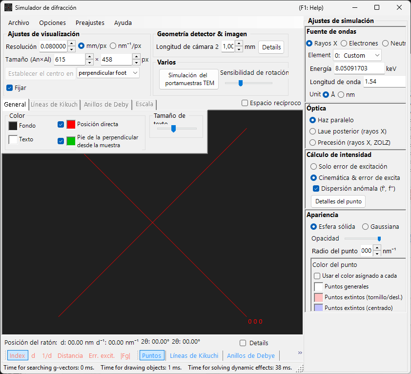

# Simulación de difracción de rayos X / neutrones

La **simulación de difracción de rayos X / neutrones** calcula patrones de difracción de monocristal para rayos X y neutrones. Es uno de los modos principales del [simulador de difracción](index.md).

> Esta página enumera cada ajuste que aparece en el lado derecho cuando selecciona **Wave Length = X-ray** (o neutron). Para operaciones que afectan a toda la ventana, como dibujar y guardar, consulte la [página de descripción general](index.md).

Condiciones de la GUI: Wave Length = X-ray / Neutron · Incident beam = Parallel / Precession (X-ray) / Back-Laue · Intensity calculation = Only excitation error / Kinematical

---

## Descripción general

Los rayos X tienen una longitud de onda mayor que los electrones (Cu Kα: 0.15406 nm = 1.5406 Å), por lo que la esfera de Ewald está más fuertemente curvada. Como resultado, menos puntos de la red recíproca satisfacen simultáneamente la condición de difracción que en el caso de los electrones. Dado que el poder de dispersión atómico es pequeño y la dispersión múltiple es débil, la teoría cinemática de la difracción ofrece una precisión suficiente para las intensidades (el cálculo dinámico solo se admite para electrones).

---

## Wave Length

Seleccione **X-ray** como fuente de radiación. Los rayos X pueden especificarse de dos maneras: rayos X característicos y radiación de sincrotrón.

### Rayos X característicos

Elegir un **elemento** y una **transición** fija la longitud de onda de los rayos X característicos. La transición se especifica en notación de Siegbahn (Kα₁ / Kα₂ / Kβ, etc.). Longitudes de onda Kα₁ de elementos representativos:

| Elemento | Línea | Longitud de onda (Å) | Energía (keV) |
|---------|------|-----------------|--------------|
| Cu | Kα₁ | 1.5406 | 8.048 |
| Mo | Kα₁ | 0.7107 | 17.479 |
| Co | Kα₁ | 1.7890 | 6.930 |
| Cr | Kα₁ | 2.2910 | 5.415 |

### Radiación de sincrotrón

Establezca **Element** en **0: Custom** e introduzca directamente la energía (keV) o la longitud de onda (Å). Puede utilizarse cualquier longitud de onda.

---

## Modo del haz incidente

Selecciona la geometría del haz incidente. Hay tres modos disponibles para los rayos X.

### Parallel

La onda plana estándar. Un haz incidente paralelo utilizado para SAED y difracción de rayos X de monocristal.

### Precession (X-ray) — cámara de precesión

Simula una cámara de precesión de rayos X. Se trata de una fotografía de precesión que captura una sola capa de la red recíproca.

### Back-Laue (Laue de retrorreflexión)

Simula un patrón de Laue de retrorreflexión con rayos X blancos (policromáticos). En esta geometría de retrorreflexión, el detector se coloca en el lado de la fuente y **Monochrome** se desactiva. La geometría de reflexión viene dada por **Tau / Phi** en **Detector geometry** (consulte [Detector geometry](index.md#detector-geometry)).

> **Nota**: Las opciones del haz incidente dependen de la longitud de onda. **Precession (electron)** y **Convergence (CBED)** aparecen solo cuando se selecciona radiación de electrones, mientras que las opciones **Precession (X-ray)** y **Back-Laue** anteriores aparecen solo cuando se selecciona radiación de rayos X. Para los neutrones, solo está disponible **Parallel**. Según el estado en el momento de la captura, la captura de pantalla puede no mostrar las opciones específicas de rayos X.

---

## Cálculo de la intensidad

Selecciona el método utilizado para calcular las intensidades de los puntos. Hay dos modos disponibles para los rayos X.

### Only excitation error

La intensidad se determina únicamente por la distancia geométrica entre la esfera de Ewald y el punto de la red recíproca (el error de excitación $s_g$). Un $\lvert s_g \rvert$ menor da una intensidad mayor, con un máximo en el valor establecido por **Radius**, y cae a cero cuando $\lvert s_g \rvert$ supera el valor de Radius. El factor de estructura se ignora.

### Kinematical & excitation error

Además del error de excitación, el factor de estructura cinemático $\lvert F_{hkl} \rvert^2$ se incorpora a la intensidad. Las reglas de extinción se obedecen estrictamente. Los factores de Lorentz y de polarización no se incluyen (se trata de una simulación del patrón geométrico).

> **Nota**: La **teoría dinámica** está deshabilitada para los rayos X (disponible solo cuando se selecciona radiación de electrones).

---

## Apariencia de los puntos

Controla cómo se renderiza cada punto de difracción.

- **Solid sphere / Gaussian** : modelo geométrico del punto de la red recíproca. **Solid sphere** utiliza la sección transversal entre una esfera de radio *R* y la esfera de Ewald (el área del círculo corresponde a la intensidad de difracción); **Gaussian** utiliza la sección transversal entre una gaussiana 3D con σ = *R* y la esfera de Ewald (la integral de la gaussiana 2D corresponde a la intensidad de difracción).
- **Opacity** : transparencia del punto (0 = transparente, 1 = opaco).
- **Radius (R)** : radio del punto de la red recíproca. El tamaño renderizado del punto se determina por la combinación de **Appearance** e **Intensity calculation**.
- **Brightness** : activo solo en el modo **Gaussian**. Establece la intensidad integrada de la gaussiana renderizada.
- **Color scale** : elija entre los mapas de color **Gray scale** y **Cold-warm**.
- **Log scale** : muestra las intensidades en una escala logarítmica.
- **Spot color** : color predeterminado del punto cuando la escala de color no se aplica.
- **Use crystal color** : cuando está marcada, dibuja los puntos con el color asignado a cada cristal.

---

## Anillos de Debye (policristalino)

Pueden mostrarse los anillos de Debye de una muestra policristalina. Active **Debye rings** en la barra de herramientas (consulte [Barra de herramientas](index.md#toolbar)).

- **Ignore diffraction intensity** : dibuja todos los anillos con el mismo color e intensidad (se utiliza para una comparación puramente geométrica que ignora el factor de estructura).
- **Show index label** : muestra el índice (*hkl*) cerca de cada anillo.

Los ajustes detallados se encuentran en la pestaña Debye rings del [menú de pestañas](index.md#drawing-overlay-tabs).

---

## Difracción de neutrones

Seleccionar **Neutron** en el control Wave Length calcula un patrón de difracción de neutrones. Introduzca la energía (meV) o la longitud de onda (nm). El haz incidente solo puede ser **Parallel**. El cálculo de la intensidad puede ser **Only excitation error** o **Kinematical** (Dynamical no está disponible). La intensidad cinemática utiliza la longitud de dispersión de neutrones en lugar del factor de dispersión atómico.

---

## Diferencias entre la difracción de rayos X y de electrones

| Característica | Difracción de rayos X | Difracción de electrones |
|---------|-------------------|----------------------|
| Longitud de onda | Larga (0.5–2.5 Å) | Corta (0.02–0.04 Å) |
| Curvatura de la esfera de Ewald | Grande | Pequeña (casi plana) |
| Reflexiones simultáneas | Pocas | Muchas |
| Factor de dispersión | Factor de dispersión atómico $f(s)$ | Factor de dispersión de electrones $f_e(s)$ |
| Efectos dinámicos | Generalmente pequeños | Grandes |
| Reglas de extinción | Estrictamente obedecidas | Pueden ser violadas por la dispersión múltiple |

---

## Operaciones comunes

Para operaciones que afectan a toda la ventana, como la longitud de cámara, la geometría del detector, el guardado de patrones y los ajustes de color, consulte la [página de descripción general](index.md). La geometría detallada del detector se configura en la ventana de geometría que se muestra a continuación.

---

## Véase también

- [Simulador de difracción (descripción general)](index.md)
- [Simulación SAED](1-saed-simulation.md)
- [Simulación de difracción de electrones por precesión (PED)](2-ped-simulation.md)
- [Simulación de difracción de electrones de haz convergente (CBED)](3-cbed-simulation.md)
- [Sistema de coordenadas — orientación del cristal](../appendix/a1-coordinate-system/1-orientation.md)
