# Crystal Diffraction (Simulador de difracción)

**Crystal Diffraction (Simulador de difracción)** simula patrones de difracción de rayos X, neutrones y electrones de monocristal.

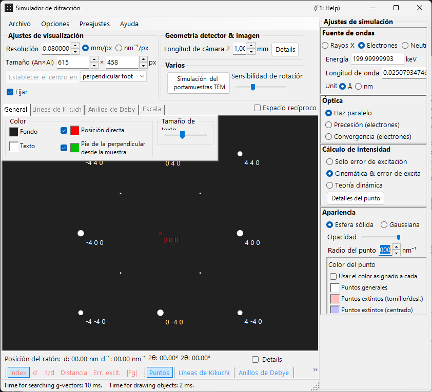

La ventana tiene un área de dibujo del patrón de difracción a la **izquierda** y, a la **derecha**, los paneles de ajustes para las propiedades de los reflejos (longitud de onda, haz incidente, cálculo de intensidad, apariencia, etc.). La combinación de longitud de onda y haz incidente determina el modo de adquisición (difracción de rayos X, SAED, PED, CBED), y los paneles de la derecha se reconfiguran en consecuencia.

---

## Cómo se reparten el trabajo esta página y las páginas de cada modo

- **Esta página (centro)**: reúne las operaciones comunes a todos los modos (atajos, menús, barra de herramientas, información de pantalla/detector, pestañas de superposición, información de reflejos, geometría del detector, compresión dinámica).
- **Cada página de modo**: cubre **todos los ajustes que aparecen a la derecha** cuando ese modo está seleccionado (longitud de onda, haz incidente, cálculo de intensidad, apariencia, ajustes de ondas de Bloch, ajustes de precesión, etc.), de modo que cada página es autónoma (existe cierto solapamiento entre los modos).

| Modo | Contenido | Página |
|------|----------|------|
| **Difracción de rayos X (y de neutrones)** | Patrón de difracción de rayos X / neutrones de monocristal (paralelo, rayos X de precesión, Back Laue) | [Simulación de difracción de rayos X](4-x-ray-neutron-diffraction.md) |
| **SAED** | Difracción de electrones con haz paralelo (selected-area electron diffraction) | [Simulación SAED](1-saed-simulation.md) |
| **PED** | Difracción de electrones por precesión | [Simulación PED](2-ped-simulation.md) |
| **CBED** | Difracción de electrones por haz convergente | [Simulación CBED](3-cbed-simulation.md) |

---

## Referencia rápida de modos

Busque la página que necesita a partir de la combinación de **longitud de onda (fuente)** y **haz incidente**.

| Longitud de onda | Haz incidente | Modo | Página |
|------------|--------------------|------|------|
| Electrón | Paralelo | SAED | [Simulación SAED](1-saed-simulation.md) |
| Electrón | Precesión (electrón = PED) | PED | [Simulación PED](2-ped-simulation.md) |
| Electrón | Convergencia (CBED) | CBED | [Simulación CBED](3-cbed-simulation.md) |
| Rayos X | Paralelo | Difracción de rayos X | [Simulación de difracción de rayos X](4-x-ray-neutron-diffraction.md) |
| Rayos X | Precesión (rayos X) | Rayos X de precesión (cámara de precesión) | [Simulación de difracción de rayos X](4-x-ray-neutron-diffraction.md) |
| Rayos X | Back Laue | Laue de retrorreflexión | [Simulación de difracción de rayos X](4-x-ray-neutron-diffraction.md) |
| Neutrón | Paralelo | Difracción de neutrones | [sección de neutrones de la Simulación de difracción de rayos X](4-x-ray-neutron-diffraction.md) |

> **Note**: Las opciones de haz incidente cambian con la longitud de onda. Para electrones: **Parallel, Precession (electron = PED), Convergence (CBED)**; para rayos X: **Parallel, Precession (X-ray), Back Laue**; para neutrones: solo **Parallel**. Al seleccionar **Precession (electron = PED)** o **Convergence (CBED)** se cambia automáticamente el cálculo de intensidad a **Dynamical**.

---

## Atajos de teclado y ratón

Estos se aplican a la ventana del patrón de difracción compartida por las simulaciones de rayos X, SAED y PED. Arrastrar sobre el patrón rota el **cristal**. Aquí **no hay zoom con la rueda del ratón** — haga zoom con clic derecho / arrastre con el botón derecho.

| Atajo | Acción |
|----------|--------|
| <kbd>F1</kbd> | Abrir esta página del manual en línea |
| Arrastre con el botón izquierdo cerca del centro | Inclinar el cristal |
| Arrastre con el botón izquierdo en la zona exterior | Girar el cristal en torno al eje del haz |
| Doble clic izquierdo en un reflejo | Mostrar los detalles del reflejo (índice, *d*, factor de estructura, error de excitación) |
| Arrastre con el botón central | Desplazar el patrón |
| <kbd>CTRL</kbd> + arrastre con el botón central | Mover el centro del detector (cuando se muestra el área del detector) |
| Clic derecho | Alejar el zoom |
| Arrastre de un recuadro con el botón derecho | Acercar el zoom a la región seleccionada |
| Doble clic derecho en la barra de estado | Copiar un resumen de texto de los ajustes actuales |
| Doble clic derecho en un botón de capa activa (Spots / Kikuchi / Debye / Scale) | Hacer parpadear esa capa para activarla y desactivarla |

Las ventanas auxiliares que se abren desde aquí añaden algunos más:

| Atajo | Acción |
|----------|--------|
| Doble clic izquierdo en el estereograma — **TEM holder** | Fijar la inclinación del portamuestras en ese punto |
| Teclas de flecha — **TEM holder** | Cambiar la inclinación del portamuestras paso a paso (marque antes **Arrow keys**) |
| Soltar un archivo `.prm` o una imagen — **Detector geometry** | Cargar la geometría del detector / imagen de superposición |
| Soltar un perfil `.txt` — **Dynamic compression** | Cargar un perfil de presión/tiempo (arrastre la línea roja del gráfico para desplazarse) |

Los atajos <kbd>CTRL</kbd>+<kbd>SHIFT</kbd> de toda la aplicación de la ventana principal también funcionan mientras esta ventana tiene el foco (consulte la [ventana principal](../0-main-window.md)).

→ Consulte **[21. Atajos de teclado y ratón](../21-shortcuts.md)** para ver todas las ventanas de un vistazo.

---

## Rutas rápidas por objetivo

| Objetivo | Empezar desde | Referencia |
|------|------------|-----------|
| Producir difracción de electrones con haz paralelo (SAED) | Poner **Incident beam** en **Parallel** y **Wavelength** en electrón | [Simulación SAED](1-saed-simulation.md), [cálculo SAED de haz paralelo](../appendix/a3-bloch-wave/calculation.md) |
| Producir difracción de rayos X de monocristal | Cambiar **Wavelength** a rayos X / Synchrotron | [Simulación de difracción de rayos X](4-x-ray-neutron-diffraction.md) |
| Producir difracción de electrones por precesión (PED) | Poner **Incident beam** en **Precession (electron)** y luego fijar el semiángulo y el paso | [Simulación PED](2-ped-simulation.md) |
| Producir difracción de electrones por haz convergente (CBED) | Poner **Incident beam** en **Convergence (CBED, electron only)** y fijar las condiciones en la ventana CBED | [Simulación CBED](3-cbed-simulation.md), [cálculo CBED](../appendix/a3-bloch-wave/cbed.md) |
| Inspeccionar la lista de reflejos del cálculo dinámico | Seleccionar **Dynamical** y abrir **Spot Details** o **Details** | [Cálculo dinámico (núcleo compartido)](../appendix/a3-bloch-wave/calculation.md) |
| Comparar la geometría del detector con una imagen experimental | Abrir los ajustes de geometría del detector desde **Details** y usar la imagen de superposición | [Sistema de coordenadas del detector](../appendix/a1-coordinate-system/2-diffraction.md) |

---

## Área principal

El patrón de difracción se simula en el centro de la pantalla.

### Manejo con el ratón

Consulte "Atajos de teclado y ratón" al principio de esta página.

### Posición del ratón

La información correspondiente a la posición del cursor (cursor *q*, *d*, 2θ, azimut, etc.) se muestra en la línea de estado situada sobre el patrón. Marcar **Details** añade información más detallada (el (*hkl*) del reflejo más cercano, el error de excitación, el factor de estructura, etc.).

---

## Menú File

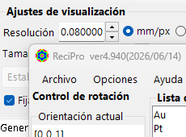

| Elemento de menú | Descripción |
|-----------|-------------|
| **Save** | Guardar el patrón de difracción mostrado en un archivo. |
| **Save detector area** | Guardar solo el recorte del área del detector. |
| **Copy** | Copiar la imagen mostrada al portapapeles. |
| **Copy detector area** | Copiar solo el recorte del área del detector. |

### Preset {#toolbar}

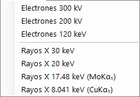

Guarde y recupere una configuración completa del simulador — longitud de onda, geometría del detector, ajustes de las pestañas, propiedades de los reflejos, etc. — como un preset. Útil para alternar rápidamente entre instrumentos / modos de adquisición.

---

## Barra de herramientas

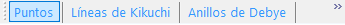

| Botón | Descripción |
|--------|-------------|
| Spots | Mostrar / ocultar la capa de reflejos de difracción |
| Kikuchi | Mostrar / ocultar la capa de líneas de Kikuchi |
| Debye | Mostrar / ocultar la capa de anillos de Debye |
| Scale | Mostrar / ocultar la capa de líneas de escala |
| Index / d / 1/d / Distance / 2θ / χ / Excitation error / Structure factor | Elección de la etiqueta asociada a cada reflejo |

---

## Información de pantalla y detector

### Pantalla

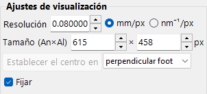

| Elemento | Descripción |
|------|-------------|
| **Resolution** | El tamaño de un píxel (mm). No tiene por qué coincidir con el tamaño real de píxel del detector; se trata como una escala de visualización y se actualiza automáticamente cuando hace zoom con el ratón. |
| **Size (W×H)** | Ancho y alto en píxeles del área de dibujo. Según la resolución de su pantalla, es posible que no se puedan establecer valores muy grandes. |
| **Set centre / Fix centre** | Fijar el centro del patrón en cualquier píxel del área de dibujo y, si es necesario, fijarlo. Cuando está fijado, el centro no se puede mover desplazando con el ratón. |
| **Horizontal flip / Vertical flip / Negative image** | Inversiones geométricas (horizontal / vertical) e inversión de contraste del patrón mostrado. Úselas para igualar la orientación o el contraste de una imagen experimental. |
| **Reciprocal space** | Superpone la esfera de Ewald y los vectores de la red recíproca sobre el patrón, visualizando qué reflejos están excitados. |

### Detector (longitud de cámara)

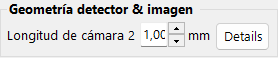

- **Camera length** : Distancia de la muestra al detector (mm).
- **Details** : Abre la ventana de ajustes de geometría del detector (consulte [Geometría del detector](#detector-geometry) más abajo).

### Misc

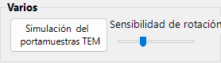

- **Rotation sensitivity** : Cantidad de rotación del cristal por píxel de arrastre del ratón.
- **TEM holder simulation** : Abre la ventana de simulación vinculada al portamuestras (consulte más abajo).

---

## Simulación del portamuestras TEM {#drawing-overlay-tabs}

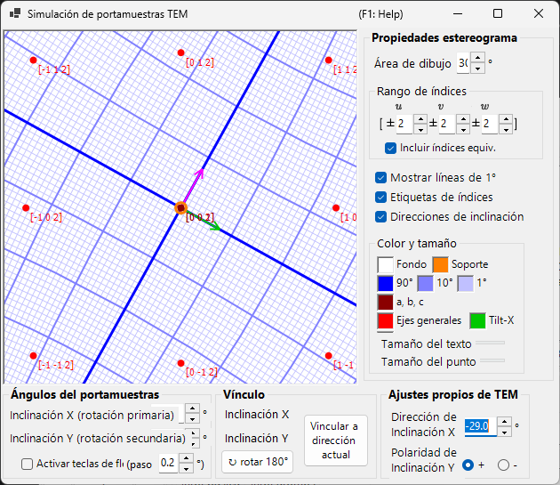

Abre una ventana que vincula el patrón de difracción a un **TEM holder** de doble inclinación (o de rotación). Establecer los ángulos de inclinación del portamuestras actualiza el patrón y la orientación del cristal, y las orientaciones alcanzables pueden mostrarse en un estereograma (añadido en v4.914). El doble clic izquierdo en el estereograma fija la inclinación del portamuestras en ese punto, y al marcar **Arrow keys** las teclas de flecha permiten cambiar la inclinación paso a paso.

---

## Pestañas de superposición del dibujo

### General

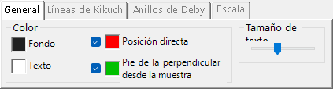

Establece los colores de los reflejos, las etiquetas, las líneas de Kikuchi, los anillos de Debye y otras superposiciones. Los ajustes de aquí se aplican a todos los modos de representación.

### Líneas de Kikuchi

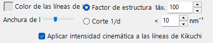

Activa cuando las líneas de Kikuchi están habilitadas en la barra de herramientas.

- **Reflection selection** : Elige qué reflejos generan las líneas de Kikuchi. Bien por **structure factor** (los *N* reflejos principales según $\lvert F_{hkl}\rvert$) o por **1/d cutoff** (todos los reflejos cuyo 1/d está por debajo del umbral (nm⁻¹)).
- **Line appearance** : Establece el grosor de la línea, el color de las líneas de Kikuchi y **Draw with kinematical intensity** (escala la oscuridad de la línea según la intensidad cinemática del reflejo).
- **Threshold** : Un parámetro heredado. Ejecuta el cálculo de las líneas de Kikuchi solo para los reflejos con un *d* mayor que el valor especificado (conservado por compatibilidad).

### Anillos de Debye

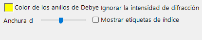

Activa cuando los anillos de Debye están habilitados en la barra de herramientas.

- **Ignore diffraction intensity** : Si está marcada, todos los anillos de Debye se dibujan con el mismo color e intensidad (ignorando el factor de estructura del cristal). Úsela para una comparación puramente geométrica.
- **Show index label** : Si está marcada, el (*hkl*) aparece cerca de cada anillo.

### Scale

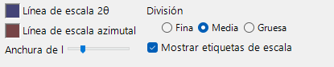

Activa cuando las líneas de escala están habilitadas en la barra de herramientas.

- **2θ / Azimuth scale lines** : **2θ** representa un ángulo de dispersión constante (círculos concéntricos), **Azimuth** representa un ángulo azimutal constante (líneas radiales desde el centro). Los colores se configuran de forma independiente.
- **Line width** : Grosor de las líneas de escala.
- **Division** : Intervalo angular entre líneas de escala adyacentes.
- **Show scale labels** : Si se dibujan etiquetas numéricas sobre las líneas de escala.

### Misc {#diffraction-spot-information}

Ajustes diversos, como la sensibilidad de rotación con el ratón.

- **Mouse sensitivity** : Cantidad de rotación del cristal por píxel de arrastre del ratón.

---

## Información de los reflejos de difracción

Lista los detalles por reflejo calculados con el método de ondas de Bloch (cálculo dinámico). Ábrala con el botón **Spot Details** (panel de cálculo de intensidad) o con la casilla **Details**.

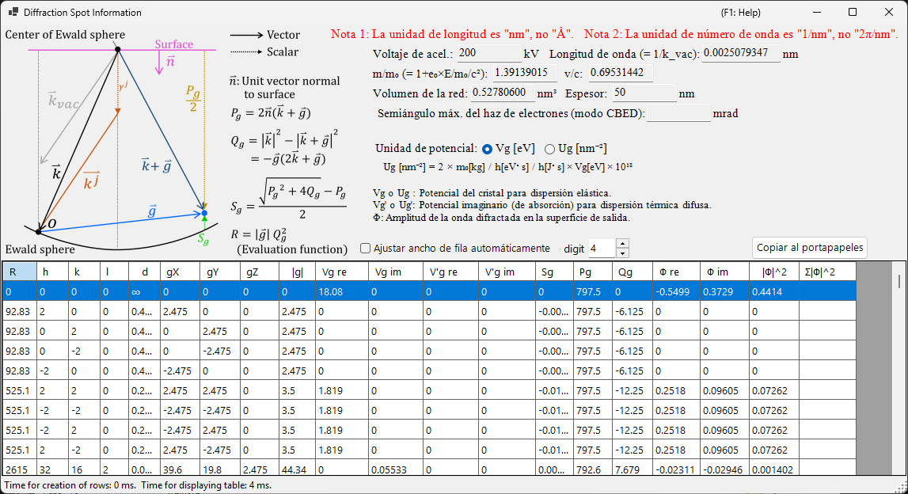

### Esquema y definiciones

El esquema (arriba a la izquierda) muestra los vectores sobre la esfera de Ewald y define las magnitudes empleadas en la tabla ($\hat{\mathbf{n}}$ es el vector unitario normal a la superficie de la muestra, $\mathbf{k}$ es el vector de onda incidente, $\mathbf{g}$ es el vector de la red recíproca).

- $P_g = 2\,\hat{\mathbf{n}} \cdot (\mathbf{k} + \mathbf{g})$
- $Q_g = |\mathbf{k}|^2 - |\mathbf{k} + \mathbf{g}|^2 = -\mathbf{g} \cdot (2\mathbf{k} + \mathbf{g})$
- **Error de excitación:** $S_g = \dfrac{\sqrt{P_g^2 + 4 Q_g} - P_g}{2}$
- **Función de evaluación:** $R = |\mathbf{g}|\, Q_g^2$ — ordena los reflejos según la intensidad con que están excitados (menor = más cerca de la esfera de Ewald = más fuertemente excitado; el haz transmitido $g=0$ tiene $R=0$ y aparece primero). La tabla está ordenada por $R$ ascendente.

### Columnas de la tabla

| Columna | Significado |
|--------|---------|
| **R** | función de evaluación $R = \lvert\mathbf{g}\rvert\, Q_g^2$ (arriba; usada para seleccionar / ordenar los reflejos) |
| **h, k, (i,) l** | índices de Miller (*i* es el índice hexagonal redundante, mostrado solo para cristales hexagonales) |
| **d** | distancia interplanar (nm) |
| **gX, gY, gZ** | componentes del vector de la red recíproca *g* (1/nm) |
| **\|g\|** | módulo de *g* (1/nm) |
| **Vg re / Vg im** | coeficiente de Fourier del potencial cristalino para la dispersión elástica, $V_g$ (real / imaginario) |
| **V'g re / V'g im** | potencial imaginario (de absorción) para la dispersión térmica difusa (TDS), $V'_g$ (real / imaginario) |
| **Sg** | error de excitación $S_g$ (arriba; 1/nm) |
| **Pg** | magnitud auxiliar $P_g = 2\,\hat{\mathbf{n}}\cdot(\mathbf{k}+\mathbf{g})$ (arriba) |
| **Qg** | magnitud auxiliar $Q_g = -\mathbf{g}\cdot(2\mathbf{k}+\mathbf{g})$ (arriba) |
| **Φ re / Φ im** | amplitud compleja $\Phi$ de la onda difractada dinámica en la superficie de salida (real / imaginaria) |
| **\|Φ\|^2** | intensidad difractada $\lvert\Phi\rvert^2$ de ese reflejo |
| **Σ\|Φ\|^2** | suma acumulada de $\lvert\Phi\rvert^2$ (total sobre los reflejos; útil como comprobación de la conservación de la intensidad) |

### Unidades de potencial y otros controles

- **Unit of potential** : Cambia el potencial mostrado entre **Vg [eV]** (potencial electrostático, eV) y **Ug [nm⁻²]** (la magnitud escalada $U_g = (2 m_0/h^2)\, V_g$ que entra en las ecuaciones de ondas de Bloch). Los encabezados de columna cambian en consecuencia entre *Vg / V'g* y *Ug / U'g*.
- Sobre la tabla se muestran el voltaje de aceleración, la longitud de onda ($\lambda = 1/k_\text{vac}$), la relación de masa relativista $m/m_0$, la relación de velocidad $v/c$, el volumen de la red, el espesor de la muestra y (en modo CBED) el semiángulo máximo del haz de electrones.
- **Note 1:** la unidad de longitud es **nm**, no Å. **Note 2:** la unidad de número de onda es **1/nm**, no 2π/nm.
- **Effective digit** : número de cifras significativas mostradas en la tabla. **Auto resize row width** : ajustar automáticamente el ancho de las columnas. **Copy to clipboard** : exporta la tabla como texto que puede pegarse en una hoja de cálculo. (Este formulario se muestra en inglés incluso con una interfaz en japonés.)

---

## Geometría del detector {#detector-geometry}

Una ventana para la configuración detallada de la geometría del detector (longitud de cámara, inclinación, rotación) y la superposición de una imagen experimental. Ábrala desde **Details** en el panel **Detector geometry**.

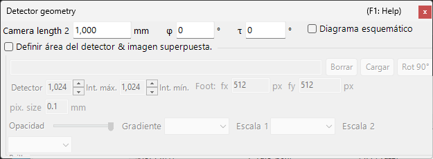

### Ajustes de geometría del detector

Especifique la geometría de reflexión, como la longitud de cámara y la inclinación del detector (**Tau / Phi**). Para Back Laue (Laue de retrorreflexión), establezca aquí la geometría que sitúa el detector en el lado de la fuente.

### Área del detector e imagen superpuesta

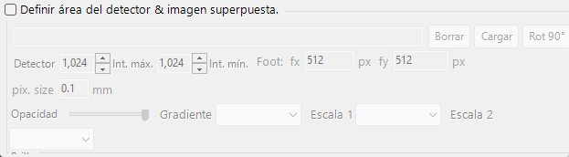

Especifique el área activa del detector y suelte una imagen experimental para superponerla. Use esto para superponer el patrón simulado y una imagen experimental y ajustar con precisión la geometría del detector.

Consulte también el [sistema de coordenadas del detector](../appendix/a1-coordinate-system/2-diffraction.md) para las definiciones del sistema de coordenadas.

---

## Compresión dinámica

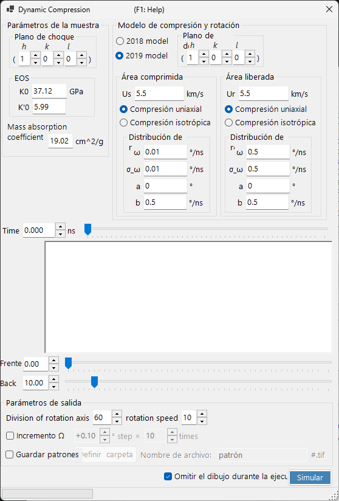

Una ventana para recorrer el perfil de presión/tiempo de un experimento de alta presión (compresión dinámica). Suelte un perfil de presión/tiempo `.txt` sobre esta ventana para cargarlo y luego arrastre la línea roja del gráfico para recorrer de forma continua el tiempo (la presión) mientras se refleja el estado correspondiente en el patrón de difracción.

---

## Temas relacionados

- [Simulación de difracción de rayos X](4-x-ray-neutron-diffraction.md)
- [Simulación SAED](1-saed-simulation.md)
- [Simulación PED](2-ped-simulation.md)
- [Simulación CBED](3-cbed-simulation.md)
- [Cálculo dinámico (núcleo compartido)](../appendix/a3-bloch-wave/calculation.md)
- [Sistema de coordenadas del detector](../appendix/a1-coordinate-system/2-diffraction.md)
