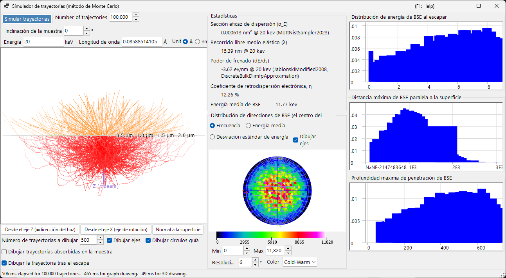
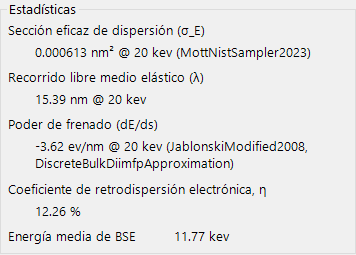
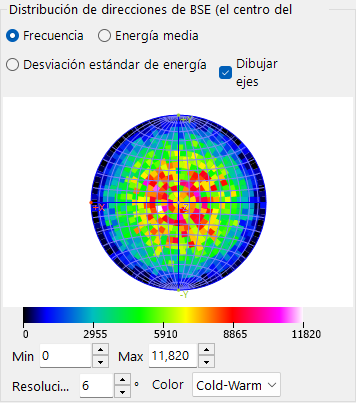
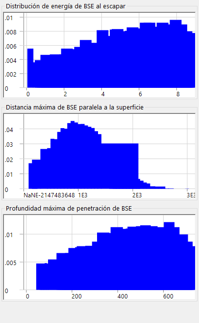

# Trayectorias electrónicas

El **Simulador de trayectorias** calcula las trayectorias de los electrones dentro de una muestra mediante el **método de Monte-Carlo**: los electrones incidentes experimentan dispersión elástica e inelástica, y se acumulan las distribuciones resultantes de los electrones retrodispersados (dirección, energía, profundidad de penetración). Estas distribuciones también alimentan la ponderación angular/de energía/de profundidad utilizada por la [12. Simulación EBSD](12-ebsd-simulation.md).

---

## Atajos de teclado y ratón

Las trayectorias se muestran en una vista 3-D de OpenGL. Utiliza la [navegación de vista](21-shortcuts.md) estándar de ReciPro, pero **el desplazamiento está deshabilitado** — utilice los botones de vista predefinida para saltar a las orientaciones estándar.

| Atajo | Acción |
|----------|--------|
| <kbd>F1</kbd> | Abrir esta página del manual en línea |
| Arrastrar con el botón izquierdo | Rotar el modelo |
| Arrastrar con el botón derecho arriba/abajo, o rueda del ratón | Zoom |
| <kbd>CTRL</kbd> + doble clic derecho | Alternar entre proyección ortográfica / en perspectiva |

→ Consulte **[21. Atajos de teclado y ratón](21-shortcuts.md)** para ver de un vistazo todas las ventanas.

---

## Condiciones de cálculo

Energía del haz, número de electrones incidentes, muestra/material y otros parámetros de Monte-Carlo (consulte la captura de pantalla general de arriba).

### Energía del haz

Voltaje de aceleración del haz de electrones incidente (keV). Establece la energía cinética utilizada tanto para los modelos de dispersión elástica (Mott) como inelástica (respuesta dieléctrica).

### Número de electrones incidentes

Cuántos electrones se simularán. Más electrones reducen el ruido estadístico, pero aumentan el tiempo de ejecución de forma lineal.

### Muestra / material

Composición y densidad de la muestra. Por defecto utiliza el cristal seleccionado actualmente en la ventana principal, pero puede sobrescribirse para estudios exclusivos de trayectorias.

### Inclinación de la muestra

Ángulo de inclinación de la muestra. Se utiliza cuando los datos de trayectorias alimentan el [simulador EBSD](12-ebsd-simulation.md) (normalmente 70° para EBSD).

### Modelo de sección eficaz

El modelo de la sección eficaz de dispersión elástica (Mott / Bethe / NIST). Los distintos modelos sacrifican velocidad por precisión con ángulos de inclinación grandes o cerca de los bordes de absorción.

---

## Opciones del estereograma

Opciones de visualización para la distribución angular dibujada sobre la proyección estereográfica (consulte la captura de pantalla general de arriba).

### Método de proyección

Proyección **Wulff** (de igual ángulo) o **Schmidt** (de igual área). Schmidt suele preferirse al leer la densidad estadística.

### Hemisferio

Representa el hemisferio superior (retrodispersado) o inferior (transmitido).

### Resolución / Escala de color

Tamaño de clase del histograma angular y el mapa de color utilizado para la visualización de la densidad.

---

## Estadísticas

Resumen de la ejecución.

- **Rendimiento de retrodispersión** — fracción de electrones incidentes que salen a través de la superficie de entrada.
- **Recorrido libre medio** — distancia promedio entre eventos de dispersión.
- **Profundidad de penetración media** — profundidad máxima promedio alcanzada por un electrón antes de salir o ser absorbido.
- **Tiempo transcurrido / Rendimiento** — coste en tiempo real de la ejecución.

---

## Distribución direccional de BSE

Distribución angular de los electrones retrodispersados (el centro del estereograma corresponde a la dirección normal a la superficie). El contorno amarillo/naranja (cuando está presente) marca la región subtendida por el detector EBSD.

---

## Perfiles

Perfiles de profundidad y energía de los electrones simulados.

### Perfil de profundidad

Histograma de la profundidad final de salida (nm) de los electrones retrodispersados. Lo utiliza el simulador EBSD para ponderar la integración en profundidad del master pattern.

### Perfil de energía

Histograma de la pérdida de energía ΔE (keV) de los electrones retrodispersados. Lo utiliza el simulador EBSD para ponderar la integración en energía.

---

## Véase también

- [Simulación EBSD](12-ebsd-simulation.md)
- [Cálculo EBSD](appendix/a3-bloch-wave/ebsd.md)
- [Difracción dinámica (onda de Bloch)](appendix/a3-bloch-wave/index.md)
- [Simulador HRTEM/STEM](9-hrtem-stem-simulator/index.md)
- [Simulador de difracción](7-diffraction-simulator/index.md)
