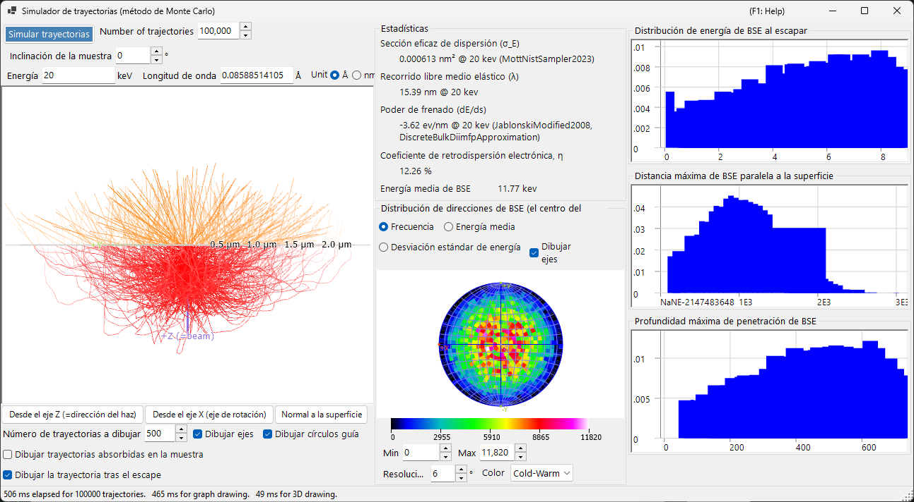
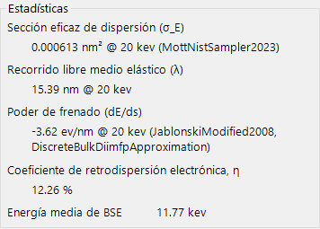
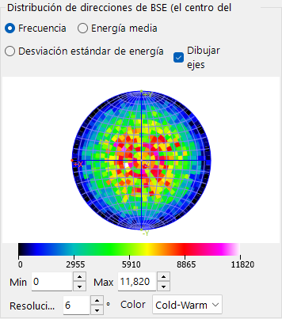
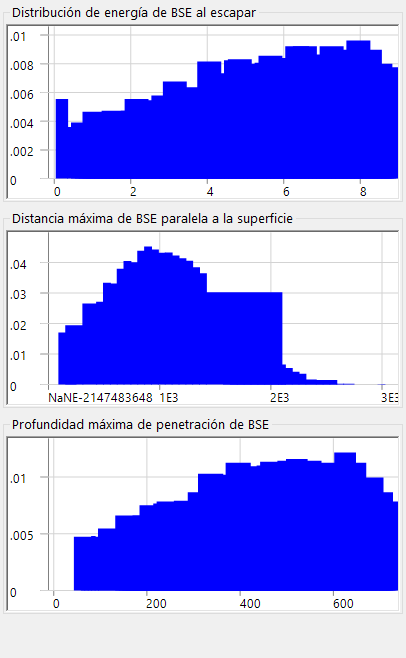

# Trayectorias electrónicas

El **Simulador de trayectorias (método de Monte Carlo)** calcula las trayectorias de los electrones dentro de una muestra mediante el **método de Monte Carlo**: los electrones incidentes experimentan dispersión elástica e inelástica, y se acumulan las distribuciones resultantes de los electrones retrodispersados (BSE): dirección, energía al escapar, profundidad de penetración y extensión lateral. Estas distribuciones también alimentan la ponderación angular/de energía/de profundidad utilizada por la [12. Simulación EBSD](12-ebsd-simulation.md).

La ventana tiene tres columnas: la **vista 3-D de trayectorias** a la izquierda, las **Estadísticas** y el estereograma de **Distribución de direcciones de BSE** en el centro, y tres **histogramas** a la derecha. La composición y la densidad de la muestra se toman del cristal seleccionado en la ventana principal; aquí solo se ajustan la energía del haz, la inclinación de la muestra y el número de trayectorias.

---

## Atajos de teclado y ratón

Las trayectorias se muestran en una vista 3-D de OpenGL. Utiliza la [navegación de vista](21-shortcuts.md) estándar de ReciPro, pero **el desplazamiento está deshabilitado**: utilice los botones de vista predefinida para saltar a las orientaciones estándar.

| Atajo | Acción |
|----------|--------|
| <kbd>F1</kbd> | Abrir esta página del manual en línea |
| Arrastrar con el botón izquierdo | Rotar el modelo |
| Arrastrar con el botón derecho arriba/abajo, o rueda del ratón | Zoom |
| <kbd>CTRL</kbd> + doble clic derecho | Alternar entre proyección ortográfica / en perspectiva |

→ Consulte **[21. Atajos de teclado y ratón](21-shortcuts.md)** para ver de un vistazo todas las ventanas.

---

## Condiciones de cálculo

Los controles de la parte superior de la ventana configuran la ejecución:

- **Simular trayectorias** : inicia la ejecución de Monte Carlo. La barra de estado de la parte inferior muestra por separado el tiempo empleado en el cálculo de trayectorias, en el dibujo de los gráficos y en la representación 3-D.
- **Number of trajectories** : cuántos electrones incidentes se siguen. Más electrones reducen el ruido estadístico de todas las distribuciones descritas más abajo, a costa de un tiempo de ejecución que crece linealmente.
- **Inclinación de la muestra** (°) : inclinación de la superficie de la muestra alrededor del eje *X*. Déjela en 0 para incidencia normal; utilice **−70°** para reproducir la geometría del [simulador EBSD](12-ebsd-simulation.md), donde la gran inclinación aumenta el rendimiento de retrodispersión.
- **Energy** (keV) / **Wavelength** / **Unit** : el voltaje de aceleración del haz incidente y la longitud de onda del electrón asociada, con corrección relativista. La energía fija la energía cinética utilizada tanto por el modelo elástico (Mott del NIST) como por los inelásticos (poder de frenado / IMFP).

Los modelos de dispersión en sí no son seleccionables por el usuario: las secciones eficaces elásticas proceden de la tabla de Mott del NIST incluida (con Rutherford apantallado como alternativa fuera de su rango), y el poder de frenado de la forma de Jablonski modificada (2008). El modelo realmente utilizado se indica junto a cada valor en **Estadísticas**. Consulte [Atenuación y transporte](appendix/a2-beam-interaction/attenuation-transport.md) para saber en qué consisten estos modelos.

### Vista 3-D de trayectorias

Las trayectorias rojas corresponden a electrones absorbidos en la muestra, y las naranjas a los que escapan como electrones retrodispersados. Los círculos guía concéntricos están rotulados en nm (o µm), y **+X**, **+Y**, **+Z (=beam)** marcan los ejes.

- **Desde el eje Z (=dirección del haz)** / **Desde el eje X (eje de rotación)** / **Normal a la superficie** : ajustan la vista a las direcciones estándar.
- **Número de trayectorias a dibujar** : cuántas de las trayectorias calculadas se representan (dibujar las 100 000 sería ilegible y lento).
- **Dibujar ejes** / **Dibujar círculos guía** : las flechas de los ejes y la escala de distancias.
- **Dibujar trayectorias absorbidas en la muestra** : incluye los electrones que nunca escapan.
- **Dibujar la trayectoria tras el escape** : sigue dibujando la trayectoria de un electrón retrodispersado después de que haya abandonado la superficie.

---

## Estadísticas

Valores para la energía del haz actual, con el modelo que ha producido cada uno indicado entre corchetes.

- **Sección eficaz de dispersión (σ_E)** (nm²): sección eficaz elástica total por átomo.
- **Recorrido libre medio elástico (λ)** (nm): distancia media entre eventos de dispersión elástica.
- **Poder de frenado (dE/ds)** (eV/nm, negativo): energía perdida por unidad de longitud de trayectoria.
- **Coeficiente de retrodispersión electrónica, η** (%): fracción de electrones incidentes que vuelven a salir por la superficie de entrada. Es la magnitud en la que se basa el contraste de las imágenes de BSE.
- **Energía media de BSE** (keV): energía media de los electrones retrodispersados en el momento en que escapan.

---

## Distribución de direcciones de BSE

Distribución angular de los electrones retrodispersados, dibujada sobre un estereograma cuyo centro es la dirección normal a la superficie.

- **Frecuencia** / **Energía media** / **Desviación estándar de energía** : la magnitud representada en color: cuántos electrones salen en cada dirección, su energía media o la dispersión de esa energía.
- **Dibujar ejes** : superpone las direcciones +X / ±Y / ±Z.
- **Min** / **Max**, **Resolution**, **Color** : los límites de la escala de color, el tamaño de clase angular del histograma y el mapa de color.

---

## Histogramas

Tres distribuciones de los electrones retrodispersados, todas normalizadas a área unidad.

### Distribución de energía de BSE al escapar

Histograma de la **energía que los electrones retrodispersados conservan todavía cuando abandonan la muestra** (keV), no de su pérdida de energía. El simulador EBSD la utiliza para ponderar la integración en energía del master pattern.

### Distancia máxima de BSE paralela a la superficie

Histograma de la distancia que cada electrón retrodispersado recorrió **lateralmente** (en paralelo a la superficie, nm) antes de escapar. Corresponde al tamaño lateral del volumen de interacción y, por tanto, al límite intrínseco de resolución espacial de una medida de BSE o EBSD.

### Profundidad máxima de penetración de BSE

Histograma de la mayor profundidad **perpendicular a la superficie** (nm) alcanzada por cada electrón retrodispersado antes de escapar. El simulador EBSD la utiliza para ponderar la integración en profundidad del master pattern.

---

## Véase también

- [Simulación EBSD](12-ebsd-simulation.md)
- [Cálculo EBSD](appendix/a3-bloch-wave/ebsd.md)
- [Atenuación y transporte](appendix/a2-beam-interaction/attenuation-transport.md): las secciones eficaces elásticas, el poder de frenado y los alcances utilizados aquí.
- [Difracción dinámica (onda de Bloch)](appendix/a3-bloch-wave/index.md)
- [Simulador HRTEM/STEM](9-hrtem-stem-simulator/index.md)
- [Simulador de difracción](7-diffraction-simulator/index.md)
