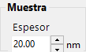
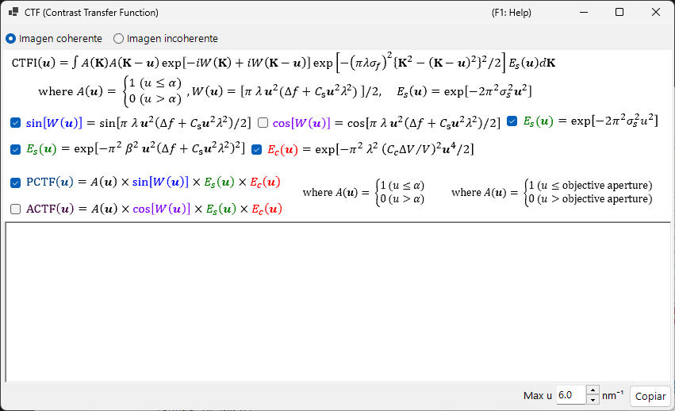
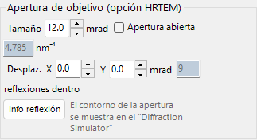
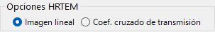
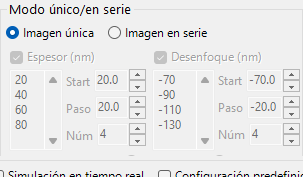
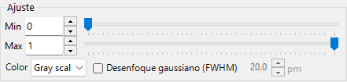

# Simulación HRTEM

Simula imágenes de franjas reticulares de TEM de alta resolución. El modo principal del [simulador HRTEM/STEM](index.md).

---

## Flujo de cálculo

1. **Método de ondas de Bloch**: calcula la propagación de la onda electrónica a través del potencial cristalino; obtiene la amplitud y la fase de la onda de salida
2. **Función de lente**: aplica las aberraciones de la lente objetivo (aberración esférica $C_s$, desenfoque $\Delta f$)
3. **Coherencia parcial**: tiene en cuenta el tamaño finito de la fuente (coherencia espacial) y la dispersión de energía (coherencia temporal)
4. **Formación de la imagen**: calcula la intensidad $|\psi(\mathbf{r})|^2$

---

## Parámetros de la muestra

| Parámetro | Descripción |
|-----------|-------------|
| **Thickness** | Espesor de la muestra (nm). Las imágenes HRTEM dependen fuertemente del espesor |

---

## Parámetros ópticos

### Condiciones TEM

| Parámetro | Descripción |
|-----------|-------------|
| **Acc. Vol.** | Voltaje de aceleración (kV). La longitud de onda corregida relativistamente se muestra al lado |
| **Defocus** | Valor de desenfoque (nm). El desenfoque de Scherzer se muestra como referencia |

### Parámetros intrínsecos

| Parámetro | Descripción | Típico |
|-----------|-------------|---------|
| **Cs** | Aberración esférica (mm) | 0.5–1.0 (convencional); < 0.01 (corregida en Cs) |
| **Cc** | Aberración cromática (mm) | 1.0–2.0 |
| **β** | Semiángulo de iluminación (mrad) | 0.1–1.0 |
| **ΔE** | Anchura 1/*e* de la dispersión de energía (eV) | 0.5–2.0 |

---

## Función de transferencia de contraste de fase (PCTF)

Se muestra en la pestaña de función de lente:

- $\sin\chi(u)$: función de transferencia de contraste de fase ($\chi(u)$ es la función de aberración de la lente)
- $E_\text{s}(u)$: envolvente de coherencia espacial
- $E_\text{c}(u)$: envolvente de coherencia temporal

Desenfoque de Scherzer: $\Delta f = -\sqrt{\tfrac{4}{3}\,C_s \lambda}\ (\approx -1.155\,\sqrt{C_s \lambda})$, la condición que produce una banda PCTF negativa amplia (contraste oscuro = posiciones atómicas). ReciPro utiliza este valor original de Scherzer — obtenido al fijar el mínimo de la fase de aberración $\chi$ en $-2\pi/3$ — y el valor mostrado en la GUI sigue esta fórmula; algunas referencias utilizan en su lugar el valor de *Scherzer extendido* $-1.2\sqrt{C_s\lambda}$.

---

## Diafragma objetivo

Establezca el tamaño del diafragma (mrad) y su posición. **Open aperture** lo elimina. El número de ondas de Bloch consideradas depende de las condiciones del diafragma.

---

## Modelos de coherencia parcial

| Modelo | Descripción |
|-------|-------------|
| **Quasi-coherent (linear image)** | Rápido. Válido bajo la aproximación de fase débil |
| **TCC (Transmission Cross Coefficient)** | Más preciso; cálculo más largo |

---

## Modos de simulación

| Modo | Descripción |
|------|-------------|
| **Single image** | Una imagen al espesor y desenfoque actuales |
| **Serial image** | Matriz de imágenes sobre rangos de espesor × desenfoque (Start / Step / Num) |

---

## Ajuste de la imagen

| Ajuste | Descripción |
|---------|-------------|
| **Min / Max** | Rango de visualización (controles deslizantes de ajuste de imagen) |
| **Colour** | Escala de grises o Cold-Warm |
| **Gaussian blur (FWHM)** | Aplica un filtro gaussiano |
| **Unit cell** | Superpone la rejilla de la celda elemental |
| **Scale** | Muestra una barra de escala |

---

## Véase también

- [Simulador HRTEM/STEM (visión general)](index.md)
- [Simulación STEM](2-stem-simulation.md)
- [Simulación de potencial](3-potential-simulation.md)
- [Apéndice A3.2 — Formación de imágenes HRTEM](../appendix/a3-bloch-wave/hrtem.md)
