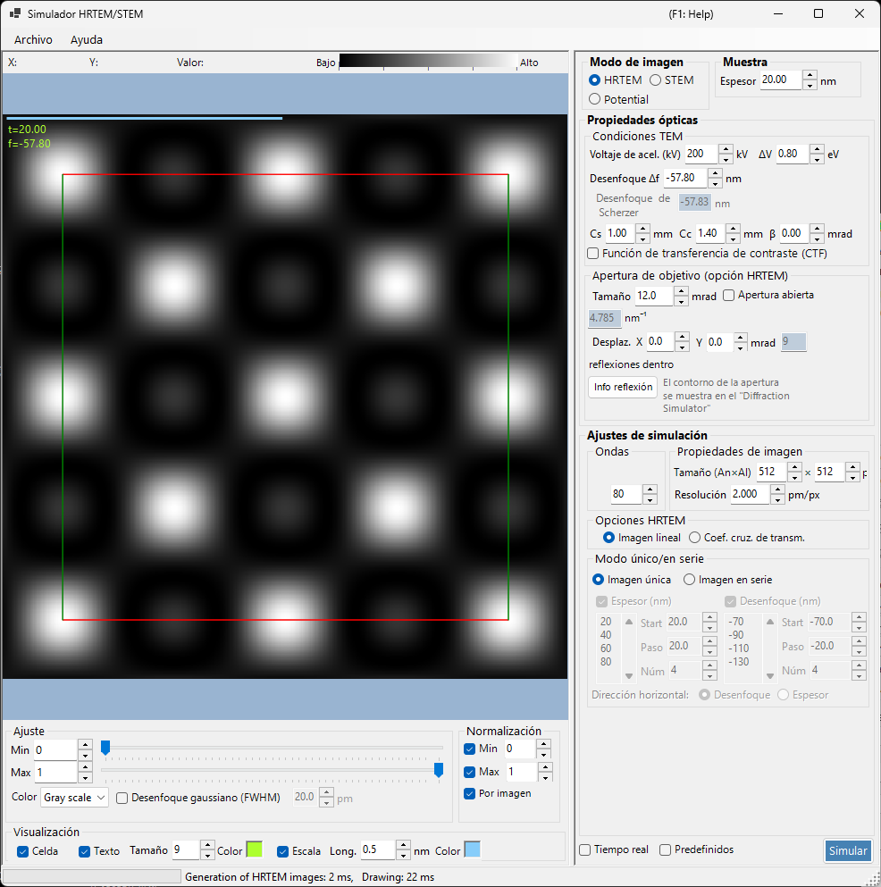
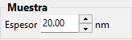
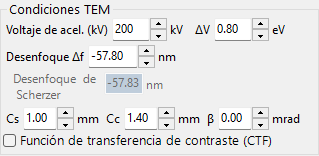
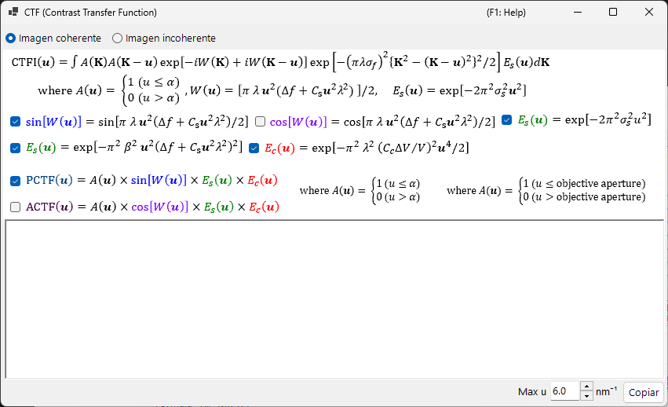
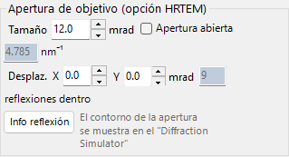
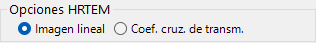
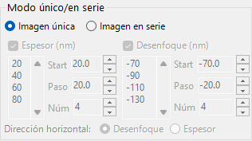
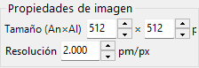
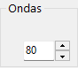

# Simulación HRTEM

La simulación **HRTEM (microscopía electrónica de transmisión de alta resolución)** calcula imágenes de franjas de red de TEM de alta resolución. Es el modo principal del [simulador HRTEM/STEM](index.md).

> Esta página describe todos los ajustes que aparecen en el lado derecho cuando **Modo de imagen = HRTEM**. Para los controles del lado izquierdo (visualización del resultado y ajuste de su brillo), consulte la [página de introducción](index.md#display-settings).

---

## Introducción

Una imagen HRTEM se forma cuando la onda electrónica transmitida a través de la muestra se proyecta en imagen bajo la influencia de las aberraciones de la lente objetivo. ReciPro calcula la propagación de la onda electrónica dentro de la muestra con el método de ondas de Bloch (cálculo dinámico) y genera la imagen HRTEM a través de la función de transferencia de contraste de fase (PCTF).

### Flujo de cálculo

1. **Método de ondas de Bloch**: calcula la propagación de la onda electrónica en el potencial cristalino y obtiene la amplitud y la fase de la onda de salida
2. **Función de lente**: aplica las aberraciones de la lente objetivo (aberración esférica $C_s$, desenfoque $\Delta f$)
3. **Coherencia parcial**: tiene en cuenta el tamaño finito de la fuente (coherencia espacial) y la fluctuación de energía (coherencia temporal)
4. **Formación de la imagen**: calcula la distribución de intensidad $|\psi(\mathbf{r})|^2$

Para la teoría, consulte el [Apéndice A3.2 — Formación de la imagen HRTEM](../appendix/a3-bloch-wave/hrtem.md).

---

## Muestra

- **Espesor** : espesor de la muestra (nm). Las imágenes HRTEM dependen fuertemente del espesor. En modo **Imagen en serie** este valor se ignora y se utiliza en su lugar la lista de espesores descrita más abajo.

---

## Condiciones TEM

Establece las condiciones de formación de imagen de la lente objetivo.

| Parámetro | Descripción | Valor por defecto / típico |
|-----------|-------------|-------------------|
| **Voltaje de acel. (kV)** | Voltaje de aceleración. A la derecha se muestra la longitud de onda del electrón con corrección relativista | 200 kV |
| **Desenfoque Δf** | Desenfoque de la lente objetivo (nm). Debajo se muestra como referencia el valor del **desenfoque de Scherzer** | −57.8 nm |
| **Cs** | Coeficiente de aberración esférica (mm). Afecta a la CTF y al desenfoque de Scherzer | 0.5–1.0 (convencional), < 0.01 (corregida en Cs) |
| **Cc** | Coeficiente de aberración cromática (mm). Determina el emborronamiento de la imagen causado por la dispersión de energía | 1.0–2.0 mm |
| **β** | Semiángulo de iluminación (mrad). Representa el efecto del tamaño finito de la fuente (coherencia espacial) | 0.1–1.0 mrad |
| **ΔV** | Anchura a media altura de la dispersión de energía de los electrones (eV). Junto con Cc determina la dispersión del foco debida a la aberración cromática | 0.5–2.0 eV |

> **Menú contextual**: en el panel de condiciones TEM puede aplicar con un solo clic **Ajustar todas las aberraciones a cero** / **Ajustar desenfoque al valor de Scherzer** / **Ajustar desenfoque a 0 nm**. Los ajustes predefinidos de condiciones (300kV ARM300F, 200kV 2100F, etc.) están disponibles en **Predefinidos**, en la parte inferior izquierda.

### Desenfoque de Scherzer

El valor de desenfoque en torno al cual el contraste de fase es óptimo, calculado a partir de la longitud de onda actual y de la aberración esférica $C_s$ (se muestra como referencia).

$$\Delta f_{\text{Scherzer}} = -\sqrt{\tfrac{4}{3}\,C_s \lambda}\quad\left(\approx -1.155\,\sqrt{C_s \lambda}\right)$$

En esta condición la PCTF es negativa en un amplio intervalo de frecuencias espaciales, de modo que las posiciones atómicas aparecen con contraste oscuro. ReciPro adopta este valor original de Scherzer (obtenido al fijar el mínimo de la fase de aberración $\chi$ en $-2\pi/3$), y el valor mostrado en la GUI sigue esta fórmula. Tenga en cuenta que algunas referencias utilizan en su lugar el valor de *Scherzer extendido* $-1.2\sqrt{C_s\lambda}$, que ensancha aún más la banda de transferencia.

---

## Función de lente / Función de transferencia de contraste (CTF)

Al marcar **Función de transferencia de contraste (CTF)** se abre una ventana que representa cómo las aberraciones de la lente y el desenfoque transfieren el contraste de la imagen a cada frecuencia espacial.

- $\sin\chi(u)$ : función de transferencia de contraste de fase ($\chi(u)$ es la función de aberración de la lente)
- $E_\text{s}(u)$ : función envolvente de coherencia espacial; la atenuación debida al tamaño finito de la fuente ($\beta$)
- $E_\text{c}(u)$ : función envolvente de coherencia temporal; la atenuación debida a la fluctuación de energía ($C_c$, $\Delta V$)

Al cambiar el límite superior del eje horizontal $u$ (frecuencia espacial) cambia el rango representado.

---

## Apertura de objetivo (opción HRTEM)

Limita las ondas difractadas que atraviesan el diafragma objetivo. El número de ondas difractadas que corta el diafragma también modifica el número de reflexiones incluidas en el cálculo de ondas de Bloch (el límite superior es el número máximo de ondas de Bloch fijado en **Ondas**).

- **Tamaño** : semiángulo del diafragma objetivo (mrad). Cuanto menor es, más ondas difractadas de ángulo alto se cortan y más se suavizan los detalles de alta resolución. Se muestra el radio equivalente en el espacio recíproco $\sin\theta/\lambda$ (nm⁻¹).
- **Desplaz. X** / **Y** : desplazamiento del centro del diafragma objetivo (mrad). Se utiliza para imágenes de campo oscuro y con haz inclinado.
- **Apertura abierta** : abre el diafragma objetivo (tamaño infinito), de modo que todas las ondas difractadas contribuyen a la imagen.
- **reflexiones dentro** : número de haces difractados (reflexiones) que caen dentro del diafragma (solo lectura).
- **Info reflexión** : abre una tabla con los haces difractados que hay dentro del diafragma (intensidad, amplitud compleja, etc.).

> El tamaño del diafragma objetivo también se muestra en el **Simulador de difracción**.

---

## Opciones HRTEM (modelo de coherencia parcial)

Selecciona el modelo de interferencia utilizado al integrar las contribuciones de todas las direcciones del haz incidente.

- **Imagen lineal** : de bajo coste computacional. Adecuado para muestras delgadas en las que se cumple la aproximación de objeto de fase débil; multiplica la PCTF por las envolventes de coherencia espacial y temporal.
- **Coef. cruz. de transm.** (coeficiente de transmisión cruzada) : de alto coste computacional pero más preciso. Integra el coeficiente de transmisión cruzada completo y es el modelo que debe usarse con dispersores fuertes que excitan muchas ondas difractadas intensas.

Para más detalles, consulte el [Apéndice A3.2 — Formación de la imagen HRTEM](../appendix/a3-bloch-wave/hrtem.md).

---

## Modo único/en serie

- **Imagen única** : calcula una imagen HRTEM al espesor y desenfoque actuales.
- **Imagen en serie** : genera un conjunto de imágenes variando por pasos el espesor y el desenfoque (serie en espesor / serie focal). Útil para encontrar la condición que mejor coincide con una imagen experimental.

Para una imagen en serie, establezca lo siguiente.

| Elemento | Descripción |
|------|-------------|
| **Espesor (nm)** / **Desenfoque (nm)** | Magnitud que se barre (se permiten ambas) |
| **Start / Paso / Núm** | Valor inicial, anchura del paso y número de imágenes. Se expanden en el cuadro de lista inferior, que también puede editarse directamente |
| **Dirección horizontal:** | Cuando se barren tanto el espesor como el desenfoque, la magnitud dispuesta en la dirección horizontal de la rejilla (**Desenfoque** o **Espesor**) |

Barrer a la vez el espesor y el desenfoque produce una matriz de imágenes de filas × columnas.

---

## Propiedades de imagen

- **Tamaño (An×Al)** : número de píxeles de la imagen simulada (512×512 por defecto).
- **Resolución** : resolución de muestreo (pm/px). Un valor menor resuelve franjas de red más finas, pero el tiempo de FFT crece proporcionalmente.

---

## Ondas

- Número máximo de ondas de Bloch utilizadas en el método de Bethe (cálculo dinámico); 80 por defecto. Un número mayor mejora la precisión, pero la resolución del problema de valores propios requiere un tiempo $O(N^3)$.

---

## Véase también

- [Simulador HRTEM/STEM (introducción)](index.md)
- [Simulación STEM](2-stem-simulation.md)
- [Simulación de potencial](3-potential-simulation.md)
- [Apéndice A3.2 — Formación de la imagen HRTEM](../appendix/a3-bloch-wave/hrtem.md)
