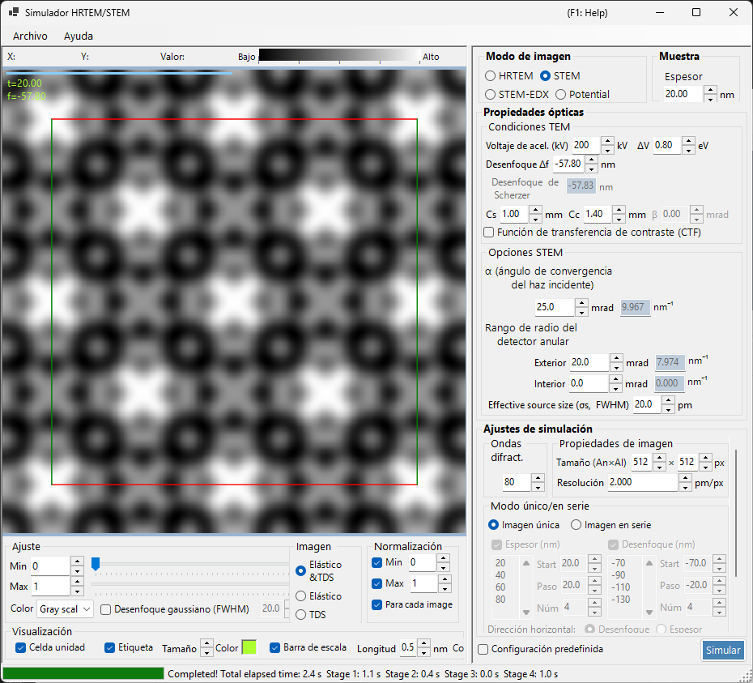
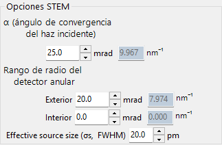
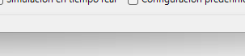
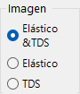

# Simulación STEM

La **simulación STEM (Scanning Transmission Electron Microscopy)** calcula imágenes de microscopía electrónica de transmisión de barrido mediante el método de ondas de Bloch.

> Esta página enumera todos los ajustes que aparecen a la derecha cuando **Image mode = STEM**. Para los controles de la izquierda relativos a la visualización del resultado, el brillo y la normalización, consulta la [página de introducción](index.md). Solo se repite a continuación el **objetivo de visualización** específico de STEM.

---

## Introducción

Un haz de electrones convergente se barre sobre la muestra, y los electrones transmitidos y dispersados en cada posición de barrido son recogidos por detectores anulares. ReciPro calcula la imagen STEM con el método de ondas de Bloch (cálculo dinámico).

### Flujo de cálculo

1. En cada posición de barrido, calcula las intensidades difractadas con el método de ondas de Bloch para cada dirección de incidencia de la sonda convergente.
2. Integra la intensidad dispersada sobre el rango angular del detector.
3. Se pueden calcular tanto las contribuciones de dispersión elástica como las de dispersión térmica difusa (TDS).

Consulta el [Apéndice A3.4 — Cálculo STEM](../appendix/a3-bloch-wave/stem.md) para la teoría.

---

## Tipos de detector

| Detector | Rango angular | Contribución principal | Contraste |
|----------|-------------|-------------------|----------|
| **BF** (campo claro) | 0 – ángulo de convergencia | Elástica | Contraste de fase |
| **ABF** (campo claro anular) | Parte interior del ángulo de convergencia | Elástica | Sensible a elementos ligeros |
| **LAADF** (campo oscuro anular de ángulo bajo) | Justo fuera del ángulo de convergencia | Elástica + TDS | Sensible a la deformación |
| **HAADF** (campo oscuro anular de ángulo alto) | Bastante fuera del ángulo de convergencia | TDS (inelástica) | Contraste Z ($\propto Z^2$) |

> **Ajustes típicos de detector** (cada uno disponible con un clic desde el menú contextual de las opciones STEM, todos con ángulo de convergencia α = 25 mrad):
> BF (0–5 mrad) / ABF (12–24 mrad) / LAADF (26–60 mrad) / HAADF (80–250 mrad)

---

## Parámetros de la muestra

- **Thickness** : espesor de la muestra (nm). Este valor se ignora en el modo **Serial image**.

---

## Condiciones del TEM

| Parámetro | Descripción | Predeterminado / típico |
|-----------|-------------|-------------------|
| **Acc. Vol. (kV)** | Tensión de aceleración. La longitud de onda del electrón corregida relativistamente se muestra al lado | 200 kV |
| **Defocus Δf** | Desenfoque de la lente objetivo (formadora de la sonda) (nm) | −57.8 nm |
| **Cs** | Coeficiente de aberración esférica (mm). Afecta al tamaño de la sonda | 0.5–1.0 mm |
| **Cc** | Coeficiente de aberración cromática (mm) | 1.0–2.0 mm |
| **ΔV (FWHM)** | Anchura a media altura de la dispersión de energía de los electrones (eV) | 0.5–2.0 eV |

> **β (semiángulo de iluminación) está deshabilitado en el modo STEM**, porque el ángulo de convergencia α asume su función.

---

## Opciones STEM (óptica)

Define la geometría de la sonda convergente y del detector anular. Cada ángulo también se muestra a la derecha convertido a un radio en el espacio recíproco $\sin\theta/\lambda$ (nm⁻¹).

| Parámetro | Descripción | Predeterminado / típico |
|-----------|-------------|-------------------|
| **α (convergence angle)** | Semiángulo de la sonda convergente (mrad). Valores mayores dan una sonda más fina y cambian el contraste de difracción | 15–25 mrad |
| **(Annular) detector inner angle** | Semiángulo interior de captación del detector anular (mrad). La señal dentro de este ángulo se excluye | BF: 0, HAADF: 80 |
| **(Annular) detector outer angle** | Semiángulo exterior de captación del detector anular (mrad). La señal fuera de este ángulo se excluye | BF: 5, HAADF: 250 |
| **Effective source size σs (FWHM)** | Tamaño efectivo de la fuente de electrones. Valores mayores difuminan la sonda y reducen el contraste de los detalles finos | — |

---

## Opciones STEM (simulación)

- **Slice thickness for inelastic** : espesor de la rebanada de la muestra (nm) usado al calcular la intensidad TDS (térmica difusa, inelástica). Valores menores son más precisos pero más lentos.
- **Angular resolution** : resolución de muestreo angular de las direcciones de incidencia de la sonda (mrad). Valores menores muestrean la sonda de forma más fina pero son más lentos.

---

## Modo de imagen (single / serial)

- **Single image** : calcula una imagen STEM al espesor actual.
- **Serial image** : genera una serie de imágenes con el espesor / desenfoque escalonado por etapas (definido mediante **Start / Step / Num**; la lista de abajo también se puede editar directamente).

---

## Propiedades de la imagen

- **Size (W×H)** : número de píxeles de la imagen barrida (predeterminado 512×512). En STEM esto equivale al número de puntos de barrido y escala el tiempo de cálculo linealmente.
- **Resolution** : resolución de muestreo (pm/px).

---

## Ondas difractadas

- **Max Bloch waves** : número máximo de ondas de Bloch usadas en el método de Bethe (predeterminado 80). El coste del problema de valores propios escala con el cubo del número de ondas.

---

## Objetivo de visualización STEM (lado del resultado)

El conmutador de visualización situado abajo a la izquierda de la ventana selecciona qué componente de dispersión de la imagen STEM ya calculada se muestra (conmutable sin volver a calcular).

| Objetivo de visualización | Descripción |
|----------------|-------------|
| **Elastic** | Imagen solo de dispersión elástica |
| **TDS** | Imagen solo de dispersión térmica difusa |
| **Elastic & TDS** | Suma de elástica + TDS |

---

## Coste computacional

La simulación STEM es costosa computacionalmente, por lo que conviene fijar adecuadamente los siguientes parámetros.

| Factor | Impacto |
|--------|--------|
| **Ángulo de convergencia** | Mayor → más solapamiento de discos CBED → mayor coste |
| **Ondas de Bloch** | El coste del problema de valores propios escala como N³ |
| **Resolución angular** | Más fina → más precisa pero el coste escala como N² |
| **Píxeles de la imagen (Size)** | Escalado lineal con el número de puntos de barrido |

---

## Importancia del factor de temperatura

Para la simulación HAADF-STEM, los átomos deben tener un factor de temperatura isótropo (factor de Debye-Waller) distinto de cero. Si el valor se desconoce, fija $B \approx 0.5\ \text{Å}^2$. Con un factor de temperatura nulo la intensidad TDS es cero y la imagen HAADF no se calcula correctamente.

| Detector | Rango | Contribución principal |
|----------|-------|-------------------|
| BF, ABF | Dentro del ángulo de convergencia | Elástica |
| LAADF, HAADF | Fuera del ángulo de convergencia | Inelástica (TDS) |

---

## Comparación con Dr. Probe

Se ha confirmado que las simulaciones STEM de ReciPro coinciden estrechamente con la ampliamente usada GUI de Dr. Probe (v1.10). La figura siguiente compara ambas para los detectores BF, ABF, LAADF y HAADF a lo largo de una serie de espesores (2.96–60.05 nm), tanto sin aberraciones (izquierda) como con Cs = 0.2 mm, desenfoque = −25.9 nm (derecha). Los dos códigos coinciden en todos los tipos de detector y espesores.

Hay disponible un informe más detallado en formato PDF: [Comparación de simulaciones STEM mediante la GUI de Dr. Probe (v1.10) y ReciPro (v4.854)](https://github.com/seto77/ReciPro/files/10976084/ComparisonSTEMsimulations.pdf).

---

## Véase también

- [Simulador HRTEM/STEM (introducción)](index.md)
- [Simulación HRTEM](1-hrtem-simulation.md)
- [Simulación de potencial](3-potential-simulation.md)
- [Apéndice A3.4 — Cálculo STEM](../appendix/a3-bloch-wave/stem.md)
- [Apéndice A3.4 — Cálculo STEM](../appendix/a3-bloch-wave/stem.md)
