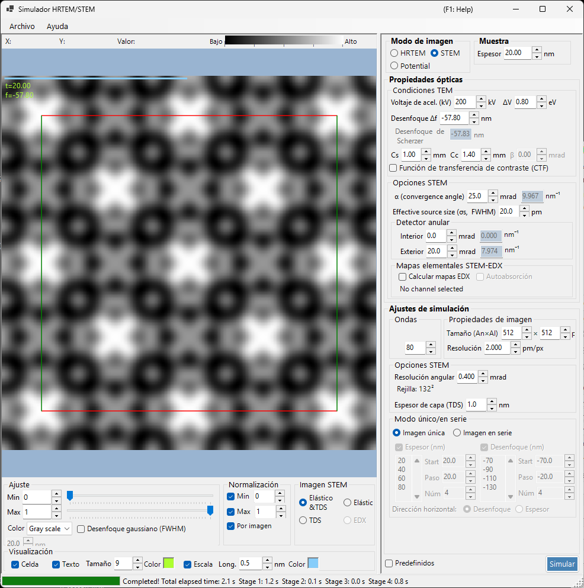
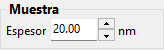
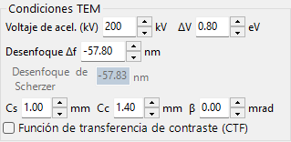
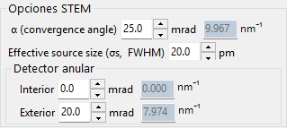
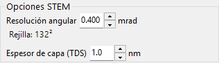
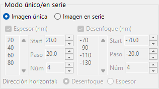
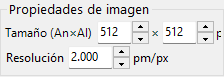
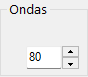
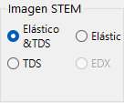
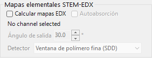

# Simulación STEM

La **simulación STEM (Scanning Transmission Electron Microscopy)** calcula imágenes de microscopía electrónica de transmisión de barrido mediante el método de ondas de Bloch.

> Esta página enumera todos los ajustes que aparecen a la derecha cuando **Image mode = STEM**. Para los controles de la izquierda relativos a la visualización del resultado, el brillo y la normalización, consulta la [página de introducción](index.md). Solo se repite a continuación el **objetivo de visualización** específico de STEM.

---

## Introducción

Un haz de electrones convergente se barre sobre la muestra, y los electrones transmitidos y dispersados en cada posición de barrido son recogidos por detectores anulares. ReciPro calcula la imagen STEM con el método de ondas de Bloch (cálculo dinámico).

### Flujo de cálculo

1. En cada posición de barrido, calcula las intensidades difractadas con el método de ondas de Bloch para cada dirección de incidencia de la sonda convergente.
2. Integra la intensidad dispersada sobre el rango angular del detector.
3. Se pueden calcular tanto las contribuciones de dispersión elástica como las de dispersión térmica difusa (TDS).

Consulta el [Apéndice A3.4 — Cálculo STEM](../appendix/a3-bloch-wave/stem.md) para la teoría.

---

## Tipos de detector

| Detector | Rango angular | Contribución principal | Contraste |
|----------|-------------|-------------------|----------|
| **BF** (campo claro) | 0 – ángulo de convergencia | Elástica | Contraste de fase |
| **ABF** (campo claro anular) | Parte interior del ángulo de convergencia | Elástica | Sensible a elementos ligeros |
| **LAADF** (campo oscuro anular de ángulo bajo) | Justo fuera del ángulo de convergencia | Elástica + TDS | Sensible a la deformación |
| **HAADF** (campo oscuro anular de ángulo alto) | Bastante fuera del ángulo de convergencia | TDS (inelástica) | Contraste Z ($\propto Z^2$) |

> **Ajustes típicos de detector** (cada uno disponible con un clic desde el menú contextual de las opciones STEM, todos con ángulo de convergencia α = 25 mrad):
> BF (0–5 mrad) / ABF (12–24 mrad) / LAADF (26–60 mrad) / HAADF (80–250 mrad)

---

## Parámetros de la muestra

- **Thickness** : espesor de la muestra (nm). Este valor se ignora en el modo **Serial image**.

---

## Condiciones del TEM

| Parámetro | Descripción | Predeterminado / típico |
|-----------|-------------|-------------------|
| **Acc. Vol. (kV)** | Tensión de aceleración. La longitud de onda del electrón corregida relativistamente se muestra al lado | 200 kV |
| **Defocus Δf** | Desenfoque de la lente objetivo (formadora de la sonda) (nm) | −57.8 nm |
| **Cs** | Coeficiente de aberración esférica (mm). Afecta al tamaño de la sonda | 0.5–1.0 mm |
| **Cc** | Coeficiente de aberración cromática (mm) | 1.0–2.0 mm |
| **ΔV (FWHM)** | Anchura a media altura de la dispersión de energía de los electrones (eV) | 0.5–2.0 eV |

> **β (semiángulo de iluminación) está deshabilitado en el modo STEM**, porque el ángulo de convergencia α asume su función.

---

## Opciones STEM (óptica)

Define la geometría de la sonda convergente y del detector anular. Cada ángulo también se muestra a la derecha convertido a un radio en el espacio recíproco $\sin\theta/\lambda$ (nm⁻¹).

| Parámetro | Descripción | Predeterminado / típico |
|-----------|-------------|-------------------|
| **α (convergence angle)** | Semiángulo de la sonda convergente (mrad). Valores mayores dan una sonda más fina y cambian el contraste de difracción | 15–25 mrad |
| **(Annular) detector inner angle** | Semiángulo interior de captación del detector anular (mrad). La señal dentro de este ángulo se excluye | BF: 0, HAADF: 80 |
| **(Annular) detector outer angle** | Semiángulo exterior de captación del detector anular (mrad). La señal fuera de este ángulo se excluye | BF: 5, HAADF: 250 |
| **Effective source size σs (FWHM)** | Tamaño efectivo de la fuente de electrones. Valores mayores difuminan la sonda y reducen el contraste de los detalles finos | — |

---

## Opciones STEM (simulación)

- **Slice thickness for inelastic** : espesor de la rebanada de la muestra (nm) usado al calcular la intensidad TDS (térmica difusa, inelástica). Valores menores son más precisos pero más lentos.
- **Angular resolution** : resolución de muestreo angular de las direcciones de incidencia de la sonda (mrad). Valores menores muestrean la sonda de forma más fina pero son más lentos. El número de direcciones crece con el cuadrado de esta razón, por lo que es la principal palanca sobre el tiempo de cálculo; véase [Muestreo angular de la sonda](../appendix/a3-bloch-wave/stem.md#angular-sampling) para las medidas de convergencia.

---

## Modo de imagen (single / serial)

- **Single image** : calcula una imagen STEM al espesor actual.
- **Serial image** : genera una serie de imágenes con el espesor / desenfoque escalonado por etapas (definido mediante **Start / Step / Num**; la lista de abajo también se puede editar directamente).

---

## Propiedades de la imagen

- **Size (W×H)** : número de píxeles de la imagen barrida (predeterminado 512×512). En STEM esto equivale al número de puntos de barrido y escala el tiempo de cálculo linealmente.
- **Resolution** : resolución de muestreo (pm/px).

---

## Ondas difractadas

- **Max Bloch waves** : número máximo de ondas de Bloch usadas en el método de Bethe (predeterminado 80). El coste del problema de valores propios escala con el cubo del número de ondas.

---

## Objetivo de visualización STEM (lado del resultado) {#stem-display-target}

El conmutador de visualización situado abajo a la izquierda de la ventana selecciona qué componente de dispersión de la imagen STEM ya calculada se muestra (conmutable sin volver a calcular).

| Objetivo de visualización | Descripción |
|----------------|-------------|
| **Elastic** | Imagen solo de dispersión elástica |
| **TDS** | Imagen solo de dispersión térmica difusa |
| **Elastic & TDS** | Suma de elástica + TDS |
| **EDX** | Mapa de rayos X característicos. La línea que se muestra (por ejemplo `O-K`) se elige en el cuadro combinado situado debajo, y **EDX común** en *Normalización* pone todos los canales en un mismo rango de visualización compartido, de modo que cambiar de canal no reescala la imagen |

!!! note
    Las tres imágenes se reconstruyen a partir de la parte real de la suma de Fourier, de modo que **Elastic & TDS** es exactamente la suma de las otras dos. Hasta la versión 4.944 se tomaba el módulo, lo que rompía esa identidad y aclaraba ligeramente los píxeles oscuros. Véase [Reconstrucción de una imagen real](../appendix/a3-bloch-wave/stem.md#real-image-reconstruction).

---

## Mapas elementales STEM-EDX {#stem-edx}

Marca **Calcular mapas EDX** para calcular mapas de rayos X característicos junto con la imagen de tipo ADF. No es un modo separado: las señales elástica, TDS y EDX salen del mismo cálculo STEM, y después se conmuta entre ellas en [Objetivo de visualización STEM](#stem-display-target) sin volver a calcular.

No hay selector de elementos. Cuando la casilla está activada se calculan **todos los canales elemento/capa que pueden calcularse para este cristal a esta tensión de aceleración**, y la línea situada bajo la casilla los enumera (por ejemplo `3 mapa(s): O-K, Mg-K, Al-K`). Un canal está disponible cuando el borde de ionización queda por debajo de la tensión de aceleración y la capa está cubierta por los datos incluidos — K: C–Sn (Z = 6–50), L-total: Ca–Rn (Z = 20–86). La tabla incluida almacena factores de forma de ionización totalmente relativistas hasta un vector de dispersión de 8 Å⁻¹ para todos los canales, de modo que las líneas L de elementos pesados hasta el radón se simulan sin extrapolación. Si no hay ningún canal disponible, el cálculo se rechaza con un mensaje explicativo en lugar de producir un mapa vacío.

La línea siguiente informa de la rejilla de direcciones de la sonda, por ejemplo `Rejilla: 132² (recomendado: ≥48²)`. Esta rejilla la determinan **Resolución angular** y el ángulo de convergencia; véase [Muestreo angular de la sonda](../appendix/a3-bloch-wave/stem.md#angular-sampling). Por debajo de la división recomendada el residuo hermítico ±q puede superar la tolerancia y abortar el cálculo, por lo que el valor se muestra en naranja y aparece un diálogo de confirmación antes de iniciar el cálculo.

!!! warning "Qué representan los valores"
    El mapa es el **número de vacantes de capa interna generadas por electrón incidente** — una magnitud del modelo, no un recuento previsto de rayos X. El rendimiento de fluorescencia, la autoabsorción en la muestra, el ángulo sólido del detector y la eficiencia del detector **no** se aplican. Usa los mapas para la distribución espacial y para comparar espesores u orientaciones, no para una cuantificación absoluta.

### Parámetros del detector (reservados)

**Autoabsorción**, **Ángulo de salida** y **Detector** están dispuestos pero deshabilitados: pertenecen al modelo de detector que aún no está implementado. Se muestran para que el panel no se desplace cuando ese modelo llegue. Su efecto futuro difiere en naturaleza:

| Factor | Contraste píxel a píxel dentro de un mapa | Cociente entre mapas de elementos |
|---|---|---|
| Autoabsorción (ángulo de salida) | **lo cambia** | **lo cambia** |
| Ventana del detector / capa muerta / eficiencia | sin efecto | **lo cambia fuertemente** |
| Ángulo sólido del detector, corriente del haz, tiempo de permanencia | sin efecto | sin efecto |

La última fila explica por qué ReciPro no expone en absoluto la corriente del haz ni el tiempo de permanencia: multiplican cada píxel de cada mapa por el mismo número, se cancelan en cualquier cociente y resultan invisibles tras la normalización de la visualización.

### Precisión y coste

STEM-EDX no impone ningún límite adicional al número de ondas ni al espesor de la rebanada: recorre las mismas rutas de cálculo que la imagen de tipo ADF, de modo que los ajustes que funcionan para STEM funcionan también para EDX.

La precisión queda en tus manos, exactamente igual que con el número de ondas o la resolución angular. Como referencia, el error de la integración en profundidad crece aproximadamente en proporción a **Espesor de capa (TDS)** — en torno al 2–3 % a 1 nm, 4–8 % a 2 nm y 12–23 % a 4 nm (relativo al pico, SrTiO₃ a 39 nm). Reducir el espesor de la rebanada a la mitad reduce el error aproximadamente a la mitad y duplica aproximadamente el trabajo de integración en profundidad.

Con aberraciones definidas (por ejemplo Cs = 1 mm con desenfoque de Scherzer a α = 25 mrad), la fase de aberración oscila rápidamente sobre la rejilla de direcciones de la sonda, y STEM-EDX puede rechazar el cálculo con un error *non-Hermitian residual* incluso con una rejilla fina; este rechazo protege el mapa de artefactos de rejilla de algunos por ciento. Reduzca Cs y el desenfoque (el promedio de barrido de un mapa EDX no depende en absoluto de las aberraciones), o haga la **Resolución angular** bastante más fina aceptando un cálculo más largo.

---

## Coste computacional

La simulación STEM es costosa computacionalmente, por lo que conviene fijar adecuadamente los siguientes parámetros.

| Factor | Impacto |
|--------|--------|
| **Ángulo de convergencia** | Mayor → más solapamiento de discos CBED → mayor coste |
| **Ondas de Bloch** | El coste del problema de valores propios escala como N³ |
| **Resolución angular** | Más fina → más precisa pero el coste escala como N² |
| **Píxeles de la imagen (Size)** | Escalado lineal con el número de puntos de barrido |

---

## Importancia del factor de temperatura

Para la simulación HAADF-STEM, los átomos deben tener un factor de temperatura isótropo (factor de Debye-Waller) distinto de cero. Si el valor se desconoce, fija $B \approx 0.5\ \text{Å}^2$. Con un factor de temperatura nulo la intensidad TDS es cero y la imagen HAADF no se calcula correctamente.

| Detector | Rango | Contribución principal |
|----------|-------|-------------------|
| BF, ABF | Dentro del ángulo de convergencia | Elástica |
| LAADF, HAADF | Fuera del ángulo de convergencia | Inelástica (TDS) |

---

## Comparación con Dr. Probe

Se ha confirmado que las simulaciones STEM de ReciPro coinciden estrechamente con la ampliamente usada GUI de Dr. Probe (v1.10). La figura siguiente compara ambas para los detectores BF, ABF, LAADF y HAADF a lo largo de una serie de espesores (2.96–60.05 nm), tanto sin aberraciones (izquierda) como con Cs = 0.2 mm, desenfoque = −25.9 nm (derecha). Los dos códigos coinciden en todos los tipos de detector y espesores.

Hay disponible un informe más detallado en formato PDF: [Comparación de simulaciones STEM mediante la GUI de Dr. Probe (v1.10) y ReciPro (v4.854)](https://github.com/seto77/ReciPro/files/10976084/ComparisonSTEMsimulations.pdf).

---

## Comparación con py_multislice

Los mapas STEM-EDX de ReciPro también se han contrastado con [py_multislice](https://github.com/HamishGBrown/py_multislice), un código multicapa / fonón congelado independiente. La figura compara los mapas O-K, Ti-K y Sr-L de SrTiO₃ [001] a 200 kV en una serie de espesores (3,91–62,48 nm), sin aberraciones (izquierda) y con Cs = 0,2 mm, desenfoque = −25,9 nm (derecha).

Las formas normalizadas de los mapas coinciden en 1–2 % para Ti-K y Sr-L en el límite delgado. Los **totales** difieren en ±10–17 % porque ambos códigos toman las secciones eficaces de ionización de fuentes distintas (Bote–Salvat en ReciPro, tablas del grupo Allen en py_multislice). La razón ReciPro / py_multislice también cae con el espesor, porque el modelo absortivo de ReciPro elimina los electrones dispersados térmicamente mientras que el fonón congelado los mantiene ionizando — lo que cuantifica el error práctico de la aproximación absortiva para EDX.

El informe completo, con las curvas cuantitativas y el análisis en frecuencia espacial, está disponible en PDF: [Comparación de simulaciones STEM-EDX por py_multislice y ReciPro (v4.945)](../../assets/references/STEM_EDX_pyms_comparison.pdf).

---

## Véase también

- [Simulador HRTEM/STEM (introducción)](index.md)
- [Simulación HRTEM](1-hrtem-simulation.md)
- [Simulación de potencial](3-potential-simulation.md)
- [Apéndice A3.4 — Cálculo STEM](../appendix/a3-bloch-wave/stem.md)
