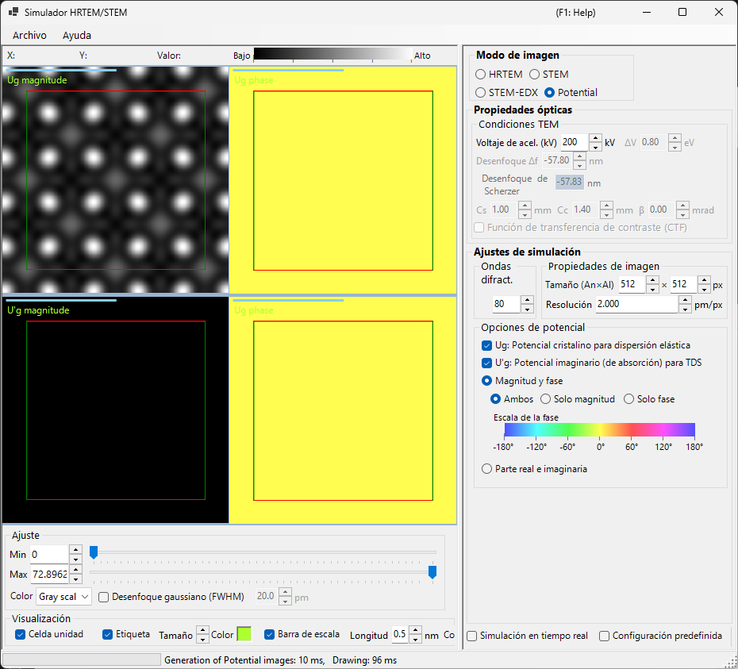
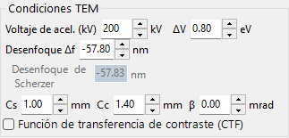
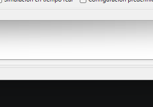
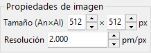
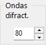

# Simulación de potencial

La **simulación de potencial** calcula y muestra la distribución 2D del potencial del cristal. No se aplican efectos de transferencia de imagen (aberraciones de la lente, detector): visualiza el propio potencial proyectado del cristal.

> Esta página cubre todos los ajustes que aparecen en el lado derecho cuando **Image mode = Potential**. Para la visualización de resultados, el ajuste de brillo y los demás controles del lado izquierdo, consulte la [página de resumen](index.md#display-settings).

---

## Resumen

Los electrones dentro de un cristal son dispersados por el potencial del cristal. Su distribución subyace a todos los fenómenos de difracción y formación de imágenes, y es información clave para comprender la estructura del cristal. Como este modo no incluye ni aberraciones de la lente ni efectos dinámicos dependientes del espesor, resulta muy adecuado para inspeccionar la estructura en sí.

> **En el modo de potencial no se muestran los paneles de espesor de la muestra, normalización de intensidad y modo de imagen (single / serial).** De las condiciones TEM, solo la tensión de aceleración está activa.

---

## Condiciones TEM

- **Acc. voltage (kV)** — tensión de aceleración. Determina la longitud de onda del electrón y se utiliza para calcular los coeficientes de Fourier $U_g$ del potencial.

> **Defocus, Cs, Cc, β, ΔE y la PCTF están inactivos en el modo de potencial** (no se aplica ninguna óptica de formación de imagen) y aparecen atenuados.

---

## Opciones de potencial

Selecciona qué potencial se muestra y cómo se representa.

### Potencial objetivo

| Tipo | Descripción |
|------|-------------|
| **$U_g$ — elastic scattering potential** | El potencial (electrostático) del cristal responsable de la dispersión elástica. Representa la intensidad de dispersión |
| **$U'_g$ — absorption potential** | El potencial imaginario (de absorción) que surge de la dispersión térmica difusa (TDS). Representa la pérdida del canal elástico |

$U_g$ y $U'_g$ pueden mostrarse al mismo tiempo (se añade un panel por cada uno que se marque).

### Método de visualización

| Modo | Opciones |
|------|---------|
| **Magnitude and phase** | **Both** / **Magnitude only** / **Phase only** (la fase se representa con una rueda de color y debajo se muestra una escala de fase) |
| **Real and imaginary part** | **Both** / **Real only** / **Imaginary only** |

---

## Propiedad de la imagen

- **Size (W×H)** — dimensiones en píxeles de la imagen generada (predeterminado 512×512).
- **Resolution** — resolución de muestreo (pm/px).

---

## Ondas difractadas

- **Max Bloch waves** — número máximo de ondas de Bloch (coeficientes de Fourier) incluidas en la síntesis de Fourier del potencial (predeterminado 80). Valores mayores incluyen frecuencias espaciales más altas y reproducen detalles más finos del potencial.

---

## Ajuste de la imagen (lado izquierdo)

El brillo (Min / Max), la escala de color y la superposición de la cuadrícula de la celda elemental se configuran en el lado izquierdo, en **Adjust** y **Display** (consulte la [página de resumen](index.md#display-settings)).

---

## Véase también

- [Simulador HRTEM/STEM (resumen)](index.md)
- [Simulación HRTEM](1-hrtem-simulation.md)
- [Simulación STEM](2-stem-simulation.md)
