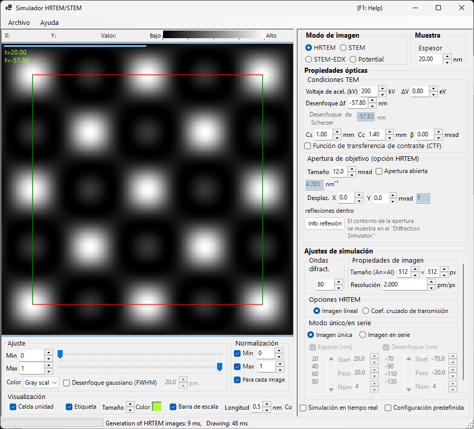
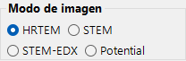
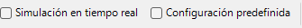
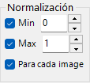
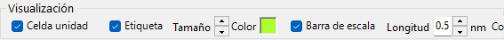

# HRTEM / STEM Simulator

El **Simulador HRTEM/STEM** simula imágenes de franjas de red (HRTEM) en TEM, imágenes STEM y potenciales proyectados. Haga clic en **Simulate** para iniciar el cálculo.

---

## Atajos de teclado y ratón

Los resultados se muestran como uno o varios paneles de imagen. Utilizan la [navegación estándar de vista de imagen](../21-shortcuts.md) de ReciPro, y todos los paneles se desplazan y se acercan o alejan de forma conjunta.

| Atajo | Acción |
|----------|--------|
| <kbd>F1</kbd> | Abrir esta página del manual en línea |
| <kbd>CTRL</kbd>+<kbd>C</kbd> (rejilla de imágenes enfocada) | Copiar la imagen o las imágenes al portapapeles como metarchivo |
| Arrastrar con el botón izquierdo / central | Desplazar la imagen (todos los paneles se mueven juntos) |
| Rueda del ratón arriba / abajo | Acercar (×2) / alejar (×0.5) en la posición del cursor |
| Arrastrar un rectángulo con el botón derecho | Acercar a la región seleccionada |
| Clic derecho / doble clic derecho | Alejar (×0.5) |
| <kbd>CTRL</kbd> + arrastrar un rectángulo con el botón derecho | Seleccionar un área rectangular |
| Doble clic izquierdo sobre un panel | Maximizar ese panel / restaurar la rejilla (diseños de varios paneles) |
| Mover el ratón (sin botón) | Leer la posición (pm) y el valor de píxel en la posición del cursor |

→ Consulte **[21. Atajos de teclado y ratón](../21-shortcuts.md)** para tener una visión general de cada ventana.

---

## Rutas rápidas según el objetivo

| Objetivo | Punto de partida | Referencia |
|------|------------|-----------|
| Calcular una imagen HRTEM | Establezca **Image mode** en **HRTEM**, luego ajuste el voltaje de aceleración y el desenfoque en **TEM conditions** | [Simulación HRTEM](1-hrtem-simulation.md), [Formación de la imagen HRTEM](../appendix/a3-bloch-wave/hrtem.md) |
| Calcular una imagen STEM | Establezca **Image mode** en **STEM**, luego ajuste el ángulo de convergencia y el detector en **STEM options** | [Simulación STEM](2-stem-simulation.md), [Cálculo STEM](../appendix/a3-bloch-wave/stem.md) |
| Ver el potencial proyectado | Establezca **Image mode** en **Potential** | [Simulación de potencial](3-potential-simulation.md) |
| Generar una serie de espesor / desenfoque | Configure **Single / Serial** y las condiciones de imagen en **HRTEM options** | [Simulación HRTEM](1-hrtem-simulation.md) |
| Usar HAADF-STEM con TDS | Establezca factores de temperatura atómicos distintos de cero y use un detector LAADF / HAADF | [Cálculo STEM](../appendix/a3-bloch-wave/stem.md) |

---

## Flujo de trabajo básico

1. Seleccione el cristal y la orientación en la ventana principal y, a continuación, abra este simulador.
2. Elija HRTEM, STEM o Potential en **Image mode**.
3. Ajuste el voltaje de aceleración, el desenfoque, las aberraciones, los diafragmas y los ajustes de convergencia STEM en **Optical property**.
4. Ajuste el espesor, el tamaño de imagen, la resolución, el número de ondas de Bloch y el modelo de coherencia parcial en **Simulation property**.
5. Haga clic en **Simulate** y luego ajuste el brillo, la normalización, la barra de escala y las etiquetas en **Display settings**.

---

## Área de imagen

La mitad izquierda de la ventana muestra la imagen simulada. La barra de estado en la parte superior informa de la posición del cursor (**X:**, **Y:**) y del valor de imagen **Value:** (intensidad) bajo el cursor, junto a una escala de intensidad **Low → High** que refleja el mapa de color y el rango de brillo actuales.

---

## Menú Archivo

### Menú Ayuda

---

## Image mode / Sample

{align=left}

HRTEM, Potential o STEM.

{ align=left style="clear: both" }
Establece el espesor de la muestra.

## Optical property { style="clear: both" }

### TEM conditions

Voltaje de aceleración, desenfoque (se muestra el de Scherzer).

#### Acc. voltage

Voltaje de aceleración del microscopio electrónico. Cambiarlo actualiza la longitud de onda corregida relativistamente (mostrada junto al campo) y, junto con **Cs**, el valor sugerido de **desenfoque de Scherzer** que se muestra debajo.

#### Defocus

Valor de desenfoque de la lente objetivo. El desenfoque de Scherzer (el valor que maximiza el transfer de contraste de fase en la aproximación de objeto de fase débil) se muestra debajo como referencia.

### Inherent property (HRTEM optical aberrations)

Parámetros de aberración específicos del microscopio utilizados por el cálculo de la función de lente.

- **Cs** — coeficiente de aberración esférica.
- **Cc** — coeficiente de aberración cromática.
- **β** — semiángulo de iluminación (efecto de fuente finita).
- **ΔE** — anchura 1/e de la fluctuación de energía del electrón.

### Lens function

Diagramas de la función de lente. Ajustar el límite superior de *u* cambia el rango de dibujo.

- **sin[χ(u)]** — función de transferencia de contraste de fase (PCTF).
- **E_s(u)** — función envolvente de coherencia espacial.
- **E_c(u)** — función envolvente de coherencia temporal.

### Objective aperture (HRTEM option)

Cs, Cc, beta, delta-E, PCTF, envolventes de coherencia espacial/temporal, diafragma objetivo.

#### Size

Tamaño del diafragma objetivo en mrad. Marque **Open aperture** para quitar el diafragma. El número de puntos de difracción incluidos en el cálculo de ondas de Bloch depende del diafragma; el máximo está limitado por el valor **Max Bloch waves** en **Simulation property**.

#### Shift

Desplazamiento horizontal del diafragma en mrad — se usa para imitar un diafragma objetivo desplazado en HRTEM.

#### Spot info

Abre la lista detallada de reflexiones (intensidad, amplitud compleja, etc.) para las reflexiones que pasan a través del diafragma. Resulta cómodo cuando el Simulador de difracción también está abierto para comparar.

### STEM options (optical)

#### Convergence semi-angle

Semiángulo de la sonda convergente (mrad). Controla el tamaño de la sonda STEM y la resolución espacial de la imagen simulada.

#### Detector geometry

Ángulos de colección interno/externo del detector anular (mrad). Elija entre BF (ángulo interno pequeño), ABF, LAADF, HAADF (ángulo interno grande).

#### Scan area / step

Campo de visión de barrido y tamaño de píxel para la imagen STEM.

---

## Simulation property

### HRTEM options

Max Bloch waves, píxeles/resolución de imagen, coherencia parcial (quasi-coherent / TCC), modo Single/Serial.

#### Max Bloch waves

Número máximo de ondas de Bloch utilizadas en el cálculo dinámico. Aumentarlo mejora la precisión a costa del tiempo de resolución de valores propios de *O*(*N*³).

#### Image property (pixels & resolution)

Dimensiones en píxeles y resolución de muestreo de la imagen simulada. Una resolución más alta produce un patrón de franjas más fino, pero un tiempo de FFT por capa proporcionalmente más largo.

#### Partial-coherent model

Cómo se trata la interferencia de ondas al combinar las contribuciones de todas las direcciones del haz incidente.

- **Quasi-coherent** — modelo rápido y aproximado que multiplica la función de transferencia de contraste de fase por las envolventes de coherencia espacial y temporal.
- **Transmission cross coefficient (TCC)** — modelo más preciso que integra sobre el coeficiente de transmisión cruzada completo. Más lento, pero exacto en el régimen de imagen lineal.

Véase [Apéndice A3.2 — Formación de la imagen HRTEM](../appendix/a3-bloch-wave/hrtem.md).

#### Single / Serial mode

- **Single image** — simula una sola imagen al espesor establecido en **Sample property** y al desenfoque establecido en **Optical property**.
- **Serial image** — genera una matriz de espesor × desenfoque según **Start / Step / Num** para cada uno. Útil para encontrar la condición que mejor coincide con una imagen experimental.

### STEM options (simulation)

- **Bloch wave count** — mismo papel que en HRTEM, aplicado por posición de sonda.
- **Angular resolution** — número de puntos de muestreo en la integración sobre la dirección de la sonda.
- **TDS treatment** — si se incluye la dispersión térmica difusa mediante los factores de temperatura *B*. Necesario para LAADF/HAADF.

### Potential options

Se muestra cuando **Image mode = Potential**.

- **Target potential** — elija **U_g** (elástico) o **U′_g** (absorción / TDS).
- **Display method** — **Magnitude and phase** o **Real and imaginary part**.

### Image properties

### Diffracted waves

---

## Simulate

---

## Display settings

### Adjust

Brillo mín./máx., escala de color, desenfoque gaussiano.

### Normalization

### Display

Etiqueta (espesor/desenfoque), barra de escala, superposición de la celda elemental.

### STEM image

---

## Simulación STEM

El cálculo depende de: ángulo de convergencia, número de ondas de Bloch, resolución angular.

| Detector | Contribución |
|----------|-------------|
| BF, ABF | Elástica |
| LAADF, HAADF | Inelástica (TDS) |

> Establezca los factores de temperatura distintos de cero para TDS (B = 0.5 Ų en caso de duda). La intensidad HAADF $\propto Z^2$.

Hay disponible un informe más detallado en formato PDF: [Comparación de simulaciones STEM con Dr. Probe GUI (v1.10) y ReciPro (v4.854)](https://github.com/seto77/ReciPro/files/10976084/ComparisonSTEMsimulations.pdf). Consulte [Simulación STEM](2-stem-simulation.md) para más detalles.

---

## Véase también

- [Simulación HRTEM](1-hrtem-simulation.md)
- [Simulación STEM](2-stem-simulation.md)
- [Simulación de potencial](3-potential-simulation.md)
- [Difracción dinámica (onda de Bloch)](../appendix/a3-bloch-wave/index.md)
- [Simulador de difracción](../7-diffraction-simulator/index.md)
- [Trayectorias electrónicas](../8-electron-trajectory.md)
