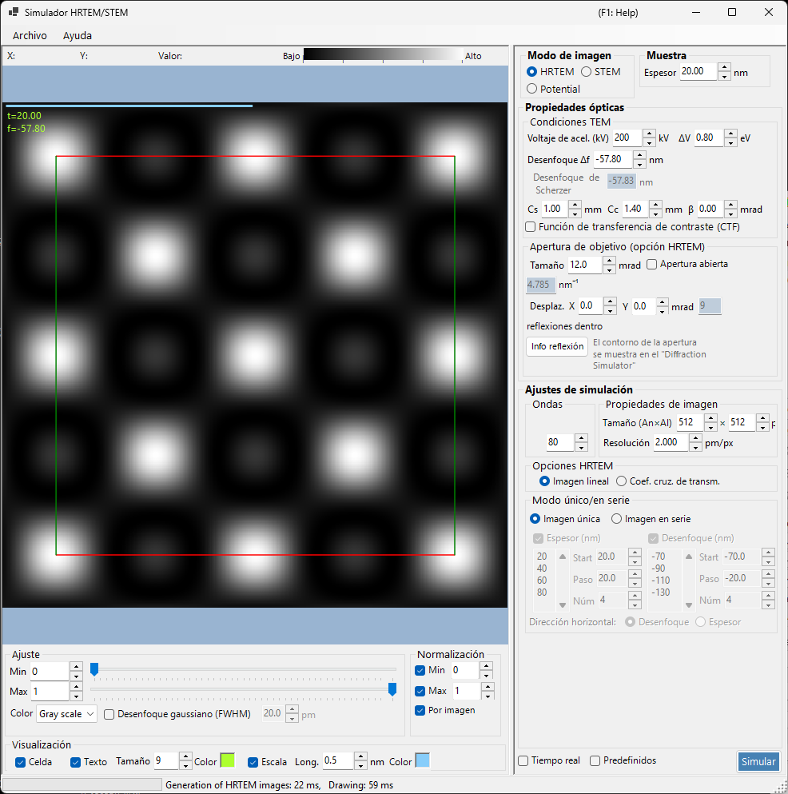
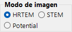
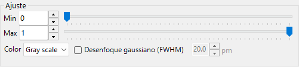
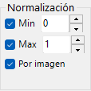
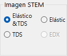
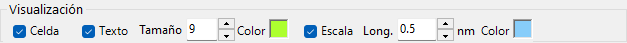
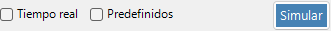
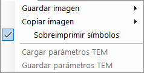
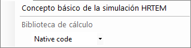

# HRTEM / STEM Simulator

El **Simulador HRTEM/STEM** simula imágenes de franjas de red en TEM (HRTEM), imágenes STEM y potenciales cristalinos proyectados para el cristal y la orientación seleccionados. Haga clic en **Simular** para ejecutar el cálculo.

La ventana está dividida en dos mitades. El **lado izquierdo** muestra el resultado de la simulación y controla su aspecto (paneles de imagen, brillo, color, barra de escala, etc.); el **lado derecho** contiene las condiciones de cálculo (**Propiedades ópticas** y **Ajustes de simulación**).

---

## Esta página y las páginas de cada modo

- **Esta página (introducción)**: las operaciones comunes a todos los modos, junto con los **controles de visualización y ajuste del resultado del lado izquierdo**.
- **Páginas de cada modo**: todos los ajustes que aparecen en el **lado derecho** en ese modo, descritos de forma que cada página sea autónoma (por eso algunos ajustes aparecen en más de una página).

| Modo | Contenido | Página |
|------|----------|------|
| **HRTEM** | Imágenes de franjas de red de TEM de alta resolución | [Simulación HRTEM](1-hrtem-simulation.md) |
| **STEM** | Imágenes de microscopio electrónico de transmisión de barrido (BF / ABF / LAADF / HAADF) | [Simulación STEM](2-stem-simulation.md) |
| **Potential** | Potencial cristalino proyectado ($U_g$ / $U'_g$) | [Simulación de potencial](3-potential-simulation.md) |

---

## Atajos de teclado y ratón

Los resultados se muestran como uno o varios paneles de imagen. Utilizan la [navegación estándar de vista de imagen](../21-shortcuts.md) de ReciPro, y todos los paneles se desplazan y se acercan o alejan de forma conjunta.

| Atajo | Acción |
|----------|--------|
| <kbd>F1</kbd> | Abrir esta página del manual en línea |
| <kbd>CTRL</kbd>+<kbd>C</kbd> (rejilla de imágenes enfocada) | Copiar la imagen o las imágenes al portapapeles como metarchivo |
| Arrastrar con el botón izquierdo / central | Desplazar la imagen (todos los paneles se mueven juntos) |
| Rueda del ratón arriba / abajo | Acercar (×2) / alejar (×0.5) en la posición del cursor |
| Arrastrar un rectángulo con el botón derecho | Acercar a la región seleccionada |
| Clic derecho / doble clic derecho | Alejar (×0.5) |
| <kbd>CTRL</kbd> + arrastrar un rectángulo con el botón derecho | Seleccionar un área rectangular |
| Doble clic izquierdo sobre un panel | Maximizar ese panel / restaurar la rejilla (diseños de varios paneles) |
| Mover el ratón (sin botón) | Leer la posición (pm) y el valor de píxel en la posición del cursor |

→ Consulte **[21. Atajos de teclado y ratón](../21-shortcuts.md)** para tener una visión general de cada ventana.

---

## Rutas rápidas según el objetivo

| Objetivo | Punto de partida | Referencia |
|------|------------|-----------|
| Calcular una imagen HRTEM | Establezca **Modo de imagen** en **HRTEM** y, a continuación, ajuste el voltaje de aceleración y el desenfoque en **Condiciones TEM** | [Simulación HRTEM](1-hrtem-simulation.md), [Formación de la imagen HRTEM](../appendix/a3-bloch-wave/hrtem.md) |
| Calcular una imagen STEM | Establezca **Modo de imagen** en **STEM** y, a continuación, ajuste el ángulo de convergencia y el detector en **Opciones STEM** | [Simulación STEM](2-stem-simulation.md), [Cálculo STEM](../appendix/a3-bloch-wave/stem.md) |
| Ver el potencial proyectado | Establezca **Modo de imagen** en **Potential** | [Simulación de potencial](3-potential-simulation.md) |
| Generar una serie de espesor / desenfoque | En HRTEM, configure **Modo único/en serie** y las condiciones de imagen | [Simulación HRTEM](1-hrtem-simulation.md) |
| Usar HAADF-STEM con TDS | Establezca factores de temperatura atómicos distintos de cero y lleve el detector STEM a LAADF / HAADF | [Cálculo STEM](../appendix/a3-bloch-wave/stem.md) |

---

## Flujo de trabajo básico

1. Seleccione el cristal y la orientación en la ventana principal y, a continuación, abra esta ventana.
2. Elija HRTEM, STEM o Potential en **Modo de imagen**.
3. Ajuste el voltaje de aceleración, el desenfoque, las aberraciones, el diafragma, el ángulo de convergencia STEM, etc. en **Propiedades ópticas** (véanse las páginas de cada modo).
4. Ajuste el espesor, el tamaño de imagen, la resolución, el número de ondas de Bloch, el modelo de coherencia parcial, etc. en **Ajustes de simulación** (véanse las páginas de cada modo).
5. Haga clic en **Simular** y, si es necesario, ajuste el aspecto con **Ajuste**, **Normalización** y **Visualización** en el lado izquierdo.

---

## Selección del modo de imagen

{ align=left }

**Modo de imagen**, en la parte superior derecha, selecciona el tipo de cálculo. Los paneles de la derecha (**Propiedades ópticas** y **Ajustes de simulación**) cambian según el modo elegido.

- **HRTEM**: imágenes de franjas de red de TEM de alta resolución → [Simulación HRTEM](1-hrtem-simulation.md)
- **STEM**: imágenes de microscopio electrónico de transmisión de barrido → [Simulación STEM](2-stem-simulation.md)
- **Potential**: potencial cristalino proyectado → [Simulación de potencial](3-potential-simulation.md)

---

## Área de imagen (lado izquierdo)

La mitad izquierda de la ventana muestra la imagen simulada. La barra de estado de la parte superior indica la posición del cursor (**X:**, **Y:**) y el **Valor:** (intensidad) de la imagen bajo el cursor, junto a una escala de intensidad **Bajo → Alto** que refleja el mapa de color y el rango de brillo actuales.

Cuando se generan varias imágenes (una imagen en serie, o la magnitud/fase de un potencial) se disponen en una rejilla, y todos los paneles se acercan, alejan y desplazan de forma conjunta.

---

## Visualización y ajuste de los resultados (panel izquierdo) {#display-settings}

El panel de la parte inferior izquierda ajusta el aspecto del resultado: brillo, color, normalización y superposiciones. Estos ajustes son comunes a todos los modos y se aplican sin necesidad de recalcular.

### Ajuste

- **Min** / **Max** : extremos inferior (negro) y superior (blanco) del rango de intensidad mostrado. Utilice las barras deslizantes para ajustar el contraste.
- **Color** : escala de color de la imagen: **Gray scale** o **Cold-Warm** (de azul a rojo).
- **Desenfoque gaussiano (FWHM)** : si está marcado, aplica un desenfoque gaussiano con la anchura a media altura (pm) indicada a la derecha, lo que aproxima una resolución finita (función de dispersión de punto).

### Normalización

- **Por imagen** : si está marcado, normaliza cada imagen por separado (si no lo está, toda la serie comparte una escala común).
- **Min** / **Max** : fija el extremo inferior / superior de la normalización en el valor indicado a la derecha, en lugar del mínimo / máximo de la imagen.

### Imagen STEM

Solo se muestra en modo STEM. Selecciona qué componente de dispersión de la imagen STEM calculada se muestra (**Elástico**, **TDS** o **Elástico & TDS**). Como es específico de STEM, también se describe en la página [Simulación STEM](2-stem-simulation.md).

### Visualización

Establece los elementos superpuestos a la imagen.

- **Celda** : superpone el contorno de la celda unidad proyectada, lo que permite relacionar el contraste de la imagen con la red cristalina.
- **Texto** : superpone etiquetas como el espesor, el desenfoque y los índices. Se pueden especificar el **Tamaño** (de letra) y el **Color**.
- **Escala** : superpone una barra de escala. Se pueden especificar la **Long.** (nm) y el **Color**.

---

## Ejecución de la simulación

- **Simular** : ejecuta el cálculo con el cristal, las condiciones del microscopio, el espesor, el desenfoque y los ajustes de visualización actuales.
- **Detener** : interrumpe el cálculo en curso (solo se muestra durante el cálculo).
- **Tiempo real** : si está marcado, recalcula inmediatamente al girar el cristal (oculto en modo STEM).
- **Predefinidos** : muestra u oculta la ventana de ajustes predefinidos, que guarda y recupera condiciones de imagen TEM.

---

## Menú Archivo

- **Guardar imagen** : guarda **como Imagen (formato PNG)**, **como Imagen (formato TIFF)** o **como metarchivo (EMF)**. **Guardar individualmente en modo de imagen en serie** escribe una a una las imágenes de una serie.
- **Copiar imagen** : copia al portapapeles **como Imagen** o **como metarchivo (EMF)**.
- **Sobreimprimir símbolos** : incrusta la celda unidad, las etiquetas y la barra de escala en la imagen guardada.
- **Cargar parámetros TEM** / **Guardar parámetros TEM** : guarda en un archivo las condiciones ópticas (voltaje de aceleración, aberraciones, etc.) y las restaura.

## Menú Ayuda

- **Concepto básico de la simulación HRTEM** : abre la explicación de la formación de la imagen HRTEM ([Apéndice A3.2](../appendix/a3-bloch-wave/hrtem.md)).
- **Biblioteca de cálculo** : selecciona la biblioteca de cálculo: **Native code** (C++/Eigen, rápida) o **Managed code** (.NET). Native suele ser más rápida.

---

## Véase también

- [Simulación HRTEM](1-hrtem-simulation.md)
- [Simulación STEM](2-stem-simulation.md)
- [Simulación de potencial](3-potential-simulation.md)
- [Difracción dinámica (onda de Bloch)](../appendix/a3-bloch-wave/index.md)
- [Simulador de difracción](../7-diffraction-simulator/index.md)
- [Trayectorias electrónicas](../8-electron-trajectory.md)
