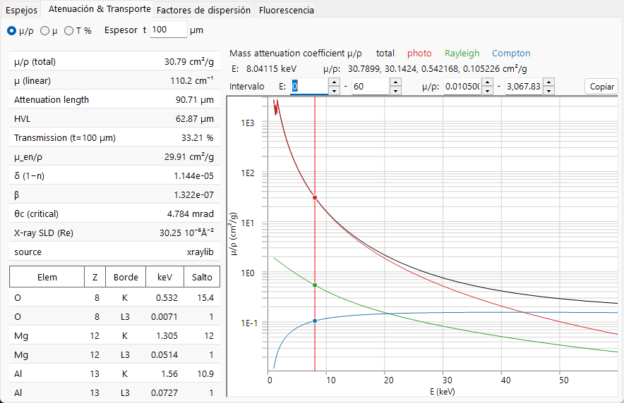
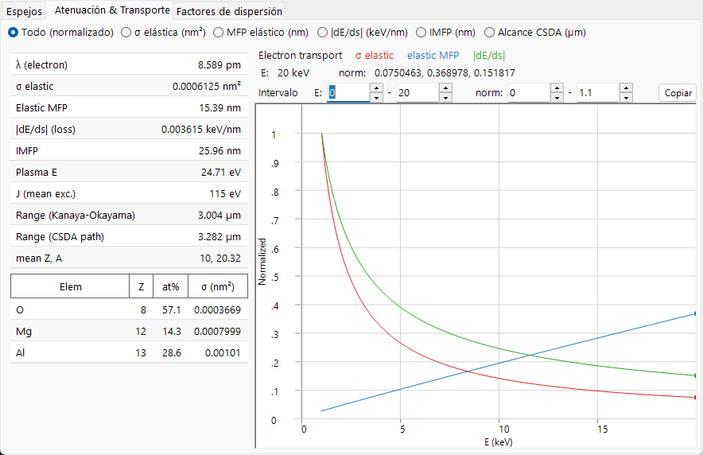
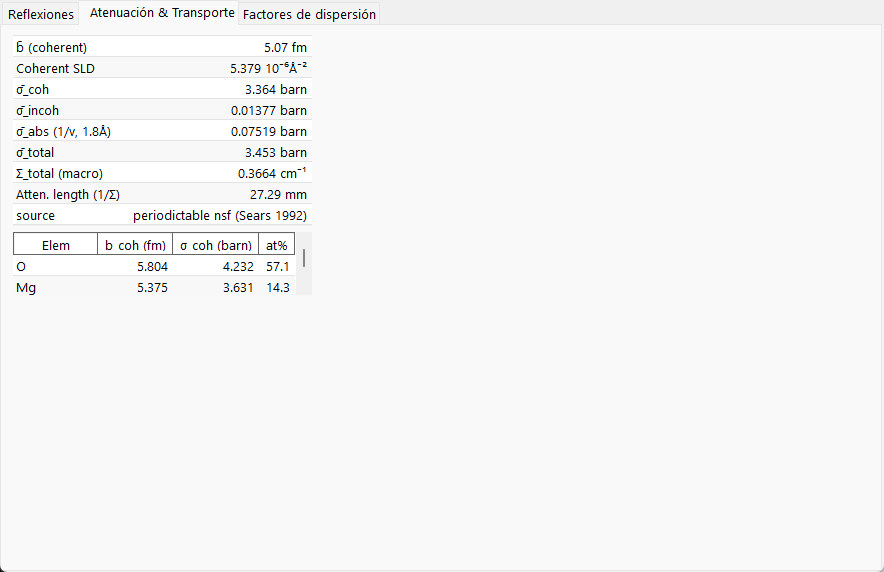

# Atenuación y transporte

Los factores de dispersión describen un único evento de dispersión; esta página trata de lo que le sucede al haz **en su conjunto** mientras atraviesa el sólido: con qué rapidez se elimina, cuánto penetra y (en el caso de los electrones) cómo se frena. La física relevante es completamente distinta para los tres haces, razón por la cual la pestaña **Atenuación & Transporte** cambia sus gráficas y tablas de forma tan drástica según la radiación.

=== "X-ray"
    

=== "Electron"
    

=== "Neutron"
    

---

## Rayos X — absorción y refracción

### Atenuación de Beer–Lambert

Un haz de rayos X monocromático se elimina exponencialmente con la longitud de recorrido:

$$I(t) = I_0\, e^{-\mu t}, \qquad \mu = \rho\,(\mu/\rho).$$

- $\mu/\rho$ : el **coeficiente de atenuación másico** (cm²/g) — la magnitud tabulada e independiente de la densidad.
- $\mu$ : el **coeficiente de atenuación lineal** (cm⁻¹) a la densidad real del material $\rho$.
- $1/\mu$ : la **longitud de atenuación** (la intensidad cae a $1/e$).
- $\text{HVL} = \ln 2/\mu$ : el **espesor de semirreducción**.
- $T = e^{-\mu t}$ : la transmisión para una muestra de espesor $t$.

### De qué se compone $\mu/\rho$

La atenuación másica total es la suma de tres procesos, representados por separado en la pestaña:

$$\left(\frac{\mu}{\rho}\right)_\text{total} = \left(\frac{\tau}{\rho}\right)_\text{photo} + \left(\frac{\mu}{\rho}\right)_\text{Rayleigh} + \left(\frac{\mu}{\rho}\right)_\text{Compton}.$$

Para un compuesto, la atenuación másica es la suma ponderada por masa de los valores elementales, mientras que el coeficiente lineal suma directamente las secciones eficaces atómicas:

$$\left(\frac{\mu}{\rho}\right)_\text{mix} = \sum_i w_i\left(\frac{\mu}{\rho}\right)_i, \qquad \mu = \sum_i n_i\,\sigma_i,$$

con $w_i$ las fracciones de masa y $n_i$ las densidades numéricas. Las tres componentes son:

- **Fotoabsorción** $\tau$ — un fotón se absorbe y expulsa un electrón ligado. Domina a baja energía y decae aproximadamente como $\tau/\rho \propto Z^{3\!-\!4}/E^{3}$ entre bordes. Este es el término que expulsa el electrón de capa interna cuya relajación produce [fluorescencia](fluorescence.md).
- **Dispersión Rayleigh (coherente)** — dispersión elástica por electrones ligados, relacionada con el factor de forma coherente $F(q)$.
- **Dispersión Compton (incoherente)** — dispersión inelástica por electrones débilmente ligados, relacionada con la función incoherente $S(q)$; su importancia relativa crece a alta energía. El fotón dispersado se desplaza en longitud de onda en

$$\Delta\lambda = \lambda' - \lambda = \frac{h}{m_e c}\,(1-\cos\varphi),$$

  de modo que un evento Compton elimina el fotón del haz monocromático (una pérdida inelástica).

Los **bordes de absorción** son los aumentos abruptos de $\tau$ cuando la energía del fotón supera la energía de enlace de una capa ($K$, $L_3$, …), abriendo un nuevo canal de ionización. La **razón de salto** es el factor por el que aumenta $\mu/\rho$ a través del borde; ReciPro lista las energías y los saltos de los bordes $K$ y $L_3$. El **coeficiente másico de absorción de energía** $\mu_\text{en}/\rho$ es la parte de $\mu/\rho$ que deposita energía localmente (excluyendo la energía que se llevan los fotones dispersados y de fluorescencia).

### Refracción, ángulo crítico y SLD

El índice de refracción de rayos X de un sólido es **ligeramente menor que 1**, escrito como

$$n = 1 - \delta + i\beta, \qquad \beta = \frac{\mu_\text{abs}\lambda}{4\pi} = \frac{r_e\lambda^2}{2\pi}\sum_i n_i\,f''_i, \qquad \delta \simeq \frac{r_e\lambda^2}{2\pi}\sum_i n_i\,(Z_i+f'_i),$$

donde $n_i$ es la densidad numérica del elemento $i$ y $r_e$ el radio clásico del electrón. Aquí $\mu_\text{abs}$ es la parte absortiva de la atenuación (ligada a $f''$); no tiene por qué ser igual al $\mu$ total de arriba, que también contiene dispersión Rayleigh y Compton. Como $n<1$, los rayos X experimentan **reflexión externa total** por debajo de un pequeño **ángulo crítico** rasante

$$\theta_c \simeq \sqrt{2\delta}.$$

Esto se sigue de la geometría de refracción: para un ángulo rasante $\alpha$ el vector de onda vertical dentro del sólido es $k_z^2 \simeq k^2(\alpha^2 - 2\delta)$, que alcanza cero en $\alpha = \alpha_c = \sqrt{2\delta}$; por debajo de ese valor la onda no puede propagarse en el material y se refleja totalmente. La parte real de la **densidad de longitud de dispersión**, $\text{SLD} = r_e\sum_i n_i (Z_i + f'_i)$, fija $\delta$ y es el análogo de rayos X de la SLD de neutrones usada en reflectometría. ReciPro indica $\delta$, $\beta$, $\theta_c$ y la SLD de rayos X en la tabla escalar.

---

## Electrones — dispersión, frenado y alcance

Un electrón rápido en un sólido a la vez **se dispersa** (cambiando de dirección) y **pierde energía** de forma continua, por lo que su transporte necesita más de una escala de longitud.

### Dispersión elástica y recorrido libre medio

La sección eficaz elástica $\sigma_\text{el}$ mide con qué facilidad un solo átomo desvía el electrón. ReciPro emplea las secciones eficaces **NIST Mott** (una solución de ondas parciales de la ecuación relativista de Dirac en el potencial atómico apantallado), válidas aproximadamente en el rango **50 eV – 36.4 keV**; fuera de ese rango, o para elementos que no figuran en la tabla, recurre a la aproximación de **Rutherford apantallada**. Las dos no tienen por qué unirse de forma perfectamente suave en el límite. La sección eficaz total es la integral angular de la diferencial,

$$\sigma_\text{el} = 2\pi\int_0^\pi \frac{d\sigma}{d\Omega}\,\sin\Theta\,d\Theta, \qquad \frac{d\sigma}{d\Omega} \propto \frac{Z^2}{E^2}\,\frac{1}{\big[\sin^2(\Theta/2)+\eta\big]^2},$$

donde el parámetro de apantallamiento $\eta$ redondea la divergencia hacia adelante de la sección eficaz de Rutherford desnuda; el tratamiento de Mott incluye además los efectos de espín y relativistas que la Rutherford apantallada omite. A partir de la sección eficaz,

$$\Sigma_\text{el} = \sum_i n_i\,\sigma_{\text{el},i}, \qquad \lambda_\text{el} = \frac{1}{\Sigma_\text{el}},$$

dan el coeficiente de dispersión macroscópico y el **recorrido libre medio elástico** — la distancia media entre eventos elásticos.

### Poder de frenado y pérdidas inelásticas

La energía se pierde principalmente en excitaciones electrónicas (ionización, plasmones). El **poder de frenado** se define como una magnitud positiva,

$$S(E) = -\frac{dE}{ds} > 0,$$

donde aquí $s$ es la **longitud de recorrido** a lo largo de la trayectoria (la variable de la curva *|dE/ds|* de la pestaña), no la variable de dispersión $\sin\theta/\lambda$ usada en otras partes de este apéndice. El gradiente de energía $dE/ds$ es negativo, por lo que la pestaña representa $S$ hacia arriba. A energías de keV sigue, conceptualmente, la forma de **Bethe**

$$S(E) \;\propto\; \frac{Z\rho}{A}\,\frac{1}{E}\,\ln\!\frac{E}{J},$$

con $J$ la **energía media de excitación** del sólido. Este esbozo no relativista muestra solo el escalado; ReciPro evalúa una forma corregida/empírica (del tipo Joy–Luo) que se mantiene bien comportada a baja energía. La **energía de plasmón** $E_p$ en la tabla escalar es una caracterización relacionada pero distinta de las mismas excitaciones electrónicas. El **recorrido libre medio inelástico** (IMFP) es la distancia media correspondiente entre colisiones con pérdida de energía; ReciPro puede evaluarlo a partir de la fórmula predictiva **TPP-2M**,

$$\lambda_\text{in}(E) = \frac{E}{E_p^2\left[\beta_\text{T}\ln(\gamma_\text{T} E) - C/E + D/E^2\right]},$$

con $E$ en eV, $\lambda_\text{in}$ en Å, y los parámetros $\beta_\text{T},\gamma_\text{T},C,D$ construidos a partir de $E_p$, la densidad, la banda prohibida y el número de electrones de valencia.

### Dos tipos de alcance

- **Alcance CSDA** — la aproximación de frenado continuo (continuous-slowing-down approximation) integra el poder de frenado para dar la longitud de recorrido total recorrida antes de que el electrón se detenga:

$$R_\text{CSDA} = \int_{E_\text{cut}}^{E_0} \frac{dE}{S(E)}.$$

(En la práctica la integral baja hasta un valor de corte de baja energía $E_\text{cut}$, por debajo del cual el esbozo de Bethe anterior ya no se cumple.)

- **Alcance de Kanaya–Okayama** — una estimación empírica ampliamente utilizada de la **profundidad de penetración** (no de la longitud de recorrido), que tiene en cuenta la trayectoria tortuosa y dispersada:

$$R_\text{KO}\,[\mu\text{m}] = 0.0276\,\frac{A\,E_0^{1.67}}{\rho\,Z^{0.89}}, \qquad (E_0\ \text{in keV}).$$

Los dos responden a preguntas diferentes — distancia total recorrida frente a cuánto penetra el electrón en el sólido — por lo que difieren en valor, y ReciPro indica ambos. Estos alcances fijan el volumen de interacción que está detrás de las simulaciones de [trayectorias electrónicas](../../8-electron-trajectory.md) y EBSD.

---

## Neutrones — sección eficaz macroscópica y la ley 1/v

Para los neutrones no hay una curva de atenuación dependiente de la energía; la interacción está fijada por las **secciones eficaces nucleares**. El haz se atenúa a través de la sección eficaz total macroscópica, que es a su vez la suma de las partes coherente, incoherente y de absorción:

$$\Sigma_\text{total} = \sum_i n_i\,\sigma_{\text{total},i}, \qquad \sigma_\text{total} = \sigma_\text{coh} + \sigma_\text{inc} + \sigma_\text{abs}(\lambda), \qquad T = e^{-\Sigma_\text{total} t},$$

con longitud de atenuación $1/\Sigma_\text{total}$. La parte de absorción depende de la velocidad del neutrón $v$ (y por tanto de la longitud de onda): para la mayoría de los nucleidos el tiempo que se pasa cerca del núcleo escala como $1/v$, dando la **ley 1/v**

$$\sigma_\text{abs}(\lambda) = \sigma_\text{abs}(\lambda_0)\,\frac{\lambda}{\lambda_0}, \qquad \lambda_0 = 1.798\ \text{Å}\ (\text{thermal}, 2200\ \text{m/s}).$$

Unos pocos absorbentes fuertes (Cd, Sm, Eu, Gd) presentan **resonancias** de baja energía que violan el sencillo escalado 1/v; ReciPro marca estos nucleidos. La **densidad de longitud de dispersión** coherente, $\text{SLD} = \sum_i n_i\, b_{\text{coh},i}$, es el análogo de neutrones de la SLD de rayos X anterior.

---

## Penetración de un vistazo

Los tres haces sondean profundidades enormemente diferentes — la razón práctica por la que responden a preguntas distintas:

| Haz | Muestra típica | Penetración (orden de magnitud) | Determinada por |
|---|---|---|---|
| Rayos X (≈8 keV) | polvo / monocristal | 10–100 µm | $\mu = \rho(\mu/\rho)$ |
| Electrón (≈200 keV) | lámina TEM | 10–100 nm (útil) | MFP elástico + pérdida inelástica |
| Neutrón (térmico) | volumen, tamaño cm | 1–10 cm | $\Sigma_\text{total}$ |

Las mismas escalas de longitud explican por qué los electrones exigen muestras ultrafinas y teoría dinámica, mientras que los neutrones ven una muestra de volumen entera bajo cinemática de dispersión simple.

---

## Véase también

- [Factores de dispersión atómicos](scattering-factor.md) — la separación $F(q)$/$S(q)$ detrás de Rayleigh/Compton, y las secciones eficaces de Mott.
- [Fluorescencia](fluorescence.md) — la relajación que sigue a la fotoabsorción de rayos X.
- [3. Interacción del haz](../../3-beam-interaction.md) — la pestaña *Atenuación & Transporte*.
- [8. Trayectorias electrónicas](../../8-electron-trajectory.md) · [12. Simulación EBSD](../../12-ebsd-simulation.md) — donde se usan los alcances electrónicos.
