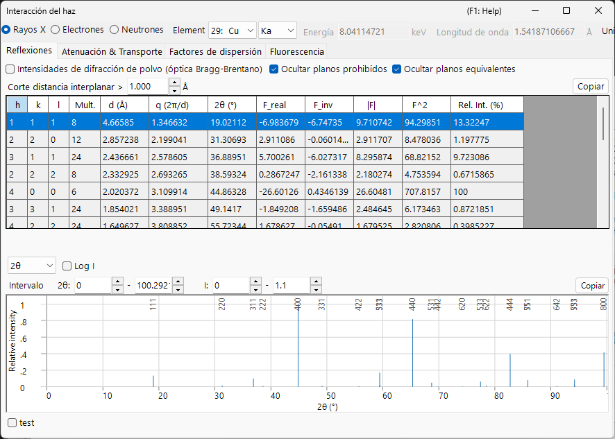

# Apéndice A2. Interacción del haz (fundamentos de física del estado sólido)

El capítulo de la ventana principal [3. Beam interaction](../../3-beam-interaction.md) es una guía de la GUI: indica qué botones pulsar y qué significa cada columna. Este apéndice reúne la **física del estado sólido y de la dispersión** que hay detrás de esos números — por qué un átomo dispersa los rayos X, los electrones y los neutrones de forma tan distinta, de dónde provienen el factor de estructura y su parte imaginaria, cómo se atenúa y se frena un haz dentro de un sólido, y qué representa y qué no representa la previsualización de fluorescencia.

La ventana tiene cuatro pestañas, y la teoría se lee mejor en el orden en que una magnitud alimenta a la siguiente:

1. **[Atomic scattering factors](scattering-factor.md)** — cómo un *único átomo* dispersa cada tipo de haz.
2. **[Structure factor](structure-factor.md)** — cómo interfieren los átomos de una *celda elemental*, incluyendo el factor de Debye–Waller y las reglas de extinción.
3. **[Attenuation & transport](attenuation-transport.md)** — cómo el haz es *eliminado y frenado* a medida que atraviesa el material.
4. **[Fluorescencia](fluorescence.md)** — la emisión de rayos X característicos que sigue a la ionización de una capa interna.

---

## Geometría de dispersión y la variable $s$

Toda magnitud de dispersión en esta ventana es función de cuánto cambia la dirección del haz. Escribiendo $\mathbf k_i$ y $\mathbf k_s$ para los vectores de onda incidente y dispersado (elástico, así que $|\mathbf k_i|=|\mathbf k_s|=1/\lambda$), el **vector de dispersión** y su módulo son

$$\mathbf Q = 2\pi(\mathbf k_s - \mathbf k_i), \qquad Q = |\mathbf Q| = \frac{4\pi\sin\theta}{\lambda} = 4\pi s .$$

- $\theta$ : el ángulo de Bragg — *la mitad* del ángulo de dispersión total. La tabla de reflexiones indica el ángulo completo $2\theta$.
- $s = \dfrac{\sin\theta}{\lambda}$ (Å⁻¹) : la variable frente a la que se representa la pestaña **Factores de dispersión**. Es el argumento natural de todo factor de forma atómico.
- $d$ : el espaciado interplanar. En la condición de Bragg $\lambda = 2d\sin\theta$, de modo que $s = \dfrac{1}{2d} = \dfrac{|\mathbf g|}{2}$, donde $\mathbf g$ es el vector de la red recíproca con $|\mathbf g| = 1/d$.

Estas tres convenciones describen la misma geometría; solo difiere la escala. Conviene tener clara la correspondencia, porque la ventana utiliza más de una de ellas:

| En la ventana | Símbolo | Relación |
|---|---|---|
| Tabla de reflexiones | $q = 2\pi/d$ | $q = 2\pi\lvert\mathbf g\rvert = Q = 4\pi s$ |
| Tabla de reflexiones | $2\theta$ | ángulo de dispersión completo, $\sin\theta = \lambda s$ |
| Pestaña Factores de dispersión | $s = \sin\theta/\lambda$ | $s = q/4\pi = 1/(2d)$ |
| Gráfico de picos de difracción | $Q = 4\pi\sin\theta/\lambda$ | $Q = q = 4\pi s$ |

!!! note "Unidades"
    Las parametrizaciones publicadas de los factores de forma usan $s$ en Å⁻¹ (por lo que $s^2$ en Å⁻²), mientras que ReciPro maneja $s^2$ internamente en nm⁻². Ambas difieren en un factor $100$ en $s^2$; las curvas y las tablas se presentan en las unidades indicadas en el encabezado de cada tabla. Un modelo — **Kirkland** — está tabulado frente a $q = 2s = 1/d$ en lugar de frente a $s$; véase [Atomic scattering factors](scattering-factor.md).

### Bragg, Laue y la esfera de Ewald {#phase-convention}

La condición de Bragg es una cara de un único requisito geométrico. La interferencia constructiva (la **condición de Laue**) exige que el vector de dispersión sea igual a un vector de la red recíproca,

$$\mathbf k_s = \mathbf k_i + \mathbf g, \qquad |\mathbf k_i + \mathbf g|^2 = |\mathbf k_i|^2 ,$$

lo que, con $|\mathbf k_i|=|\mathbf k_s|=1/\lambda$, se reduce a

$$2\,\mathbf k_i\cdot\mathbf g + |\mathbf g|^2 = 0 \qquad\Longleftrightarrow\qquad |\mathbf g| = \frac{1}{d} = \frac{2\sin\theta}{\lambda},$$

es decir, la **ley de Bragg** $\lambda = 2d\sin\theta$. Geométricamente esto es la construcción de la **esfera de Ewald**: una reflexión se excita cuando su punto de la red recíproca se sitúa sobre la esfera de radio $1/\lambda$. (Aquí $\mathbf g$ está en unidades de $1/d$, así que $\mathbf Q = 2\pi\mathbf g$.)

---

## Convención de fase

ReciPro construye los factores de estructura con la convención de fase cristalográfica

$$F_{\mathbf g} = \sum_j \dots \exp\!\left(-2\pi i\,\mathbf g\cdot\mathbf r_j\right),$$

es decir, con un signo **menos** en el exponente. Esta elección fija el signo de la parte imaginaria del factor de estructura (`F_inv` en la tabla de reflexiones) y la relación entre los pares de Friedel una vez que se activa la dispersión anómala. Se establece aquí una sola vez y se da por supuesta a lo largo del apéndice; las consecuencias se desarrollan en [Structure factor](structure-factor.md).

---

## Dispersión cinemática frente a dinámica

Este apéndice trata la **dispersión simple (cinemática)**: el haz incidente se dispersa una vez, y la amplitud difractada es el factor de estructura de la página siguiente. Esa es la imagen correcta cuando la interacción es débil — rayos X y neutrones en casi todas las muestras, y electrones en especímenes *muy delgados*.

Cuando la interacción es fuerte — electrones en cualquier cristal salvo los más delgados — el haz se dispersa muchas veces antes de salir, la intensidad se redistribuye entre las reflexiones, y $\lvert F\rvert^2$ ya no proporciona la intensidad medida. Ese régimen requiere la teoría **dinámica** del [Appendix A3](../a3-bloch-wave/index.md). Los factores de dispersión y los factores de estructura aquí deducidos son la *entrada* de ambas imágenes.

Incluso en el límite cinemático la amplitud difractada no es únicamente el factor de estructura: sumar la onda dispersada a través de una lámina de espesor $t$ da

$$A_{\mathbf g}(t) \;\propto\; F_{\mathbf g}\int_0^t e^{\,2\pi i S_{\mathbf g} z}\,dz = F_{\mathbf g}\, t\, e^{\,\pi i S_{\mathbf g} t}\,\operatorname{sinc}(\pi S_{\mathbf g} t),$$

donde $S_{\mathbf g}$ es el **error de excitación** — la distancia del punto de la red recíproca a la esfera de Ewald. La intensidad alcanza un máximo agudo en $S_{\mathbf g}=0$ y oscila con el espesor (el origen de las franjas de espesor); la teoría dinámica del [Appendix A3](../a3-bloch-wave/index.md) sustituye este resultado de haz único por un comportamiento de haces acoplados.

---

## Las tres sondas de un vistazo

| | Rayos X | Electrón | Neutrón |
|---|---|---|---|
| Interactúa con | densidad electrónica $\rho_e$ | potencial electrostático $V$ | núcleos (y espines no apareados) |
| Intensidad de la interacción | débil | fuerte | muy débil |
| Penetración típica | µm – mm | nm – µm | mm – cm |
| ¿Dispersión simple válida? | casi siempre | solo láminas delgadas | casi siempre |
| Sensibilidad a átomos ligeros | pobre ($\propto Z$) | moderada | a menudo excelente |

Estos contrastes reaparecen a lo largo de las páginas siguientes, cada uno rastreable hasta el mecanismo de dispersión de [Atomic scattering factors](scattering-factor.md).

---

## Véase también

- [3. Beam interaction](../../3-beam-interaction.md) — la GUI que explica este apéndice.
- [Atomic scattering factors](scattering-factor.md) · [Structure factor](structure-factor.md) · [Attenuation & transport](attenuation-transport.md) · [Fluorescencia](fluorescence.md)
- [Appendix A1. Coordinate systems](../a1-coordinate-system/1-orientation.md)
- [Appendix A3. Dynamical diffraction (Bloch-wave method)](../a3-bloch-wave/index.md) — la teoría de dispersión múltiple que utiliza estos factores de dispersión.
