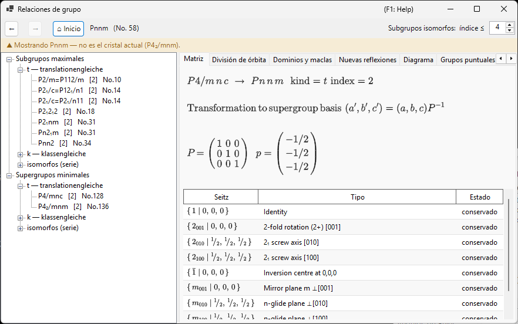
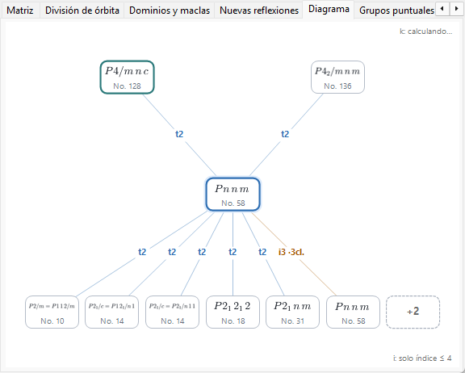
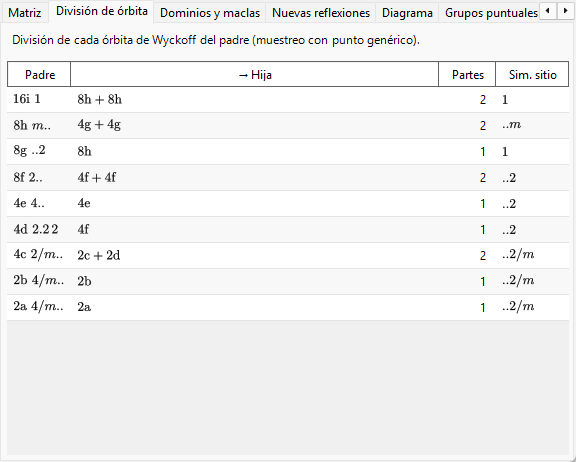
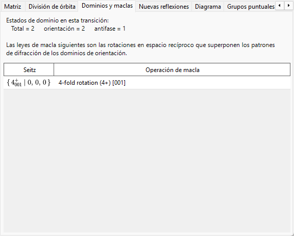
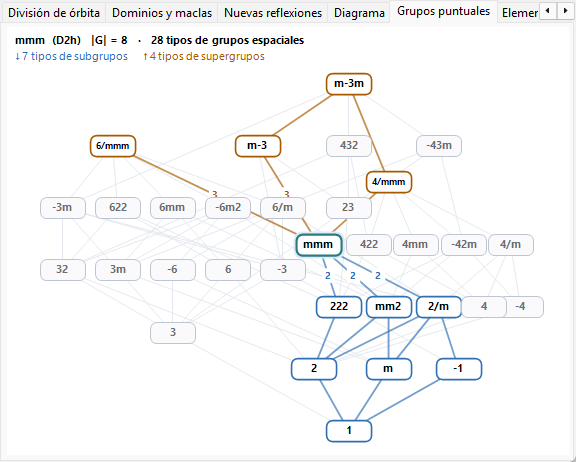
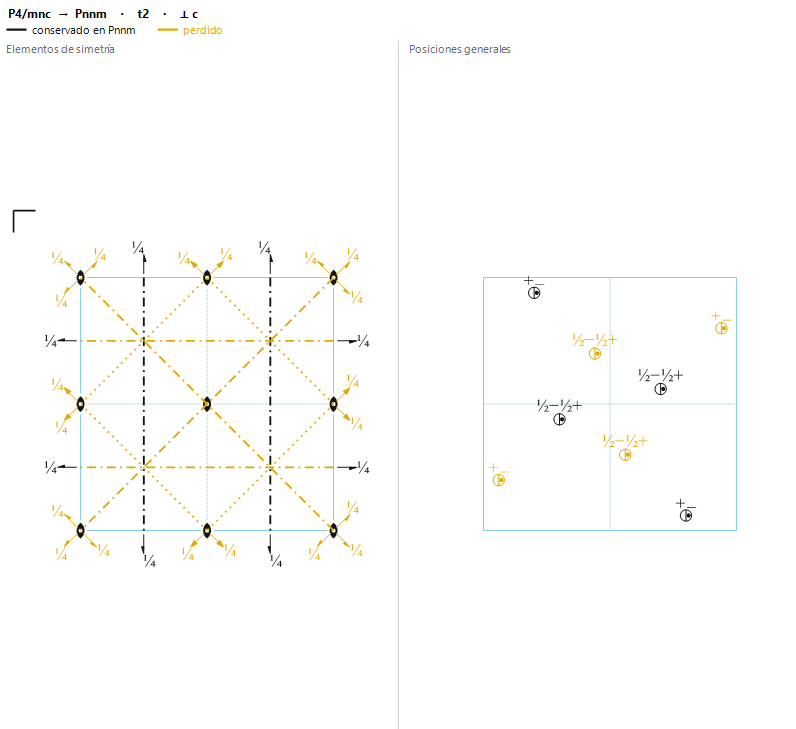

# A4.2. Relaciones grupo-subgrupo

**Relaciones de grupo…** es un explorador de las relaciones de subgrupos maximales / supergrupos minimales de los 230 tipos de grupos espaciales, que se abre desde el panel **Opciones** de [Información de simetría](../../2-symmetry-information.md). A diferencia de una tabla estática, cada relación que muestra se calcula en tiempo de ejecución directamente a partir de las propias operaciones de simetría del grupo espacial actual (véase [A4.1](symbols-and-diagrams.md#operaciones-de-simetría-pestaña-operaciones)), de modo que puede cotejarse operación por operación, en lugar de aceptarse solo como una transcripción de las *International Tables*, Vol. A1.

Esta página explica el vocabulario de teoría de grupos que emplea el explorador y, a continuación, recorre cada una de sus pestañas.

---

## El teorema de Hermann: subgrupos *t*, *k* e isomorfos

Un subgrupo $H<G$ es **maximal** si ningún subgrupo de $G$ se sitúa estrictamente entre $H$ y $G$. Un teorema debido a Carl Hermann (1929) dice que, para los grupos espaciales tridimensionales aquí tabulados, todo subgrupo maximal de un grupo espacial $G$ es de uno de dos tipos:

- **subgrupo translationengleiche (*t*-)** — «de iguales traslaciones»: $H$ conserva *todas* las traslaciones de $G$ (la misma red, la misma celda), pero un grupo puntual menor. El índice $[G:H]$ (el número de clases laterales de $H$ en $G$) es igual al índice de grupos puntuales $[P_G:P_H]$.
- **subgrupo klassengleiche (*k*-)** — «de igual clase»: $H$ conserva la *misma clase cristalina geométrica* (tipo de grupo puntual) que $G$, pero solo una subred de las traslaciones de $G$ — una celda convencional mayor y/o menos vectores de centrado. El índice es igual al índice de redes de traslación $[T_G:T_H]$.

**Los subgrupos isomorfos** son el caso especial e importante de los subgrupos *k* en el que $H$ es, además, del *mismo tipo de grupo espacial* que el propio $G$ (solo con una celda mayor — una relación que se repite indefinidamente, de modo que los subgrupos isomorfos forman una serie infinita indexada por el tamaño de la celda, a diferencia de los subgrupos *t* y *k* no isomorfos de un $G$ dado, que son finitos en número). Para un subgrupo isomorfo *maximal* el índice es siempre una potencia de primo ($p$, y en tres dimensiones ocasionalmente $p^2$ o $p^3$); qué potencia aparece depende de cómo se descomponga la red cociente finita como módulo bajo el grupo puntual. Nótese también que el cambio de base hacia una subred puede llevar consigo un cambio genuino de los vectores de la base y un desplazamiento del origen, no meramente una ampliación uniforme de la celda a lo largo de un eje.

Como toda relación de subgrupo de índice finito (maximal o no) puede alcanzarse como una cadena de pasos maximales, enumerar solo los subgrupos maximales (y, en la otra dirección, los supergrupos minimales) basta para describir la red completa de relaciones de subgrupo de índice finito — que es exactamente la razón por la que las ITA Vol. A1, y este explorador, tabulan únicamente las relaciones maximales/minimales.

!!! note "Solo dos tipos — el isomorfo es una subclase, no un tercero"
    Es una abreviatura habitual hablar de «subgrupos *t*, *k* e isomorfos» como si fueran tres categorías equivalentes, y el árbol de este explorador está organizado, en efecto, en tres ramas por comodidad. Formalmente, sin embargo, el teorema de Hermann es una división en **dos** (*t* frente a *k*); los subgrupos isomorfos son simplemente los subgrupos *k* que resultan reproducir el propio tipo de grupo espacial de $G$.

### El índice, como recuento de clases laterales

Como los grupos espaciales son infinitos (contienen traslaciones), «índice» significa aquí siempre **el número de clases laterales de $H$ en $G$**, no un cociente de órdenes $|G|/|H|$ (ambos órdenes son infinitos) — para grupos finitos las dos nociones coinciden, pero para los grupos espaciales solo tiene sentido la definición por recuento de clases laterales. El árbol y la pestaña Matriz muestran este índice como, p. ej., `t, index 2` o `k, index 3`.

### Subgrupos conjugados y clase de conjugación

Una misma relación de subgrupo abstracta puede a menudo realizarse dentro de $G$ de más de una manera geométricamente distinta — relacionadas por la orientación o la posición, no por el tipo — por ejemplo, la imagen especular de un plano de espejo, o un eje helicoidal a lo largo de una dirección orientada de otro modo pero equivalente por simetría. Dos de esas realizaciones $H$ y $H'$ son conjugadas **dentro de $G$** si $H' = gHg^{-1}$ para algún $g\in G$; el explorador agrupa todas esas copias $G$-conjugadas de una relación en una sola entrada e indica cuántas hay como tamaño de la *clase de conjugación*. Esta es una noción estrictamente más fina que agrupar los subgrupos por la equivalencia (más gruesa) bajo el normalizador euclidiano o afín de $G$ — una clasificación que las propias ITA emplean a veces en su lugar — de modo que los subgrupos que comparten tipo e índice no pertenecen automáticamente a una sola clase de conjugación; pueden repartirse en varias.

---

## Navegación por el explorador

- El **árbol** (panel izquierdo) tiene dos raíces, **Subgrupos maximales** y **Supergrupos minimales**, cada una dividida en una rama **`t — translationengleiche`**, una rama **`k — klassengleiche`** y una rama **`isomorfos (serie)`**. Las clases no conjugadas que comparten el mismo tipo hijo y el mismo índice recibirían etiquetas idénticas, así que se distinguen con un sufijo `· clase n`. En la rama **isomorfos** de Subgrupos maximales, las clases de conjugación equivalentes bajo el *normalizador afín* de $G$ se agrupan además bajo una única fila de órbita (*"… — m clases (equivalentes por normalizador)"*) — la misma granularidad que las entradas IIc de las ITA Vol. A1 — y el límite de la enumeración se fija con el selector **Subgrupos isomorfos:  índice ≤** de la barra de herramientas (de 2 a 27, 4 por defecto; los límites mayores se calculan en segundo plano).
- La pestaña **Diagrama** dibuja un esqueleto simplificado al estilo de Bärnighausen: el grupo actual en el centro (resaltado), sus supergrupos minimales encima y sus subgrupos maximales debajo — **las relaciones *t*, *k* e isomorfas por igual**, ya que cada una es un «paso maximal». Cada arista lleva como etiqueta su tipo y su índice (`t2`, `k3`, `i3`), con código de color: azul para *t*, verde azulado para *k* y naranja para las isomorfas. Los símbolos de los nodos se componen como símbolos cristalográficos propiamente dichos — subíndices para los ejes helicoidales, barras superiores para las rotoinversiones. Las clases no conjugadas que comparten el mismo tipo de destino, el mismo tipo de relación y el mismo índice se fusionan en un único nodo cuya etiqueta de arista lleva un recuento de clases (p. ej. `k2 ·2 cl.`) — el árbol sigue siendo el lugar donde inspeccionar cada clase individualmente. Cuando una fila contiene más relaciones de las que caben en el ancho de la ventana, los nodos se reducen un paso y el resto se recoge en un nodo discontinuo `+N` (no clicable — use el árbol para la lista completa); un pequeño recordatorio `i: solo índice ≤ 4` aparece en la esquina siempre que se muestran aristas isomorfas, y `k: calculando…` mientras la búsqueda inversa de supergrupos *k* aún se está construyendo. Cuando desciende por los subgrupos con dobles clics sucesivos, la cadena de grupos que ha atravesado (su *rama seleccionada*) se dibuja como una columna vertical morada encima del grupo actual — un árbol de Bärnighausen multinivel de su propio camino de transición (p. ej. $Pm\bar3m \rightarrow P4/mmm \rightarrow Pmmm \rightarrow \ldots$), con cada arista etiquetada con la relación que tomó; al ascender o al pulsar **Atrás**, la rama se recorta en consecuencia, y las cadenas de más de tres antecesores se abrevian con un `⋮ +N` atenuado. Esto muestra únicamente el esqueleto de teoría de grupos: un árbol de Bärnighausen completo, en el sentido de las relaciones estructurales, lleva además en cada arista las transformaciones de celda, la división de las posiciones de Wyckoff y las correlaciones entre coordenadas atómicas, que viven en las otras pestañas descritas más abajo y no en el propio diagrama.
- **Un clic** (en un nodo del árbol o en un nodo del Diagrama) selecciona una relación y rellena las pestañas de detalle inferiores. **Doble clic** *navega*: reancla el explorador entero en ese grupo espacial, de modo que puede caminar paso a paso de grupo a subgrupo, y de ahí a otro subgrupo.
- **Atrás / Adelante / Inicio** recorren su historial de navegación; **Inicio** vuelve siempre al grupo espacial del cristal desde el que abrió realmente el explorador.
- La **ruta de navegación** (arriba) muestra el grupo espacial visualizado actualmente (`símbolo HM (No. n)`); el **rótulo de contexto** situado debajo se pone verde ("Mostrando el grupo espacial del cristal actual.") cuando coincide con su cristal, o ámbar ("Mostrando … — no es el cristal actual (…).") cuando ha navegado a otro lugar — un recordatorio de que explorar un subgrupo *no* cambia su cristal.

---

## Pestaña Matriz

Muestra el cambio de base y el desplazamiento del origen entre la configuración del padre y la de la hija, con la convención de las ITA: los nuevos vectores de la base son $(\mathbf a',\mathbf b',\mathbf c')=(\mathbf a,\mathbf b,\mathbf c)\cdot P$, y las coordenadas de un punto en la configuración del padre son $\mathbf x_{\text{parent}} = P\,\mathbf x_{\text{child}} + \mathbf p$. La matriz $3\times3$ $P$ y el desplazamiento del origen $\mathbf p$ se imprimen como fracciones.

- Cuando ha llegado a esta relación desde **Subgrupos maximales**, $P$ y $\mathbf p$ se muestran directamente (en el sentido padre → hija).
- Cuando, en cambio, ha llegado desde **Supergrupos minimales**, la pestaña muestra $P^{-1}$ (y el desplazamiento invertido correspondiente), con la leyenda *"derivada de la tabla de subgrupos del propio supergrupo"* — el explorador almacena siempre la relación desde el punto de vista del grupo mayor y la invierte a demanda, en lugar de mantener dos copias independientes.
- **Subgrupos conjugados de esta clase: $n$** indica el tamaño de la clase de conjugación descrita más arriba.
- Una tabla de generadores enumera todos los representantes de las clases laterales, etiquetados como **conservado** (sigue presente en $H$) o **perdido** (presente en $G$ pero no en $H$ — estas son exactamente las operaciones responsables de la ruptura de la simetría), cada uno con su símbolo de Seitz y su descripción de tipo geométrico de [A4.1](symbols-and-diagrams.md#operaciones-de-simetría-pestaña-operaciones).
- Si el tipo de grupo espacial de destino de una relación candidata no pudo identificarse contra el catálogo de ReciPro, la pestaña lo dice claramente en lugar de adivinar, y muestra solo el símbolo del grupo puntual.

---

## Pestaña División de órbita

Muestra cómo se divide cada posición de Wyckoff del grupo *padre* cuando la simetría desciende a $H$: una fila por posición del padre, con la multiplicidad/letra/simetría de sitio del padre, las multiplicidades/letras hijas resultantes (unidas con `+` si la órbita se divide en más de una), en cuántas piezas se dividió y las distintas simetrías de sitio hijas.

Esto se calcula sustituyendo realmente **un punto de muestra fijo y genérico** en las operaciones de ambos grupos y comparando las órbitas resultantes — una división *muestreada* numéricamente, no el formalismo plenamente simbólico de división de Wyckoff (el que usan herramientas como WYCKSPLIT); por esta razón se denomina deliberadamente «División de órbita» y no «División de Wyckoff» — un tratamiento plenamente simbólico podría en principio rastrear cada coincidencia de parámetros especiales, mientras que este enfoque muestreado informa solo de la división vista en un punto genérico y no señalaría por sí mismo una coincidencia que ocurre solo para valores especiales de $x,y,z$.

Para una relación ***k* o isomorfa** se aplica el mismo enfoque muestreado a la red de traslaciones más gruesa: la pestaña muestra cómo se divide cada órbita del padre a medida que se pierden traslaciones de red, y las multiplicidades hijas se cuentan **en la celda ampliada del subgrupo** (de modo que, para una ampliación de celda de índice $n$, las multiplicidades de las piezas suman $n$ veces la multiplicidad del padre).

---

## Pestaña Dominios y maclas

Cuando un cristal se transforma de $G$ a un subgrupo $H$, cada una de las $[G:H]$ clases laterales de $H$ en $G$ corresponde a un posible **estado de dominio**: el estado de referencia es la clase lateral de la identidad, y cada una de las demás clases laterales — representada por una operación «perdida» de la pestaña Matriz — genera un estado de dominio más, relacionado con el de referencia por esa operación.

Para un **subgrupo *t*** en concreto, la red de traslaciones no cambia ($T_G=T_H$), así que, desde el punto de vista de la teoría de grupos, aquí no existe tal cosa como un **dominio de antifase (de traslación)**: todo estado de dominio difiere del de referencia por una operación genuina del grupo puntual, nunca por un mero desplazamiento. Por tanto, la pestaña informa siempre `antifase = 1` y `orientación = total`, es decir, los $[G:H]$ estados de dominio son todos **dominios de orientación**.

Para una transición ***k* o isomorfa** la situación es exactamente la inversa: el grupo puntual no cambia, así que hay un solo **estado de orientación**, y las traslaciones de red perdidas generan **dominios de antifase (de traslación)** — la pestaña informa `orientación = 1` y `antifase = total`. Cada traslación perdida se enumera como un símbolo de Seitz de traslación pura, junto con el vector de antifase correspondiente expresado en la celda del subgrupo. Como todos los dominios de antifase comparten la misma orientación, sus reflexiones fundamentales coinciden exactamente; solo las reflexiones de superestructura (véase la pestaña **Nuevas reflexiones**) llevan una diferencia de fase a través de una frontera de antifase.

La **ley de macla** para una pareja de dominios de orientación es la parte matricial de la operación perdida — una rotación o una reflexión, expresada como actuando sobre la red directa o la recíproca — que lleva la orientación de la red de un dominio sobre la del otro. Para una transición a un subgrupo *t*, esta operación es por construcción una simetría de la red del grupo *padre* $G$; por tanto, si la métrica real de la estructura de baja simetría aún conserva esa simetría de red, las redes recíprocas de los dos dominios coinciden exactamente tras la operación de macla y sus patrones de difracción se solapan por completo — el caso idealizado de macla *merohédrica* que describe esta pestaña. En una transición real, la fase de baja simetría desarrolla típicamente una pequeña deformación espontánea que solo conserva aproximadamente la métrica del padre, de modo que en la práctica el solapamiento suele ser solo aproximado (macla *pseudomerohédrica*); esta pestaña informa de la ley de macla exacta en métrica, deducida de la teoría de grupos, no de una medida de cuánto se acerca a ella un cristal real concreto.

Un caso degenerado con la lista de clases laterales vacía se informa como `(dominio único)` (el índice 1 nunca se muestra como relación).

---

## Pestaña Nuevas reflexiones

Para una transición a un subgrupo *t*, enumera las reflexiones que pasan a estar permitidas por la simetría en $H$ aunque estaban sistemáticamente ausentes en $G$ — es decir, reflexiones que las condiciones de reflexión del padre (de la pestaña [Condiciones](../../2-symmetry-information.md)) prohíben, pero las de $H$ no. La ventana de búsqueda se ajusta con el selector **Ventana de búsqueda** de la pestaña: $|h|,|k|,|l|\le4$ por defecto, ajustable de 2 a 8 (límites mayores pueden listar muchas más reflexiones).

Como un subgrupo *t* nunca amplía la celda elemental, estas **no** son reflexiones de superestructura ni de índice fraccionario: siguen siendo $(h,k,l)$ enteros de la celda del padre, y solo pasan a estar *permitidas* porque el plano de deslizamiento o el eje helicoidal que antes las obligaba a anularse ya no está presente. (Las verdaderas reflexiones de superestructura con índices fraccionarios del padre solo son posibles cuando la propia celda se amplía, lo que ocurre para un subgrupo *k*, no para un subgrupo *t*.) Una reflexión que aparece aquí está solo *permitida* por la simetría; que se observe realmente sigue dependiendo del factor de estructura de la estructura real de menor simetría.

Para una relación ***k* o isomorfa**, la pestaña enumera las nuevas reflexiones **indexadas en la celda ampliada del subgrupo** (de nuevo dentro de la ventana de búsqueda) y clasifica cada una en la última columna:

- las **reflexiones de superestructura** corresponden a índices *fraccionarios* del padre, mostrados entre paréntesis (p. ej. `(1/2 0 1)`) — aparecen puramente porque la celda se amplió;
- las **reflexiones liberadas** son enteras en la celda del padre, pero estaban prohibidas por una condición de reflexión del padre que el subgrupo levanta — en su lugar se muestra la regla del padre levantada (esto incluye la pérdida de traslaciones de centrado, p. ej. un padre centrado $I$ que pierde su condición de $h+k+l$ par).

Las reflexiones permitidas tanto en el padre como en la hija (reflexiones fundamentales) no se enumeran. Si el tipo de grupo espacial de la hija no pudo identificarse, las condiciones de reflexión de la hija se desconocen y la pestaña indica que la predicción no es posible.

---

## Pestaña Grupos puntuales

Mientras que el resto del explorador camina entre grupos *espaciales*, esta pestaña muestra el mapa más amplio en el que viven esos recorridos: el **diagrama de Hasse de los 32 tipos de grupos puntuales cristalográficos** (las clases cristalinas geométricas) — el orden parcial de qué tipo aparece como subgrupo de cuál. Cada nodo es un tipo de grupo puntual; el eje vertical es el orden del grupo (1 abajo, 48 arriba, en escala logarítmica), con la familia hexagonal/trigonal formando la torre izquierda y la torre cúbica–tetragonal–ortorrómbica a la derecha. Una arista es una relación de subgrupo *maximal* (de cobertura) — ningún tercer tipo cabe estrictamente entre ambos — y hay exactamente 80 de esas aristas entre los 32 tipos. El diagrama es un orden parcial pero *no* un retículo en el sentido matemático: tiene dos elementos maximales, $m\bar3m$ y $6/mmm$, que no son comparables.

- El grupo puntual del grupo espacial que está explorando lleva un halo azul pálido (como el nodo actual de la pestaña Diagrama) y es el tipo *enfocado* por defecto.
- **Haga clic** en cualquier nodo para enfocarlo en su lugar: sus **tipos de subgrupos se resaltan en azul**, sus **tipos de supergrupos en naranja**, y los números sobre las aristas propias del nodo enfocado son el **índice** (cociente de órdenes) de ese paso maximal. Los tipos sin relación con el foco permanecen en gris. Hacer clic en el espacio vacío devuelve el foco al grupo puntual actual. (Hacer clic nunca navega a ninguna parte — un tipo de grupo puntual corresponde a muchos grupos espaciales, no a uno solo.)
- El rótulo de la parte superior resume el tipo enfocado: los símbolos de Hermann–Mauguin y Schoenflies, el orden del grupo $|G|$, cuántos de los 230 tipos de grupos espaciales le pertenecen y los tamaños de sus conjuntos de subgrupos/supergrupos.

Este diagrama es la sombra en los grupos puntuales del teorema de Hermann: un paso de subgrupo *t* en el árbol desciende aquí exactamente una arista (el índice de grupos espaciales de un paso *t* es igual al índice de grupos puntuales de la arista), mientras que los pasos *k* e isomorfos permanecen en el mismo nodo.

---

## Pestaña Elementos y posiciones

Mientras que la pestaña **Matriz** enumera las operaciones conservadas y perdidas en forma de tabla, esta pestaña muestra la misma información *geométricamente*, en las dos figuras que los cristalógrafos ya leen una junto a otra en las ITA Vol. A: a la izquierda, el [diagrama de elementos de simetría](symbols-and-diagrams.md#symmetry-element-diagram) del padre (ejes, planos y centros de inversión); a la derecha, el **diagrama de posiciones generales** del padre. Ambas siguen una única regla de color — **lo que sobrevive en $H$ es negro, lo que se pierde es amarillo**, con la celda elemental dibujada debajo en azul — de modo que la pestaña responde de un vistazo: qué elementos de simetría se rompen, y cómo se divide la órbita de la posición general, cuando el cristal se transforma de $G$ al subgrupo $H$. La dirección de proyección (⟂ *a*, *b* o *c*) se elige automáticamente según el sistema cristalino del padre, y el encabezado indica la relación, su tipo y su índice, y la proyección.

**Izquierda — elementos de simetría.**

- La superposición dibuja en negro los elementos de simetría reconstruidos directamente a partir del propio conjunto de operaciones de $H$, encima de los elementos del padre que se pierden, en amarillo — de modo que los elementos conservados son exactamente los que reaparecen en $H$, sin conjeturas símbolo por símbolo.
- Un elemento de simetría que se degrada a otro de orden menor se muestra solo con el símbolo superviviente: donde un eje de orden 4 conserva únicamente su eje de orden 2, aparece solo el **símbolo negro de orden 2**. Un elemento perdido se imprime en amarillo únicamente donde nada sobrevive en su lugar geométrico, de modo que la simetría superviviente sigue siendo legible.

La figura de la izquierda trata tres situaciones, según cómo se relacione la celda del subgrupo con la del padre:

- **Misma celda convencional** — subgrupos *translationengleiche* (*t*-), y subgrupos *klassengleiche* (*k*-) que solo eliminan vectores de centrado ($\det$ de la base de la subred $= 1$). Aquí los elementos de $H$ viven en la celda del padre, de modo que la superposición es un único diagrama de la celda del padre. (Una relación *k*- que elimina el centrado, p. ej. centrado en $I$ o $F$ $\to$ primitivo, hace que los ejes helicoidales y los planos de deslizamiento generados por el centrado se vuelvan amarillos.)
- **Ampliación de celda en el plano** — relaciones *k*- o isomorfas cuya ampliación se sitúa en el plano *a*–*b* ($a'=n_a a$, $b'=n_b b$, con *c* inalterado) en un padre ortorrómbico, tetragonal o cúbico. La celda ampliada se dibuja (proyectada ⟂ *c*) como una cuadrícula $n_a\times n_b$ de teselas de la celda del padre, y **cada tesela se colorea de forma independiente**: un elemento de simetría conservado en $H$ aparece en negro en las teselas donde esa copia sobrevive, y en amarillo donde la ampliación de la celda lo ha eliminado — así, la duplicación de la celda se ve directamente como una de cada dos copias que se vuelve amarilla.
- **En caso contrario** (ampliación a lo largo del eje de visión $c$, cambios de celda oblicuos/no ortogonales, padres hexagonales/trigonales/monoclínicos) la simetría perdida no puede dibujarse sin ambigüedad en una proyección 2-D, por lo que la pestaña muestra una breve nota que remite a las pestañas **Dominios y maclas** y **Nuevas reflexiones**, que ya contienen la información de la simetría de red perdida para esos casos.

**Derecha — posiciones generales.** Bajo $G$ todos los puntos dibujados forman una sola órbita (una posición general); bajo $H$ esa órbita se divide en $[G:H]$ subórbitas (compárese la pestaña **División de órbita**). La subórbita que contiene el punto representativo — el conjunto que sigue siendo una posición general de $H$ — se dibuja en **negro**; los puntos de las demás subórbitas, que dejan de ser equivalentes a él al descender la simetría, son **amarillos**. Donde la proyección hace coincidir dos puntos equivalentes se usa el *círculo dividido* estándar de las ITA: un círculo partido por una línea vertical, con una coma que marca la mitad de imagen especular y una etiqueta de altura (`+`, `½−`, …) junto a cada mitad. **Si una mitad sobrevive en $H$ y la otra se pierde, la línea divisoria y la coma y la etiqueta de altura de la mitad perdida se dibujan en amarillo**, de modo que una posición medio perdida puede leerse directamente en la figura. El coloreado de la órbita se muestra para las relaciones de misma celda (*t*-, y *k*- que eliminan el centrado); para las relaciones que amplían la celda, el panel derecho muestra en su lugar una breve nota.

Para los grupos espaciales R mostrados en la configuración de ejes romboédricos (Rho), ninguna de las dos figuras puede dibujarse en esta proyección; la pestaña muestra una nota en su lugar, y ambos diagramas están disponibles en la configuración de ejes hexagonales (Hex) del mismo grupo espacial R.

---

## Limitaciones actuales

Los motores de subgrupos *t* y *k* del explorador, las búsquedas inversas de supergrupos *t* y *k* y la clasificación isomorfa (IIc) están completamente implementados y verificados de forma independiente contra las tablas de operaciones de los grupos espaciales, y las pestañas **División de órbita**, **Dominios y maclas** y **Nuevas reflexiones** funcionan para todos los tipos de relación. Las limitaciones restantes se muestran como tales, en lugar de omitirse en silencio:

- **Los subgrupos isomorfos se enumeran hasta el límite del selector (índice ≤ 4 por defecto, 27 como máximo).** Una serie isomorfa continúa indefinidamente hacia índices mayores, así que la nota atenuada en gris de la rama indica siempre el límite vigente en lugar de aparentar que la lista es completa. La agrupación en órbitas por el normalizador se apoya en una búsqueda acotada de generadores del normalizador; está verificada contra las ITA A1 en los casos probados, pero una demostración formal de completitud para todos los grupos queda como trabajo futuro — en el peor de los casos, una órbita podría mostrarse dividida en varias filas, nunca fusionada erróneamente.
- **Los supergrupos *k*** se calculan en segundo plano la primera vez que se usan (la búsqueda inversa necesita las tablas de subgrupos *k* de todos los tipos de la misma clase cristalina); el árbol muestra brevemente un nodo atenuado *"calculando…"* (y el Diagrama, una nota de esquina *"k: calculando…"*) hasta que está listo.

---

## Glosario

| Término | Significado |
|---|---|
| Subgrupo maximal / supergrupo minimal | Un subgrupo (supergrupo) sin ninguna otra relación de subgrupo estrictamente entre él y $G$ |
| Índice $[G:H]$ | El número de clases laterales de $H$ en $G$ |
| *translationengleiche* (*t*-) | La misma red de traslaciones, un grupo puntual menor; índice = índice de grupos puntuales |
| *klassengleiche* (*k*-) | El mismo tipo de grupo puntual, una subred de traslaciones (celda mayor); índice = índice de redes |
| Subgrupo isomorfo | Un subgrupo *k* que, además, es del mismo tipo de grupo espacial que $G$ |
| Clase de conjugación (dentro de $G$) | El conjunto de realizaciones $G$-conjugadas ($gHg^{-1}$) de una relación de subgrupo |
| Dominio de orientación | Un estado de dominio relacionado con el de referencia por una operación del grupo puntual |
| Dominio de antifase (de traslación) | Un estado de dominio relacionado con el de referencia solo por una traslación perdida (posible en transiciones *k*, no en las *t*) |
| Ley de macla | La parte matricial de una operación perdida, que lleva la red de un dominio de orientación sobre la de otro |

---

## Véase también

- [2. Información de simetría](../../2-symmetry-information.md) — la guía de la GUI que este apéndice explica.
- [A4.1. Símbolos de grupos espaciales y diagramas de simetría](symbols-and-diagrams.md) — el vocabulario de símbolos de Seitz y tipos geométricos usado en las pestañas Matriz y Dominios y maclas.
- [Apéndice A4. Simetría y grupos espaciales](index.md)
