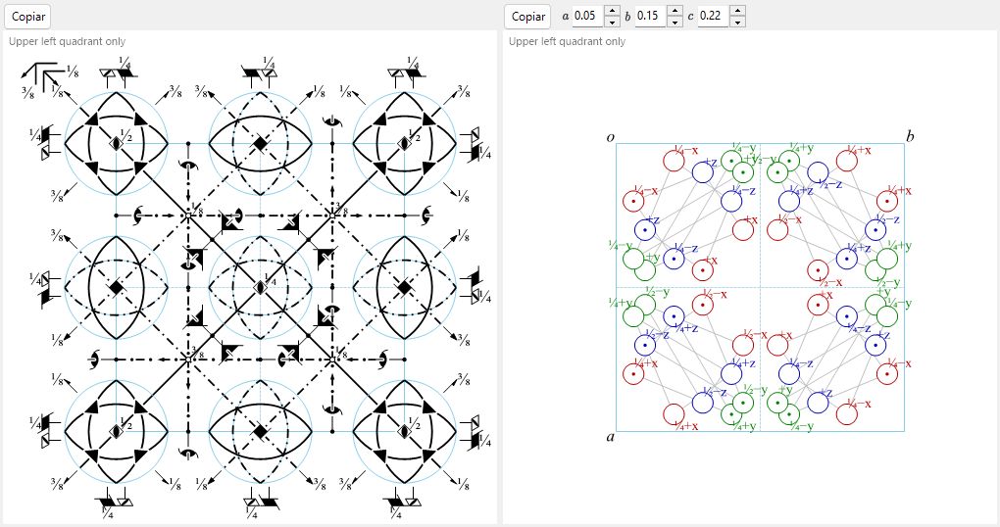

# A4.1. Símbolos de grupos espaciales y diagramas de simetría

Esta página explica todo lo que se muestra en la mitad superior de [Información de simetría](../../2-symmetry-information.md) (el panel de identidad del grupo espacial y las pestañas **Operaciones**/**Propiedades**/**Configuraciones**), y los dos diagramas esquemáticos de la parte inferior de la ventana. Toda la notación sigue las *International Tables for Crystallography* (ITA), Vol. A.

---

## Símbolos de Hermann–Mauguin (HM)

Un símbolo de Hermann–Mauguin tiene dos niveles: el **símbolo del grupo puntual** (recuadro superior, *Grupo puntual*) describe únicamente la simetría macroscópica del cristal, y el **símbolo del grupo espacial** (recuadro inferior, *Grupo espacial*) añade el centrado de la red y las posibles componentes helicoidales o de deslizamiento.

### Letra de red

El símbolo del grupo espacial comienza con una de las siete letras de red estándar:

| Letra | Significado |
|---|---|
| `P` | Primitiva |
| `A`, `B`, `C` | Centrada en una cara (centrado en la cara *bc*, *ac* o *ab*, respectivamente) |
| `I` | Centrada en el cuerpo |
| `F` | Centrada en todas las caras |
| `R` | Romboédrica (una red trigonal propia; a menudo se describe en *ejes hexagonales*, en cuyo caso la celda contiene tres puntos de red) |

### Direcciones de simetría

Tras la letra de red, cada posición restante del símbolo representa una **dirección de simetría**: una dirección del cristal a lo largo de la cual se sitúa un eje de rotación o helicoidal, y/o perpendicular a la cual se sitúa un plano de espejo o de deslizamiento. A qué direcciones físicas se refieren estas posiciones, y en qué orden, lo fija el sistema cristalino:

| Sistema cristalino | 1.ª posición | 2.ª posición | 3.ª posición |
|---|---|---|---|
| Triclínico | *(ninguna — solo `1` o `-1`)* | | |
| Monoclínico | $[010]$ (eje único $b$, convención de ReciPro) | | |
| Ortorrómbico | $[100]$ | $[010]$ | $[001]$ |
| Tetragonal | $[001]$ | $[100],[010]$ | $[110],[1\bar 10]$ |
| Trigonal / Hexagonal | $[001]$ | $[100],[010],[\bar 1\bar 1 0]$ | $[1\bar 10],[120],[\bar 2\bar 1 0]$ |
| Cúbico | $[100],[010],[001]$ | $[111]$ *(y las otras 3 diagonales del cuerpo)* | $[1\bar 10],[110]$ *(y las otras 4 diagonales de las caras)* |

Cada posición se rellena según estas reglas:

- Un número solo $n$ ($n=1,2,3,4,6$) : un eje de **rotación** de orden $n$ a lo largo de esa dirección.
- Un eje helicoidal $n_p$ (p. ej. $2_1$, $4_2$, $6_3$) : una rotación de $360°/n$ *combinada con* una traslación de $p/n$ del período de red a lo largo del eje. Por ejemplo, $2_1$ (un «helicoidal binario») significa rotar $180°$ **y** desplazarse media arista de la celda a lo largo del eje; $6_3$ significa rotar $60°$ y desplazarse media arista de la celda a lo largo de $c$.
- Una letra sola ($m,a,b,c,n,d$) sin número de rotación delante : un **plano de espejo o de deslizamiento** perpendicular a esa dirección (el significado de cada letra es el mismo que para los diagramas, más abajo).
- $n/m$ o $n_p/m$ : un eje de rotación o helicoidal **con** un espejo perpendicular a él (los dos elementos comparten la misma dirección, uno a lo largo del eje y otro atravesándolo).
- $-n$ (p. ej. $-1,-3,-4,-6$) : un eje de **rotoinversión** (rotar $360°/n$ y después invertir a través de un punto del eje). $-1$ por sí solo denota un centro de inversión puro; no existe un eje «$-2$» porque una rotoinversión binaria es idéntica a un espejo, así que siempre se escribe $m$.

### Símbolo corto frente a símbolo completo

El símbolo HM **corto** (el que se cita habitualmente) omite los elementos de simetría que ya están implícitos en los escritos; el símbolo **completo** explicita todas las direcciones. Por ejemplo, el grupo espacial No. 62 es $Pnma$ en forma corta y $P\,2_1/n\,2_1/m\,2_1/a$ en forma completa: los tres ejes helicoidales $2_1$ están implícitos en los tres planos de deslizamiento/espejo junto con el grupo puntual $mmm$ del grupo espacial, así que el símbolo corto los omite. Los campos *Símbolo HM (corto)* y *Símbolo HM (completo)* de ReciPro muestran ambos; en la mayoría de los grupos espaciales coinciden.

### Símbolos de Schoenflies (SF) y de Hall

El **símbolo de Schoenflies** (p. ej. $D_{2h}^{16}$) nombra el tipo de grupo puntual ($D_{2h}$) y añade un superíndice que simplemente enumera *cuál* de los grupos espaciales de esa familia de grupo puntual es este; a diferencia del símbolo HM, el superíndice no lleva por sí mismo ningún significado geométrico directo: hay que consultarlo. ReciPro muestra el símbolo de Schoenflies tanto para el grupo puntual como para el grupo espacial.

El **símbolo de Hall** es una notación distinta, basada en generadores y diseñada para un procesamiento informático sin ambigüedades: enumera un conjunto mínimo de operaciones generadoras junto con un origen explícito, de modo que un programa puede reconstruir el conjunto exacto de coordenadas sin consultar una tabla que indique «qué configuración/elección de origen implica este símbolo HM». Un símbolo de Hall no es la *única* manera posible de codificar un conjunto de operaciones dado (distintas elecciones de generadores producen cadenas de Hall diferentes e igualmente válidas para el mismo grupo), pero cada uno es plenamente explícito y reversible por sí solo. ReciPro muestra un símbolo de Hall generado sistemáticamente para la configuración actual; la pestaña **Configuraciones** (más abajo) enumera todas las elecciones tabuladas de origen/configuración que comparten el número del grupo espacial actual, cada una con su propio símbolo HM y de Hall.

---

## Operaciones de simetría (pestaña Operaciones)

La pestaña **Operaciones** enumera cada operación de simetría de la posición general para la configuración actual (con las traslaciones de centrado de la red ya expandidas), en tres notaciones paralelas:

| Columna | Ejemplo | Significado |
|---|---|---|
| Coordenadas | `-y, x-y, z+1/3` | El triplete de coordenadas $(x,y,z)\mapsto(x',y',z')$, es decir, la aplicación afín $x'=Rx+t$ escrita algebraicamente (convención ITA/CIF). |
| Seitz | `3+ [111]` | Un símbolo compacto: orden y sentido de la rotación o del helicoide (`3+`), dirección del eje (`[111]`) y — si existe — la traslación de la operación, p. ej. `2₁ [001] 0,0,1/2`. Un espejo puro es `m`, la identidad es `1`, la inversión es `-1`. |
| Tipo | `3-fold rotation (3+) [111]` | Una clasificación de la operación en lenguaje llano: `Identity`, `Inversion centre at …`, una rotación de orden `n` (`n-fold rotation`), un eje helicoidal `nₚ` (`screw axis`), un plano de espejo (`Mirror plane m`), un plano de deslizamiento `a/b/c/n/d` (`glide plane`) o una rotoinversión de orden `n` (`rotoinversion`), cada una con su dirección (y, para el centro de inversión, su posición). |

El botón **Copiar (CIF)** coloca la lista completa de operaciones en el portapapeles como un bucle CIF `_space_group_symop_operation_xyz`. Este vocabulario — símbolo de Seitz y tipo geométrico — reaparece a lo largo de [A4.2](group-subgroup-relations.md), donde cada generador conservado/perdido de una relación de subgrupo se describe de la misma manera.

---

## Clasificación según la teoría de grupos (pestaña Propiedades)

La pestaña **Propiedades** presenta un conjunto de clasificaciones estándar del grupo espacial actual. Algunas de ellas — centrosimétrico, Sohncke y polar (y, a partir de esas, los permisos de propiedades físicas de más abajo) — se deducen directamente de la **parte matricial** $R$ de cada operación (la parte lineal, de rotación o de reflexión), junto con la parte de traslación en el caso de centrosimétrico. Las demás — simórfico, pareja enantiomorfa, familia cristalina/sistema reticular/tipo de Bravais, clase cristalina aritmética y simetría de Patterson — son propiedades del *tipo* de grupo espacial en su conjunto (su número IT, su tipo de red y su clase de Laue) más que de una operación concreta. Nada de esto requiere una métrica (forma de la celda elemental): depende únicamente del contenido de simetría abstracto y de la clasificación del tipo de grupo espacial.

**Centrosimétrico** — el conjunto de operaciones contiene alguna operación de la forma $\{-I \mid t\}$ (una inversión a través del punto $t/2$, que no tiene por qué ser el origen). Las propiedades de Sohncke y polar (más abajo) son mutuamente excluyentes con esta: un centro de inversión invierte todas las direcciones, por lo que un grupo centrosimétrico nunca puede ser polar, y $-I$ tiene determinante $-1$, por lo que un grupo centrosimétrico nunca puede ser de Sohncke.

**Grupo de Sohncke (conserva la orientación)** — la parte matricial de *todas* las operaciones tiene $\det R=+1$: el grupo contiene solo rotaciones propias y rotaciones helicoidales, nunca un espejo, un deslizamiento, una inversión o una rotoinversión. 65 de los 230 tipos de grupos espaciales son grupos de Sohncke. Ser un grupo de Sohncke es la condición de simetría para que una estructura sea compatible con objetos de quiralidad definida (moléculas quirales, proteínas, cuarzo, …) sin contener también sus imágenes especulares. Esto es más amplio que ser uno de los miembros de una *pareja* genuinamente distinta de tipos de grupos espaciales imagen especular uno del otro — véase **Pareja enantiomorfa**, a continuación.

**Pareja enantiomorfa** — entre los 65 tipos de Sohncke, 11 parejas (22 tipos) están relacionadas entre sí *únicamente* por una transformación que invierte la orientación, y por ninguna propia (que la conserve): aplicar un espejo a un cristal de uno de estos grupos espaciales lo convierte en el otro miembro de la pareja, nunca en sí mismo bajo ningún reetiquetado de los ejes. Las 11 parejas son las construidas sobre ejes helicoidales de quiralidad opuesta:

$$P4_1 / P4_3,\ \ P4_122 / P4_322,\ \ P4_12_12 / P4_32_12,\ \ P3_1/P3_2,\ \ P3_112/P3_212,\ \ P3_121/P3_221,$$
$$P6_1/P6_5,\ \ P6_2/P6_4,\ \ P6_122/P6_522,\ \ P6_222/P6_422,\ \ P4_332/P4_132.$$

Los $65-22=43$ tipos de Sohncke restantes son su propia imagen especular (aquirales *como tipos de grupo espacial*, aunque cada estructura individual en ellos siga teniendo quiralidad).

**Simórfico** — uno de los 73 tipos de grupos espaciales para los que puede elegirse un origen tal que *todos* los representantes de las clases laterales (módulo las traslaciones de red) tengan componente de traslación intrínseca (helicoidal/de deslizamiento) nula — equivalentemente, algún punto de la celda tiene un grupo de simetría de sitio isomorfo al grupo puntual completo. (Las traslaciones de centrado, por supuesto, permanecen; «simórfico» es una afirmación sobre las partes no primitivas de las operaciones del *grupo puntual*, no sobre la red.) Un grupo espacial simórfico siempre puede generarse a partir de su grupo puntual y su red solamente, sin necesidad de ejes helicoidales ni planos de deslizamiento, cuando se describe en ese origen concreto — que es exactamente el origen que las propias ITA tabulan para un tipo simórfico, de modo que su símbolo estándar corto/completo ya está libre de letras helicoidales o de deslizamiento. (Describir las operaciones del mismo grupo en un origen desplazado o trasladado por un vector de centrado puede hacer que una operación individual parezca llevar una traslación helicoidal/de deslizamiento, sin que cambie la clasificación simórfica del tipo: la clasificación solo pregunta si existe en absoluto un origen libre de traslaciones, y para estos 73 tipos existe.)

**Polar** — si alguna dirección queda invariante, $Rv=v$, bajo la parte matricial de *todas* las operaciones (no $\pm v$: una verdadera dirección polar debe conservarse exactamente, no simplemente invertirse o quedar como un eje binario). Las condiciones relevantes son: **ninguna** (no existe tal dirección) &nbsp;/&nbsp; un único eje $[uvw]$ &nbsp;/&nbsp; un plano entero (cualquier dirección contenida en él) &nbsp;/&nbsp; **cualquier** dirección (solo para el grupo puntual $1$). Un eje polar es la dirección a lo largo de la cual la simetría permite una polarización eléctrica espontánea (véase la tabla de propiedades físicas más abajo).

**Familia cristalina, sistema reticular, tipo de Bravais** — la jerarquía de clasificación estándar de la IUCr por encima del sistema cristalino: 6 **familias cristalinas**, 7 **sistemas cristalinos**, 7 **sistemas reticulares** y 14 **tipos de redes de Bravais** en total. La sutileza está en la **familia cristalina hexagonal**: como **sistemas cristalinos** se divide en *trigonal* y *hexagonal*, pero como **sistemas reticulares** se divide de otra manera, en *hexagonal* y *romboédrico* — un grupo espacial trigonal cae en el sistema reticular hexagonal si su red es de tipo $P$, o en el sistema reticular romboédrico si está centrada $R$, con independencia de a cuál de los dos sistemas cristalinos pertenezca.

**Clase cristalina aritmética** — el emparejamiento de un símbolo de grupo puntual (posiblemente resuelto por direcciones) con una letra de red de Bravais, p. ej. `4mmP`; hay 73 clases cristalinas aritméticas en total. Como algunos símbolos de grupo puntual (`3m1` frente a `31m`, para las dos maneras no equivalentes en que un grupo puntual $3m$ puede situarse respecto a una red hexagonal) ya codifican por sí mismos su orientación relativa a la red, citar el símbolo de grupo puntual orientado junto con la letra de red basta para nombrar la clase sin ambigüedad.

**Simetría de Patterson** — el tipo de red junto con la *clase de Laue* (el grupo puntual centrosimétrico que se obtiene añadiendo $-1$ al grupo puntual del propio grupo espacial), despojado de toda la información helicoidal/de deslizamiento; p. ej. `Pmmm` para cualquiera de los 30 grupos espaciales ortorrómbicos de red $P$, tengan o no planos de deslizamiento. Esta es la simetría de la función de Patterson calculada a partir de las *intensidades* de difracción $|F|^2$ en la aproximación cinemática, porque $|F|^2$ es insensible al desfase que introduce una traslación de deslizamiento o helicoidal (aunque las ausencias sistemáticas que esta causa, y los picos de Harker del mapa de Patterson, pueden delatar indirectamente su presencia). En la difracción de electrones dinámica esta imagen cinemática no se cumple exactamente; véase el [Apéndice A3](../a3-bloch-wave/index.md).

### Propiedades físicas permitidas por la simetría

Las últimas filas de la pestaña Propiedades indican si una propiedad física macroscópica dada está **permitida por la simetría** para el grupo puntual actual — una condición necesaria, no una garantía de que el efecto sea grande o siquiera esté presente en un cristal real (la convención de "Physical Properties of Crystals" de Nye):

| Propiedad | Condición de simetría | Grupos puntuales |
|---|---|---|
| Piroeléctrico / ferroeléctrico | Polar (se permite un vector polar de rango 1 — la polarización espontánea) | los 10 grupos puntuales polares |
| Piezoeléctrico | No centrosimétrico **y** grupo puntual $\ne 432$ | 20 de los 21 grupos puntuales no centrosimétricos |
| Generación de segundo armónico ($\chi^{(2)}$ dipolar eléctrico de volumen) | La misma condición que la piezoelectricidad (un tensor polar de rango 3) | los mismos 20 grupos puntuales |
| Actividad óptica (girotropía natural) | Los 11 grupos puntuales que contienen solo rotaciones propias, más otros 4 que son girotrópicos sin ser puramente de Sohncke | $1,2,3,4,6,222,32,422,622,23,432$ y $m,mm2,\bar4,\bar42m$ — 15 grupos puntuales en total |

$432$ es el único grupo puntual acéntrico *sin* respuesta piezoeléctrica/SHG: tiene demasiada simetría rotacional (todas las rotaciones propias, cúbico) para que sobreviva componente alguna de un tensor polar de rango 3, aun sin ser centrosimétrico.

!!! note "Permitido por la simetría, no necesariamente observado"
    Estas filas indican lo que el grupo puntual *permite*. Que un cristal real llegue a conmutar su polarización (ferroelectricidad verdadera), o muestre una respuesta piezoeléctrica o SHG de utilidad práctica, depende de la química y de los detalles de la estructura, más allá de la simetría.

### Pestaña Configuraciones

Enumera todas las elecciones tabuladas de origen/configuración de ejes que comparten el número IT del grupo espacial actual (p. ej. las dos elecciones de origen de $Fd\bar 3m$, o las distintas elecciones de celda de un grupo monoclínico), cada una con su símbolo HM y de Hall; la fila de la configuración mostrada actualmente aparece marcada. Esta pestaña sirve solo para consultar las alternativas: seleccionar una fila no cambia el cristal.

---

## Diagrama de elementos de simetría {#symmetry-element-diagram}

El diagrama de la izquierda reproduce el diagrama esquemático de simetría de las ITA Vol. A para la configuración actual, proyectado a lo largo del eje elegido con el control **Dirección** (`a`/`b`/`c`).

**Los ejes perpendiculares a la página** se dibujan como símbolos puntuales rellenos cuya forma codifica el orden de rotación, con pequeñas colas («aletas») añadidas para los ejes helicoidales (su número y disposición codifican tanto el paso $p$ del helicoide como su quiralidad, de modo que p. ej. $3_1$ y $3_2$ — helicoides del mismo orden y quiralidad opuesta — se dibujan con patrones de colas especulares entre sí, no simplemente con distinto número de colas):

| Símbolo | Elemento |
|---|---|
| Lente rellena (óvalo apuntado) | Eje de rotación de orden 2 |
| Lente rellena con una aleta | Eje helicoidal $2_1$ |
| Triángulo relleno | Eje de rotación de orden 3 |
| Triángulo relleno con colas | Eje helicoidal $3_1$ / $3_2$ |
| Cuadrado relleno | Eje de rotación de orden 4 |
| Cuadrado relleno con colas | Eje helicoidal $4_1$ / $4_2$ / $4_3$ |
| Hexágono relleno | Eje de rotación de orden 6 |
| Hexágono relleno con colas | Eje helicoidal $6_1 \ldots 6_5$ |
| Círculo pequeño vacío | Centro de inversión ($-1$) |
| Símbolo combinado vacío/relleno | Eje de rotoinversión ($-3,-4,-6$) |

Los ejes que discurren oblicuos o contenidos en la página (esto solo ocurre para direcciones especiales, como las diagonales del cuerpo $\langle 111\rangle$ o las diagonales de las caras $\langle 110\rangle$ del sistema cúbico) se dibujan como una flecha con el símbolo puntual en su pie, siguiendo la misma convención de las ITA.

**Los planos** se dibujan como líneas cuyo estilo nombra el tipo de deslizamiento — la letra indica a lo largo de qué dirección de la red discurre el vector de deslizamiento (o que es diagonal/de un cuarto de celda), mientras que el hecho de que esa traslación quede *dentro* de la página o salga *fuera* de ella depende del eje de proyección elegido:

| Estilo de línea | Plano |
|---|---|
| Línea continua | Plano de espejo $m$ |
| Trazos largos | Deslizamiento axial $a$ o $b$ |
| Línea de puntos | Deslizamiento axial $c$ (en el caso habitual en que su traslación sale de la página) |
| Línea de trazo y punto | Deslizamiento diagonal $n$ |
| Línea de trazo y punto con flecha | Deslizamiento de diamante $d$ (una traslación de un cuarto de celda; solo aparece en celdas centradas) |
| Línea doble | «Deslizamiento doble» $e$ — dos vectores de deslizamiento independientes coinciden sobre el mismo plano (solo aparece en celdas centradas, donde un deslizamiento y su compañero trasladado por el centrado pasan por el mismo plano) |

Una etiqueta de altura fraccionaria (p. ej. `1/4`) junto a un símbolo da su coordenada a lo largo del eje de proyección siempre que el elemento no esté contenido en el plano de altura 0.

!!! note "Grupos cúbicos de red F: solo se dibuja un octante"
    Para los grupos espaciales cúbicos centrados $F$, ReciPro dibuja solo el cuadrante superior izquierdo de un octavo de la celda (de lo contrario el diagrama sería demasiado denso para leerse); la celda completa lo repite mediante las traslaciones de centrado y mediante los propios elementos de simetría dibujados. Los mismos elementos de simetría también pueden superponerse directamente sobre el modelo 3D en el [Visor de estructura](../../5-structure-viewer.md).

---

## Diagrama de posiciones generales

El diagrama de la derecha representa las posiciones equivalentes generales — la órbita de un punto genérico $(x,y,z)$ bajo todas las operaciones del grupo espacial — de nuevo al estilo de las ITA:

- Cada **círculo** es la proyección de una copia del punto equivalente por simetría.
- Una **coma** dentro de un círculo marca una copia generada por una operación *de segunda especie* (un espejo, un deslizamiento, una inversión o una rotoinversión): tiene la quiralidad opuesta a la de un objeto de prueba quiral colocado en el punto original, exactamente como las parejas de manos lisas y espejadas que usan las propias ITA.
- Un **círculo dividido** (mitad lisa, mitad con coma) marca una posición en la que una copia por operación propia y una copia por operación impropia se proyectan sobre el mismo punto.
- Una etiqueta de altura junto a un círculo (`+`, `−`, `½+`, …) da la coordenada de esa copia a lo largo del eje de proyección *relativa al* punto de referencia — `+` significa «en $z$», `−` significa «en $-z$», `½+` significa «en $z+\tfrac12$», y así sucesivamente; no es una altura absoluta.
- (Solo en los grupos espaciales cúbicos) líneas auxiliares finas conectan los tres círculos relacionados por un eje ternario según la diagonal del cuerpo $\langle111\rangle$.
- En general, un círculo (o una mitad de un círculo dividido) corresponde a una posición equivalente, de modo que el número de círculos coincide con la **multiplicidad** de la posición general mostrada en la pestaña [Posiciones de Wyckoff](../../2-symmetry-information.md) — una comprobación rápida al leer cualquiera de los dos diagramas. Si el eje de proyección elegido hace que varias copias de la misma quiralidad coincidan exactamente, se superponen en un solo punto (distinguidas solo por etiquetas de altura separadas) en lugar de dibujarse como círculos contiguos, por lo que el número de círculos visibles puede entonces ser menor que la multiplicidad.

Los campos `numericBox` situados bajo **Dirección** permiten alejar el punto de prueba $(x,y,z)$ de la posición por defecto que el grupo espacial asigna a ese grupo puntual, lo que a veces resulta útil para despejar un diagrama en el que varios círculos coincidirían.

---

## Véase también

- [2. Información de simetría](../../2-symmetry-information.md) — la guía de la GUI que este apéndice explica.
- [A4.2. Relaciones grupo-subgrupo](group-subgroup-relations.md) — reutiliza el vocabulario de símbolos de Seitz y tipos geométricos introducido aquí.
- [Apéndice A4. Simetría y grupos espaciales](index.md)
