# Fenêtre principale

Au démarrage de ReciPro, la fenêtre principale apparaît. Depuis cette fenêtre, vous sélectionnez le cristal, contrôlez sa rotation et lancez diverses fonctions.

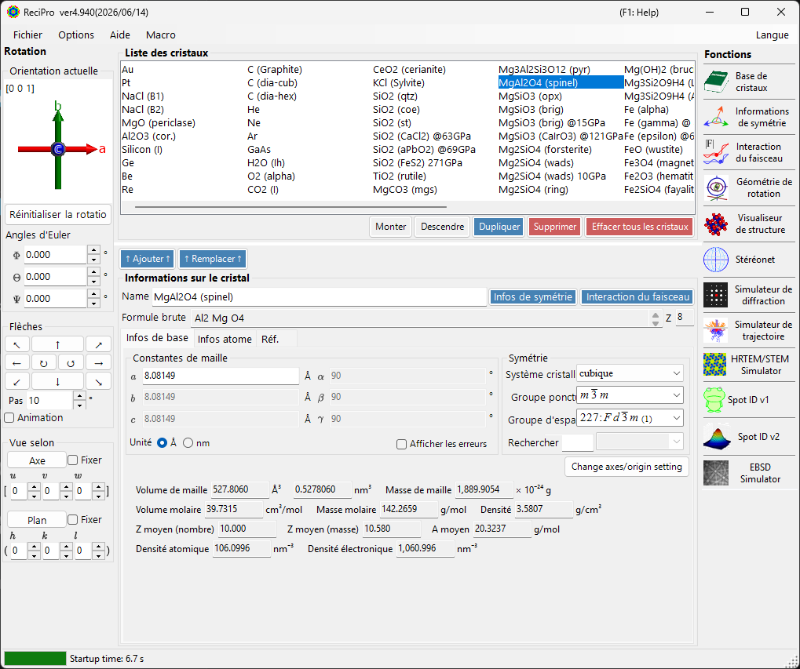

| Zone | Emplacement | Description |
|------|----------|-------------|
| **Menu Fichier** | En haut | Opérations sur les fichiers, options, aide |
| **Contrôle de rotation** | À gauche | Afficher/définir l'orientation du cristal |
| **Liste des cristaux** | Centre supérieur | Sélectionner et gérer les cristaux |
| **Informations sur le cristal** | Centre inférieur | Modifier les paramètres de maille, la symétrie, les atomes |
| **Fonctions** | À droite | Lancer les fenêtres de simulation/analyse |

---

## Raccourcis clavier et souris {#keyboard-mouse-shortcuts}

La fenêtre principale installe plusieurs raccourcis **applicables à toute l'application**. Ils restent actifs lorsque les fenêtres Visualiseur de structure, Stéréonet, Simulateur de diffraction, Spot ID et Calculatrice ont le focus.

| Raccourci | Action |
|----------|--------|
| <kbd>F1</kbd> | Ouvrir cette page du manuel en ligne |
| <kbd>CTRL</kbd>+<kbd>SHIFT</kbd>+<kbd>D</kbd> | Ouvrir / fermer le **Simulateur de diffraction** |
| <kbd>CTRL</kbd>+<kbd>SHIFT</kbd>+<kbd>V</kbd> | Ouvrir / fermer le **Visualiseur de structure** |
| <kbd>CTRL</kbd>+<kbd>SHIFT</kbd>+<kbd>S</kbd> | Ouvrir / fermer le **Stéréonet** |
| <kbd>CTRL</kbd>+<kbd>SHIFT</kbd>+<kbd>T</kbd> | Ouvrir / fermer **Spot ID** |
| <kbd>CTRL</kbd>+<kbd>SHIFT</kbd> + touches fléchées | Faire pivoter le cristal d'un pas dans cette direction (maintenez deux flèches pour une diagonale) |
| Double-appui sur <kbd>CTRL</kbd> | Ouvrir / fermer la **Calculatrice** |
| <kbd>CTRL</kbd>+<kbd>SHIFT</kbd>+<kbd>R</kbd> | Basculer l'indicateur **Reserved** du cristal sélectionné |
| Maintenir <kbd>CTRL</kbd> au démarrage de ReciPro | Démarrer avec OpenGL désactivé (récupération en cas de problèmes graphiques) |
| Glisser avec le bouton gauche le widget d'orientation (en bas à gauche, sous *Current Direction*) | Faire pivoter le cristal |
| Double-clic droit sur le widget d'orientation | Copier l'image du widget dans le presse-papiers |
| Simple clic sur un bouton de fonction | Ouvrir / fermer cette fenêtre |
| Double-clic sur un bouton de fonction | Forcer l'affichage de la fenêtre et la mettre au premier plan |
| Clic droit sur un cristal dans la liste | Menu contextuel (Renommer / Dupliquer / Supprimer / Exporter en CIF…) |
| Double-clic sur l'étiquette **Current Index** | Afficher / masquer la zone max-UVW |
| Déposer un fichier sur la fenêtre | Charger une liste de cristaux (`.xml`, `.cdb2`) ou un cristal (`.cif`, `.amc`) |

→ Voir **[21. Raccourcis clavier et souris](21-shortcuts.md)** pour chaque fenêtre en un coup d'œil.

---

## Flux de travail de base

Si vous débutez avec ReciPro, suivez les étapes ci-dessous :

1. Sélectionnez le cristal cible dans la **Liste des cristaux**. Pour utiliser un fichier CIF/AMC, glissez-déposez-le dans les **Informations sur le cristal**.
2. Si vous modifiez les paramètres de maille ou les positions des atomes, appuyez sur **Add** ou **Replace** afin que les changements soient réécrits dans la liste des cristaux.
3. Définissez l'orientation du cristal dans le **Contrôle de rotation** à l'aide d'un axe de zone, d'un plan cristallin, d'angles d'Euler ou en faisant glisser la souris.
4. Ouvrez l'outil souhaité depuis les **Fonctions**. Les fenêtres de calcul Diffraction, HRTEM/STEM, EBSD et autres utilisent le cristal et l'orientation actuellement sélectionnés.

---

## Menu Fichier

### File

| Élément de menu | Description |
|-----------|-------------|
| Read crystal list (as new list) | Charger un fichier de liste de cristaux (*.xml) en remplaçant la liste actuelle |
| Read crystal list (and add) | Ajouter à la liste actuelle |
| Read initial crystal list | Recharger la liste de cristaux par défaut |
| Save crystal list | Enregistrer la liste de cristaux actuelle |
| Export selected crystal to CIF | Enregistrer au format CIF |
| Clear crystal list | Supprimer tous les cristaux |
| Exit | Fermer l'application |

### Option

| Élément de menu | Description |
|-----------|-------------|
| Show Tooltips | Basculer l'affichage des info-bulles |
| Use Miller-Bravais (hkil) index | Utiliser la notation à 4 indices pour les systèmes trigonaux/hexagonaux dans toute l'application |
| Reset registry settings on exit (effective after restart) | Réinitialiser les paramètres au prochain redémarrage |
| Disable Crystallography.Native library (requires restart) | Revenir au code managé si la bibliothèque native (C++) ne peut pas être chargée |
| Disable all OpenGL rendering (requires restart) | Pour les GPU plus anciens / le bureau à distance |
| Disable OpenGL text rendering (requires restart) | Solution de contournement pour les problèmes de rendu de texte sur certains GPU |
| Use MKL Library | Utiliser Intel MKL pour les routines numériques |
| Dark mode | Basculer entre les thèmes de couleur clair et sombre |
| Powder diffraction function (under development) | Activer la fenêtre de diffraction polycristalline (sur poudre) |
| Capture GUI Components… | Outil de développeur pour enregistrer des captures d'écran de l'interface |

### Help

| Élément de menu | Description |
|-----------|-------------|
| Program updates | Vérifier si une nouvelle version de ReciPro est disponible et l'installer |
| Hint | Afficher les conseils d'utilisation (obsolète) |
| Version history | Ouvrir la boîte de dialogue de l'historique des versions |
| License | Afficher la licence MIT |
| GitHub page | Ouvrir le dépôt ReciPro dans un navigateur |
| Report bugs, requests, or comments | Ouvrir la page GitHub Issues |
| Help (Web) | Ouvrir le manuel en ligne sur GitHub Pages, dans la page correspondant à la langue de l'interface. |

La langue se change depuis le menu **Language** distinct (anglais/japonais, nécessite un redémarrage).

### Language

Basculer la langue de l'interface entre l'anglais et le japonais. Le changement prend effet après le redémarrage de ReciPro.

### Macro

Ouvre la fenêtre [Macro](20-macro/index.md) pour automatiser les opérations de ReciPro avec des scripts de style Python. Pour les flux de travail répétitifs, voir les [fonctions intégrées](20-macro/1-built-in-functions.md) et les [exemples de macros](20-macro/2-examples.md).

---

## Contrôle de l'orientation du cristal

L'état de rotation du cristal est partagé par le simulateur de diffraction, le Visualiseur de structure, le Stéréonet, le Simulateur HRTEM/STEM, le Simulateur EBSD et d'autres fenêtres. Ce n'est pas seulement un réglage d'affichage — il définit la direction du faisceau incident et la relation entre les coordonnées du cristal utilisée par les simulations. Un court tutoriel vidéo est disponible sur la page [Mode d'emploi](appendix/a0-how-to-use.md).

### Orientation actuelle

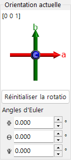

Affiche l'orientation du cristal. Faites glisser pour pivoter. Axes : rouge = *a*, vert = *b*, bleu = *c*.

### Réinitialiser la rotation
Réinitialise à l'état initial : axe *c* perpendiculaire à l'écran, axe *b* vers le haut.

### Axe de zone
Affiche l'axe de zone le plus proche de la normale à l'écran (p. ex. *u*+*v*+*w* < 30).

### Angles d'Euler (Z-X-Z)
Définissez l'orientation du cristal avec les angles d'Euler **Z–X–Z** :

- \(\Phi\): rotation autour de l'axe Z
- \(\Theta\): rotation autour de l'axe X
- \(\Psi\): rotation autour de l'axe Z

Les rotations sont appliquées dans l'ordre \(\Psi \to \Theta \to \Phi\). Voir [Géométrie de rotation](4-rotation-geometry.md) et [Annexe A1. Système de coordonnées](appendix/a1-coordinate-system/1-orientation.md) pour les détails.

### Flèches

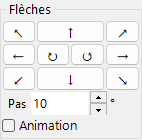

Pivote de l'angle Step. Cochez Animation pour une rotation continue.

### Vue selon

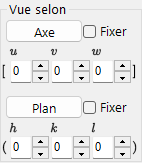

Aligne un axe de zone [*uvw*] ou un plan cristallin (*hkl*) perpendiculairement à l'écran.

- **Fix** : lorsqu'elle est cochée, l'axe de zone ou le plan spécifié est maintenu fixe dans l'espace lors des opérations de rotation suivantes.
- **Axis** : place l'axe de zone saisi \([uvw]\) perpendiculairement à l'écran. Si **Plane** est également défini, cette direction est orientée vers le haut sur l'écran.
- **Plane** : place la normale du plan cristallin saisi \((hkl)\) perpendiculairement à l'écran. Si **Axis** est également défini, cette direction est orientée vers le haut sur l'écran.

### Méthodes de base pour définir l'orientation

| Méthode | À utiliser quand | Où |
|--------|----------|-------|
| Glisser avec la souris | Vous voulez pivoter librement tout en observant les axes du cristal. | Panneau **Orientation actuelle** |
| Boutons fléchés | Vous voulez de petites rotations reproductibles. | Panneau **Flèches** |
| Axe de zone | Vous connaissez la direction de visée, telle que \([001]\) ou \([110]\). | **Vue selon** / saisie de l'axe de zone |
| Normale au plan | Vous voulez un plan cristallin \((hkl)\) normal à l'écran. | **Vue selon** / saisie du plan |
| Angles d'Euler | Vous avez besoin d'une orientation numérique reproductible. | **Angles d'Euler (Z-X-Z)** |

Voir [Géométrie de rotation](4-rotation-geometry.md) et [Annexe A1. Systèmes de coordonnées](appendix/a1-coordinate-system/1-orientation.md) pour les matrices de rotation et les conventions de coordonnées.

---

## Liste des cristaux

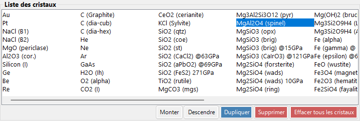

~80 cristaux dans l'installation par défaut. Sélectionnez-en un pour afficher les détails et le définir pour les calculs. **Clic droit sur un cristal** dans la Liste des cristaux pour un menu contextuel : *Rename*, *Export as CIF*, *Duplicate*, *Delete*.

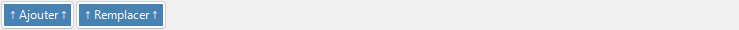

| Bouton | Action |
|--------|--------|
| Up / Down | Réordonner |
| Duplicate | Copier le cristal sélectionné |
| Delete / All clear | Supprimer des cristaux |
| Add / Replace | Ajouter à la liste ou remplacer l'entrée sélectionnée |

---

## Informations sur le cristal

Modifiez les paramètres de maille, la symétrie et les atomes ; glissez-déposez des fichiers CIF/AMC pour charger une structure. Ce contrôle est partagé par ReciPro, PDIndexer et CSmanager, mais les onglets et fonctionnalités affichés diffèrent selon l'application. ReciPro affiche les onglets Basic Info, Atom et Reference (les onglets EOS, Elasticity et autres sont destinés aux autres applications et ne sont pas affichés dans ReciPro).

> **Important** : Appuyez sur **Add** ou **Replace** pour enregistrer les modifications.

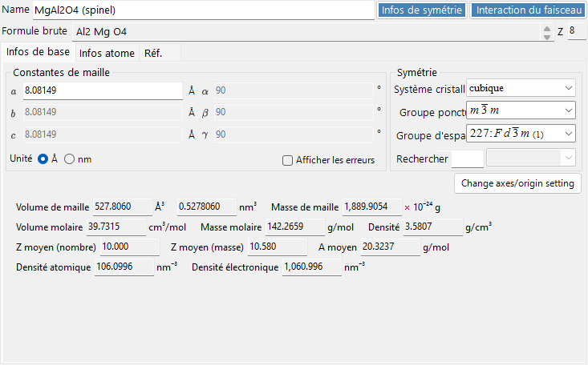

Le haut du panneau affiche toujours **Name** (nom du cristal), **Formula** (formule chimique, calculée à partir de la liste des atomes) et **Reset** (effacer tous les champs).

### Onglet Basic Info

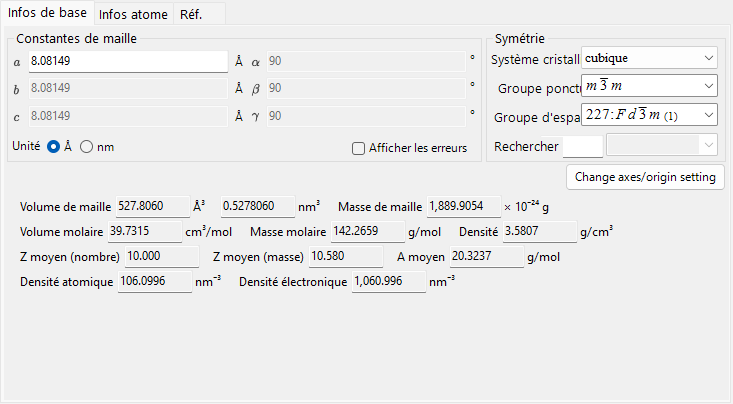

Paramètres de maille, symétrie et grandeurs qui en découlent.

| Élément | Description |
|------|------|
| Cell constants | Paramètres de maille a, b, c (en Å = 10⁻¹⁰ m) et α, β, γ. Le choix d'une symétrie les contraint automatiquement (p. ex. a=b=c, α=β=γ=90° pour le système cubique). |
| Symmetry | Choisissez le système cristallin, le groupe ponctuel et le groupe d'espace. Saisissez du texte dans le champ **Search** pour lister les candidats correspondants (sensible à la casse). |
| Cell Volume / Cell Mass | Volume et masse de la maille. |
| Molar Volume / Molar Mass / Z / Density | Volume molaire, masse molaire, nombre d'unités formulaires par maille (Z) et densité. Affiché **uniquement lorsque des atomes ont été saisis**. |
| Color of Profile | Couleur utilisée lors du tracé du profil de diffraction de ce cristal. |

### Onglet Atom

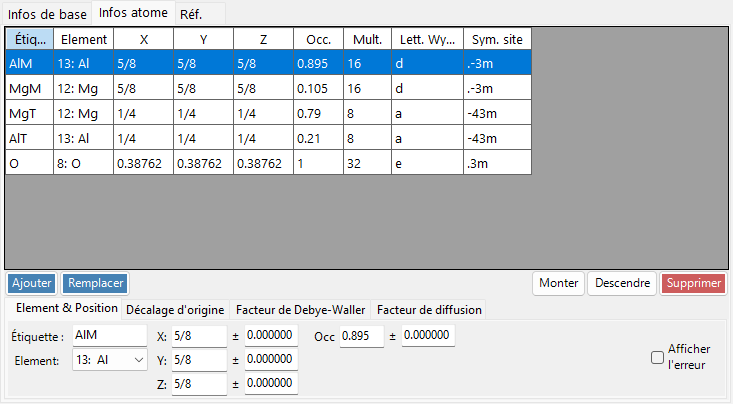

Définissez l'espèce, la position, le facteur de température et le facteur de diffusion de chaque atome. Modifiez la liste des atomes avec **Add**, **Replace** (remplacer la ligne sélectionnée), **Up/Down** (réordonner) et **Delete**. Chaque atome possède :

| Élément | Description |
|------|------|
| Label | Étiquette de l'atome (identifiant quelconque). |
| Element | Élément (y compris la valence ionique). |
| X, Y, Z | Coordonnées fractionnaires (0–1). Des fractions telles que 1/2 ou 2/3 peuvent être saisies. |
| Occ | Taux d'occupation (0–1). |

**Origin shift** : décale l'origine de toutes les coordonnées atomiques. Utilisez les boutons prédéfinis (**+** / **−**) pour les décalages standard, ou **Apply custom shift** pour une valeur arbitraire.

**Facteur de Debye–Waller (facteur de température)** :

| Élément | Description |
|------|------|
| Notation | Utiliser la notation U ou B. |
| Model | Isotrope ou anisotrope. |
| B##, U## | Pour le cas anisotrope, saisir chaque composante (B11, …). |

**Scattering factor** : choisissez le facteur de diffusion utilisé pour chaque atome.

| Rayonnement | Source / réglage |
|-----------|------|
| X-ray | Facteurs de diffusion incluant la valence ionique (International Tables for Crystallography, Vol. C). |
| Electron | Facteurs de diffusion électronique (Peng 1998, Acta Cryst. A54, 481–485). |
| Neutron | Longueurs de diffusion des neutrons. Choisissez **Natural isotope abundance** ou **Custom isotope abundance** (une composition isotopique arbitraire). |

### Onglet Reference

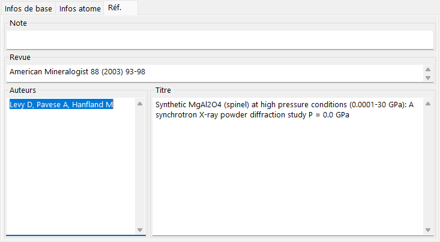

Enregistrez la source de la structure : **Note**, **Authors**, **Journal** et **Title**.

### Menu contextuel (clic droit)

Cliquez avec le bouton droit sur une zone vide du contrôle pour ces actions principales :

| Élément de menu | Action |
|-----------|------|
| Beam Interaction | Ouvre la fenêtre [Interaction du faisceau](3-beam-interaction.md). |
| Symmetry information | Ouvre la fenêtre [Informations de symétrie](2-symmetry-information.md). |
| Import from CIF, AMC | Charge un cristal depuis un fichier CIF / AMC. |
| Export to CIF | Exporte le cristal actuel au format CIF. |
| Revert cell constants | Restaure les constantes de maille aux valeurs chargées initialement. |
| Convert to P1 spacegroup | Développe la structure dans le groupe d'espace P1. |
| Convert to a superstructure | Convertit en une surstructure avec des multiples entiers de a, b, c (boîte de dialogue de taille). |
| Convert to an equivalent space group | Convertit en un groupe d'espace équivalent (un autre choix d'axes). |

---

## Panneau Fonctions {#functions}

La barre verticale de boutons à droite lance les fenêtres d'analyse et de simulation (voir le tableau [Fonctions](#functions) ci-dessous).

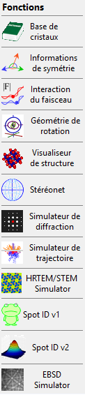

| Bouton | Description | Détails |
|--------|-------------|---------|
| Crystal Database | Rechercher et importer des cristaux depuis les bases de données fournies / en ligne | [1. Base de données de cristaux](1-crystal-database.md) |
| Symmetry Information | Informations sur le groupe d'espace et diagrammes de symétrie ITC Vol. A | [2. Informations de symétrie](2-symmetry-information.md) |
| Beam Interaction | Interaction faisceau–cristal : réflexions, atténuation, facteurs de diffusion, fluorescence | [3. Interaction du faisceau](3-beam-interaction.md) |
| Rotation Geometry | Matrice de rotation 3D / angles du goniomètre | [4. Géométrie de rotation](4-rotation-geometry.md) |
| Structure Viewer | Structure cristalline 3D | [5. Visualiseur de structure](5-structure-viewer.md) |
| Stereonet | Projection stéréographique | [6. Stéréonet](6-stereonet.md) |
| Diffraction Simulator | Diffraction des rayons X / des électrons sur monocristal | [7. Simulateur de diffraction](7-diffraction-simulator/index.md) |
| Trajectory Simulator | Simulation Monte-Carlo de trajectoires électroniques | [8. Trajectoires électroniques](8-electron-trajectory.md) |
| HRTEM/STEM Simulator | Simulation d'images HRTEM / STEM | [9. Simulateur HRTEM/STEM](9-hrtem-stem-simulator/index.md) |
| Spot ID v1 | Indexation de clichés SAED (anciennement « TEM ID ») | [10. Spot ID v1](10-spot-id.md) |
| Spot ID v2 | Détection et indexation des taches | [11. Spot ID v2](11-spot-id-v2.md) |
| EBSD Simulator | Simulation de clichés EBSD | [12. Simulation EBSD](12-ebsd-simulation.md) |
| Powder Diffraction | Diffraction polycristalline (sur poudre) — activer via **Option ▸ Powder diffraction function** | - |

---

## Voir aussi

- [Base de données de cristaux](1-crystal-database.md)
- [Géométrie de rotation](4-rotation-geometry.md)
- [Visualiseur de structure](5-structure-viewer.md)
- [Simulateur de diffraction](7-diffraction-simulator/index.md)
- [Raccourcis clavier et souris](21-shortcuts.md)
- [Système de coordonnées de base et orientation du cristal](appendix/a1-coordinate-system/1-orientation.md)
